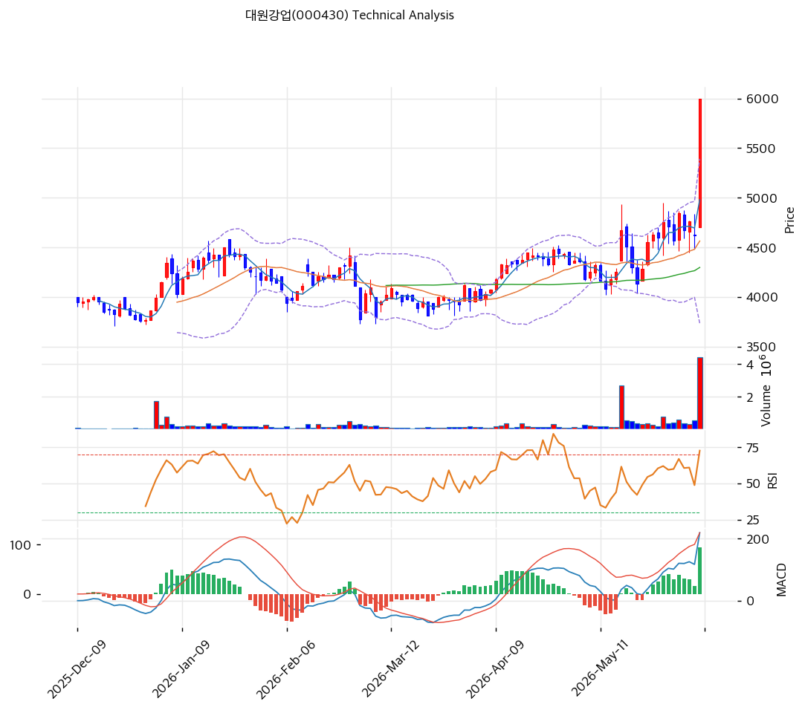

# 대원강업(000430) 기술적 분석 보고서

---

## 캔들스틱 차트

---

## 추세 판단

| 이동평균 | 값 (원) | 괴리율 | 위치 |
|---------|-------:|------:|:----:|
| MA5 | 4,980 | +20.5% | 위 |
| MA20 | 4,564 | +31.5% | 위 |
| MA60 | 4,297 | +39.6% | 위 |
| MA120 | 4,206 | +42.6% | 위 |
| MA200 | 4,080 | +47.1% | 위 |

- **정배열 여부**: **완전 정배열** (MA5>20>60>120>200, 현재가 모든 이평선 위)
- **추세 요약**: 당일 **+29.87% 급등으로 52주 신고가(6,000원)** 경신. MA200 대비 +47.1%의 극단적 이격 — 강한 상승 모멘텀이나 단기 과열 명백

---

## 모멘텀 지표

| 지표 | 값 | 신호 |
|------|-----|:----:|
| RSI(14) | 74.5 | 과매수 🔴 |
| MACD | 219 / Signal 124 / Hist 95 | 매수 확장 🟢 |
| 스토캐스틱 | K=81.2, D=77.2 | 과매수·골든크로스 🔴 |
| 거래량 비율 | 9.13 | 평균 대비 **813% 폭증** |

**모멘텀 해석**: MACD 매수 신호 + 히스토그램 확장으로 상승 모멘텀 강력. 그러나 RSI 74.5·스토캐스틱 81.2로 과매수 진입, 거래량 9.13배 폭증은 급등 정점 특유의 패턴. 추세는 강하나 단기 조정 압력 동반.

---

## 변동성·밴드

| 볼린저 밴드 | 값 (원) |
|------------|-------:|
| 상단 | 5,391 |
| 중간 (MA20) | 4,564 |
| 하단 | 3,736 |
| 밴드폭 | 36.3% |

**밴드 해석**: 현재가 6,000원이 BB 상단(5,391원)을 +11% **상향 돌파** — 밴드 밖으로 이탈한 과열 신호. 밴드폭 36.3%로 확장 중. 평균 회귀(상단 5,391원) 압력 상존.

---

## 매매 신호 종합

| 지표 | 판정 | 비고 |
|------|:----:|------|
| 이동평균선 | 🟢 매수 | 완전 정배열 |
| RSI | 🔴 매도 | 74.5 과매수 |
| MACD | 🟢 매수 | 매수 확장 |
| 볼린저 | 🔴 매도 | 상단 돌파 과열 |
| 스토캐스틱 | 🔴 매도 | 과매수 골든크로스 |
| 거래량 | 🟢 매수 | 9.13배 폭증 |

**종합 판정**: 매수 3 / 매도 3 / 중립 1 → **중립** (강한 모멘텀 vs 과열)

---

## 지지·저항 & 피보나치

### 피봇 / 주요 레벨

| 구분 | 가격 (원) | 근거 |
|------|-------:|------|
| 저항 | 6,938 | 피보나치 1.382 확장 |
| 저항 | 6,668 | 피보나치 1.272 확장 |
| 저항 | 6,433 | 피봇 R1 |
| **현재가** | **6,000** | 52주 고가 (신고가) |
| 지지 | 5,133 | 피봇 S1 |
| 지지 | 5,058 | PRZ(중): MA5 + 피보 0.382 + S1 |
| 지지 | 4,564 | MA20 |
| 지지 | 4,267 | 피봇 S2 + MA120/60 |

### 피보나치 되돌림 (직전 스윙 기준)

| 레벨 | 가격 (원) |
|------|-------:|
| 0.236 | 5,421 |
| 0.382 | 5,062 |
| 0.5 | 4,772 |
| 0.618 | 4,483 |

> 신고가 돌파 구간이라 상단은 피보나치 확장(6,668\~7,517원)이 목표. 조정 시 1차 지지 5,133원(S1)\~5,058원(PRZ 중), 2차 4,564원(MA20).

---

## 매매 전략

### 보유자 전략

| 항목 | 가격 (원) | 비고 |
|------|-------:|------|
| 1차 목표 | 6,433\~6,668 | 피봇 R1 + 피보 확장 |
| 2차 목표 | 6,938\~7,517 | 피보 1.382\~1.618 확장 |
| 손절 | 4,267 | 피봇 S2 / MA60·MA120 이탈 시 |

### 관망자 전략

| 항목 | 가격 (원) | 비고 |
|------|-------:|------|
| 1차 진입 | 5,058\~5,133 | PRZ(중) MA5 + 피보 0.382 + S1 눌림목 |
| 2차 진입 | 4,564 | MA20 지지 |
| 손절 | 4,267 | MA60·MA120 이탈 |

**전략 요약**: 당일 +29.87% 급등으로 52주 신고가 경신, 완전 정배열의 강한 추세이나 RSI 74.5·스토캐스틱 81.2·거래량 9.13배·BB 상단 돌파로 **단기 과열 명백**. 신고가 추격은 부담 — 눌림목(PRZ 5,058\~5,133원, MA20 4,564원) 분할 접근이 안전. 손절 4,267원(MA60·MA120). 모터코어 테마 모멘텀 지속 여부가 추세 연장의 관건.
