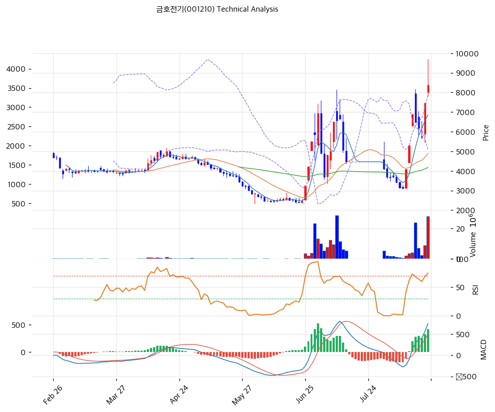

# 금호전기(001210) 기술적 분석

## 차트

⚠️ **이 차트를 읽기 전에 두 가지를 알아야 한다.**

**① 액면병합 소급조정.** 2026년 7월 31일 5대 1 액면병합 신주가 상장됐다. 조회되는 시계열은 병합 이전 구간이 **×5로 소급조정**돼 있어, 예컨대 6월 24일 표기 2,500원은 실제로는 500원에 거래된 값이다. 지표 계산에는 문제가 없으나 과거 실제 호가와는 다르다.

**② 11거래일 거래정지.** 2026년 7월 15일부터 30일까지 액면병합 절차로 매매가 정지됐고, 이 구간은 종가 4,470원이 거래량 0으로 채워져 있다. 이동평균·볼린저를 그대로 계산하면 왜곡된다. **아래 지표는 거래량 0인 정지일 11일을 제외하고 재계산한 값이다.**

## 가격 현황

| 항목 | 값 |
|---|---|
| 현재가 | **8,380원** (**+12.33%**) |
| 당일 시가 / 고가 / 저가 | 8,000 / **9,690(상한가)** / 7,810원 |
| 52주 고 / 저 | **9,690원** (2026-08-21) / **2,325원** (2026-06-02) |
| 52주 위치 | 82.2% |
| 고점 대비 | -13.5% |
| **12거래일 상승률** | **+128.6%** (8/4 3,665원 → 8/21 8,380원) |
| 1개월 / 3개월 / 6개월 / 1년 | +87.5% / +125.3% / +97.4% / +46.8% |
| RSI(14) | **68.8** |
| MACD | 782 / 424 / **+358** (히스토그램 확대) |
| Stochastic | K=72.9 D=66.5 |
| 볼린저(20) | 상단 8,419 / 중단 5,235 / 하단 2,052, **폭 121.6%** |
| 거래량 | **27,916,426주** (20일 평균 대비 **3.62배**) |
| **회전율** | **226%** (발행주식 12,376,016주 대비) |

⚠️ **8월 21일 거래량 27,916,426주는 발행주식 전체의 226%다.** 하루에 전 주식이 두 번 이상 손바뀜했다는 뜻이다. 자기주식 183,822주와 최대주주 등 4,034,464주를 제외한 실질 유통물량 약 815만주 기준으로는 회전율이 343%에 이른다.

## 이동평균선

| MA | 가격(원) | 갭 | 위치 |
|---|--:|--:|---|
| MA5 | 6,850 | **+22.3%** | 위 |
| MA20 | 5,235 | **+60.1%** | 위 |
| MA60 | 4,084 | **+105.2%** | 위 |
| MA120 | 4,197 | **+99.7%** | 위 |

→ **완전 정배열이며 이격이 극단이다.** 60일선 대비 +105.2%, 120일선 대비 +99.7%다. 주가가 60일 평균의 두 배를 넘는다.

MA60(4,084)과 MA120(4,197)이 4,100\~4,200원에 붙어 있다. 급등 이전 반년 가까이 이 자리에서 움직였다는 뜻이며, 되돌림이 깊어질 경우 자석처럼 작용할 수 있는 구간이다.

## 상승 경로: 두 번의 3연속 상한가

| 일자 | 종가 | 등락 | 거래량 | 비고 |
|---|--:|--:|--:|---|
| 2026-06-02 | 2,325원(장중) | | | **52주 최저** |
| 2026-06-24 | 2,500원 | -3.1% | 90,421 | 급등 직전 |
| **2026-06-25** | **3,250원** | **+30.0%** | 3,536,002 | **상한가** |
| **2026-06-26** | **4,225원** | **+30.0%** | 2,121,912 | **상한가** |
| **2026-06-29** | **5,490원** | **+29.9%** | 3,908,301 | **상한가 (3연속)** |
| 2026-06-30 | 5,870원 | +6.9% | 23,319,653 | |
| 2026-07-01 | 6,945원 | +18.3% | 13,157,331 | |
| 2026-07-02 | 4,915원 | -29.2% | 9,860,792 | 급락 |
| **2026-07-06** | 4,815원 | +30.0% | 7,621,030 | **정부 호남 반도체 클러스터 발표일** |
| 2026-07-09 | 6,580원 | -0.8% | 28,583,070 | 장중 8,140원 |
| 2026-07-14 | 4,470원 | -11.9% | 5,181,534 | 정지 직전 |
| **2026-07-15\~30** | 4,470원 | — | **0** | **액면병합 매매거래정지 (11거래일)** |
| 2026-07-31 | 4,115원 | -7.9% | 5,421,120 | **신주 상장, 거래 재개** |
| **2026-08-04** | **3,665원** | -1.2% | 1,733,120 | **재개 후 최저** |
| **2026-08-11** | **4,080원** | **+29.9%** | 2,154,106 | **상한가** |
| **2026-08-12** | **5,300원** | **+29.9%** | 3,498,483 | **상한가** |
| **2026-08-13** | **6,890원** | **+30.0%** | 4,058,088 | **상한가 (3연속).** 거래소 조회공시 요구 |
| 2026-08-14 | 6,490원 | -5.8% | **23,913,143** | 답변 "중요 공시대상 없음" + 반기보고서 |
| 2026-08-19 | 5,740원 | -7.1% | 2,385,783 | |
| **2026-08-20** | **7,460원** | **+30.0%** | 8,794,217 | **상한가** |
| **2026-08-21** | **8,380원** | **+12.33%** | **27,916,426** | 장중 9,690원 상한가 |

**두 달 사이 상한가가 7번 나왔다.** 6월 말 3연속, 8월 중순 3연속, 그리고 8월 20일이다.

주목할 점은 **1차 급등이 정부 발표(7월 6일)보다 앞섰다는 것**이다. 6월 25\~29일 3연속 상한가는 발표 9일 전에 나왔다.

## 수급

| 구분 | 5일 누적 | 20일 누적 |
|---|--:|--:|
| 외국인 | **-272,588주** | **-48,326주** |
| 기관 | +10,748주 | +12,735주 |

**일자별 (주)**

| 일자 | 외국인 | 기관 | 개인 |
|---|--:|--:|--:|
| 2026-08-11 | +34,068 | +2 | -38,666 |
| 2026-08-12 | +182,887 | +1,089 | -190,712 |
| 2026-08-13 | +84,515 | +1,083 | -82,531 |
| **2026-08-14** | **-377,336** | -999 | **+381,322** |
| 2026-08-18 | +67,205 | +800 | -57,482 |
| 2026-08-19 | -53,901 | -1,893 | +57,009 |
| 2026-08-20 | +1,733 | 0 | -505,199 |
| **2026-08-21** | +89,711 | +12,840 | **+404,914** |

⚠️ **기관 순매수가 20거래일 누적 12,735주다.** 하루 거래량 2,790만주와 비교하면 사실상 0에 가깝다. 외국인도 20일 누적 -48,326주로 순매도다.

**이 상승에는 기관도 외국인도 참여하지 않았다.** 전량 개인·단기자금이 만든 움직임이며, 8월 14일에는 외국인이 37.7만주를 팔고 개인이 38.1만주를 받았다.

## 시그널 종합

| 구분 | 카운트 |
|---|--:|
| 매수 | 2 |
| 매도 | 0 |
| 과열 경고 | 3 |
| 해석 불가 | 1 |
| **결론** | **모멘텀 유지, 이격 극단** |

- 🟢 **이동평균** 4개선 완전 정배열
- 🟢 **MACD** 782 > 시그널 424, 히스토그램 +265 → +358로 확대
- 🔴 **이격도** 60일선 대비 **+105.2%**, 120일선 대비 +99.7%
- 🔴 **거래량** 20일 평균의 3.62배, 회전율 226%
- 🔴 **볼린저 상단 근접** 종가 8,380이 상단 8,419 바로 아래
- ⚪ **RSI 68.8** 의외로 과매수(70) 미만. 상한가와 급락이 반복돼 평균화된 결과이며 이 종목에서는 신뢰도가 낮다
- ⛔ **볼린저 밴드 폭 121.6%** 표준편차 폭발로 지표 기능 상실 (하단 2,052원)

RSI 68.8이 낮게 보이는 것에 속으면 안 된다. 두 달간 상한가 7번과 -29% 급락이 섞이면서 평균화된 값이다. **이격도 +105.2%가 실제 과열 수준을 더 정확히 보여준다.**

## 지지·저항

| 구분 | 가격(원) | 근거 |
|---|--:|---|
| 저항 | 10,507 | 피봇 R2 |
| 저항 | 9,443 | 피봇 R1 |
| **강 저항** | **9,690** | **52주 최고 = 당일 상한가** |
| 저항 | 8,419 | 볼린저 상단 |
| **현재가** | **8,380** | |
| 지지 | 7,952 | 피보나치 0.236 되돌림 |
| 지지 | 7,810 | 당일 저가 |
| 지지 | 7,563 | 피봇 S1 |
| 지지 | 6,890 | 8/13 종가(상한가) |
| 지지 | 6,877 | 피보나치 0.382 되돌림 |
| 지지 | 6,850 | MA5 |
| 지지 | 6,747 | 피봇 S2 |
| **강 지지** | **6,008** | **피보나치 0.5 되돌림** |
| **강 지지** | **5,138\~5,300** | **피보 0.618 + 8/12 종가 매물대** |
| 지지 | 5,235 | MA20 |
| **강 지지** | **4,084\~4,197** | **MA60·MA120 밀집. 급등 이전 균형가격** |
| 최종 지지 | 3,665 | 8/4 재개 후 최저 |

※ 피보나치는 상승 추세 기준(저점 2,325원 → 고점 9,690원)
※ 유상증자 발행가 **3,285원**(2026-12-10 상장예정)은 현재가 대비 -61%

## 전략

| 시나리오 | 액션 |
|---|---|
| 보유자 | **분할 익절** (1차 9,690원 재도전 시 / 2차 6,890원 이탈 시) |
| 신규 진입 | **권하지 않음.** 60일선 대비 +105.2%, 회전율 226% |
| 관찰 진입 1차 | 6,008\~6,877원 (피보 0.382\~0.5, 현재가 대비 -18\~28%) |
| 관찰 진입 2차 | 5,138\~5,300원 (피보 0.618·8/12 매물대, -37\~39%) |
| 가치 기준 재진입 | 4,084\~4,197원 (MA60·MA120, PBR 약 1.9배) |
| 손절 기준 | 6,890원(8/13 상한가 종가) 이탈 |
| 이벤트 트리거 | 11월 중순 3분기 보고서 / **12월 10일 유상증자 신주 상장** |

## 핵심 판단

차트는 **전형적인 테마 급등주의 궤적**을 그리고 있다.

두 달 사이 상한가가 7번 나왔고 그 사이 -29% 급락도 있었다. 8월 21일 거래량은 발행주식의 226%였고, 그 물량을 기관도 외국인도 아닌 개인이 받았다. 20거래일 누적 기관 순매수는 12,735주로 사실상 0이다.

앞서 다룬 두 급등주와 비교하면 성격이 더 극단적이다.

| 항목 | 금호전기 | 혜인 | 자이에스앤디 |
|---|---|---|---|
| 상승 | 12거래일 +128.6% | 8거래일 +143.5% | 15거래일 +95.7% |
| 상한가 | **7회 (2개월)** | 2회 | 0회 |
| 회전율(당일) | **226%** | 107% | 6% |
| 기관 20일 | **+1.3만주 (0.1%)** | +16.9만주 | +294.6만주 (7.6%) |
| MA60 이격 | **+105.2%** | +120.7% | +103.8% |
| 상승 중 실적 | 영업적자 확대, 매출 3년 최저 | 매출 -21.2% | 흑자전환 |
| 조회공시 답변 | **"중요 공시대상 없음"** | "중요 공시대상 없음" | 해당 없음 |
| 상승 근거 | 호남 반도체 테마 | 데이터센터 발전기 테마 | 실적 + 수주잔고 |

**금호전기는 세 종목 중 실적 뒷받침이 가장 약하고 회전율이 가장 높다.** 자이에스앤디가 기관 매집형이었다면 이 종목은 순수 개인 회전형이다.

기술적으로 읽을 수 있는 것은 세 가지다.

**① 모멘텀은 아직 살아 있다.** MACD 히스토그램이 265에서 358로 확대 중이고 완전 정배열이다. 8월 21일 장중 상한가(9,690원)를 찍었다.

**② 이격이 감당하기 어려운 수준이다.** 60일선 대비 +105.2%다. 이 정도 이격이 되돌림 없이 유지된 사례는 드물다.

**③ 12월에 확정된 물량이 있다.** 제3자배정 유상증자 1,522,070주(발행주식의 12.3%)가 발행가 3,285원에 2026년 12월 10일 상장 예정이다. 현재가 대비 61% 낮은 가격이며, 납입만 되면 배정자는 2.55배 차익 상태가 된다.

보유자에게는 분할 익절 구간이고, 미보유자에게는 관망 구간이다. 되돌림이 시작되면 1차 목표는 피보나치 0.382\~0.5 되돌림인 **6,008\~6,877원**, 깊어지면 급등 이전 균형가격인 **4,084\~4,197원(MA60·MA120)**이다.
