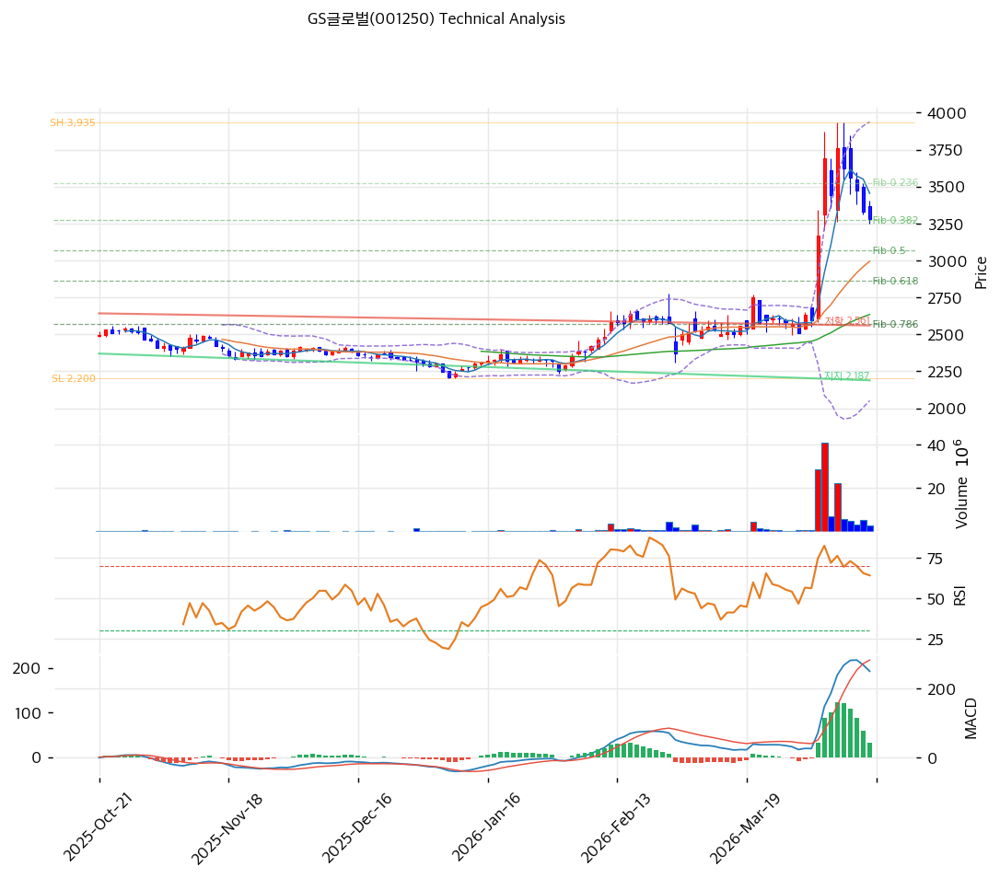

# GS글로벌(001250) 기술적 분석

2026-04-15 | T2 Technical Analysis

---

## 차트

---

## 1. 가격 현황

| 항목 | 값 |
|------|-----|
| 현재가 | 3,280원 (-1.50%) |
| 52주 고가 | 3,760원 |
| 52주 저가 | 2,210원 |
| 52주 범위 위치 | 69.0% |
| 거래량 | 20일 평균 대비 0.47x |

---

## 2. 차트 패턴 분석

### 2.1 캔들스틱 패턴

| 패턴 | 위치 | 신뢰도 | 해석 |
|------|------|--------|------|
| 음봉 (당일) | 2026-04-15 | 중 | 현재가 3,280원(-1.5%)으로 단기 하락 압력. MA5(3,454원) 하향 이탈 상태로 단기 매도 우위 |
| 비정배열 구조 | 현재 | 중 | MA5가 MA20을 하향 돌파하여 단기 조정 국면. 중장기선(MA60·120·200)은 여전히 하향 위치 |

※ 주요 캔들 패턴: 거래량이 20일 평균의 0.47배에 불과해 의미 있는 방향성 확인 미흡

### 2.2 가격 구조 패턴

- **박스권 수렴** (신뢰도: 중)
  현재가 3,280원은 52주 고가(3,760원)에서 -12.8%, 52주 저가(2,210원)에서 +48.4% 수준으로 52주 범위 상단 2/3 구간에 위치한다. 피봇 R1(3,373원)과 피봇 S1(3,218원) 사이 약 155원 폭의 좁은 박스권에서 등락 중이다. 박스권 상단(3,373원) 돌파 여부가 단기 방향성을 결정할 기준선이다.

- **중기 상승 조정** (신뢰도: 중)
  피보나치 기준점인 Swing Low 2,200원에서 Swing High 3,935원까지의 상승 추세가 현재 0.382 되돌림(3,272원) 근처에서 지지를 탐색 중이다. 이 구간이 유지되면 중기 상승 추세 이어질 가능성이 있다.

### 2.3 다이버전스

- **RSI 히든 다이버전스 부재** (신뢰도: 약)
  RSI 58.6으로 중립 구간에서 특별한 다이버전스 패턴이 관찰되지 않는다. 현재 RSI는 과매수(70 이상)도 과매도(30 이하)도 아닌 구간으로 추세 전환 시그널로 활용하기 어렵다.

- **MACD 히스토그램 수축** (신뢰도: 중)
  MACD(249) > Signal(217)로 매수 구간을 유지하고 있으나 히스토그램이 32로 수축 중(hist_expanding: false)이다. 매수 모멘텀이 약화되고 있음을 시사하며, 히스토그램 반전 여부 주목 필요.

### 2.4 패턴 종합 판단

단기적으로는 MA5(3,454원) 하향 이탈과 스토캐스틱 데드크로스가 조정 압력을 시사하고 있다. 반면 중기적으로는 피보나치 0.382 되돌림(3,272원) 근방이 지지대 역할을 할 수 있어 하방이 제한될 가능성이 있다. 거래량이 평균의 0.47배로 저조해 어느 방향으로도 결정적인 신호가 부재한 상태이며, 박스권 돌파 여부를 확인한 후 포지션 결정이 합리적이다.

---

## 3. 이동평균선 — 비정배열 (중립)

| MA | 값 | 현재가 괴리율 | 위치 |
|----|-----|--------------|------|
| MA5 | 3,454원 | -5.0% | 아래 |
| MA20 | 2,994원 | +9.5% | 위 |
| MA60 | 2,634원 | +24.5% | 위 |
| MA120 | 2,510원 | +30.7% | 위 |
| MA200 | 2,556원 | +28.3% | 위 |

**해석**: 현재가(3,280원)는 MA5(3,454원)를 하향 이탈한 상태로 단기 비정배열이 형성됐다. 중장기 MA20·MA60·MA120·MA200은 모두 현재가 아래에 위치해 중장기 상승 추세를 지지하고 있다. MA20(2,994원)과의 괴리율이 +9.5%로, 중기 지지선으로 역할 가능하다. MA5 재돌파(3,454원 이상 안착)가 단기 상승 재개의 신호가 된다.

---

## 4. 보조 지표

### RSI(14) — 58.6 (중립)

RSI 58.6은 과매수(70) 구간에 근접했다가 내려온 수준으로, 모멘텀이 다소 둔화됐음을 시사하나 과매도 우려는 없는 중립 구간이다.

### MACD(12,26,9)

| 항목 | 값 |
|------|-----|
| MACD | 249 |
| Signal | 217 |
| Histogram | +32 |
| 크로스 상태 | 매수 구간 (수축 중) |

**해석**: MACD가 Signal 위에 위치해 매수 구간을 유지 중이나, 히스토그램이 수축 중(+32)으로 매수 모멘텀이 약화되고 있다. 히스토그램이 음전환 시 매도 크로스 전환 가능성에 유의 필요.

### 볼린저밴드(20, 2σ)

| 항목 | 값 |
|------|-----|
| 상단 | 3,938원 |
| 중단 (MA20) | 2,994원 |
| 하단 | 2,051원 |
| 밴드 폭 | 63.0% |
| 현재 위치 | 중간 |

**해석**: 밴드 폭이 63.0%로 넓어 변동성이 높은 상태다. 현재가는 중단(MA20 2,994원)과 상단(3,938원) 사이 중간 구간에 위치하고 있어 방향성이 불분명하다. 상단 3,938원은 강력한 저항대이며, 중단 2,994원 이탈 시 하단 방향의 추가 조정 가능성을 검토해야 한다.

### 스토캐스틱(14, 3, 3)

| 항목 | 값 |
|------|-----|
| Slow %K | 60.2 |
| Slow %D | 66.8 |
| 크로스 상태 | 데드크로스 |
| 판단 | 중립 |

---

## 5. 지지/저항 — 추세선 · 피보나치 · PRZ 통합

### 5.1 피보나치 되돌림/확장

| 구분 | 비율 | 가격 | 현재가 대비 |
|------|------|------|-----------|
| Swing High | — | 3,935원 | +19.9% |
| 되돌림 | 0.236 | 3,526원 | +7.5% |
| 되돌림 | 0.382 | 3,272원 | -0.2% |
| 되돌림 | 0.5 | 3,068원 | -6.5% |
| 되돌림 | 0.618 | 2,863원 | -12.7% |
| 되돌림 | 0.786 | 2,571원 | -21.6% |
| Swing Low | — | 2,200원 | -32.9% |
| 확장 | 1.272 | 4,407원 | +34.4% |
| 확장 | 1.382 | 4,598원 | +40.2% |
| 확장 | 1.618 | 5,007원 | +52.7% |
| 확장 | 2.0 | 5,670원 | +72.9% |

※ 피보나치 기준: 상승 추세 (Swing Low 2,200원 → Swing High 3,935원)
※ 되돌림 = 직전 추세에서 되돌아온 비율, 확장 = 추세 방향 목표가

### 5.2 추세선

| 추세선 | 방향 | 현재 교차가 | 포인트 수 | 해석 |
|--------|------|-----------|---------|------|
| 지지선 | 하락 | 2,187원 | 6개 | 하락 추세의 지지선. 현재가(3,280원) 대비 -33.3% 아래에 위치해 실질적 지지 역할 미약 |
| 저항선 | 하락 | 2,561원 | 6개 | 하락 추세의 저항선. 현재가(3,280원) 이미 돌파. 추세선 저항 극복 후 현재 구간 진입 상태 |

### 5.3 PRZ (Potential Reversal Zone)

| 방향 | 가격 범위 | 신뢰도 | 근거 |
|------|---------|--------|------|
| 지지 | 3,157~3,272원 | 중 | 피봇 S2(3,157원), 피봇 S1(3,218원), 피보나치 0.382 되돌림(3,272원) |
| 저항 | 3,454~3,526원 | 중 | MA5(3,454원), 피봇 R2(3,467원), 피보나치 0.236 되돌림(3,526원) |
| 지지 | 2,510~2,634원 | 강 | MA120(2,510원), MA200(2,556원), 추세선 저항(2,561원), 피보나치 0.786 되돌림(2,571원), MA60(2,634원) |

※ PRZ = 추세선·피보나치·피봇·MA 등 복수 지표가 겹치는 가격 구간. 겹치는 소스가 많을수록 반전 확률 상승.

### 5.4 종합 지지/저항 테이블

| 구분 | 가격 | 근거 |
|------|------|------|
| 저항 | 3,760원 | 52주 고가 |
| 저항 | 3,454~3,526원 | PRZ (중) — MA5, 피봇 R2(3,467원), 피보나치 0.236(3,526원) |
| 저항 | 3,373원 | 피봇 R1 |
| **현재가** | **3,280원** | — |
| 지지 | 3,157~3,272원 | PRZ (중) — 피봇 S2(3,157원), 피봇 S1(3,218원), 피보나치 0.382(3,272원) |
| 지지 | 2,994원 | MA20 |
| 지지 | 2,510~2,634원 | PRZ (강) — MA120, MA200, 추세선 저항, 피보나치 0.786, MA60 |

---

## 6. 시그널 종합

| 지표 | 내용 | 시그널 |
|------|------|--------|
| **차트 패턴** | 박스권 수렴, 피보나치 0.382 지지 탐색 중 | ⚪ |
| 이동평균선 | 비정배열 (MA5 하향 이탈, 중장기선은 상향) | ⚪ |
| RSI | 58.6 — 중립 | ⚪ |
| MACD | 매수 구간, 히스토그램 수축 중 | ⚪ |
| 볼린저밴드 | 중간 위치, 밴드 폭 63.0% | ⚪ |
| 스토캐스틱 | 데드크로스, K=60.2 중립 | ⚪ |
| 거래량 | 0.47x — 약함 | ⚪ |

**종합 판단**: 🟢 매수 0개 / 🔴 매도 0개 / ⚪ 중립 7개 → **중립**

모든 기술적 지표가 중립 신호를 발신하고 있다. MA5 하향 이탈로 단기 조정 압력이 있으나 피보나치 0.382(3,272원) 및 PRZ 지지대(3,157~3,272원)가 하방을 방어하고 있어 추세 전환보다는 박스권 등락 가능성이 높다. 거래량이 평균의 절반에도 못 미치는 0.47배로 방향성 확인이 어렵다. 상단 PRZ(3,454~3,526원) 돌파 + 거래량 증가가 확인될 때 매수 진입이 유리하고, 하단 PRZ(3,157원) 이탈 시에는 MA20(2,994원) 수준까지 추가 조정을 경계해야 한다.

---

## 7. 전략 제안

### 보유 중인 경우
- **홀드**
- 익절 라인: 3,835원 (피봇 R2 3,467원 돌파 후 피보나치 0.236 되돌림 3,526원 근방 저항 통과 시 목표)
- 손절 라인: 3,157원 (피봇 S2 이탈, PRZ 하단 붕괴)
- 리스크/리워드: (3,835 - 3,280) / (3,280 - 3,157) = 555 / 123 ≈ 4.5:1

### 진입 대기인 경우
- **진입가능**
- 1차 진입가: 3,218원 (피봇 S1, PRZ 지지대 중간값)
- 2차 진입가: 2,994원 (MA20, 볼린저밴드 중단)
- 진입 조건: PRZ 지지대(3,157~3,272원)에서 거래량 동반 반등 확인, 또는 상단 PRZ(3,454원) 돌파 + 거래량 20일 평균 초과 확인 후 추격 진입
