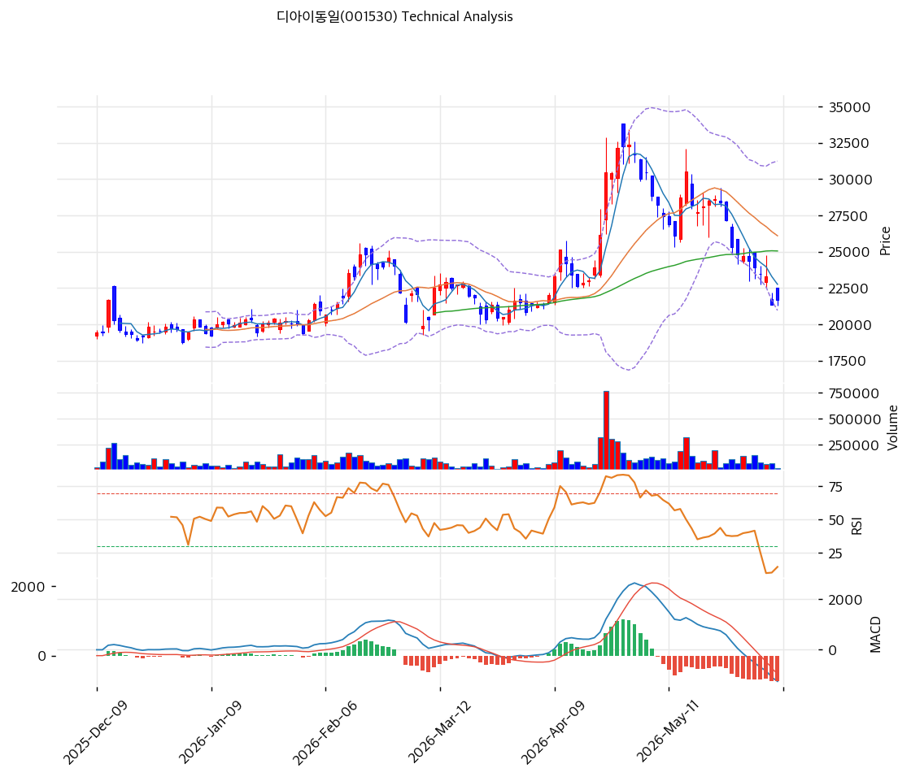

# 디아이동일(001530) 기술적 분석 보고서

---

## 가격 위치

현재가 **21,650원** (+1.41%) — 1년 위치 25.1%(고점 41,286원 대비 -48%, 저점 15,152원). 매출 감소·적자로 하락 추세, 저점권에서 당일 +1.41% 반등. **RSI 31.5·스토캐 5.0 극단 과매도**, BB 하단 근접. PBR 0.87x 딥밸류가 저점 매수 논거. 거래량비 0.21x(위축).

## 이동평균선

| 이평선 | 값 | 이격도 | 위치 |
|------|---:|----:|:---:|
| MA5 | 22,760원 | -4.7% | 아래 |
| MA20 | 26,105원 | -16.9% | 아래 |
| MA60 | 25,056원 | -13.4% | 아래 |
| MA120 | 22,920원 | -5.3% | 아래 |
| MA200 | 23,893원 | -9.2% | 아래 |

**완전 역배열(하락추세)** — 현재가가 모든 이평선 아래. MA5(22,760원)·MA120(22,920원)이 1차 저항 밀집. 반등 시 MA5·MA120 22,800원 돌파가 관건.

## 모멘텀 지표

- **RSI 31.5 (중립)** — 30 근접 침체권. 추가 하락 압력 제한적
- **MACD -1,253 / 시그널 -533 / 히스토 -720** — 매도 + 하락. 하락 모멘텀 잔존
- **스토캐스틱 K=5.0 / D=6.9** — 데드크로스 **극단 과매도(5.0)**. 기술적 반등 임박 구간
- **볼린저밴드** — 상단 31,250 / 중심 26,105 / 하단 20,960, 폭 39.4%, **하단 근접**. 과매도
- **거래량비 0.21x** — 거래 위축(바닥 다지기)

## 반등 시 저항 (스윙 19,920 / 32,400)

| 레벨 | 가격 | 성격 |
|------|---:|------|
| 0.786 | 22,591원 | 1차 저항 (MA5·MA120 근접) |
| 0.618 | 24,687원 | 2차 저항 (MA200·MA60 근접) |
| 0.5 | 26,160원 | 중기 저항 (MA20 근접) |

## 지지/저항 (S&R)

- **저항**: 22,591원(피보 0.786) / 22,760원(MA5) / 22,920원(MA120) / 23,893원(MA200) / 25,056원(MA60)
- **지지**: **20,960원(BB 하단)** / 19,920원(스윙 저점) / 15,152원(52주 저가)

## 종합 시그널 & 전략

**시그널: 매수 1 / 매도 1 / 중립 4 → 중립** (극단 과매도 반등 vs 하락추세)

- **전략**: 분할 매수 관점. 역배열 하락추세이나 **PBR 0.87x 딥밸류 + 스토캐 5.0 극단 과매도 + 2026Q1 흑자 회복**으로 저점 분할 매수 구간
- **저점 분할 매수**: BB 하단(20,960원)~현재가 부근 **20,900\~21,700원 분할 매수**, 손절 스윙 저점 19,920원 이탈
- **상방**: 반등 시 MA5·MA120 22,800원 돌파 → 피보 0.618 24,687원(MA200/MA60) → MA20 26,105원. 흑전 정착·2차전지 알루미늄박 회복이 동력
- **하방**: BB 하단 20,960원·스윙 저점 19,920원 이탈 시 52주 저가 15,152원. 단 PBR 0.87x 자산가치로 하방 일부 방어
- **변곡점**: 흑자 전환 정착 + 2차전지 알루미늄박·코팅박 회복이 추세 반전 핵심. 딥밸류 + 극단 과매도로 저점 매수 매력, 단 적자·매출 감소 유의
