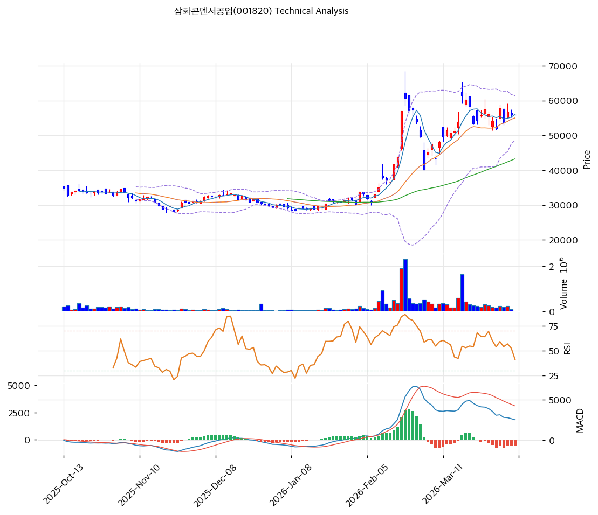

# 삼화콘덴서공업(001820) 기술적 분석

2026-04-07 | T2 Technical Analysis

---

## 차트

---

## 1. 가격 현황

| 항목 | 값 |
|------|-----|
| 현재가 | 55,900원 (0.00%) |
| 52주 고가 | 61,500원 |
| 52주 저가 | 21,750원 |
| 52주 범위 위치 | 85.9% |
| 거래량 | 20일 평균 대비 0.0x (휴장일 또는 미집계) |

---

## 2. 차트 패턴 분석

### 2.1 캔들스틱 패턴

| 패턴 | 위치 | 신뢰도 | 해석 |
|------|------|--------|------|
| 도지형 | 최근 1일 (55,900원) | 중 | 전일 대비 변동 0%의 완전 도지로, 매수·매도 세력 간 팽팽한 균형 상태. 직전 추세 방향의 지속 또는 반전 전환점 주목 |
| 박스권 상단 접근 | 단기 수렴 구간 | 중 | 현재가 55,900원이 MA5(56,040원)와 MA20(55,018원) 사이 밀집 구간에 위치, 방향성 결정을 앞둔 눈치 장세 |

※ 거래량 데이터 미집계(0.0x)로 캔들 신뢰도 제약 존재

### 2.2 가격 구조 패턴

- **상승 추세 후 조정 국면** (신뢰도: 중)
  52주 저가 21,750원에서 고가 61,500원까지 182% 급등한 이후, 현재 고가 대비 -9.1% 조정 중. 저가 대비로는 여전히 157% 상단에 위치하며, 52주 범위 내 85.9%의 고점 밀집 구간에 해당한다. 단기 고점 형성 후 MA20(55,018원) 지지 여부 확인이 다음 방향성의 분기점이다.

- **삼각 수렴 가능성** (신뢰도: 약)
  MA5(56,040원)와 현재가(55,900원)의 좁은 괴리(-0.2%)와 함께 상단 저항(61,500원 52주 고가)·하단 지지(MA20 55,018원) 사이에서 점진적 수렴 패턴이 형성 중인 것으로 추정된다. 거래량 확인 없이는 방향성 단정 불가.

### 2.3 다이버전스

- **MACD 하락 다이버전스** (신뢰도: 중)
  MACD 값(2,527)이 시그널(3,104)을 하회하고 히스토그램이 -577로 음전환된 상태. 주가는 52주 고점 근방에 위치하나 MACD 모멘텀은 수축 중으로, 가격 상승 여력 소진 가능성을 시사한다. 히스토그램이 확대(Expanding)되지 않고 있어 추세 반전보다는 조정 연장의 성격이 강하다.

- **RSI 중립권 유지** (신뢰도: 약)
  RSI(14) 55.2는 과매수(70 이상) 구간에 진입하지 않은 상태로, 추가 상승 여력을 완전히 소진하지 않았음을 시사한다. 뚜렷한 다이버전스보다는 모멘텀 정체 국면으로 해석.

### 2.4 패턴 종합 판단

캔들스틱은 도지형으로 방향성을 명확히 제시하지 못하고 있으며, 가격 구조상 52주 고점 근방에서 상승 추세 이후 숨고르기가 진행 중이다. MACD 히스토그램이 음전환(-577)되어 단기 매도 압력이 존재하나, RSI는 55.2로 중립권이어서 급격한 하락보다는 박스권 횡보 가능성이 높다. MA20(55,018원) 지지가 유지되는지 여부가 핵심으로, 이탈 시 MA60(43,272원)까지 조정 확대 리스크가 존재한다.

---

## 3. 이동평균선 — 정배열 (강세)

| MA | 값 | 현재가 괴리율 | 위치 |
|----|-----|--------------|------|
| MA5 | 56,040원 | -0.2% | 아래 |
| MA20 | 55,018원 | +1.6% | 위 |
| MA60 | 43,272원 | +29.2% | 위 |
| MA120 | 37,550원 | +48.9% | 위 |
| MA200 | 33,803원 | +65.4% | 위 |

**해석**: MA5·MA20·MA60·MA120·MA200의 완전 정배열 상태로 중장기 강세 구조가 유지되고 있다. 현재가는 MA5(56,040원)를 소폭 하회(-0.2%)하고 있어 단기적으로 미세한 약세 흐름이 나타나고 있으나, MA20(55,018원)까지는 +1.6% 내에서 1차 지지선 역할을 수행 중이다. MA60 대비 +29.2% 괴리율은 중기 상승 과열 가능성을 내포하며, 단기 조정 시 MA20~MA60 사이의 구간(43,272~55,018원)이 유의미한 지지 밴드로 작동할 전망이다.

---

## 4. 보조 지표

### RSI(14) — 55.2 (중립)

RSI 55.2는 중립 구간(40~60)의 상단에 위치하며, 매수 모멘텀이 존재하나 과매수 진입 직전 수준이다. 추가 상승 시 60~70 구간 진입 여부, 하락 시 50선 이탈 여부가 단기 방향성의 참고 기준이다.

### MACD(12,26,9)

| 항목 | 값 |
|------|-----|
| MACD | 2,527 |
| Signal | 3,104 |
| Histogram | -577 |
| 크로스 상태 | 매도 구간 (수축 중) |

**해석**: MACD 라인(2,527)이 시그널 라인(3,104)을 하회하는 데드크로스 상태로 단기 매도 구간에 진입해 있다. 히스토그램은 -577로 음수이지만 확대(Expanding) 추세는 아니어서 하락 모멘텀이 강화되기보다는 소강 국면으로 해석된다. MACD 골든크로스 재전환 확인 전까지는 매수 신호로 보기 어렵다.

### 볼린저밴드(20, 2σ)

| 항목 | 값 |
|------|-----|
| 상단 | 61,407원 |
| 중단 (MA20) | 55,018원 |
| 하단 | 48,628원 |
| 밴드 폭 | 23.2% |
| 현재 위치 | 중간 |

**해석**: 밴드 폭 23.2%는 넓은 편으로, 변동성이 아직 수축(스퀴즈) 국면이 아님을 나타낸다. 현재가(55,900원)는 밴드 중단(55,018원)과 상단(61,407원) 사이의 중간 구간에 위치해 있어 상단 돌파 시 강세 가속 가능성과 중단 이탈 시 하단(48,628원)으로의 하락 가능성 모두 열려 있다.

### 스토캐스틱(14, 3, 3)

| 항목 | 값 |
|------|-----|
| Slow %K | 39.0 |
| Slow %D | 37.6 |
| 크로스 상태 | 골든크로스 |
| 판단 | 중립 |

---

## 5. 지지/저항

| 구분 | 가격 | 근거 |
|------|------|------|
| 저항 | 61,500원 | 52주 고가, 강한 매물대 |
| 저항 | 61,407원 | 볼린저밴드 상단 |
| **현재가** | **55,900원** | — |
| 지지 | 55,018원 | MA20, 볼린저밴드 중단 |
| 지지 | 43,272원 | MA60, 중기 지지선 |
| 지지 | 37,550원 | MA120, 장기 지지선 |

---

## 6. 시그널 종합

| 지표 | 내용 | 시그널 |
|------|------|--------|
| **차트 패턴** | 도지형 캔들 + 고점 조정 + MACD 하락 다이버전스 | ⚪ |
| 이동평균선 | 완전 정배열, MA20 +1.6% 위 | 🟢 |
| RSI | 55.2 — 중립 | ⚪ |
| MACD | 매도 구간 (히스토그램 -577, 수축 중) | 🔴 |
| 볼린저밴드 | 중간 위치, 밴드 폭 23.2% (정상) | ⚪ |
| 스토캐스틱 | 골든크로스, K=39.0 (중립) | ⚪ |
| 거래량 | 0.0x — 미집계 (판단 유보) | ⚪ |

**종합 판단**: 🟢 매수 1개 / 🔴 매도 1개 / ⚪ 중립 5개 → **중립**

이동평균선의 완전 정배열이라는 중장기 강세 구조가 유효하나, MACD 데드크로스와 히스토그램 음전환이 단기 조정 압력을 시사하고 있다. RSI 55.2와 스토캐스틱 골든크로스(K=39)는 중립적이어서 방향성에 확신을 주지 못한다. 현 국면은 매수와 매도가 팽팽히 맞서는 눈치 장세로, MA20(55,018원) 지지 확인 후 추세 방향을 재확인하는 접근이 합리적이다. 52주 고가(61,500원) 돌파 여부가 중기 추세 강화의 결정적 신호가 될 것이다.

---

## 7. 전략 제안

### 보유 중인 경우
- **홀드**
- 익절 라인: 61,500원 (52주 고가 및 볼린저밴드 상단 돌파 확인 시)
- 손절 라인: 55,018원 (MA20 이탈 시, 중기 추세 훼손 신호)
- 리스크/리워드: (61,500 - 55,900) : (55,900 - 55,018) = 5,600 : 882 ≈ 1 : 6.3 (유리)

### 진입 대기인 경우
- **진입 가능**
- 1차 진입가: 55,900원 (현재가, 정배열 구조 유효 구간)
- 2차 진입가: 55,018원 (MA20 지지 확인 후 재진입)
- 진입 조건: MA20(55,018원) 지지 재확인 + MACD 히스토그램 양전환 또는 스토캐스틱 골든크로스 강화(K>D 격차 확대) 동반 시 진입 유효성 상승. 거래량 20일 평균 이상 동반 시 신뢰도 한층 제고
