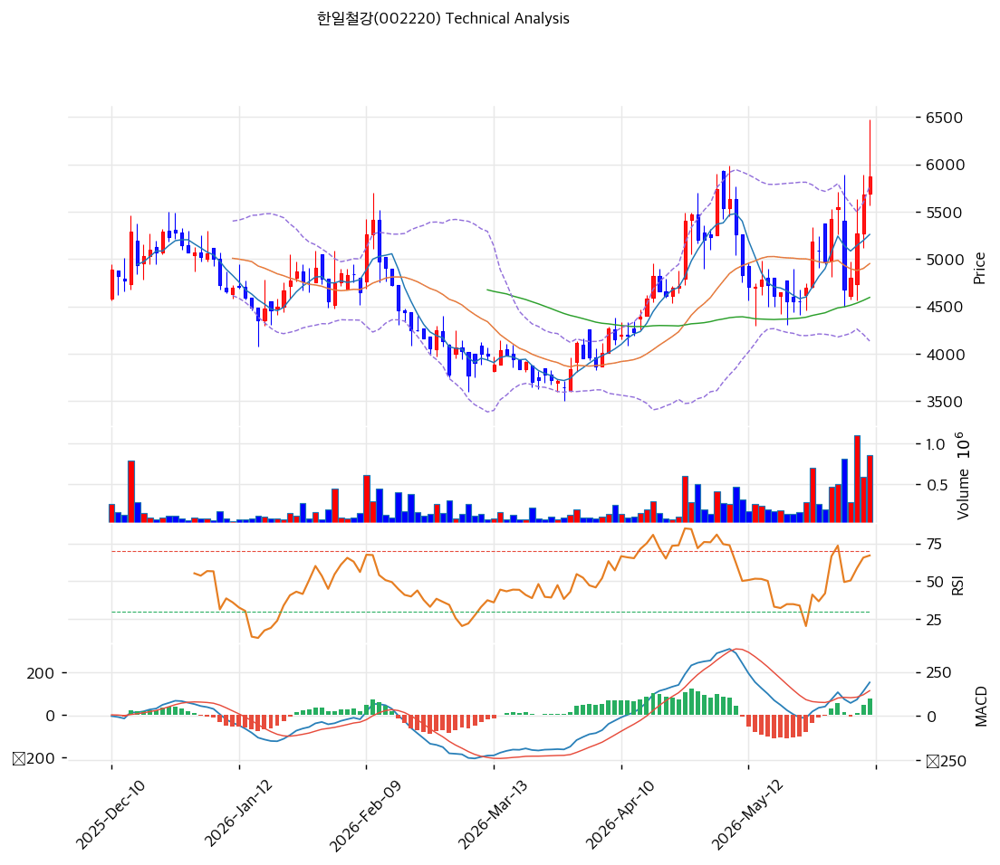

# 기술적분석

2026-06-10 | T2 Technical Analysis

***

## 차트

***

## 1. 가격 현황

| 항목        | 값                       |
| --------- | ----------------------- |
| 현재가       | 5,870원 (+3.35%)         |
| 52주 고가    | 6,470원                  |
| 52주 저가    | 2,455원                  |
| 52주 범위 위치 | 약 85% (고점권)             |
| 거래량       | 20일 평균 대비 2.47x (강력 동반) |

***

## 2. 차트 패턴 분석

### 2.1 캔들스틱 패턴

| 패턴            | 위치                      | 신뢰도 | 해석                                   |
| ------------- | ----------------------- | --- | ------------------------------------ |
| 장대양봉 + 거래량 폭증 | 최근 1\~2주 (5,000→6,470원) | 강   | 매수 시그널 — 밸류업·반덤핑 기대로 대량 매수 유입, 추세 가속 |
| 적삼병 계열 연속 양봉  | 5월 중순\~6월               | 중   | 매수 우위 — 박스권 상단 돌파 후 상승 지속            |
| 윗꼬리 음봉(고점권)   | 최근 6,470원 터치 후          | 약   | 단기 차익실현 — 신고가 부근 변동성 확대, 눌림 가능성      |

※ 주요 캔들 패턴: 망치형, 역망치형, 장악형(상승/하락), 도지, 샛별/석별, 적삼병/흑삼병, 하라미, 유성형, 교수형 등

### 2.2 가격 구조 패턴

* **박스권 상향 돌파 (4,000\~5,000원 → 6,000원대)** (신뢰도: 강) 장기간 4,000\~5,000원 박스권에 갇혀 있던 주가가 4\~6월 밸류업 공시·반덤핑 관세 모멘텀으로 박스 상단을 거래량 동반 돌파, 52주 신고가권(6,470원)까지 급등. 돌파 후 5,870원 안착 시도 중 — 박스 상단(5,000\~5,200원)이 이탈 시 새 지지로 전환되는지 확인 필요.
* **장기 상승 추세선** (신뢰도: 중) 2,000원대 저점부터 이어지는 장기 상승 추세 유효. 단기 급등으로 MA200(4,265원) 대비 +37.6% 괴리 — 과열 부담은 있으나 추세 자체는 강세.

※ 주요 구조 패턴: 이중천정/바닥, 헤드앤숄더(정/역), 삼각수렴, 쐐기형, 깃발형, 페넌트, 컵앤핸들, 박스권 등

### 2.3 다이버전스

* **뚜렷한 다이버전스 없음 — 추세 추종 국면** (신뢰도: 중) 가격 신고가와 함께 RSI(63.7)·MACD(+191)도 상승해 가격-지표가 동행. 하락 다이버전스 신호는 아직 없어 상승 모멘텀이 살아 있음. 다만 RSI가 과매수(70) 근접 중이라 단기 과열은 경계.

※ RSI·MACD 기반 | 상승 다이버전스 = 가격↓ 지표↑ (반등 시사), 하락 다이버전스 = 가격↑ 지표↓ (하락 시사), 히든 다이버전스 = 기존 추세 지속 시사

### 2.4 패턴 종합 판단

박스권 상향 돌파 + 거래량 2.47배 폭증 + MACD 매수 확대로 **단기 강세 추세가 명확**하다. 모든 이동평균선 위에 위치한 강세 배열이며 모멘텀이 살아 있다. 다만 MA200 대비 +37.6%, 52주 신고가권으로 단기 과열 부담이 있어, 신규 진입은 눌림목(MA5\~MA20, 5,000\~5,260원)을 노리는 것이 유리하다. 밸류업 실행·반덤핑 효과가 추세를 연장할 변수다.

***

## 3. 이동평균선 — 정배열 근접 (강세)

| MA    | 값      | 현재가 괴리율 | 위치 |
| ----- | ------ | ------- | -- |
| MA5   | 5,260원 | +11.6%  | 위  |
| MA20  | 4,952원 | +18.5%  | 위  |
| MA60  | 4,595원 | +27.7%  | 위  |
| MA120 | 4,635원 | +26.6%  | 위  |
| MA200 | 4,265원 | +37.6%  | 위  |

**해석**: 현재가가 모든 이동평균선 위에 위치한 강세 배열. 단기선(MA5 +11.6%)부터 장기선(MA200 +37.6%)까지 큰 폭의 괴리는 강한 상승 추세를 확인시키지만 동시에 단기 과열을 시사한다. 눌림 시 MA5(5,260원)·MA20(4,952원)이 1차·2차 지지로 작동한다.

***

## 4. 보조 지표

### RSI(14) — 63.7 (중립, 과매수 근접)

상승 모멘텀이 유지되는 가운데 과매수(70) 직전 구간. 70 돌파 시 추세 가속이나 단기 과열, 미돌파 후 둔화 시 눌림 가능. 다이버전스 해석은 2.3 참조.

### MACD(12,26,9)

| 항목        | 값                |
| --------- | ---------------- |
| MACD      | 191.0            |
| Signal    | 114.0            |
| Histogram | +77.0            |
| 크로스 상태    | 매수 구간 (히스토그램 확대) |

**해석**: MACD가 Signal 위에서 히스토그램을 확대하는 전형적 상승 모멘텀 강화 구간. 0선 위 강세 신호.

### 볼린저밴드(20, 2σ)

| 항목        | 값         |
| --------- | --------- |
| 상단        | 5,770원    |
| 중단 (MA20) | 4,952원    |
| 하단        | 4,134원    |
| 밴드 폭      | 33.0%     |
| 현재 위치     | 상단 돌파(밀착) |

**해석**: 현재가 5,870원이 밴드 상단(5,770원)을 상회 — 강한 상승 압력이나 단기 과열 신호. 밴드 폭(33%)이 확대 중으로 변동성 분출 국면. 상단 밖 주행은 추세 강도를 보여주나 되돌림 시 중단(4,952원)까지 조정 가능.

### 스토캐스틱(14, 3, 3)

| 항목      | 값      |
| ------- | ------ |
| Slow %K | 73.2   |
| Slow %D | 57.1   |
| 크로스 상태  | 골든크로스  |
| 판단      | 중립(상승) |

***

## 5. 지지/저항 — 추세선 · 피보나치 · PRZ 통합

### 5.1 피보나치 되돌림/확장

| 구분         | 비율    | 가격      | 현재가 대비 |
| ---------- | ----- | ------- | ------ |
| Swing High | —     | 6,470원  | +10.2% |
| 되돌림        | 0.236 | 5,410원  | -7.8%  |
| 되돌림        | 0.382 | 4,755원  | -19.0% |
| 되돌림        | 0.5   | 4,225원  | -28.0% |
| 되돌림        | 0.618 | 3,695원  | -37.1% |
| 되돌림        | 0.786 | 2,941원  | -49.9% |
| Swing Low  | —     | 1,980원  | —      |
| 확장         | 1.272 | 7,691원  | +31.0% |
| 확장         | 1.382 | 8,185원  | +39.4% |
| 확장         | 1.618 | 9,245원  | +57.5% |
| 확장         | 2.0   | 10,960원 | +86.7% |

※ 피보나치 기준: 상승 추세 (Swing Low 1,980원 → Swing High 6,470원) ※ 되돌림 = 직전 추세에서 되돌아온 비율, 확장 = 추세 방향 목표가

### 5.2 추세선

| 추세선 | 방향 | 현재 교차가 | 포인트 수 | 해석                         |
| --- | -- | ------ | ----- | -------------------------- |
| 지지선 | 상승 | 3,899원 | 6개    | 장기 저점 연결 상승 추세선 — 강한 하단 지지 |
| 저항선 | 상승 | 6,644원 | 6개    | 상승 채널 상단 — 1차 상단 목표        |

### 5.3 PRZ (Potential Reversal Zone)

| 방향 | 가격 범위         | 신뢰도 | 근거                     |
| -- | ------------- | --- | ---------------------- |
| 지지 | 5,410\~5,470원 | 약   | 피보나치 0.236 되돌림 + 피봇 S1 |
| 지지 | 4,595\~4,635원 | 약   | MA60 + MA120 수렴        |
| 지지 | 4,225\~4,265원 | 약   | 피보나치 0.5 되돌림 + MA200   |

※ PRZ = 추세선 · 피보나치 · 피봇 · MA 등 복수 지표가 겹치는 가격 구간. 겹치는 소스가 많을수록 반전 확률 상승.

### 5.4 종합 지지/저항 테이블

| 구분      | 가격            | 근거                     |
| ------- | ------------- | ---------------------- |
| 저항      | 7,691원        | 피보나치 1.272 확장          |
| 저항      | 6,644원        | 상승 채널 상단 추세선           |
| 저항      | 6,470원        | 52주 고가                 |
| **현재가** | **5,870원**    | 볼린저 상단 돌파              |
| 지지      | 5,410\~5,470원 | PRZ — 피보 0.236 + 피봇 S1 |
| 지지      | 5,260원        | MA5                    |
| 지지      | 4,952원        | MA20 + 볼린저 중단          |

***

## 6. 시그널 종합

| 지표        | 내용                           | 시그널 |
| --------- | ---------------------------- | --- |
| **차트 패턴** | 박스권 상향 돌파 + 거래량 폭증, 단기 과열 경계 | 🟢  |
| 이동평균선     | 강세 배열(모든 MA 위), MA20 +18.5%  | ⚪   |
| RSI       | 63.7 — 과매수 근접                | ⚪   |
| MACD      | 매수구간, 히스토그램 확대               | 🟢  |
| 볼린저밴드     | 상단 돌파(밀착), 밴드 폭 33%          | ⚪   |
| 스토캐스틱     | 골든크로스, K=73.2                | ⚪   |
| 거래량       | 2.47x — 강력 동반                | 🟢  |

**종합 판단**: 🟢 매수 3개 / 🔴 매도 0개 / ⚪ 중립 4개 → **매수우위 (단기 과열 동반)**

박스권 돌파·거래량 폭증·MACD 강세로 단기 상승 추세가 뚜렷하다. 다만 MA200 대비 +37.6%·볼린저 상단 돌파·RSI 과매수 근접 등 과열 신호도 명확해, 추격보다는 눌림목 분할 진입이 합리적이다. 밸류업·반덤핑 모멘텀이 추세를 연장할지가 관건.

***

## 7. 전략 제안

### 보유 중인 경우

* **홀드 (분할 익절 병행)**
* 익절 라인: 6,470원(52주 고가) 1차 / 6,644원(채널 상단)·7,691원(피보 1.272) 2차
* 손절 라인: 4,950원 (MA20·볼린저 중단 종가 이탈 — 돌파 실패 시그널)
* 리스크/리워드: 약 1 : 0.6 (1차 익절 +600원 vs 손절 -920원) — 단기 과열로 신규 진입 손익비는 불리

### 진입 대기인 경우

* **눌림목 대기 (추격 자제)**
* 1차 진입가: 5,260원 (MA5 눌림)
* 2차 진입가: 4,952원 (MA20·볼린저 중단)
* 진입 조건: 박스 상단(5,000\~5,200원) 지지 전환 확인 후 분할 진입. 거래량 동반 6,470원 돌파 시 추세 추종도 가능하나 과열 구간이므로 비중 관리. 밸류업 실행·실적 확인 전 추격 매수 자제
