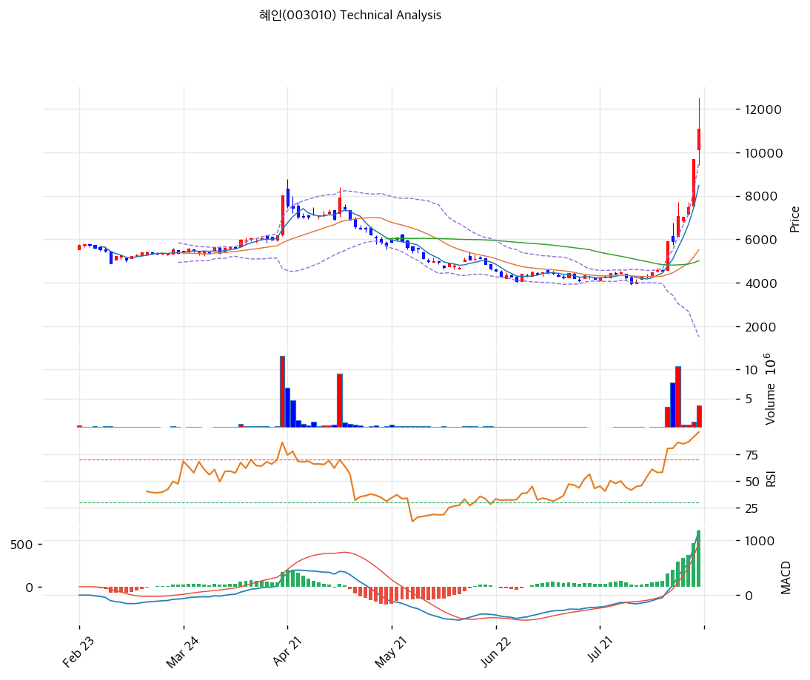

# 혜인(003010) 기술적 분석

## 차트

⚠️ **이 차트는 정상적인 기술적 분석이 성립하지 않는 상태다.** 8거래일 만에 +143.5% 오르면서 20일 표준편차가 폭발했고, 볼린저 밴드 하단이 1,533원이라는 무의미한 값으로 벌어졌다. 이동평균선은 전부 주가 절반 아래에 있다. 아래 지표는 과열의 정도를 재는 용도로만 유효하다.

## 가격 현황

| 항목 | 값 |
|---|---|
| 현재가 | **11,080원** (**+14.34%**) |
| 당일 시가 / 고가 / 저가 | 10,140 / **12,490** / 9,400원 |
| 당일 상한가 / 하한가 | 12,590 / 6,790원 |
| 52주 고 / 저 | **12,490원** (2026-08-18) / **3,925원** (2026-07-29) |
| 52주 위치 | 83.5% |
| 고점 대비 | -11.3% |
| **8거래일 상승률** | **+143.5%** (8/6 4,550원 → 8/18 11,080원) |
| **저점 대비** | **+182.3%** (7/29 3,925원 대비) |
| 1년 수익률 | +107.9% |
| RSI(14) | **92.5 (극단 과매수)** |
| MACD | 1,175 / 517 / **+658** (히스토그램 확대 중) |
| Stochastic | K=92.4 D=90.4 (과매수 영역) |
| 볼린저(20) | 상단 9,523 / 중단 5,528 / 하단 1,533, **폭 144.5%** |
| 거래량 | 3,743,641주 (20일 평균 대비 **2.64배**) |

당일 고가 12,490원은 상한가 12,590원에 100원 못 미친 값이다.

## 이동평균선

| MA | 가격(원) | 갭 | 위치 |
|---|--:|--:|---|
| MA5 | 8,472 | **+30.8%** | 위 |
| MA20 | 5,528 | **+100.4%** | 위 |
| MA60 | 5,019 | **+120.7%** | 위 |
| MA120 | 5,526 | **+100.5%** | 위 |
| MA200 | 5,437 | **+103.8%** | 위 |

→ **완전 정배열이지만 이격이 비정상이다.** 20일선 대비 +100.4%, 60일선 대비 +120.7%다. 주가가 60일 평균의 2.2배에 있다는 뜻이며, 이 정도 이격은 통계적으로 되돌림 없이 유지되기 어렵다.

MA20(5,528), MA120(5,526), MA200(5,437)이 5,400\~5,530원 좁은 구간에 몰려 있다. 급등 직전까지 주가가 이 자리에서 오래 횡보했다는 뜻이고, 되돌림이 깊어질 경우 자석처럼 작용할 수 있는 구간이다.

## 급등 경로

| 일자 | 종가 | 등락 | 거래량 | 비고 |
|---|--:|--:|--:|---|
| 2026-07-29 | 3,995원 | -5.9% | 140,790 | **장중 3,925원, 52주 최저** |
| 2026-08-05 | 4,600원 | +2.6% | 94,659 | |
| 2026-08-06 | 4,550원 | -1.1% | 59,196 | 급등 직전 |
| **2026-08-07** | **5,910원** | **+29.9%** | **3,568,342** | **상한가. 거래량 60배** |
| 2026-08-10 | 5,930원 | +0.3% | 7,681,987 | 장중 6,750원 |
| **2026-08-11** | **7,080원** | **+19.4%** | **10,477,889** | **거래소 조회공시 요구** |
| 2026-08-12 | 7,050원 | -0.4% | 530,617 | **답변: 중요 공시대상 없음** |
| 2026-08-13 | 7,460원 | +5.8% | 507,262 | |
| **2026-08-14** | **9,690원** | **+29.9%** | **978,616** | **상한가. 반기보고서 제출일** |
| **2026-08-18** | **11,080원** | **+14.34%** | **3,743,641** | 장중 12,490원 |

⚠️ **8월 11일 거래량 10,477,889주는 유통주식수 9,797,756주를 넘어섰다.** 하루에 유통 물량 전체가 손바뀜한 셈이다. 자기주식 22.93%와 최대주주 등 19.71%를 제외한 실질 유동물량이 약 729만주인 점을 감안하면 회전율은 그보다 더 높다.

상한가가 두 번(8/7, 8/14) 나왔고, 두 번 모두 회사 공시와 무관한 날이었다. 8월 14일은 반기보고서 제출일이지만 그 내용은 매출 -21.2%였다.

## 수급

| 구분 | 5일 누적 | 20일 누적 |
|---|--:|--:|
| 외국인 | **+287,287주** | +24,379주 |
| 기관 | **+168,617주** | +168,934주 |

**주요 일자별 (주)**

| 일자 | 외국인 | 기관 | 개인 |
|---|--:|--:|--:|
| 2026-08-07 | — | +41,329 | +81,803 |
| 2026-08-10 | -253,743 | -41,185 | +284,459 |
| **2026-08-11** | **+404,482** | **+142,740** | **-592,759** |
| 2026-08-12 | -121,646 | -4 | +117,551 |
| 2026-08-14 | -1,593 | +36,237 | -81,098 |

수급의 방향이 날마다 뒤집힌다. 8월 10일에는 외국인이 25만주를 팔고 개인이 28만주를 샀는데, 다음 날인 8월 11일에는 외국인이 40만주를 사고 개인이 59만주를 팔았다. 20일 누적으로 보면 외국인은 +24,379주로 사실상 중립이고 기관만 +168,934주 순매수다.

**특정 주체가 일관되게 매집하는 그림이 아니다.** 단기 자금이 회전하는 국면으로 읽는 것이 자연스럽다.

## 시그널 종합

| 구분 | 카운트 |
|---|--:|
| 매수 | 2 |
| 매도 | 0 |
| 과열 경고 | 3 |
| 산출 무의미 | 1 |
| **결론** | **강한 상승 추세 + 극단적 과열** |

- 🟢 **이동평균** 5개선 완전 정배열
- 🟢 **MACD** 1,175 > 시그널 517, 히스토그램 +658로 확대 중. 모멘텀은 아직 살아 있다
- 🔴 **RSI 92.5** 극단 과매수. 통상 70 이상을 과매수로 보는데 90을 넘었다
- 🔴 **이격도** 20일선 대비 +100.4%, 60일선 대비 +120.7%
- 🔴 **스토캐스틱** K 92.4 D 90.4 동반 과매수
- ⛔ **볼린저** 밴드 폭 144.5%, 하단 1,533원. 지표가 깨져 해석 불가

매수 신호와 과열 경고가 동시에 최대치다. 이런 배치는 방향 예측이 아니라 **포지션 크기 관리의 문제**로 접근해야 하는 구간이다.

## 지지·저항

| 구분 | 가격(원) | 근거 |
|---|--:|---|
| 강 저항 | 12,590 | 당일 상한가 |
| 저항 | 12,580 | 피봇 R2 |
| 강 저항 | **12,490** | **52주 최고 (당일 장중)** |
| **현재가** | **11,080** | |
| 지지 | 10,469 | 피보나치 0.236 되돌림 |
| 지지 | 9,690 | 8/14 종가(상한가) |
| 지지 | 9,490 | 피봇 S1 |
| 지지 | 9,400 | 당일 저가 |
| 지지 | 9,218 | 피보나치 0.382 되돌림 |
| 지지 | 8,472 | MA5 |
| 지지 | 8,208 | 피보나치 0.5 되돌림 |
| 지지 | 7,900 | 피봇 S2 |
| **강 지지** | **7,050\~7,460** | **8/11\~8/13 대량 거래 구간. 실질 매물대** |
| 지지 | 7,197 | 피보나치 0.618 되돌림 |
| 강 지지 | **5,528** | **MA20·MA120·MA200 밀집 구간 (5,437\~5,528)** |
| 강 지지 | 5,260 | 회사 자사주 평균 매입단가 |

※ 피보나치는 상승 추세 기준(저점 3,925원 → 고점 12,490원)
※ 확장 목표: 1.272 = 14,820원 / 1.618 = 17,783원

**7,050\~7,460원 구간이 이 차트에서 가장 두꺼운 실질 지지대다.** 8월 11일부터 13일까지 3거래일간 이 가격대에서 1,151만주가 거래됐다. 피보나치 0.618 되돌림(7,197원)도 이 안에 들어온다.

## 전략

| 시나리오 | 액션 |
|---|---|
| 보유자 | **분할 익절 검토** (1차 12,490원 재도전 시 / 2차 이탈 시 7,460원) |
| 신규 진입 | **권하지 않음.** RSI 92.5, 20일선 대비 +100.4% |
| 조정 시 1차 관찰 | 9,218\~9,490원 (피보 0.382·피봇 S1, 현재가 대비 -14\~17%) |
| 조정 시 2차 관찰 | **7,050\~7,460원** (대량 거래 매물대, -33\~36%) |
| 가치 기준 재진입 | 5,528원 이하 (MA20·MA120·MA200 밀집, PBR 0.52배) |
| 손절 기준 | 7,050원 이탈 (8/11 대량 거래일 종가) |

## 핵심 판단

차트는 **모멘텀이 살아 있는 급등 국면**을 보여준다. MACD 히스토그램이 아직 확대 중이고 완전 정배열이며 상한가가 두 번 나왔다. 단기 추세만 보면 위쪽이다.

동시에 **과열 지표가 전부 극단에 있다.** RSI 92.5, 20일선 대비 +100.4%, 60일선 대비 +120.7%. 볼린저 밴드는 표준편차 폭발로 지표 기능을 잃었다. 8월 11일 하루 거래량이 유통주식 전체를 넘었다.

이 종목에서 기술적 분석이 답하지 못하는 것이 하나 있다. **가격의 닻이 없다는 점이다.** 커버 증권사가 없어 목표주가도 컨센서스 추정치도 존재하지 않고, 회사는 8월 12일 조회공시에 "중요 공시사항 없음"이라고 답했다. 상승을 정당화하거나 부정할 공식 기준선이 없는 상태에서 수급만으로 가격이 형성되고 있다.

세 가지를 기준선으로 삼는 것이 현실적이다.

**① 12,490원** (52주 최고, 당일 장중). 이 가격을 거래량 동반해 넘으면 추세가 연장된다.
**② 7,050\~7,460원** (8/11\~8/13 대량 거래 매물대). 여기가 깨지면 급등 이전 자리로 돌아가는 경로가 열린다.
**③ 5,437\~5,528원** (MA20·MA120·MA200 밀집). 급등 직전까지의 균형가격이며 PBR 약 0.52배에 해당한다.

보유자에게는 분할 익절 구간이고, 미보유자에게는 관망 구간이다. 다음 방향은 차트가 아니라 **11월 중순 3분기 보고서**에서 엔진·발전기 매출이 반등하는지가 정할 가능성이 높다.
