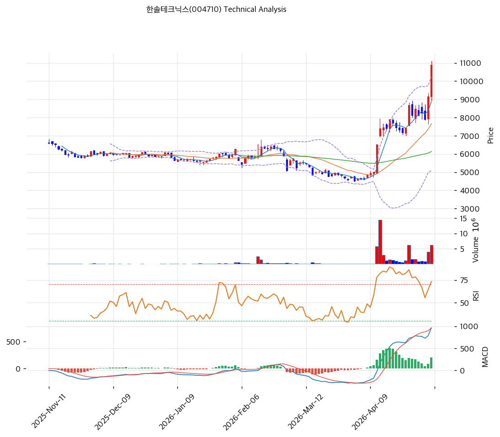

# 기술적분석

2026-05-08 | T2 Technical Analysis

***

## 차트

***

## 1. 가격 현황

| 항목        | 값                 |
| --------- | ----------------- |
| 현재가       | 10,880원 (+18.91%) |
| 52주 고가    | 11,130원           |
| 52주 저가    | 4,510원            |
| 52주 범위 위치 | 100.0%            |
| 거래량       | 20일 평균 대비 2.64x   |

***

## 2. 차트 패턴 분석

### 2.1 캔들스틱 패턴

| 패턴                           | 위치                       | 신뢰도 | 해석                                                        |
| ---------------------------- | ------------------------ | --- | --------------------------------------------------------- |
| 장대양봉 (Long Bullish Marubozu) | 당일 (2026-05-08)          | 강   | +18.91% 갭상승 후 상단 마감, 거래량 2.64x 동반 — 강력한 매수 시그널이나 단기 과열 동반 |
| 갭상승 돌파 (Breakaway Gap)       | 4월 초 — 5,000원대 → 7,000원대 | 강   | 장기 박스권(5,500\~6,500) 상향 이탈, 추세 전환 점화 신호                   |
| 적삼병 유사 패턴                    | 최근 4월 중순                 | 중   | 7,500\~8,500원 구간 연속 양봉 후 11,000원 안착, 모멘텀 지속 시사            |
| 유성형 흔적 (Shooting Star Hint)  | 4월 하순 단기 고점              | 약   | 11,000원 근접 후 윗꼬리 발생 후 재돌파, 일시적 매물 소화 정황                   |

### 2.2 가격 구조 패턴

* **박스권 상향 이탈 (Range Breakout)** (신뢰도: 강) 2025년 11월 \~ 2026년 3월까지 약 5개월간 5,500\~6,500원 박스권에서 횡보. 4월 초 거래량 동반 갭상승으로 박스 상단을 돌파하며 추세 전환. 박스 폭(≈1,000원) 기준 측정이동(measured move) 목표가는 7,500원 수준이었으나 이미 +45% 초과 달성, 현재는 추세 확장 국면.
* **신고가 돌파 (52주 신고가)** (신뢰도: 강) 당일 10,880원으로 52주 고가 11,130원에 거의 근접하며 100% 위치. 1년 +141% 급등 후 신고가 갱신 단계로, 미확인 가격대(blue sky) 진입. 저항이 옅어지지만 차익실현 압력은 누적.
* **상승 추세선 (Ascending Trendline)** (신뢰도: 중) 4월 초 저점(≈5,000원)부터 형성된 가파른 상승 추세선이 살아있으며 기울기 +2.6/일 수준. 추세 이탈 시 1차 손절 라인은 8,000원대 중반.
* **볼린저밴드 확장 (Squeeze → Expansion)** (신뢰도: 강) 3월까지 지속된 BB 스퀴즈(밴드폭 축소) 이후 4월부터 폭발적 확장. 밴드 폭 67.3%로 급격히 벌어지며 상단(10,246원) 외부에서 종가 형성 — 추세 강도는 강하나 밴드 워킹 후 평균회귀 리스크 누적.

### 2.3 다이버전스

* **RSI 잠재적 하락 다이버전스 (Bearish Divergence)** (신뢰도: 약) 4월 중순 RSI 80 부근 도달 후 일시 하락(~~60대)했다가 가격은 신고가 갱신했으나 RSI는 77.4로 직전 고점 대비 약간 낮은 수준. 명확한 다이버전스로 확인되려면 추가 1~~2봉 관찰 필요. 단기 모멘텀 둔화 가능성을 시사하나 강도는 약함.
* **MACD 동행 강세** (신뢰도: 강 / 다이버전스 미발생) MACD 961, Signal 753, Histogram +208로 확대 중. 가격 신고가와 MACD 신고가가 동행 → 추세 지속 시사. 다이버전스 없음.

### 2.4 패턴 종합 판단

캔들·구조·다이버전스 신호는 **추세 지속 우위 + 단기 과열 경계**로 요약된다. 박스권 돌파 후 신고가 갱신, 거래량 2.64x 동반 장대양봉, MACD 동행 강세는 강력한 상승 추세를 확정하는 시그널이다. 그러나 RSI 77.4의 과매수권 진입과 BB 상단 외부 종가, 잠재적 RSI 하락 다이버전스 흔적은 단기 조정 가능성을 경고한다. 결론: **중기 추세는 상방, 단기는 눌림목 발생 가능성 높은 과열 구간**으로 신규 추격매수보다 조정 시 진입이 유리.

***

## 3. 이동평균선 — 비정배열 (강세 — 단기 급등형)

| MA    | 값      | 현재가 괴리율 | 위치 |
| ----- | ------ | ------- | -- |
| MA5   | 8,864원 | +22.7%  | 위  |
| MA20  | 7,665원 | +41.9%  | 위  |
| MA60  | 6,134원 | +77.4%  | 위  |
| MA120 | 6,033원 | +80.3%  | 위  |
| MA200 | 6,053원 | +79.7%  | 위  |

**해석**: 모든 MA가 현재가 아래에 위치해 단기 강세는 명확하지만, MA60/120/200이 6,033\~6,134원에 밀집해 거의 수평이며, 정배열(MA5>MA20>MA60>MA120>MA200) 조건을 충족하지 않아 **비정배열 상태**. 이는 장기간 횡보 후 단기 폭등으로 단기 MA만 급격히 들어올린 전형적 "급등 초기형" 구조다. MA20 +41.9%, MA60 +77.4%는 통계적으로 평균회귀 압력이 매우 높은 수준 — 정상화 시 1차 지지는 MA20(7,665원), 2차는 MA60(6,134원). 정배열 정착에는 시간이 필요하며, 그 사이 변동성 확대 가능.

***

## 4. 보조 지표

### RSI(14) — 77.4 (🔴 과매수)

70 상회 과매수권에 안착. 4월 중순 80 부근에서 한 차례 식힘 후 재상승했으나 직전 고점 미돌파 — 단기 모멘텀 피로 누적. 70 하회 시 단기 조정 신호로 확정될 가능성. 다이버전스 해석은 2.3 참조.

### MACD(12,26,9)

| 항목        | 값            |
| --------- | ------------ |
| MACD      | 961          |
| Signal    | 753          |
| Histogram | +208         |
| 크로스 상태    | 매수 구간 (확대 중) |

**해석**: MACD가 Signal 위에서 강한 양의 격차 유지, 히스토그램 확대 → 추세 강도 매우 강함. 다만 0선 대비 상당히 이격된 상태로 향후 히스토그램 축소 전환 시 단기 조정 신호로 작동할 가능성. 다이버전스 미발생.

### 볼린저밴드(20, 2σ)

| 항목        | 값                |
| --------- | ---------------- |
| 상단        | 10,246원          |
| 중단 (MA20) | 7,665원           |
| 하단        | 5,084원           |
| 밴드 폭      | 67.3%            |
| 현재 위치     | 상단 외부 (상단 근접 초과) |

**해석**: 3월까지 이어진 스퀴즈 후 4월부터 급격한 확장. 종가 10,880원이 상단 10,246원을 초과 — 밴드 워킹(band walking) 진입. 밴드 폭 67.3%는 1년 내 최고 수준의 변동성 폭발 상태로 추세 강도는 강하지만 평균회귀 압력 동시 누적. 상단 재진입 시(종가 < BB 상단) 단기 조정의 첫 신호.

### 스토캐스틱(14, 3, 3)

| 항목      | 값              |
| ------- | -------------- |
| Slow %K | 77.3           |
| Slow %D | 69.8           |
| 크로스 상태  | 골든크로스          |
| 판단      | 중립 (과매수 임계 부근) |

골든크로스 + K>D 구조로 단기 매수 우위. 다만 K가 77로 80 과매수권 임박 — 추가 상승 여력은 있으나 80 진입 후 데드크로스 시 조정 신호.

***

## 5. 지지/저항 — 추세선 · 피보나치 · PRZ 통합

### 5.1 피보나치 되돌림/확장

| 구분         | 비율    | 가격      | 현재가 대비 |
| ---------- | ----- | ------- | ------ |
| Swing High | —     | 11,130원 | +2.3%  |
| 되돌림        | 0.236 | 9,561원  | -12.1% |
| 되돌림        | 0.382 | 8,590원  | -21.0% |
| 되돌림        | 0.5   | 7,805원  | -28.3% |
| 되돌림        | 0.618 | 7,020원  | -35.5% |
| 되돌림        | 0.786 | 5,903원  | -45.7% |
| Swing Low  | —     | 4,480원  | -58.8% |
| 확장         | 1.272 | 12,939원 | +18.9% |
| 확장         | 1.382 | 13,670원 | +25.6% |
| 확장         | 1.618 | 15,240원 | +40.1% |
| 확장         | 2.0   | 17,780원 | +63.4% |

※ 피보나치 기준: 상승 추세 (Swing Low 4,480원 → Swing High 11,130원) ※ 되돌림 = 직전 추세에서 되돌아온 비율, 확장 = 추세 방향 목표가

### 5.2 추세선

| 추세선 | 방향 | 현재 교차가 | 포인트 수 | 해석                                             |
| --- | -- | ------ | ----- | ---------------------------------------------- |
| 지지선 | 하락 | 4,774원 | 6개    | 11월\~3월 횡보권 저점 연결, 현재가에서 -56% 떨어진 장기 안전판       |
| 저항선 | 상승 | 7,070원 | 6개    | 박스권 상단 추세선이었으나 4월 돌파로 이미 무력화 — 현재 지지로 역할 전환 가능 |

### 5.3 PRZ (Potential Reversal Zone)

| 방향 | 가격 범위         | 신뢰도 | 근거                     |
| -- | ------------- | --- | ---------------------- |
| 지지 | 9,483\~9,561원 | 약   | 피봇 S1 + 피보나치 0.236 되돌림 |
| 지지 | 7,665\~7,805원 | 약   | MA20 + 피보나치 0.5 되돌림    |

※ PRZ = 추세선 · 피보나치 · 피봇 · MA 등 복수 지표가 겹치는 가격 구간. 겹치는 소스가 많을수록 반전 확률 상승.

### 5.4 종합 지지/저항 테이블

| 구분      | 가격          | 근거                       |
| ------- | ----------- | ------------------------ |
| 저항      | 13,670원     | 피보나치 1.382 확장 (중기 목표)    |
| 저항      | 12,939원     | 피보나치 1.272 확장 (1차 목표)    |
| 저항      | 11,703원     | 피봇 R1 (단기 1차 저항)         |
| 저항      | 11,130원     | 52주 고가 (직접 저항)           |
| **현재가** | **10,880원** | —                        |
| 지지      | 10,246원     | BB 상단 (재진입 시 1차 지지)      |
| 지지      | 9,522원      | PRZ — 피봇 S1 + 피보나치 0.236 |
| 지지      | 8,590원      | 피보나치 0.382 되돌림           |
| 지지      | 8,087원      | 피봇 S2 (손절 라인)            |
| 지지      | 7,735원      | PRZ — MA20 + 피보나치 0.5    |
| 지지      | 6,134원      | MA60 (장기 추세 지지)          |

***

## 6. 시그널 종합

| 지표        | 내용                                           | 시그널 |
| --------- | -------------------------------------------- | --- |
| **차트 패턴** | 박스권 상향 돌파 + 신고가 + 장대양봉, 단 과열 흔적              | 🟢  |
| 이동평균선     | 비정배열, MA20 +41.9% / MA60 +77.4% (단기 강세 / 과열) | ⚪   |
| RSI       | 77.4 — 과매수권 안착, 단기 피로                        | 🔴  |
| MACD      | 매수 구간, 히스토그램 확대 — 추세 지속                      | 🟢  |
| 볼린저밴드     | 상단 외부 종가, 밴드 폭 67.3% — 평균회귀 리스크              | 🔴  |
| 스토캐스틱     | 골든크로스, K=77.3 — 중립 (과매수 임박)                  | ⚪   |
| 거래량       | 2.64x — 강력 동반                                | 🟢  |

**종합 판단**: 🟢 매수 3개 / 🔴 매도 2개 / ⚪ 중립 2개 → **중립 (추세 우위 + 과열 경계)**

차트 패턴(박스권 돌파, 신고가 장대양봉) · MACD · 거래량 2.64x는 명확한 상승 추세 지속을 시사한다. 그러나 RSI 77.4 과매수, BB 상단 외부 종가, MA20 대비 +41.9% 이격은 통계적 평균회귀 가능성을 경고한다. 단기 1~~2주 시계로는 11,130~~11,703원 저항 테스트 후 9,500원 또는 8,000원대 중후반으로의 눌림 가능성이 높고, 중기 추세는 12,939원(피보 1.272)을 1차 목표로 살아있다.

***

## 7. 전략 제안

### 보유 중인 경우

* **부분 익절 + 홀드**
* 익절 라인: 11,098원 — 11,130원 (52주 고가 직전 부분 차익 / 11,703원 피봇 R1 도달 시 추가 익절)
* 손절 라인: 8,087원 (피봇 S2 / 피보 0.382 +α)
* 리스크/리워드: 진입가 기준 산정 — 현재가 10,880원 기준 R1 11,703원 도달 시 +7.6%, 손절 8,087원 시 -25.7% → R/R 약 1:3.4 (불리). 따라서 트레일링 스톱 또는 9,500원선 손절 단축 권고.

### 진입 대기인 경우

* **관망** (추격매수 비권장)
* 1차 진입가: 9,483원 (피봇 S1 / PRZ 9,522원 인접 — 1차 눌림목)
* 2차 진입가: 7,665원 (MA20 / PRZ 7,735원 — 추세선 재테스트 구간)
* 진입 조건:
  1. RSI 70 하회 + 가격이 BB 상단 안으로 재진입한 후 1차 PRZ(9,500원대) 도달 시 분할 매수
  2. 거래량 동반 양봉으로 9,500원선 지지 확인 시 1차 진입
  3. MA20(7,665원) 도달 시에는 추세 훼손 여부 점검 후 (MACD 데드크로스 미발생 조건) 2차 진입
  4. 8,087원 이탈 시 추세 전환으로 간주, 진입 보류
