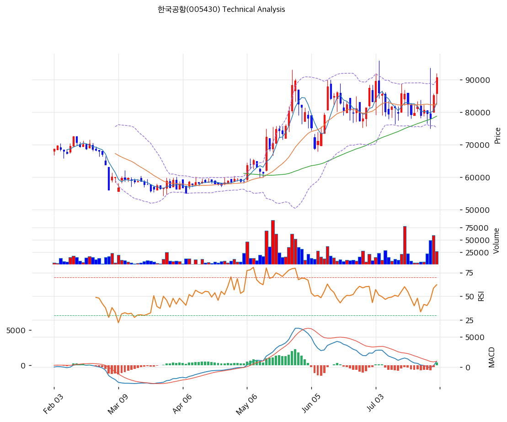

# 한국공항(005430) 기술적 분석

2026-08-02 | T2 Technical Analysis

---

## 차트

---

## 1. 가격 현황

| 항목 | 값 |
|------|-----|
| 현재가 | 90,700원 (+6.46%) |
| 52주 고가 | 90,700원 (2026-07-31, 종가 기준 = 당일 신고가) |
| 52주 저가 | 55,000원 (2026-04-07) |
| 52주 범위 위치 | 100.0% |
| 장중 52주 고가 | 95,900원 (2026-07-06) |
| 장중 52주 저가 | 54,132원 (2025-11-20, 배당락 조정가) |
| 거래량 | 27,618주 — 20일 평균 대비 1.29x |
| 3거래일 상승률 | +16.3% (7/29 종가 78,000원 → 7/31 90,700원) |

> ⚠️ **KIS API 52주 필드 오류**: 데이터 수집 시 KIS가 반환한 52주 고 92,000 / 저 82,400은 **2026-07-31 당일 장중 고·저가**와 동일한 값이다. 위 표는 yfinance 일봉 원본에서 직접 산출했다.

**당일 종가 90,700원은 종가 기준 52주 신고가다.** 다만 장중 기준으로는 7월 6일 95,900원이 여전히 최고치이므로, 아직 완전한 신고가 돌파 상태는 아니다. 이 5,200원(5.7%) 구간이 현 국면의 첫 관문이다.

---

## 2. 차트 패턴 분석

### 2.1 캔들스틱 패턴

| 패턴 | 위치 | 신뢰도 | 해석 |
|------|------|--------|------|
| 롱레그드 도지(Long-legged Doji) | 2026-07-29 | 강 | 시가 79,600 / 종가 78,000의 작은 실체에 위꼬리 14,100원·아래꼬리 3,100원. 장중 74,900\~93,700원(변동폭 25.1%)을 오가며 대량거래(20일 평균의 2.68배)를 동반했다. **대규모 손바뀜이 일어난 변곡 캔들**이다 |
| 상승 마루보즈(하단) | 2026-07-30 | 중 | 시가 80,000 = 저가 80,000, 아래꼬리 없이 85,200원 마감. 전일 도지의 매도 압력을 시초부터 흡수했다는 뜻이며, 거래량 2.89x로 최대치를 기록했다 |
| 적이병(양봉 2연속) + 신고가 마감 | 2026-07-30\~31 | 중 | 이틀 연속 양봉으로 +16.3% 상승. 7/31은 아래꼬리 3,400원을 달았으나 종가가 고가 92,000원의 98.6% 지점에서 마감해 **매수세가 장 마감까지 우위**였음을 보여준다 |
| 하락 장악형 | 2026-07-08 | 약(소멸) | 조정 국면의 시작을 알렸던 패턴. 7/30\~31 반등으로 무효화됐다 |

**참고**: 이 종목은 일평균 5,000\~6,000주(약 5억원)만 거래되는 극저유동성 종목이라 일봉 실체 대비 꼬리가 비정상적으로 길다. 최근 20거래일 평균 일중 변동폭이 **7.4%**에 달한다. 캔들 패턴 해석 시 이 구조적 노이즈를 감안해야 하며, 종가 기준 흐름을 우선해야 한다.

### 2.2 가격 구조 패턴

- **상승 깃발형(Bull Flag) 완성** (신뢰도: 중)
  4월 7일 저점 55,000원에서 7월 3일 89,600원까지 **약 3개월간 +62.9%의 급등(깃대)**이 나왔고, 이후 7월 8일\~7월 29일 3주간 78,000\~85,800원 사이에서 **하향 조정(깃발)**을 거쳤다. 조정 폭은 종가 기준 -12.9%(89,600 → 78,000)로 깃대 상승분의 33.4% 되돌림이며, 피보나치 0.382 되돌림(81,693원)과 0.5 되돌림(79,250원) 사이에서 지지받았다. 7월 30\~31일 대량거래를 동반해 깃발 상단을 돌파했으므로 패턴이 완성된 것으로 본다. 깃대 높이(34,600원)를 돌파 지점(85,800원)에 더한 **이론적 목표가는 120,400원**이나, 이는 유동성을 감안하면 과도한 수치이므로 참고치로만 본다.

- **박스권 상단 돌파** (신뢰도: 강)
  7월 3일 이후 4주간 **79,000\~89,600원 박스**가 형성됐다. 하단은 7/24(79,000)·7/28(79,600)·7/29(78,000)에서 세 차례 확인됐고, 상단은 7/3(89,600)·7/6(86,000)·7/15(85,800)에서 형성됐다. 7월 31일 종가 90,700원은 이 박스 상단을 명확히 상향 돌파했다. **박스 폭 10,600원을 더한 1차 목표가는 100,200원**이다.

- **장기 상승 추세선 유효** (신뢰도: 강)
  6개 저점을 잇는 상승 추세선(기울기 일 61.1원)이 현재 65,965원 지점을 지난다. 현재가는 이 선 대비 **+37.5% 위**에 있어 추세 훼손 우려는 없다. 다만 그만큼 추세선까지의 하방 여유도 크다는 뜻이다.

### 2.3 다이버전스

- **MACD 하락(베어리시) 다이버전스** (신뢰도: 중)
  가격은 7월 3일 종가 89,600원 → 7월 31일 90,700원으로 **+1.2% 상승해 고점을 갱신**했으나, 같은 기간 MACD는 **2,765 → 949로 65.7% 하락**했다. 가격이 신고가인데 모멘텀 지표의 절대 수준이 크게 낮아진 전형적인 하락 다이버전스다. 이는 이번 상승이 지속적 매수세의 결과라기보다 **7/29\~30 이틀간의 집중 매수(대량거래 2.68x·2.89x)에 의한 단기 급등**임을 시사한다. 신고가 갱신 후 되돌림 확률이 있다.

- **RSI 다이버전스 없음** (신뢰도: —)
  7월 3일 RSI 61.6, 7월 31일 RSI 61.8로 **사실상 동일**하다. 가격과 RSI가 나란히 움직여 다이버전스가 성립하지 않는다. MACD 다이버전스의 경고 강도를 한 단계 낮춰 읽어야 하는 근거다.

- **MACD 골든크로스 발생** (신뢰도: 강)
  7월 29일 MACD가 -161로 0선 아래까지 떨어졌다가 7월 31일 949로 급반등하며 시그널선(571)을 상향 돌파했다. 히스토그램은 -701 → -259 → **+378**로 3거래일 만에 부호가 전환됐다. 다이버전스와 상충하는 신호이며, 방향은 골든크로스가 우선한다.

### 2.4 패턴 종합 판단

**단기 방향은 상승, 다만 상승의 질이 약하다.** 세 카테고리가 모두 같은 결론을 가리킨다 — 캔들에서는 7/29 롱레그드 도지 이후 2연속 양봉으로 반전이 확인됐고, 구조적으로는 4주 박스 상단과 상승 깃발이 대량거래를 동반해 돌파됐다. 그러나 MACD 하락 다이버전스는 이 상승이 **폭넓은 매수세가 아니라 이틀 동안의 집중 매수**에 기댄 것임을 보여준다. 7/29 Dalton Investments 5.01% 대량보유 공시라는 명확한 이벤트가 있었고, 그 직후 3거래일 만에 +16.3%가 나왔다는 사실이 이를 뒷받침한다. **이벤트 드리븐 급등은 재료 소진 후 되돌림이 잦으므로**, 신규 진입은 장중 52주 고가 95,900원 돌파를 확인하거나 조정 시 82,000원대 지지 확인 후가 합리적이다.

---

## 3. 이동평균선 — 정배열 (강세)

| MA | 값 | 현재가 괴리율 | 위치 |
|----|-----|--------------|------|
| MA5 | 82,860원 | +9.5% | 위 |
| MA20 | 82,585원 | +9.8% | 위 |
| MA60 | 78,795원 | +15.1% | 위 |
| MA120 | 69,970원 | +29.6% | 위 |
| MA200 | 66,986원 | +35.4% | 위 |

**해석**: MA5 > MA20 > MA60 > MA120 > MA200의 **완전 정배열**이며 현재가가 모든 이평선 위에 있다. 추세의 건강성으로만 보면 최상급이다.

문제는 **괴리율이다.** MA20 대비 +9.8%, MA60 대비 +15.1%로 단기 이평과의 거리가 크게 벌어졌다. 특히 MA5(82,860원)와 현재가(90,700원)의 괴리 +9.5%는 이틀 만에 벌어진 것으로, 이 종목의 통상 일중 변동폭(7.4%)을 감안해도 과도하다. **이격도가 100 근처로 수렴하는 과정에서 82,000\~83,000원까지의 되돌림은 정상 범주**로 봐야 한다.

MA120(69,970원)과 MA200(66,986원)의 격차가 2,984원(4.3%)에 불과할 정도로 장기 이평이 밀착한 뒤 위로 벌어지는 국면이라, 중기 추세 자체는 초입에 가깝다.

---

## 4. 보조 지표

### RSI(14) — 61.8 (중립)

과매수 기준선 70까지 8.2포인트 여유가 있다. 3거래일 +16.3%의 급등에도 RSI가 70을 넘지 않은 것은 **직전에 45.6까지 눌렸다가 반등한 덕분**이다. 추가 상승 여력이 지표상으로는 남아 있으며, 70 도달 시 대응 주가는 약 96,000\~98,000원 수준으로 추산된다 — 공교롭게도 장중 52주 고가(95,900원) 및 피보나치 1.382 확장(97,507원)과 겹치는 구간이다.

### MACD(12,26,9)

| 항목 | 값 |
|------|-----|
| MACD | 949 |
| Signal | 571 |
| Histogram | **+378** |
| 크로스 상태 | **매수 구간 (확대 중)** |

**해석**: 7월 29일 MACD가 -161로 0선을 하회했다가 이틀 만에 949로 복귀하며 시그널선을 상향 돌파했다. 히스토그램이 -701 → +378로 전환된 속도가 가파르다. 신호 자체는 명확한 매수지만, **MACD 절대 수준이 7월 초 고점(2,810)의 34%에 불과**하다는 점이 앞서 지적한 하락 다이버전스의 근거다. 히스토그램 확대가 3\~5거래일 더 이어져야 신뢰할 만한 추세 전환으로 인정할 수 있다.

### 볼린저밴드(20, 2σ)

| 항목 | 값 |
|------|-----|
| 상단 | 89,915원 |
| 중단 (MA20) | 82,585원 |
| 하단 | 75,255원 |
| 밴드 폭 | 17.8% |
| 현재 위치 | **상단 이탈 (+0.9%)** |

**해석**: 종가 90,700원이 상단 밴드 89,915원을 **785원(0.9%) 상회**해 밴드 밖으로 나갔다. 볼린저 상단 이탈은 두 가지로 읽힌다 — ① 강한 추세의 시작(밴드 워킹), ② 단기 과열. 구분 기준은 다음 2\~3거래일이다. 종가가 계속 상단 위에 머물면 밴드 워킹이고, 하루 만에 밴드 안으로 되돌아오면 과열 신호다.

밴드 폭 17.8%는 KOSPI 평균(통상 8\~12%)보다 크게 넓다. 이 종목의 구조적 변동성을 반영한 값이며, **스퀴즈(수축) 국면이 아니므로 폭발적 확장을 기대하기는 어렵다**. 하단 75,255원은 7/29 장중 저가 74,900원과 거의 일치해 강력한 하방 방어선 역할을 한다.

### 스토캐스틱(14, 3, 3)

| 항목 | 값 |
|------|-----|
| Slow %K | 51.8 |
| Slow %D | 36.9 |
| 크로스 상태 | **골든크로스** |
| 판단 | 중립 |

%K가 %D를 14.9포인트 차이로 상향 돌파한 명확한 골든크로스다. 다만 %K 51.8은 중립 구간 한복판이라 **과매도 반등의 초기 단계**로 해석된다. 80 이상 과매수 구간까지 여유가 있어 단기 상승 여력을 지지한다.

---

## 5. 지지/저항 — 추세선 · 피보나치 · PRZ 통합

### 5.1 피보나치 되돌림/확장

| 구분 | 비율 | 가격 | 현재가 대비 |
|------|------|------|-----------|
| **Swing High** | — | 89,600원 | -1.2% |
| 되돌림 | 0.236 | 84,715원 | -6.6% |
| 되돌림 | 0.382 | 81,693원 | -9.9% |
| 되돌림 | 0.5 | 79,250원 | -12.6% |
| 되돌림 | 0.618 | 76,807원 | -15.3% |
| 되돌림 | 0.786 | 73,330원 | -19.1% |
| **Swing Low** | — | 68,900원 | -24.0% |
| 확장 | 1.272 | 95,230원 | **+5.0%** |
| 확장 | 1.382 | 97,507원 | +7.5% |
| 확장 | 1.618 | 102,393원 | +12.9% |
| 확장 | 2.0 | 110,300원 | +21.6% |

※ 피보나치 기준: 상승 추세 (Swing Low 68,900원 → Swing High 89,600원)
※ 현재가 90,700원은 Swing High를 이미 1.2% 상회했으므로 **되돌림 구간을 벗어나 확장 구간에 진입**했다. 이제 유효한 것은 확장 레벨이다.

7월 조정 국면에서 실제 저점 78,000원(7/29 종가)은 **0.5 되돌림(79,250원)과 0.618 되돌림(76,807원) 사이**에서 형성됐다. 상승 추세에서 0.5\~0.618 되돌림은 건강한 조정의 표준 범위이며, 추세 훼손 없이 되돌림이 완료됐음을 확인해준다.

### 5.2 추세선

| 추세선 | 방향 | 현재 교차가 | 포인트 수 | 해석 |
|--------|------|-----------|---------|------|
| 지지선 | 상승 (일 +61.1원) | 65,965원 | 6개 | 4월 이후 6개 저점을 연결. 현재가 대비 **-27.3%**로 하방 여유가 매우 크며, 훼손 우려는 없으나 지지선으로서의 실용성도 낮다 |
| 저항선 | 상승 (일 +111.4원) | 93,284원 | 6개 | 상단 저항선 기울기가 지지선의 1.8배로, **확산형(Broadening) 채널** 형태다. 현재가 대비 +2.8% 위에 있어 **가장 임박한 저항**이다 |

지지선과 저항선의 기울기 차이(61.1 vs 111.4)가 크다는 것은 상승할수록 변동폭이 커지는 확산 구조를 의미한다. 저유동성 종목의 전형이며, **위로도 아래로도 오버슈팅이 나기 쉬운 국면**임을 시사한다.

### 5.3 PRZ (Potential Reversal Zone)

| 방향 | 가격 범위 | 신뢰도 | 근거 |
|------|---------|--------|------|
| **저항** | 93,284\~95,230원 | **중** | 추세선 저항 + 피봇 R1(94,333) + 피보나치 1.272 확장 — **3개 소스 중첩. 장중 52주 고가 95,900원과도 근접해 사실상 4중 저항** |
| 저항 | 97,507\~97,967원 | 약 | 피보나치 1.382 확장 + 피봇 R2 |
| 지지 | 84,715\~84,733원 | 약 | 피보나치 0.236 되돌림 + 피봇 S1 — 두 값이 18원 차이로 정확히 겹침 |
| **지지** | 81,693\~82,860원 | **중** | 피보나치 0.382 되돌림 + MA20(82,585) + MA5(82,860) — **3개 소스 중첩. 되돌림 시 1차 방어선** |
| **지지** | 78,767\~79,250원 | **중** | 피봇 S2 + MA60(78,795) + 피보나치 0.5 되돌림 — 3개 소스 중첩 |
| 지지 | 65,965\~66,986원 | 약 | 추세선 지지 + MA200 |

※ PRZ = 추세선·피보나치·피봇·MA 등 복수 지표가 겹치는 구간. 겹치는 소스가 많을수록 반전 확률이 높다.

### 5.4 종합 지지/저항 테이블

| 구분 | 가격 | 근거 |
|------|------|------|
| 저항 | 110,300원 | 피보나치 2.0 확장 |
| 저항 | 102,393원 | 피보나치 1.618 확장 |
| 저항 | 97,737원 | **PRZ(약)** — 피보나치 1.382 확장 + 피봇 R2 |
| 저항 | **95,900원** | **장중 52주 최고가 (2026-07-06)** |
| 저항 | **94,282원** | **PRZ(중)** — 추세선 저항 + 피봇 R1 + 피보나치 1.272 확장 |
| 저항 | 89,915원 | 볼린저 상단 (이미 돌파) |
| **현재가** | **90,700원** | 종가 기준 52주 신고가 |
| 지지 | 88,367원 | 피봇 Pivot |
| 지지 | **84,724원** | **PRZ(약)** — 피보나치 0.236 + 피봇 S1 |
| 지지 | **82,379원** | **PRZ(중)** — MA5 + MA20 + 피보나치 0.382 |
| 지지 | **78,937원** | **PRZ(중)** — MA60 + 피봇 S2 + 피보나치 0.5 |
| 지지 | 76,807원 | 피보나치 0.618 되돌림 |
| 지지 | 75,255원 | 볼린저 하단 (7/29 장중 저가 74,900원과 일치) |
| 지지 | 66,476원 | PRZ(약) — 추세선 지지 + MA200 |

**가격대 밀집도**: 78,767\~84,733원의 6,000원 구간에 **8개 지표가 몰려 있다**(MA5·MA20·MA60·피봇 S1·S2·피보나치 0.236·0.382·0.5). 되돌림이 오면 이 구간에서 강하게 방어될 가능성이 높고, 반대로 이 구간을 종가로 이탈하면 76,807원 → 75,255원까지 지지가 급격히 얇아진다.

---

## 6. 시그널 종합

| 지표 | 내용 | 시그널 |
|------|------|--------|
| **차트 패턴** | 상승 깃발 + 박스 상단 돌파 완성, 단 MACD 하락 다이버전스 상충 | 🟢 |
| 이동평균선 | 완전 정배열, MA20 대비 +9.8% (괴리 과대) | 🟢 |
| RSI | 61.8 — 중립, 과매수까지 8.2p 여유 | ⚪ |
| MACD | 골든크로스 발생, 히스토그램 +378 확대 중 | 🟢 |
| 볼린저밴드 | 상단 89,915원 0.9% 이탈, 밴드 폭 17.8% | ⚪ |
| 스토캐스틱 | 골든크로스, %K 51.8 중립 | ⚪ |
| 거래량 | 1.29x — 보통 (전일 2.89x 대비 급감) | ⚪ |

**종합 판단**: 🟢 매수 3개 / 🔴 매도 0개 / ⚪ 중립 4개 → **매수우위**

**종합 해석**: 매도 신호가 하나도 없다는 점에서 단기 추세는 명백히 상방이다. 완전 정배열·MACD 골든크로스·박스 상단 돌파가 동시에 성립했고, RSI와 스토캐스틱은 아직 과매수가 아니어서 여유가 있다.

경계 요인은 두 가지다. 첫째, **거래량이 식고 있다** — 7/29 2.68x, 7/30 2.89x로 폭발했던 거래량이 7/31에는 1.29x로 절반 이하로 줄었다. 상승은 이어졌지만 참여자는 줄었다는 뜻이다. 둘째, **MACD 하락 다이버전스**가 이번 상승의 모멘텀이 7월 초 상승보다 약함을 보여준다.

이 조합은 "Dalton 5% 공시라는 이벤트에 반응한 3거래일 급등이 일단락되는 국면"으로 읽힌다. **93,284\~95,900원의 4중 저항대를 거래량을 동반해 돌파하면 100,000원 이상을 열어두지만, 여기서 막히면 82,000원대 PRZ까지의 되돌림이 기본 시나리오**다.

---

## 7. 전략 제안

### 보유 중인 경우

- **홀드 (일부 익절 병행)**
- 익절 라인 1차: **94,282원** (PRZ 중 — 추세선 저항 + 피봇 R1 + 피보나치 1.272, 현재가 대비 +3.9%) → 보유분의 30\~40% 정리 권장
- 익절 라인 2차: **95,900원** (장중 52주 최고가, +5.7%) → 거래량 동반 돌파 실패 시 추가 정리
- 익절 라인 3차: **97,737원** (PRZ 약 — 피보나치 1.382 + 피봇 R2, +7.8%)
- 손절 라인: **78,767원** (PRZ 중 — MA60 + 피봇 S2 + 피보나치 0.5, -13.2%). 이 구간 종가 이탈 시 상승 깃발 패턴 자체가 무효화된다
- 리스크/리워드: 1차 익절 기준 **0.30 : 1** (익절 폭 3,582원 / 손절 폭 11,933원) — **불리하다**. 현재가에서의 신규 매수는 손익비 측면에서 권하지 않으며, 기보유자의 부분 익절이 합리적이다
- 중간 방어선: **82,379원**(PRZ 중, MA5+MA20+피보나치 0.382)을 종가로 이탈하면 손절 라인까지 기다리지 말고 비중을 절반으로 줄일 것

### 진입 대기인 경우

- **관망 (조정 대기)**
- 1차 진입가: **84,724원** (PRZ 약 — 피보나치 0.236 + 피봇 S1, -6.6%)
- 2차 진입가: **82,379원** (PRZ 중 — MA5 + MA20 + 피보나치 0.382, -9.2%)
- 3차 진입가: **78,937원** (PRZ 중 — MA60 + 피봇 S2 + 피보나치 0.5, -13.0%)
- 진입 조건:
  - ① 조정 진입 시 **거래량이 20일 평균 이하로 줄면서** 위 PRZ에 닿을 것(거래량 동반 급락은 이탈 신호이므로 진입 금지)
  - ② 또는 **95,900원(장중 52주 고가)을 거래량 1.5x 이상 동반해 종가로 돌파**할 경우 추격 매수 — 이 경우 손절은 89,915원(볼린저 상단) 종가 이탈
- **유동성 경고**: 실질 유통물량이 101만주(약 920억원), 일평균 거래대금이 약 5억원에 불과하다. 최근 20거래일 평균 일중 변동폭은 **7.4%**이며 7/29에는 25.1%까지 벌어졌다. **시장가 주문은 피하고 반드시 지정가로 분할 진입할 것**이며, 단일 종목 비중을 평소보다 낮게 가져가는 것이 안전하다
