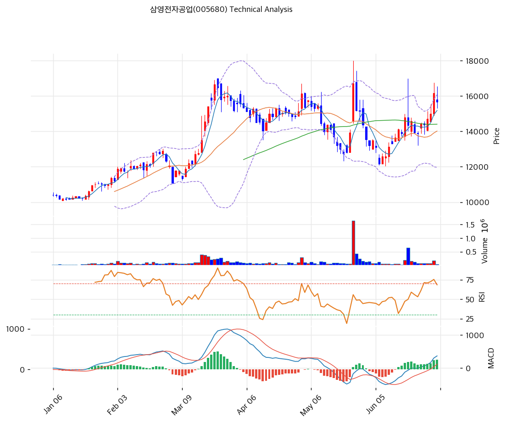

# 삼영전자공업(005680) 기술적 분석

2026-07-02 | T2 Technical Analysis

---

## 차트

---

## 1. 가격 현황

| 항목 | 값 |
|------|-----|
| 현재가 | 15,660원 (-3.15%) |
| 52주 고가 | 16,700원 |
| 52주 저가 | 10,110원 |
| 52주 범위 위치 | 84.2% |
| 거래량 | 20일 평균 대비 0.29x |

---

## 2. 차트 패턴 분석

### 2.1 캔들스틱 패턴

| 패턴 | 위치 | 신뢰도 | 해석 |
|------|------|--------|------|
| 장대양봉 + 긴 위꼬리(급등 스파이크) | 5월 하순, 스윙로우(12,160원) 직후 단 하루 | 강 | 20일 평균 대비 5배 이상 거래량이 폭증하며 하루 만에 상단 볼린저밴드 위까지 급등했으나 종가는 고점 대비 크게 낮게 마감, 위꼬리 구간에서 강한 매물 출회 시사 |
| 장대음봉(급락 반전) | 위 스파이크 직후 1\~2거래일 | 강 | 전일 상승분 상당폭을 반납하는 대형 음봉이 출현해 스파이크 고점권(16,000\~18,000원대)에서 하락장악형에 준하는 매도 우위 확인 |
| 연속 양봉(적삼병 유사) | 최근 3\~4거래일(6월 하순) | 중 | 박스권 상단(14,000원대)을 연속 양봉으로 돌파하며 단기 상승 탄력을 확인했으나, 금일 첫 음봉(-3.15%)이 출현하며 숨고르기 국면 진입 |

※ 주요 캔들 패턴: 망치형, 역망치형, 장악형(상승/하락), 도지, 샛별/석별, 적삼병/흑삼병, 하라미, 유성형, 교수형 등

### 2.2 가격 구조 패턴

- **이중천정형(더블탑)** (신뢰도: 중~강)
  3월 중순과 6월 하순 두 차례에 걸쳐 16,700원 부근(피보나치 Swing High = 52주 고가와 동일)에서 고점을 형성하고 저항에 막혀 반락했다. 금일 -3.15% 하락은 두 번째 고점 테스트 실패로 해석되며, 16,700원 상단을 거래량 동반으로 돌파하기 전까지는 해당 가격대가 단기 매물대(저항)로 작용할 가능성이 높다.

- **상승채널(라이징 채널)** (신뢰도: 중)
  저점 6개를 연결한 상승 지지선(현재 교차가 13,178원)과 고점 6개를 연결한 상승 저항선(현재 교차가 18,823원)이 모두 우상향하며, 1월 저점 이후 전체 주가 흐름은 이 채널 내 등락으로 요약된다. 현재가(15,660원)는 채널 하단~상단 구간 중 약 44% 지점에 위치해 채널 중단 수준이다.

- **박스권 다지기 후 돌파** (신뢰도: 중)
  4월\~6월 중순 약 13,500\~15,000원 구간에서 약 2개월간 횡보했으며, 박스권 하단은 MA20 및 피보나치 0.382\~0.5 되돌림 구간과 겹친다. 6월 하순 거래량 동반 상단 돌파로 박스권을 마감하고 신고가(16,700원) 근접까지 랠리했다.

※ 주요 구조 패턴: 이중천정/바닥, 헤드앤숄더(정/역), 삼각수렴(대칭/상승/하락), 쐐기형(상승/하락), 깃발형, 페넌트, 컵앤핸들, 박스권 등

### 2.3 다이버전스

- **RSI 하락 다이버전스** (신뢰도: 중)
  3월 중순 고점(RSI 약 80, 과매수 상단)과 6월 하순 고점(RSI 약 68\~70)을 비교하면, 주가는 두 시점 모두 16,700원 안팎으로 비슷한 수준까지 올랐으나 RSI 고점은 뚜렷하게 낮아졌다(80→68 내외). 신고가권 진입에도 상승 모멘텀이 3월 대비 약화되었음을 시사하며, 이중천정 리스크를 뒷받침한다.

- **MACD 상승 다이버전스** (신뢰도: 약~중)
  4월 저점 대비 5월 저점(피보나치 스윙로우 12,160원)에서 주가는 추가로 하락했으나, MACD 히스토그램의 마이너스 폭은 4월 저점보다 오히려 축소되며 매도 압력 둔화를 시사했다. 실제로 이 다이버전스 이후 주가는 반등해 현재의 상승 국면으로 이어졌다.

※ RSI·MACD 기반 | 상승 다이버전스 = 가격↓ 지표↑ (반등 시사), 하락 다이버전스 = 가격↑ 지표↓ (하락 시사), 히든 다이버전스 = 기존 추세 지속 시사

### 2.4 패턴 종합 판단

중기적으로는 1월 저점 이후 상승채널을 유지하며 현재가가 MA5~MA200 전 구간 위에 위치하는 강세 구조다. 다만 단기적으로는 16,700원에서 3월·6월 두 차례 저항에 막힌 이중천정과 RSI 약세 다이버전스가 겹치며 숨고르기 국면에 진입한 모습이다. 반대로 4\~5월 저점권에서 확인된 MACD 상승 다이버전스는 실제 반등으로 검증된 바 있어, 되돌림이 나올 경우 1차 지지(피봇 S1~S2, 15,127\~14,593원)에서의 매수 대응 여지는 열려 있다.

---

## 3. 이동평균선 — 비정배열 (강세)

| MA | 값 | 현재가 괴리율 | 위치 |
|----|-----|--------------|------|
| MA5 | 15,180원 | +3.2% | 위 |
| MA20 | 14,017원 | +11.7% | 위 |
| MA60 | 14,406원 | +8.7% | 위 |
| MA120 | 13,405원 | +16.8% | 위 |
| MA200 | 12,278원 | +27.5% | 위 |

**해석**: 현재가는 MA5~MA200 5개 이동평균선 전부 위에 위치해 큰 틀의 상승추세는 유효하다. 다만 MA20(14,017원)이 MA60(14,406원)보다 낮아 완전한 정배열(MA5>MA20>MA60>MA120>MA200)은 아니며, 이는 4\~5월의 급락·급등 변동성이 중기 이평선 배열을 흐트러뜨린 결과다. 장기 이평선(MA120·MA200)과의 괴리율이 각각 +16.8%, +27.5%로 크게 벌어져 있어 단기 과열 시 되돌림 시 이들 라인보다는 MA20(14,017원)·MA60(14,406원)이 1차 지지선 역할을 할 가능성이 높다.

---

## 4. 보조 지표

### RSI(14) — 60.2 (중립)

RSI는 과매수(70) 문턱 아래 중립 구간에서 상단을 향해 완만히 상승 중이나, 6월 하순 고점 대비 소폭 밀린 수준이다. 다이버전스 해석은 2.3 참조.

### MACD(12,26,9)

| 항목 | 값 |
|------|-----|
| MACD | 369.0 |
| Signal | 130.0 |
| Histogram | +239.0 |
| 크로스 상태 | 매수 구간 (확대 중) |

**해석**: MACD가 Signal선 위 매수 구간에서 히스토그램이 확대되고 있어 단기 상승 모멘텀은 아직 살아있으나, 3월 랠리 당시의 히스토그램 최대치 대비 진폭은 뚜렷이 작아 모멘텀 강도 자체는 약화된 상태다. 다이버전스 해석은 2.3 참조.

### 볼린저밴드(20, 2σ)

| 항목 | 값 |
|------|-----|
| 상단 | 16,071원 |
| 중단 (MA20) | 14,017원 |
| 하단 | 11,963원 |
| 밴드 폭 | 29.3% |
| 현재 위치 | 중간 |

**해석**: 밴드 폭이 29.3%로 5월 급등·급락 국면(밴드 급확장) 이후 다시 수축하는 과정에 있으며, 현재가(15,660원)는 상단(16,071원)에 근접했다가 소폭 밀려 밴드 중간 부근에서 등락 중이다. 상단 재접근 시 돌파 여부가 이중천정 해소의 관건이다.

### 스토캐스틱(14, 3, 3)

| 항목 | 값 |
|------|-----|
| Slow %K | 66.9 |
| Slow %D | 61.0 |
| 크로스 상태 | 골든크로스 |
| 판단 | 중립 |

---

## 5. 지지/저항 — 추세선 · 피보나치 · PRZ 통합

### 5.1 피보나치 되돌림/확장

| 구분 | 비율 | 가격 | 현재가 대비 |
|------|------|------|-----------|
| Swing High | — | 16,700원 | +6.6% |
| 되돌림 | 0.236 | 13,231원 | -15.5% |
| 되돌림 | 0.382 | 13,894원 | -11.3% |
| 되돌림 | 0.5 | 14,430원 | -7.9% |
| 되돌림 | 0.618 | 14,966원 | -4.4% |
| 되돌림 | 0.786 | 15,728원 | +0.4% |
| Swing Low | — | 12,160원 | -22.3% |
| 확장 | 1.272 | 10,925원 | -30.2% |
| 확장 | 1.382 | 10,426원 | -33.4% |
| 확장 | 1.618 | 9,354원 | -40.3% |
| 확장 | 2.0 | 7,620원 | -51.3% |

※ 피보나치 기준: 하락 추세 (Swing Low 12,160원 ← Swing High 16,700원 하락폭 기준)
※ 되돌림 = 직전 추세에서 되돌아온 비율, 확장 = 추세 방향 목표가 (본 종목은 하락 추세 기준이므로 확장 레벨은 추가 하락 시 참고선)

### 5.2 추세선

| 추세선 | 방향 | 현재 교차가 | 포인트 수 | 해석 |
|--------|------|-----------|---------|------|
| 지지선 | 상승 | 13,178원 | 6개 | 1월 이후 저점들을 연결한 상승 지지선. 현재가 대비 -15.9% 하단에 위치해 상승채널의 마지노선 역할 |
| 저항선 | 상승 | 18,823원 | 6개 | 1월 이후 고점들을 연결한 상승 저항선(고점 기준선은 더 가파른 기울기). 현재가 대비 +20.2% 위로, 아직 미접촉 구간 |

### 5.3 PRZ (Potential Reversal Zone)

| 방향 | 가격 범위 | 신뢰도 | 근거 |
|------|---------|--------|------|
| 지지 | 14,966\~15,180원 | 중 | 피보나치 0.618 되돌림 + 피봇 S1 + MA5 |
| 지지 | 14,406\~14,593원 | 중 | MA60 + 피보나치 0.5 되돌림 + 피봇 S2 |
| 지지 | 13,894\~14,017원 | 약 | 피보나치 0.382 되돌림 + MA20 |
| 지지 | 13,178\~13,405원 | 중 | 추세선 지지 + 피보나치 0.236 되돌림 + MA120 |

※ PRZ = 추세선 · 피보나치 · 피봇 · MA 등 복수 지표가 겹치는 가격 구간. 겹치는 소스가 많을수록 반전 확률 상승.

### 5.4 종합 지지/저항 테이블

| 구분 | 가격 | 근거 |
|------|------|------|
| 저항 | 16,700원 | 52주 고가 = 피보나치 Swing High (3월·6월 이중천정) |
| 저항 | 15,728원 | 피보나치 0.786 되돌림 |
| **현재가** | **15,660원** | — |
| 지지 | 15,127원 | 피봇 S1 (PRZ 중, MA5 부근) |
| 지지 | 14,593원 | 피봇 S2 (PRZ 중, MA60 부근) |
| 지지 | 14,017원 | MA20 (PRZ 약) |

---

## 6. 시그널 종합

| 지표 | 내용 | 시그널 |
|------|------|--------|
| **차트 패턴** | 이중천정(16,700원) 테스트 실패 + RSI 약세 다이버전스, 다만 상승채널·MACD 상승 다이버전스는 유효 (혼조) | ⚪ |
| 이동평균선 | 비정배열, MA20 +11.7% | ⚪ |
| RSI | 60.2 — 중립 | ⚪ |
| MACD | 매수구간, 히스토그램 확대 | 🟢 |
| 볼린저밴드 | 중간, 밴드 폭 29.3% | ⚪ |
| 스토캐스틱 | 골든크로스, K=66.9 | ⚪ |
| 거래량 | 0.29x — 약함 | ⚪ |

**종합 판단**: 🟢 매수 1개 / 🔴 매도 0개 / ⚪ 중립 6개 → **매수우위**

MACD 골든크로스·확대와 전 이평선 상회로 중기 상승추세 자체는 유효하나, 거래량이 20일 평균의 0.29배에 불과해 최근 반등의 힘이 강하지 않고 이중천정 부근에서의 첫 조정이라는 점은 주의할 부분이다. 단기적으로는 16,700원 돌파 여부와 15,127\~14,593원 지지 방어 여부가 다음 방향성을 가를 변곡점이다.

---

## 7. 전략 제안

### 보유 중인 경우
- **홀드**
- 익절 라인: 17,034원 (피봇 R1~R2 구간(16,367\~17,073원) 상단, 이중천정 16,700원 돌파 시 목표가)
- 손절 라인: 14,593원 (피봇 S2 겸 PRZ(중) 하단 이탈 시)
- 리스크/리워드: 약 1.29 : 1 (기대이익 1,374원 / 손실위험 1,067원, 현재가 15,660원 기준)

### 진입 대기인 경우
- **진입가능**
- 1차 진입가: 15,127원 (피봇 S1 & PRZ(중) 상단 지지)
- 2차 진입가: 14,017원 (MA20 & PRZ(약) 지지)
- 진입 조건: 각 지지선 부근에서 거래량 동반 반등 캔들 확인 후 분할 진입 권장. 16,700원 이중천정 돌파 전까지는 추격 매수보다 눌림목 재진입 전략이 유효하며, 돌파 시에는 거래량 확대를 동반한 종가 기준 돌파 확인 후 대응.
