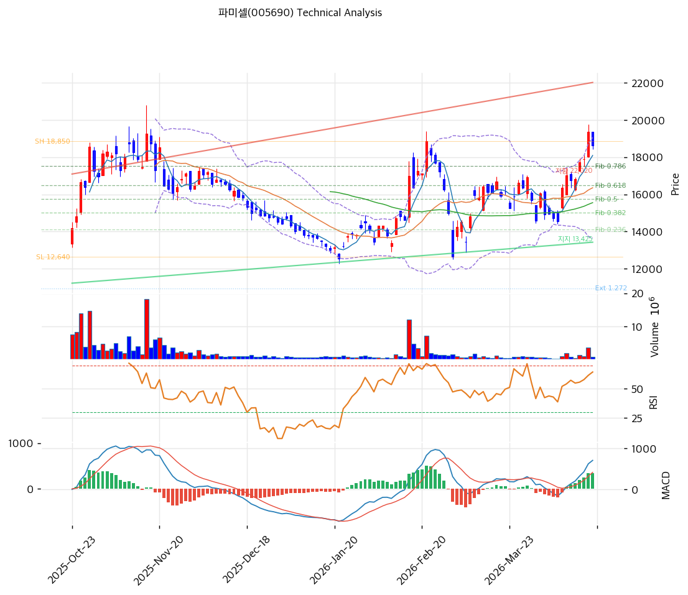

# 파미셀(005690) 기술적 분석

2026-04-17 | T2 Technical Analysis

---

## 차트

---

## 1. 가격 현황

| 항목 | 값 |
|------|-----|
| 현재가 | 18,620원 (-3.92%) |
| 52주 고가 | 19,380원 |
| 52주 저가 | 8,440원 |
| 52주 범위 위치 | 93.1% |
| 거래량 | 20일 평균 대비 0.89x |

---

## 2. 차트 패턴 분석

### 2.1 캔들스틱 패턴

| 패턴 | 위치 | 신뢰도 | 해석 |
|------|------|--------|------|
| 음봉 (-3.92%) | 최근 1일 | 중 | 52주 고가 근처에서 매도 압력 출현, 단기 조정 시그널 |
| 상승 추세 내 고점권 도달 | 최근 5일 | 중 | 연속 신고가 시도 후 되돌림, 차익 실현 국면 진입 가능성 |

※ 주요 캔들 패턴: 52주 고가 19,380원에서 불과 -4% 이내에 위치한 상태에서 음봉 발생

### 2.2 가격 구조 패턴

- **상승 추세 지속** (신뢰도: 강)
  2025년 하반기 이후 8,440원 저점에서 19,380원 고가까지 +129.6% 상승한 강력한 중기 상승 추세가 형성되어 있다. 현재가 18,620원은 52주 범위의 93.1%에 위치하여 고점권이며, 추세선 지지(현재 교차가 13,425원)와 비교하면 현재가까지 여전히 충분한 상승 여력이 시사된다.

- **박스권 진입 가능성** (신뢰도: 중)
  52주 고가 19,380원이 1차 저항으로 작용하고 있으며, PRZ(강) 구간인 17,521~18,250원이 단기 지지대다. 이 범위 내에서의 횡보 박스 형성 가능성이 있다.

### 2.3 다이버전스

- **RSI 중립 유지** (신뢰도: 중)
  RSI(14) 61.5로 중립 구간에 위치. 주가가 52주 고가 근접 수준임에도 RSI가 과매수(70이상)에 도달하지 않았다는 점은 추세 건전성을 나타내나, 스토캐스틱 과매수에서의 데드크로스와 상충하는 시그널이다.

- **MACD 매수 구간** (신뢰도: 중)
  MACD 709 > Signal 362, 히스토그램 +348로 매수 구간이지만 히스토그램이 수축 중이어서 추세 모멘텀이 둔화되고 있다.

### 2.4 패턴 종합 판단

현재 파미셀 차트는 중기 상승 추세 내 고점권 도달 후 단기 숨 고르기 국면이다. RSI·MACD는 매수 우위를 지지하나, 스토캐스틱 과매수·데드크로스와 거래량 0.89x(평균 이하)의 조합은 단기 상승 모멘텀 둔화를 시사한다. 52주 고가 19,380원 돌파 여부가 추세 지속의 핵심 분기점이다.

---

## 3. 이동평균선 — 비정배열 (강세)

| MA | 값 | 현재가 괴리율 | 위치 |
|----|-----|--------------|------|
| MA5 | 18,094원 | +2.9% | 위 |
| MA20 | 16,356원 | +13.8% | 위 |
| MA60 | 15,554원 | +19.7% | 위 |
| MA120 | 15,850원 | +17.5% | 위 |
| MA200 | 14,409원 | +29.2% | 위 |

**해석**: 현재가가 MA5~MA200 전 이동평균 위에 위치하여 강세 구조다. 그러나 단기(MA5)→중기(MA20)→장기(MA200) 순서로 정배열이 아닌 점이 확인된다(MA20 < MA120 역전). 현재가는 MA200 대비 +29.2%로 상당히 과열된 상태이며, MA20(16,356원)이 핵심 중기 지지선이다.

---

## 4. 보조 지표

### RSI(14) — 61.5 (중립)

RSI 61.5로 과매수(70) 아래 중립 구간에 위치. 주가 상승 강도 대비 RSI가 낮게 유지되고 있어 추가 상승 여지가 남아 있으나, 과매수 진입 시 조정 주의가 필요하다.

### MACD(12,26,9)

| 항목 | 값 |
|------|-----|
| MACD | 709 |
| Signal | 362 |
| Histogram | +348 |
| 크로스 상태 | 매수 구간 (수축 중) |

**해석**: MACD가 Signal을 상회하는 매수 구간이나 히스토그램이 수축 중으로 단기 모멘텀이 약화되는 조짐이다.

### 볼린저밴드(20, 2σ)

| 항목 | 값 |
|------|-----|
| 상단 | 19,067원 |
| 중단 (MA20) | 16,356원 |
| 하단 | 13,644원 |
| 밴드 폭 | 33.2% |
| 현재 위치 | 중간 |

**해석**: 밴드 폭 33.2%로 상당히 확장된 상태다. 현재가가 상단(19,067원)에 근접하고 있으며, 상단 돌파 시 추가 상승, 중단(16,356원) 이탈 시 조정 신호다.

### 스토캐스틱(14, 3, 3)

| 항목 | 값 |
|------|-----|
| Slow %K | 88.4 |
| Slow %D | 90.4 |
| 크로스 상태 | 데드크로스 |
| 판단 | 과매수 |

---

## 5. 지지/저항 — 추세선 · 피보나치 · PRZ 통합

### 5.1 피보나치 되돌림/확장

| 구분 | 비율 | 가격 | 현재가 대비 |
|------|------|------|-----------|
| Swing High | — | 18,850원 | — |
| 되돌림 | 0.236 | 14,106원 | -24.2% |
| 되돌림 | 0.382 | 15,012원 | -19.4% |
| 되돌림 | 0.5 | 15,745원 | -15.4% |
| 되돌림 | 0.618 | 16,478원 | -11.5% |
| 되돌림 | 0.786 | 17,521원 | -5.9% |
| Swing Low | — | 12,640원 | — |
| 확장 | 1.272 | 10,951원 | -41.2% |
| 확장 | 1.382 | 10,268원 | -44.8% |
| 확장 | 1.618 | 8,802원 | -52.7% |
| 확장 | 2.0 | 6,430원 | -65.5% |

※ 피보나치 기준: 하락 추세 (Swing High 18,850원 → Swing Low 12,640원)
※ 현재가 18,620원은 Swing High에 근접한 수준으로, 되돌림 레벨들이 하방 지지선 역할

### 5.2 추세선

| 추세선 | 방향 | 현재 교차가 | 포인트 수 | 해석 |
|--------|------|-----------|---------|------|
| 지지선 | 상승 | 13,425원 | 6개 | 장기 상승 채널 하단, 현재 가격 -27.9% |
| 저항선 | 상승 | 22,020원 | 6개 | 장기 상승 채널 상단, 현재 가격 +18.3% |

### 5.3 PRZ (Potential Reversal Zone)

| 방향 | 가격 범위 | 신뢰도 | 근거 |
|------|---------|--------|------|
| 지지 | 17,521~18,250원 | 강 | 피보나치 0.786 되돌림, 피봇 S1, 피봇 S2, MA5 |
| 지지 | 16,356~16,478원 | 약 | MA20, 피보나치 0.618 되돌림 |
| 지지 | 15,554~15,850원 | 중 | MA60, 피보나치 0.5 되돌림, MA120 |
| 지지 | 14,106~14,409원 | 약 | 피보나치 0.236 되돌림, MA200 |

※ PRZ = 추세선·피보나치·피봇·MA 등 복수 지표가 겹치는 가격 구간. 겹치는 소스가 많을수록 반전 확률 상승.

### 5.4 종합 지지/저항 테이블

| 구분 | 가격 | 근거 |
|------|------|------|
| 저항 | 22,020원 | 추세선 저항 (상승 채널 상단, 6포인트) |
| 저항 | 19,380원 | 52주 고가 |
| 저항 | 19,180원 | 피봇 R1 |
| **현재가** | **18,620원** | — |
| 지지 | 17,936원 | PRZ (강) — 피보나치 0.786, 피봇 S1·S2, MA5 |
| 지지 | 16,417원 | PRZ (약) — MA20, 피보나치 0.618 |
| 지지 | 15,716원 | PRZ (중) — MA60, 피보나치 0.5, MA120 |
| 지지 | 13,425원 | 추세선 지지 (상승 채널 하단) |

---

## 6. 시그널 종합

| 지표 | 내용 | 시그널 |
|------|------|--------|
| **차트 패턴** | 고점권 음봉, 상승 추세 유지 | ⚪ |
| 이동평균선 | 비정배열, MA20 +13.8% 강세 구조 | ⚪ |
| RSI | 61.5 — 중립 | ⚪ |
| MACD | 매수구간, 히스토그램 수축 | ⚪ |
| 볼린저밴드 | 중간, 밴드 폭 33.2% 확장 | ⚪ |
| 스토캐스틱 | 데드크로스, K=88.4 (과매수) | 🔴 |
| 거래량 | 0.89x — 약함 | ⚪ |

**종합 판단**: 🟢 매수 0개 / 🔴 매도 1개 / ⚪ 중립 6개 → **중립 (단기 조정 경계)**

현재 파미셀은 중기 상승 추세는 온전하나 단기적으로 고점권 과매수(스토캐스틱) 신호와 거래량 부진이 겹치며 숨 고르기 국면이다. 52주 고가(19,380원) 돌파와 거래량 급증이 수반될 경우 추세선 저항(22,020원)이 중기 목표가로 부상한다. 반대로 PRZ(강) 구간 17,521~18,250원 이탈 시 MA20(16,356원)까지 단기 조정 가능성을 열어두어야 한다.

---

## 7. 전략 제안

### 보유 중인 경우
- **비중축소**
- 익절 라인: 19,768원 (추세선 저항 목표가 기준)
- 손절 라인: 17,880원 (피봇 S2 이탈 기준)
- 리스크/리워드: 1:0.6

### 진입 대기인 경우
- **진입가능**
- 1차 진입가: 18,250원 (PRZ 강 하단, 피봇 S1)
- 2차 진입가: 16,356원 (MA20, PRZ 약 구간)
- 진입 조건: PRZ(강) 지지 확인 + 거래량 평균 이상 회복 동반 시
