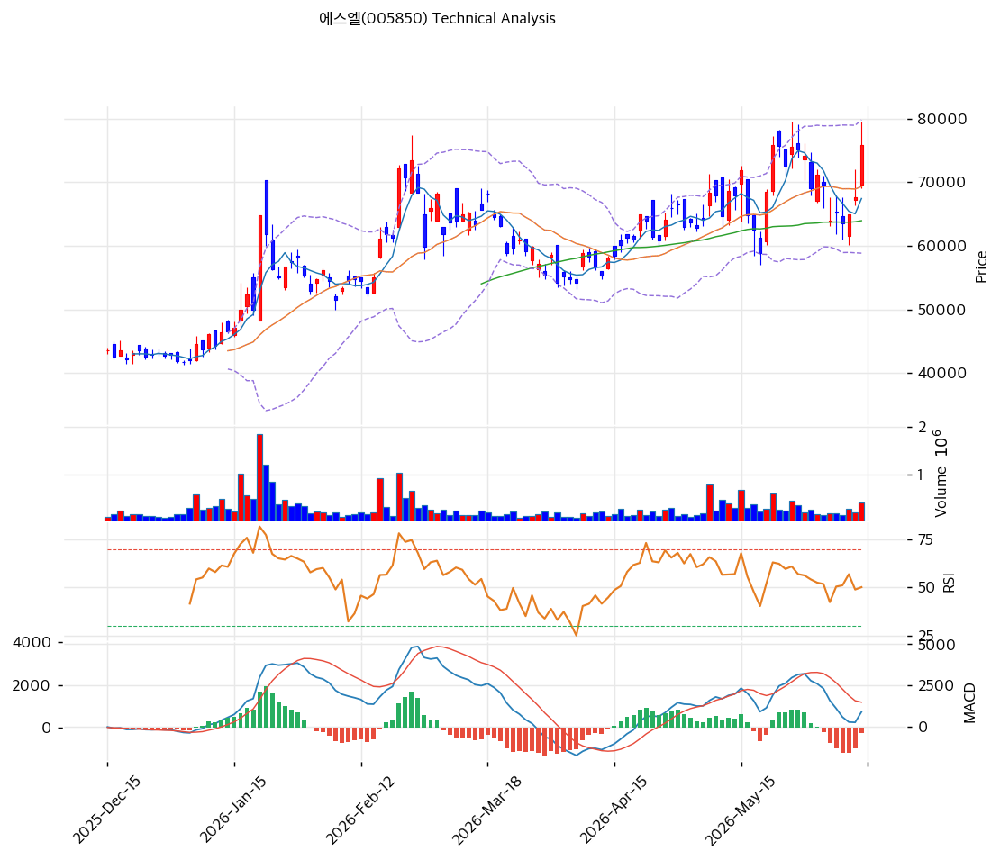

# 에스엘(005850) 기술적 분석

2026-06-15 | T2 Technical Analysis

---

## 차트

---

## 1. 가격 현황

| 항목 | 값 |
|------|-----|
| 현재가 | 75,900원 (+12.11%) |
| 52주 고가 | 79,500원 |
| 52주 저가 | 31,050원 |
| 52주 범위 위치 | \~93% (신고가권) |
| 거래량 | 20일 평균 대비 1.43x (동반) |

> 52주 저점(31,050원) 대비 약 2.4배 상승. 당일 +12.11%로 신고가권 재진입. MA200 대비 +52%로 다른 배치 종목(+89\~158%)보다 과열은 덜한 편이나 단기 급등.

---

## 2. 차트 패턴 분석

### 2.1 캔들스틱 패턴

| 패턴 | 위치 | 신뢰도 | 해석 |
|------|------|--------|------|
| 장대양봉 + 거래량 동반 | 당일 (+12.11%, 1.43x) | 강 | 매수 — 신고가권 재돌파 |
| MA20 상회 재돌파 | 75,900 > MA20 69,330 | 중 | 매수 — 단기 회복 |
| 신고가 근접 | 52주 79,500 부근 | 중 | 단기 과열 경계 |

※ 주요 캔들 패턴: 망치형, 역망치형, 장악형, 도지, 샛별/석별, 적삼병/흑삼병, 하라미, 유성형, 교수형 등

### 2.2 가격 구조 패턴

- **신고가권 재돌파 + 로봇 모멘텀** (신뢰도: 강)
  로봇 신사업·실적 호조로 +12% 장대양봉, 전고(79,500원) 재도전. 피보 1.272 확장(80,397원)·신고가 돌파 시 추세 가속.

- **장기 상승 추세** (신뢰도: 강)
  MA200(49,863원) 대비 +52%로 1년 2.4배 강세. 다른 종목 대비 과열 덜해 추세 여력 상대적 양호.

※ 주요 구조 패턴: 이중천정/바닥, 헤드앤숄더, 삼각수렴, 쐐기형, 깃발형, 페넌트, 컵앤핸들, 박스권 등

### 2.3 다이버전스

- **단기 회복 — MACD 매도 잔존** (신뢰도: 중)
  당일 +12% 급등으로 MA20 재돌파했으나 직전 조정으로 MACD는 아직 매도(데드크로스). RSI 59.9 중립. 급등으로 단기 모멘텀 회복 중이나 지표 전환 확인 필요.

※ RSI·MACD 기반 | 상승 다이버전스 = 가격↓ 지표↑, 하락 다이버전스 = 가격↑ 지표↓

### 2.4 패턴 종합 판단

신고가권에 거래량을 동반해 +12% 재돌파한 강세 국면이나, 직전 조정으로 **MACD 매도(데드크로스)가 잔존**해 지표 전환 확인이 필요하다. MA200 +52%로 과열은 다른 배치 종목 대비 덜하다. 로봇 신사업·실적 호조가 펀더멘털을 받친다. 전고(79,500원) 돌파 여부가 분기점이며, 눌림목(MA20 69,330원·피보 0.382 69,344원 PRZ)이 지지.

---

## 3. 이동평균선 — 단기 회복(비정배열)

| MA | 값 | 현재가 괴리율 | 위치 |
|----|-----|--------------|------|
| MA5 | 67,440원 | +12.5% | 위 |
| MA20 | 69,330원 | +9.5% | 위 |
| MA60 | 63,957원 | +18.7% | 위 |
| MA120 | 58,987원 | +28.7% | 위 |
| MA200 | 49,863원 | +52.2% | 위 |

**해석**: 현재가가 모든 MA 위이나 직전 조정으로 MA5(67,440원)<MA20(69,330원)의 단기 데드크로스 흔적(aligned False). 당일 +12% 급등으로 모든 MA를 +9\~52% 상회하며 단기 회복. MA200 +52%로 장기 추세 견조하되 과열은 제한적. 조정 시 MA20(69,330원)·MA60(63,957원)이 지지대.

---

## 4. 보조 지표

### RSI(14) — 59.9 (중립)

급등에도 과매수(70) 미도달 — 추가 상승 여지. 다른 배치 종목(RSI 67\~80) 대비 여유.

### MACD(12,26,9)

| 항목 | 값 |
|------|-----|
| MACD | 913 |
| Signal | 1,188 |
| Histogram | -275 |
| 크로스 상태 | 매도 (데드크로스, 전환 시도) |

**해석**: 직전 조정으로 MACD가 Signal 아래의 매도 구간이나, 당일 급등으로 히스토그램 축소·전환 시도 중. 0선 위 강세는 유지.

### 볼린저밴드(20, 2σ)

| 항목 | 값 |
|------|-----|
| 상단 | 79,817원 |
| 중단 (MA20) | 69,330원 |
| 하단 | 58,843원 |
| 밴드 폭 | 30.3% |
| 현재 위치 | 상단 근접 |

**해석**: 현재가 75,900원이 상단(79,817원) 근접. 급등으로 상단 도전. 되돌림 시 중단(MA20 69,330원) 여지.

### 스토캐스틱(14, 3, 3)

| 항목 | 값 |
|------|-----|
| Slow %K | 48.5 |
| Slow %D | 36.5 |
| 크로스 상태 | 골든크로스 |
| 판단 | 중립(상승 전환) |

---

## 5. 지지/저항 — 추세선 · 피보나치 · PRZ 통합

### 5.1 피보나치 되돌림/확장

| 구분 | 비율 | 가격 | 현재가 대비 |
|------|------|------|-----------|
| 확장 | 1.382 | 82,256원 | +8.4% |
| 확장 | 1.272 | 80,397원 | +5.9% |
| **현재가** | — | 75,900원 | — |
| 되돌림 | 0.236 | 71,812원 | -5.4% |
| 되돌림 | 0.382 | 69,344원 | -8.6% |
| 되돌림 | 0.5 | 67,350원 | -11.3% |
| 되돌림 | 0.618 | 65,356원 | -13.9% |

### 5.2 종합 지지/저항 테이블

| 구분 | 가격 | 근거 |
|------|------|------|
| 저항 | 82,256원 | 피보 1.382 확장 |
| 저항 | 80,498원 | 피봇 R1·피보 1.272 (PRZ) |
| 저항 | 79,500원 | 52주 고가 |
| **현재가** | **75,900원** | 신고가권·볼린저 상단 |
| 지지 | 71,812원 | 피보 0.236 |
| 지지 | 70,100원 | 피봇 S1 |
| 지지 | 69,591원 | MA20·피보 0.382·피봇 S1 (PRZ 중) |
| 지지 | 64,032원 | MA60·피보 0.786·피봇 S2 (PRZ 강) |

---

## 6. 시그널 종합

| 지표 | 내용 | 시그널 |
|------|------|--------|
| 차트 패턴 | 신고가권 재돌파, 거래량 동반 | 🟢 |
| 이동평균선 | 비정배열(단기 데드크로스 흔적) | ⚪ |
| RSI | 59.9 — 중립(여유) | ⚪ |
| MACD | 매도(데드크로스, 전환 시도) | 🔴 |
| 볼린저밴드 | 상단 근접 | ⚪ |
| 스토캐스틱 | 골든크로스, K=48.5 | ⚪ |
| 거래량 | 1.43x — 동반 | ⚪ |

**종합 판단**: 🟢 매수 0개(요약) / 🔴 매도 1개 / ⚪ 중립 5개 → **매도우위(직전 조정 잔존) → 당일 급등으로 회복 전환 시도**

요약 시그널은 직전 조정의 MACD 매도를 반영해 매도우위이나, 당일 +12% 급등·거래량 동반으로 신고가권 재돌파하며 회복 전환 중이다. RSI 59.9로 과열 여유, MA200 +52%로 다른 종목 대비 과열 덜함. 로봇·실적이 펀더멘털을 받친다. 전고(79,500원) 돌파 확인이 분기점, 눌림목(MA20 69,330원·PRZ 69,591원)이 지지.

---

## 7. 전략 제안

### 보유 중인 경우
- **홀드 (전고 돌파 주시)**
- 익절 라인: 80,498원(피봇 R1·피보 1.272 PRZ) / 82,256원(피보 1.382)
- 손절 라인: 69,330원 (MA20·PRZ 이탈)
- 리스크/리워드: +12% 급등 직후 단기 손익비 다소 불리하나 밸류 합리적

### 진입 대기인 경우
- **눌림목 분할 (밸류 합리적)**
- 1차 진입가: 69,591원 (MA20·피보 0.382 PRZ 중)
- 2차 진입가: 64,032원 (MA60·피보 0.786 PRZ 강)
- 진입 조건: 신고가권 급등 추격보다 눌림목 대기. 단 PER 11x·배당 5.1%의 합리적 밸류로 다른 배치 종목 대비 하방 안정. 로봇 신사업·북미 램프·분기 OPM 10%대 확인 시 분할. MA20(69,330원) 지지가 핵심.
