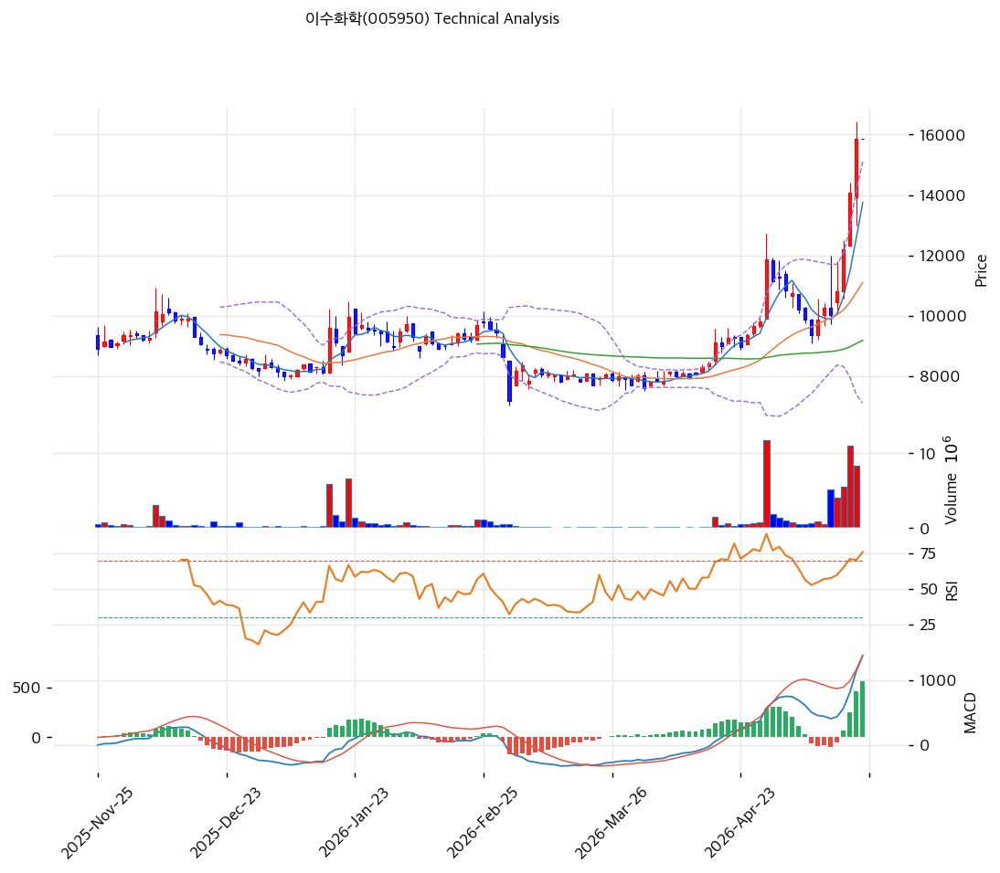

# 기술적분석

## 차트

## 가격 현황

| 항목      | 값                               |
| ------- | ------------------------------- |
| 현재가     | **15,850원** (0.00%, 52주 신고가)    |
| 52주 고/저 | 15,850원 / 5,200원 (**3.05배** 폭등) |
| 52주 위치  | **100% 상단** 🔴                  |
| RSI     | **80.6 🔴 과매수**                 |
| MACD    | 1,378/819/560 매수 (확장 강함)        |
| Stoch   | K=92.6, D=86.4 골든크로스 (과매수 영역)   |
| 볼린저     | 폭 72.2%, 상단 근접(15,104원)         |
| 거래량     | 평균 0.0배                         |

## 이동평균선

| MA    |  가격(원) |      갭(%) | 위치        |
| ----- | -----: | --------: | --------- |
| MA5   | 13,754 |     +15.2 | 위         |
| MA20  | 11,099 |     +42.8 | 위 (과열)    |
| MA60  |  9,178 |     +72.7 | 위 (강한 과열) |
| MA120 |  9,116 |     +73.9 | 위 (극단)    |
| MA200 |  8,307 | **+90.8** | 위 (극단 과열) |

→ **정배열 완성** (MA5>MA20>MA60>MA120>MA200). MA200 +90.8% = 6\~12개월 평균의 1.91배 이격 = **평균회귀 압력 매우 큼**.

## 시그널 종합

| 구분     |                                카운트 |
| ------ | ---------------------------------: |
| 매수     |           2 (MACD 확장, Stoch 골든크로스) |
| 매도     | 3 (RSI 과매수, MA200 극단 이격, BB 상단 근접) |
| 중립     |                                  2 |
| **결론** |                    **매도우위 → 비중축소** |

## 지지·저항

| 구분      |     가격대(원) | 근거               |
| ------- | ---------: | ---------------- |
| 강 저항    | **16,167** | 단기 TP (피보 확장 추정) |
| **현재가** | **15,850** | 52주 고가           |
| 지지      |     15,104 | BB 중앙 (상단 부근)    |
| 강 지지    |     13,754 | MA5              |
| 지지      |     13,232 | 추세선 저항(상승)       |
| 강 지지    | **11,099** | MA20 (-30.0%)    |
| 지지      |      9,178 | MA60 (-42.1%)    |
| 지지      |      9,116 | MA120 (-42.5%)   |
| 지지      |      8,494 | 추세선 지지(상승)       |
| 강 지지    |      8,307 | MA200 (-47.6%)   |
| 약 지지    |      7,094 | BB 하단            |
| **BPS** |  **3,655** | 이론 바닥 (-77%)     |

## 전략

| 시나리오     | 액션                                                  |
| -------- | --------------------------------------------------- |
| 보유자      | **30\~50% 익절** + 잔량 홀드 (TP 16,167)                  |
| 신규 진입 1차 | **11,099원** (MA20, -30.0%) 30% 매수                   |
| 신규 진입 2차 | **9,178원** (MA60, -42.1%) 30% 매수                    |
| 신규 진입 3차 | **8,307원** (MA200, -47.6%) 30% 매수                   |
| 매도 트리거   | 26Q2 OPM < 2% 회귀 / 8,307원 이탈 (MA200 하방) / 유증 대규모 발표 |
| 추세 가속    | **16,167원** 돌파 + 거래량 +100% → 20,000원 도전             |

## 수급 분석

| 주체  |         20일 누적 | 해석                     |
| --- | -------------: | ---------------------- |
| 외국인 | **+1,169,415** | 매우 강력한 매집 (시총 대비 4.4%) |
| 기관  | **+1,059,699** | 동방향 강력 매집 (시총 대비 4.0%) |

**외인·기관 동시 매집 +220만주** = 이수 그룹 안정 + LAB 사이클 회복 + 26Q1 V자 폭발 동시 베팅. KOSPI 종합 화학 중 가장 강력한 수급 시그널.

## 핵심 판단

**3.05배 폭등 후 RSI 80.6 + MA200 +90.8% 극단 과열** = 단기 평균회귀 -15\~-25% 압력 매우 큼. 그러나 **26Q1 OP 254억 V자 폭발 + 외인·기관 동시 강력 매집(+220만주)** = 펀더멘털·수급 강력 뒷받침. **20,000원 추가 가속 가능하나 평균회귀 우선 시나리오**. 보유자는 30\~50% 익절, 신규 진입자는 **MA20 11,099원 / MA60 9,178원 영역 분할 매수**가 안전. SL 8,307원 (MA200, BPS 3,655의 +127% 마진).
