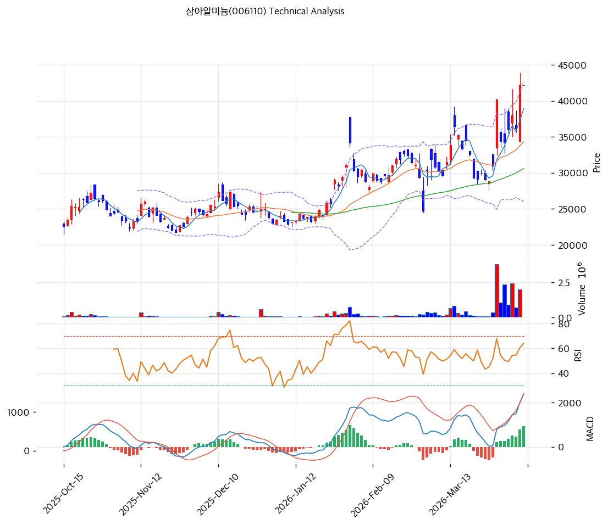

# 삼아알미늄(006110) 기술적 분석

2026-04-09 | T2 Technical Analysis

---

## 차트

---

## 1. 가격 현황

| 항목 | 값 |
|------|-----|
| 현재가 | 42,200원 (0.00%) |
| 52주 고가 | 42,200원 |
| 52주 저가 | 17,610원 |
| 52주 범위 위치 | 100.0% |
| 거래량 | 20일 평균 대비 데이터 미수신 (0.0x) |

---

## 2. 차트 패턴 분석

### 2.1 캔들스틱 패턴

| 패턴 | 위치 | 신뢰도 | 해석 |
|------|------|--------|------|
| 52주 신고가 도달 | 최근 1일 | 강 | 강력한 상승 모멘텀 확인, 단 추가 저항 부재로 고점 경계 필요 |
| 상승 추세 지속 | 최근 4~8주 | 강 | MA5~MA200 전 구간 정배열, 단기·중기·장기 모두 매수 우위 |

※ 주요 캔들 패턴: 52주 신고가 상단 밀착으로 망치형·장악형 등 반전 패턴보다 추세 지속 패턴이 우세

### 2.2 가격 구조 패턴

- **상승 추세 채널** (신뢰도: 강)
  2025년 하반기 저점(17,610원) 이후 가격이 지속적으로 고점·저점을 높이는 상승 추세를 형성하고 있다. 현재가 42,200원은 52주 최고가와 일치하며, 추세 채널 상단부 근처에 위치한다. 채널 하단 지지선은 MA60(30,611원) 부근으로 추정된다.

- **박스권 돌파 후 추세 전환** (신뢰도: 중)
  52주 저가(17,610원)에서 현재가(42,200원)까지 약 +140% 상승한 구조는, 장기 저점에서의 대규모 구조적 바닥 형성 이후 본격 상승 국면 진입으로 해석된다. 다만 현재 고점 부근에서 추가 상승 여력보다 단기 조정 가능성을 점검해야 한다.

### 2.3 다이버전스

- **RSI 중립 구간 유지** (신뢰도: 중)
  RSI(14) = 64.3으로 과매수(70) 직전 중립 구간에 위치한다. 가격이 신고가를 경신했음에도 RSI가 70 미만을 유지하고 있어, 기술적 과열 없이 추세가 이어지고 있음을 시사한다. 명확한 하락 다이버전스는 미형성 상태이나, 가격 추가 상승 시 RSI 70 돌파·다이버전스 형성 여부를 주시해야 한다.

- **MACD 상승 다이버전스 지속** (신뢰도: 강)
  MACD(2,397) > Signal(1,467), 히스토그램 +931로 확대 중이다. 히스토그램이 지속 확대되고 있어 상승 추세의 모멘텀이 아직 살아있음을 나타낸다.

### 2.4 패턴 종합 판단

캔들스틱(52주 신고가 도달·전구간 정배열), 가격구조(상승 추세 채널 상단), MACD 히스토그램 확대 등 세 카테고리 모두 단기 상승 모멘텀을 지지한다. 그러나 **볼린저밴드 상단 밀착(42,634원), 스토캐스틱 과매수(K=80.1), 52주 신고가 = 현재가**라는 세 가지 과열 시그널이 동시에 출현하고 있어 단기 조정 또는 속도 조절 가능성이 상충 신호로 존재한다. 신고가 돌파 지속 시 추가 상승 여지가 있으나, 저항 없는 신고가 구간에서의 상승은 모멘텀 소멸 시 급락으로 전환될 수 있다.

---

## 3. 이동평균선 — 정배열 (강세)

| MA | 값 | 현재가 괴리율 | 위치 |
|----|-----|--------------|------|
| MA5 | 38,910원 | +8.5% | 위 |
| MA20 | 34,328원 | +22.9% | 위 |
| MA60 | 30,611원 | +37.9% | 위 |
| MA120 | 27,542원 | +53.2% | 위 |
| MA200 | 25,263원 | +67.0% | 위 |

**해석**: MA5~MA200 전 구간이 우상향 정배열을 이루고 있으며 현재가가 모든 이동평균선 위에 위치한다. 특히 MA200 대비 +67.0% 괴리는 강력한 중장기 상승 추세를 확인해 주지만, 동시에 단기 평균(MA5) 대비도 +8.5%에 달해 단기 과열 구간임을 시사한다. MA20(34,328원)과 MA60(30,611원)이 1차·2차 핵심 지지선이다.

---

## 4. 보조 지표

### RSI(14) — 64.3 (중립)

RSI 64.3은 과매수 경계선(70) 직전 중립 구간으로, 상승 모멘텀이 살아있으면서도 아직 기술적 과열이 확정되지 않은 상태다. 추가 상승 시 RSI 70 돌파 여부가 다음 관건이며, 70 돌파 후 다이버전스 형성 시 단기 매도 시그널로 해석할 수 있다.

### MACD(12,26,9)

| 항목 | 값 |
|------|-----|
| MACD | 2,397 |
| Signal | 1,467 |
| Histogram | +931 |
| 크로스 상태 | 매수 구간 (확대 중) |

**해석**: MACD가 Signal 위에서 히스토그램이 확대되는 강세 구간이며, 상승 추세의 가속도가 붙어 있다. 히스토그램 축소 전환이 확인될 때 단기 고점 경계 신호로 삼을 수 있다.

### 볼린저밴드(20, 2σ)

| 항목 | 값 |
|------|-----|
| 상단 | 42,634원 |
| 중단 (MA20) | 34,328원 |
| 하단 | 26,021원 |
| 밴드 폭 | 48.4% |
| 현재 위치 | 상단 근접 |

**해석**: 현재가(42,200원)가 볼린저밴드 상단(42,634원)에 근접해 있다. 밴드 폭 48.4%는 확장 국면으로 추세 강도가 강함을 나타내지만, 상단 터치·이탈 구간에서 단기 되돌림이 발생하는 경향이 있다. 상단 돌파 후 안착 시 추가 상승 신호, 상단 이탈 실패 시 중단(34,328원)으로의 되돌림 가능성.

### 스토캐스틱(14, 3, 3)

| 항목 | 값 |
|------|-----|
| Slow %K | 80.1 |
| Slow %D | 74.1 |
| 크로스 상태 | 골든크로스 |
| 판단 | 과매수 |

---

## 5. 지지/저항

| 구분 | 가격 | 근거 |
|------|------|------|
| 저항 | 42,200원 | 52주 신고가 = 현재가 (신고가 구간, 명시적 저항 없음) |
| 저항 | 42,634원 | 볼린저밴드 상단 |
| **현재가** | **42,200원** | — |
| 지지 | 38,910원 | MA5 |
| 지지 | 34,328원 | MA20 / 볼린저밴드 중단 |
| 지지 | 30,611원 | MA60 |

---

## 6. 시그널 종합

| 지표 | 내용 | 시그널 |
|------|------|--------|
| **차트 패턴** | 52주 신고가·상승채널 상단, MACD 히스토그램 확대, 단기 과열 상충 | ⚪ |
| 이동평균선 | 전구간 정배열, MA200 +67.0% (추세 강세 / 단기 과열) | 🟢 |
| RSI | 64.3 — 중립 (과매수 직전) | ⚪ |
| MACD | 매수 구간, 히스토그램 +931 확대 중 | 🟢 |
| 볼린저밴드 | 상단 밀착(42,634원), 밴드폭 48.4% 확장 | ⚪ |
| 스토캐스틱 | 골든크로스, K=80.1 과매수 | 🔴 |
| 거래량 | 데이터 미수신 (0.0x) | ⚪ |

**종합 판단**: 🟢 매수 2개 / 🔴 매도 1개 / ⚪ 중립 4개 → **중립 (단기 과열 경계)**

현재가는 정배열·MACD 확대라는 중장기 강세 구조를 유지하고 있으나, 52주 신고가 = 현재가, 볼린저밴드 상단 밀착, 스토캐스틱 과매수가 동시에 나타나 단기 속도조절 가능성이 높다. 중기 상승 추세 자체는 훼손되지 않았으므로 추세 추종 전략에서는 홀드가 유효하나, 신규 진입은 단기 조정 후 MA20(34,328원) 또는 MA5(38,910원) 되돌림 시점을 기다리는 것이 리스크/리워드 측면에서 유리하다.

---

## 7. 전략 제안

### 보유 중인 경우
- **홀드**
- 익절 라인: 44,000~45,000원 (볼린저밴드 상단 돌파 후 신고가 저항 없는 구간)
- 손절 라인: 38,910원 (MA5 이탈 시, 추세 약화 신호)
- 리스크/리워드: 손절 -7.8% / 익절 +4.7~6.6% → 약 1:0.6~0.8 (단기 비효율, 홀드 유지 전제)

### 진입 대기인 경우
- **관망 후 조정 시 진입**
- 1차 진입가: 38,910원 (MA5 지지 확인 시)
- 2차 진입가: 34,328원 (MA20 / 볼린저밴드 중단 지지 확인 시)
- 진입 조건: 조정 후 MA5 또는 MA20에서 반등 캔들(망치형·장악형) + 거래량 동반 확인. 현재 신고가 구간 무조건 추격 매수는 지양.
