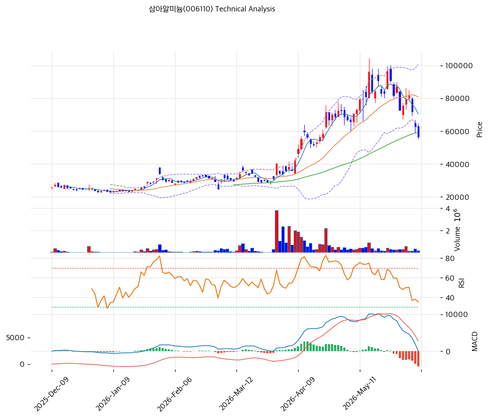

# 기술적분석

***

## 가격 위치

현재가 **56,300원** (**당일 -10.63%**) — 1년 위치 49.2%(고점 96,400원 대비 -42%, 저점 17,610원 대비 +220%). 1년 +447% 폭등 후 급락 국면, 당일 -10.63% 급락. **RSI 38.7·스토캐 8.9 극단 과매도**, BB 하단 이탈. 적자·부채 부담 vs 장기 상승추세(MA120/200 위). 거래량비 0.59x.

## 이동평균선

| 이평선   |       값 |    이격도 |  위치 |
| ----- | ------: | -----: | :-: |
| MA5   | 70,420원 | -19.9% |  아래 |
| MA20  | 80,910원 | -30.3% |  아래 |
| MA60  | 59,222원 |  -4.8% |  아래 |
| MA120 | 43,260원 | +30.4% |  위  |
| MA200 | 35,392원 | +59.4% |  위  |

**혼조(aligned False)** — 최근 급락으로 MA5·MA20·MA60(59,000\~81,000원) 아래이나, **MA120(43,260원)·MA200(35,392원)은 한참 아래**로 장기 상승추세는 유지. 단기 급락 + 장기 추세의 충돌. MA60 59,222원이 1차 저항.

## 모멘텀 지표

* **RSI 38.7 (중립)** — 침체권. 추가 하락 압력 제한적
* **MACD 157 / 시그널 4,321 / 히스토 -4,164** — 매도 + 하락 확장(급락 반영). 하락 모멘텀 강함
* **스토캐스틱 K=8.9 / D=19.5** — 데드크로스 **극단 과매도(8.9)**. 기술적 반등 임박 구간
* **볼린저밴드** — 상단 100,664 / 중심 80,910 / 하단 61,156, 폭 48.8%, **하단 이탈**. 과매도 극단
* **거래량비 0.59x** — 거래 위축

## 피보나치 되돌림 (스윙 17,550 / 104,600)

| 레벨    |      가격 | 성격                 |
| ----- | ------: | ------------------ |
| 0.236 | 38,094원 | 깊은 지지 (MA120 근접)   |
| 0.382 | 50,803원 | 1차 지지              |
| 0.5   | 61,075원 | 현재가 위 저항 (MA60 근접) |
| 0.618 | 71,347원 | 중기 저항              |
| 0.786 | 85,971원 | 깊은 반등              |

## 지지/저항 (S\&R)

* **저항**: 59,222원(MA60) / 61,075원(피보 0.5) / 70,420원(MA5) / 71,347원(피보 0.618)
* **지지**: **50,803원(피보 0.382)** / 43,260원(MA120·피보 0.236 근접) / 38,094원(피보 0.236)

## 종합 시그널 & 전략

**시그널: 매수 2 / 매도 1 / 중립 3 → 매수우위** (극단 과매도 반등 vs 급락 모멘텀)

* **전략**: 관망\~분할. 당일 -10.63% 급락 + 스토캐 8.9 극단 과매도로 **단기 기술적 반등 가능**하나, 적자·부채 207%·하락 모멘텀으로 추세 미반전. 단기 반등은 투기적, 추세 매수는 흑전 확인 후
* **저점 분할(투기적)**: 피보 0.382(50,803원)\~MA120(43,260원) 분할 매수, 손절 MA120 하향 이탈. 장기 추세선(MA120/200)이 하방 지지
* **상방**: 반등 시 MA60 59,222원 → 피보 0.5 61,075원 → MA5 70,420원. 하반기 풀캐파·ESS 회복·흑전이 추세 반전 동력
* **하방**: 피보 0.382 50,803원 이탈 시 MA120 43,260원. 적자·부채로 반등 후 재하락 위험
* **변곡점**: 하반기 풀캐파 가동·ESS 회복·흑자 전환이 추세 핵심. 폭등 후 급락·적자로 변동성 극대, 비중·손절 엄격
