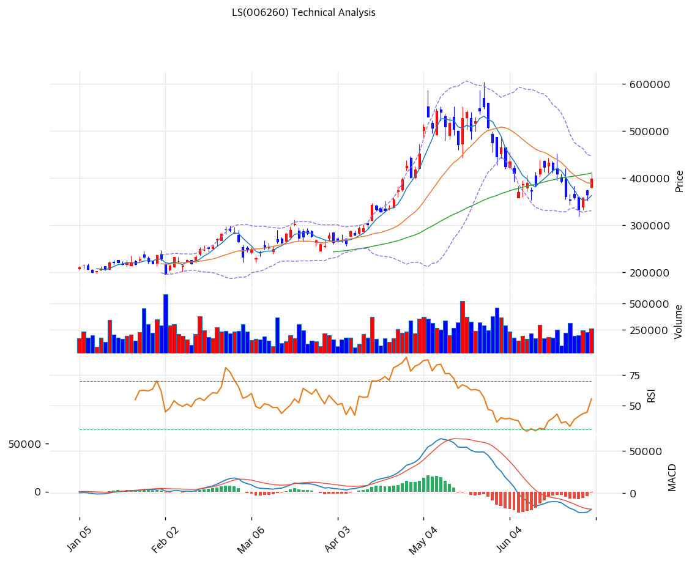

# 기술적분석

2026-07-01 | T2 Technical Analysis

***

## 차트

***

## 1. 가격 현황

| 항목        | 값                 |
| --------- | ----------------- |
| 현재가       | 399,000원 (+9.17%) |
| 52주 고가    | 553,000원          |
| 52주 저가    | 150,800원          |
| 52주 범위 위치 | 61.7%             |
| 거래량       | 20일 평균 대비 1.25x   |

***

## 2. 차트 패턴 분석

### 2.1 캔들스틱 패턴

| 패턴            | 위치                            | 신뢰도 | 해석                                                                            |
| ------------- | ----------------------------- | --- | ----------------------------------------------------------------------------- |
| 장대음봉 (고점권 이탈) | 5월 중순 (52주 고가 553,000원 형성 구간) | 중   | 500,000\~590,000원대 박스권 상단 재시도 후 긴 윗꼬리 동반 음봉 마감 — 매물 소화 실패, 하락 전환 신호           |
| 장대양봉 (저점 반등)  | 최근 1일                         | 약   | 6월 저점(약 335,000원대) 대비 +9.17% 급반등, 다만 거래량은 1.25배에 그쳐 대량거래 동반 없이 진행 — 확인 신뢰도 낮음 |

※ 캔들 자체보다 박스권 이탈·저점 반등의 맥락이 신호의 핵심

### 2.2 가격 구조 패턴

* **고점 박스권 이탈 후 하락 채널** (신뢰도: 중) 4월 말\~5월 중순 500,000\~590,000원대에서 두 차례 고점(553,000원 부근)을 형성하며 박스권을 이루다 이탈, 이후 6월까지 저점을 낮추는 하락 채널이 진행돼 6월 중순 약 335,000\~340,000원까지 조정(고점 대비 -40% 내외 낙폭).
* **저점권 다지기 (잠정 바닥 시도)** (신뢰도: 약) 6월 중순 이후 335,000\~365,000원 구간에서 등락을 반복하다 최근 MA5·MA20을 상향 돌파. 장기 상승채널 하단(추세선 지지 현재 교차가 251,917원)까지는 거리가 있어 채널 하단 지지 재확인은 아직 이르다.

※ 상승 추세선(포인트 6개, 251,917원)과 저항 추세선(포인트 6개, 497,824원)은 1\~5월 급등 구간에서 형성된 장기 채널로, 현재가는 채널 내부 중단에 위치

### 2.3 다이버전스

* **RSI 다이버전스 부재** (신뢰도: 중) 6월 저점(약 335,000원) 형성 시 RSI도 32\~33까지 동반 저점을 낮춰(5월 고점 시 80대 후반 → 6월 저점 30대 초반) 가격·지표가 같은 방향으로 움직임. 다이버전스가 없다는 것은 6월 하락이 실제 매물 압력에 기인했음을 시사, 현재 반등을 다이버전스 기반 반전 신호로 해석하긴 근거가 약함.
* **MACD 히스토그램 수축** (신뢰도: 약) 히스토그램이 -1,235로 여전히 마이너스이나 6월 중순 저점(-2만 선 근접) 대비 큰 폭 축소, 매도 모멘텀 둔화를 시사. 다만 확대 재개 여부는 미확정(hist\_expanding=false)이라 뚜렷한 다이버전스로 단정하기는 이름.

### 2.4 패턴 종합 판단

5월 고점권 박스권 이탈 이후 이어진 하락 채널이 완전히 종료됐다고 보긴 이르다. 최근 저점 대비 반등하며 MA5·MA20을 재돌파했으나 거래량(1.25x)이 뒷받침되지 않고 RSI·MACD 다이버전스도 부재해, 추세 전환의 기술적 근거는 아직 약한 수준이다. MA60(411,408원)과 PRZ 저항(412,370\~413,333원) 회복 여부가 단기 방향성의 분수령이 될 전망이다.

***

## 3. 이동평균선 — 비정배열 (단기 조정 / 중장기 상승추세 유지)

| MA    | 값        | 현재가 괴리율 | 위치 |
| ----- | -------- | ------- | -- |
| MA5   | 363,300원 | +9.8%   | 아래 |
| MA20  | 389,200원 | +2.5%   | 아래 |
| MA60  | 411,408원 | -3.0%   | 위  |
| MA120 | 327,589원 | +21.8%  | 아래 |
| MA200 | 272,486원 | +46.4%  | 아래 |

**해석**: 5개 이동평균 중 MA60만 현재가 위에 위치한 비정배열 구조. 단기(MA5·MA20)는 최근 반등으로 저항에서 지지로 전환됐으나, 중기 저항선인 MA60(411,408원, -3.0%)을 아직 회복하지 못해 완전한 추세 전환은 미확정. 다만 MA120(+21.8%)·MA200(+46.4%) 대비 여전히 큰 폭 우위를 유지하고 있어 중장기 상승 추세 자체는 살아있다.

***

## 4. 보조 지표

### RSI(14) — 49.6 (중립)

5월 과매수권(80선 근접)에서 6월 저점 32\~33까지 급락했던 RSI가 저점 대비 반등하며 중립 구간(49.6)에 진입 — 단기 매도 압력은 완화됐으나 뚜렷한 방향성 신호는 아직 부재.

### MACD(12,26,9)

| 항목        | 값            |
| --------- | ------------ |
| MACD      | -19,550      |
| Signal    | -18,315      |
| Histogram | -1,235       |
| 크로스 상태    | 매도 구간 (수축 중) |

**해석**: MACD가 시그널선을 하회하는 매도 구간을 유지 중이나, 히스토그램이 -1,235로 6월 중순 저점(-2만 선 근접) 대비 크게 축소돼 매도 모멘텀은 둔화. 다만 여전히 마이너스 영역이라 매수 전환 확인까지는 시간이 필요하다.

### 볼린저밴드(20, 2σ)

| 항목        | 값        |
| --------- | -------- |
| 상단        | 447,349원 |
| 중단 (MA20) | 389,200원 |
| 하단        | 331,051원 |
| 밴드 폭      | 29.9%    |
| 현재 위치     | 중간       |

**해석**: 5월 급등기 확대됐던 밴드 폭이 축소되며 안정화 국면 진입. 현재가(399,000원)는 중단(MA20, 389,200원) 바로 위에서 등락 중이며, 상단(447,349원) 돌파 전까지는 박스권 성격의 등락이 예상된다.

### 스토캐스틱(14, 3, 3)

| 항목      | 값     |
| ------- | ----- |
| Slow %K | 41.6  |
| Slow %D | 28.5  |
| 크로스 상태  | 골든크로스 |
| 판단      | 중립    |

***

## 5. 지지/저항 — 추세선 · 피보나치 · PRZ 통합

### 5.1 피보나치 되돌림/확장

| 구분         | 비율    | 가격       | 현재가 대비  |
| ---------- | ----- | -------- | ------- |
| Swing High | —     | 553,000원 | —       |
| 되돌림        | 0.236 | 476,890원 | +19.5%  |
| 되돌림        | 0.382 | 429,805원 | +7.7%   |
| 되돌림        | 0.5   | 391,750원 | -1.8%   |
| 되돌림        | 0.618 | 353,695원 | -11.4%  |
| 되돌림        | 0.786 | 299,515원 | -24.9%  |
| Swing Low  | —     | 230,500원 | —       |
| 확장         | 1.272 | 640,720원 | +60.6%  |
| 확장         | 1.382 | 676,195원 | +69.5%  |
| 확장         | 1.618 | 752,305원 | +88.5%  |
| 확장         | 2.0   | 875,500원 | +119.4% |

※ 피보나치 기준: 상승 추세 (Swing Low 230,500원 → Swing High 553,000원) ※ 되돌림 = 직전 추세에서 되돌아온 비율, 확장 = 추세 방향 목표가

### 5.2 추세선

| 추세선 | 방향 | 현재 교차가   | 포인트 수 | 해석                                                        |
| --- | -- | -------- | ----- | --------------------------------------------------------- |
| 지지선 | 상승 | 251,917원 | 6개    | 1\~5월 급등 구간에서 형성된 장기 상승채널 하단, 현재가와 -36.9% 괴리로 단기 지지력은 제한적 |
| 저항선 | 상승 | 497,824원 | 6개    | 장기 상승채널 상단, 5월 고점권과 유사 수준. 현재가 대비 +24.8%                  |

### 5.3 PRZ (Potential Reversal Zone)

| 방향 | 가격 범위             | 신뢰도 | 근거                          |
| -- | ----------------- | --- | --------------------------- |
| 지지 | 381,833\~391,750원 | 중   | 피봇 S1 + MA20 + 피보나치 0.5 되돌림 |
| 저항 | 411,408\~413,333원 | 약   | MA60 + 피봇 R1                |
| 저항 | 427,667\~429,805원 | 약   | 피봇 R2 + 피보나치 0.382 되돌림      |
| 지지 | 363,300\~364,667원 | 약   | MA5 + 피봇 S2                 |

※ PRZ = 추세선 · 피보나치 · 피봇 · MA 등 복수 지표가 겹치는 가격 구간. 겹치는 소스가 많을수록 반전 확률 상승.

### 5.4 종합 지지/저항 테이블

| 구분      | 가격           | 근거                                   |
| ------- | ------------ | ------------------------------------ |
| 저항      | 553,000원     | 52주 고가                               |
| 저항      | 429,805원     | PRZ(약) — 피봇 R2 + 피보나치 0.382 되돌림      |
| 저항      | 412,370원     | PRZ(약) — MA60 + 피봇 R1                |
| **현재가** | **399,000원** | —                                    |
| 지지      | 387,594원     | PRZ(중) — 피봇 S1 + MA20 + 피보나치 0.5 되돌림 |
| 지지      | 363,984원     | PRZ(약) — MA5 + 피봇 S2                 |
| 지지      | 353,695원     | 피보나치 0.618 되돌림                       |

***

## 6. 시그널 종합

| 지표        | 내용                                        | 시그널 |
| --------- | ----------------------------------------- | --- |
| **차트 패턴** | 5월 고점권 이탈 후 하락채널, 최근 반등이나 다이버전스·거래량 확인 부재 | ⚪   |
| 이동평균선     | 비정배열, MA60만 저항(-3.0%)                     | ⚪   |
| RSI       | 49.6 — 중립                                 | ⚪   |
| MACD      | 매도구간 (수축 중)                               | 🔴  |
| 볼린저밴드     | 중간, 밴드 폭 29.9%                            | ⚪   |
| 스토캐스틱     | 골든크로스, K=41.6                             | ⚪   |
| 거래량       | 1.25x — 약함                                | ⚪   |

**종합 판단**: 🟢 매수 0개 / 🔴 매도 1개 / ⚪ 중립 6개 → **매도우위**

5월 고점(553,000원) 이후 이어진 조정 국면에서 아직 뚜렷한 추세 전환 신호는 나타나지 않았다. MACD가 유일하게 매도 신호를 보내는 가운데 나머지 지표는 대부분 중립에 머물러 있어, 단기적으로는 MA60(411,408원)·PRZ 저항(412,370\~413,333원) 돌파 여부가 방향성을 결정할 분수령이다. 중장기적으로는 MA120·MA200을 크게 상회하고 있어 상승 추세 자체는 유지되고 있다.

***

## 7. 전략 제안

### 보유 중인 경우

* **비중축소**
* 익절 라인: 564,060원 (52주 고가 553,000원 상단 돌파 목표가)
* 손절 라인: 364,667원 (피봇 S2 이탈 시)
* 리스크/리워드: 약 1:4.8

### 진입 대기인 경우

* **진입가능**
* 1차 진입가: 381,833원 (피봇 S1)
* 2차 진입가: 389,200원 (MA20)
* 진입 조건: MA60(411,408원) 회복 확인 또는 381,833\~389,200원 구간 지지 재확인 후 거래량 동반 반등 시 분할 진입
