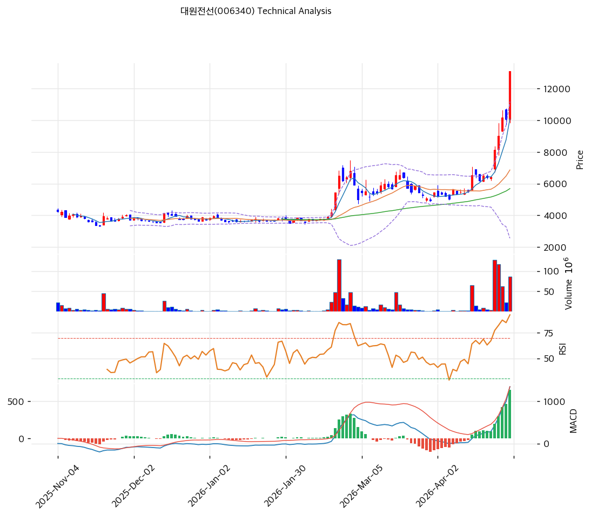

# 대원전선(006340) 기술적 분석

2026-04-29 | T2 Technical Analysis

---

## 차트

---

## 1. 가격 현황

| 항목 | 값 |
|------|-----|
| 현재가 | 13,090원 (+29.99%) |
| 52주 고가 | 13,090원 |
| 52주 저가 | 2,655원 |
| 52주 범위 위치 | 100.0% |
| 거래량 | 20일 평균 대비 3.71x |

---

## 2. 차트 패턴 분석

### 2.1 캔들스틱 패턴

| 패턴 | 위치 | 신뢰도 | 해석 |
|------|------|--------|------|
| 장대양봉/상한가형 추세 캔들 | 최근 거래일 | 강 | 강한 수급 유입이 확인되나 단기 과열도 동시에 확대 |
| 고가권 추격 양봉 | 52주 고가권 | 중 | 돌파 추세는 유효하나 익절 매물 출회 가능성 병존 |

### 2.2 가격 구조 패턴

- **52주 신고가 돌파 구조** (신뢰도: 강)  
  현재가는 52주 범위의 100.0%에 위치한다. 돌파 자체는 추세 추종 신호지만, 직전 지지선과의 괴리가 커져 눌림 확인 전 신규 진입 리스크가 높다.

- **상승 추세선 대비 과격한 이격** (신뢰도: 중)  
  주요 추세선 지지 가격은 4,652원, 저항/상단 기준은 7,273원으로 수집된다. 현재가는 단기 추세선보다 크게 위에 있어 평균회귀 리스크가 있다.

### 2.3 다이버전스

- **RSI 고점권 모멘텀** (신뢰도: 중)  
  가격이 52주 고가를 경신했으나 RSI도 고점권이라 명확한 상승 다이버전스보다는 과매수형 모멘텀 지속 신호가 우세하다.

- **MACD 추세 지속 신호** (신뢰도: 중)  
  MACD는 매수 구간이며 히스토그램은 +652다. 확대 여부는 True로, 단기 추세 판단에 보조적으로 활용한다.

### 2.4 패턴 종합 판단

캔들·가격구조는 강한 돌파를 말하지만 RSI/스토캐스틱은 과매수를 경고한다. 따라서 단기 방향은 추세 지속 가능성이 남아 있으나, 신규 매수는 지지선 확인 후 분할 접근이 더 합리적이다.

---

## 3. 이동평균선 — 정배열 (강세)

| MA | 값 | 현재가 괴리율 | 위치 |
|----|-----|--------------|------|
| MA5 | 10,098원 | +29.6% | 위 |
| MA20 | 6,864원 | +90.7% | 위 |
| MA60 | 5,687원 | +130.2% | 위 |
| MA120 | 4,728원 | +176.9% | 위 |
| MA200 | 4,048원 | +223.3% | 위 |

**해석**: MA20 괴리율은 +90.7%로 단기 과열권이다. 추세 자체는 강하지만 평균회귀 시 MA20 또는 피보나치 0.382선까지 변동성을 열어둬야 한다.

---

## 4. 보조 지표

### RSI(14) — 87.0 (과매수 🔴)

RSI는 과매수 구간으로 진입했다. 추세주에서는 과매수가 지속될 수 있지만, 신규 진입의 기대수익/위험비는 낮아졌다.

### MACD(12,26,9)

| 항목 | 값 |
|------|-----|
| MACD | 1346.0 |
| Signal | 694.0 |
| Histogram | +652 |
| 크로스 상태 | 매수 구간 (확대 중) |

**해석**: MACD는 추세 지속을 지지하지만, RSI와 스토캐스틱 과매수 신호 때문에 추격 매수에는 경계가 필요하다.

### 볼린저밴드(20, 2σ)

| 항목 | 값 |
|------|-----|
| 상단 | 11,177원 |
| 중단 (MA20) | 6,864원 |
| 하단 | 2,551원 |
| 밴드 폭 | 125.7% |
| 현재 위치 | 상단 근접 |

**해석**: 밴드 폭이 확대된 상태라 변동성 장세다. 상단 돌파 후 안착 실패 시 급한 되돌림이 가능하다.

### 스토캐스틱(14, 3, 3)

| 항목 | 값 |
|------|-----|
| Slow %K | 92.8 |
| Slow %D | 89.7 |
| 크로스 상태 | 골든크로스 |
| 판단 | 과매수 |

---

## 5. 지지/저항 — 추세선 · 피보나치 · PRZ 통합

### 5.1 피보나치 되돌림/확장

| 구분 | 비율 | 가격 | 현재가 대비 |
|------|------|------|-----------|
| Swing High | — | 13,090원 | — |
| 되돌림 | 0.236 | 10,618원 | -18.9% |
| 되돌림 | 0.382 | 9,089원 | -30.6% |
| 되돌림 | 0.5 | 7,852원 | -40.0% |
| 되돌림 | 0.618 | 6,616원 | -49.5% |
| 되돌림 | 0.786 | 4,857원 | -62.9% |
| Swing Low | — | 2,615원 | — |
| 확장 | 1.272 | 15,939원 | +21.8% |
| 확장 | 1.382 | 17,091원 | +30.6% |
| 확장 | 1.618 | 19,564원 | +49.5% |
| 확장 | 2.0 | 23,565원 | +80.0% |

※ 피보나치 기준: 상승 추세 (Swing Low 2,615원 → Swing High 13,090원)

### 5.2 추세선

| 추세선 | 방향 | 현재 교차가 | 포인트 수 | 해석 |
|--------|------|-----------|---------|------|
| 지지선 | 상승 | 4,652원 | 6개 | 단기 조정 시 2차 지지 후보 |
| 저항선 | 상승 | 7,273원 | 6개 | 돌파 후 이격 확대 여부 확인 |

### 5.3 PRZ (Potential Reversal Zone)

| 방향 | 가격 범위 | 신뢰도 | 근거 |
|------|---------|--------|------|
| — | — | — | — |

### 5.4 종합 지지/저항 테이블

| 구분 | 가격 | 근거 |
|------|------|------|
| 저항 | 13,090원 | 52주 고가 |
| 저항 | 14,177원 | 피봇 R1 |
| 현재가 | 13,090원 | 현재가 |
| 지지 | 10,917원 | 피봇 S1 |
| 지지 | 8,743원 | 피봇 S2 |
| 지지 | 6,864원 | MA20 |
| 지지 | 5,687원 | MA60 |
| 지지 | 4,652원 | 추세선 지지 (상승) |

---

## 6. 시그널 종합

| 지표 | 내용 | 시그널 |
|------|------|--------|
| **차트 패턴** | 신고가 돌파와 과매수 경고 병존 | ⚪ |
| 이동평균선 | 정배열, MA20 +90.7% | 🟢 (추세) / 🔴 (과열) |
| RSI | 87.0 — 과매수 🔴 | 🔴 |
| MACD | 매수구간, 히스토그램 확대 | 🟢 |
| 볼린저밴드 | 상단 밀착, 밴드 폭 125.7% | ⚪ |
| 스토캐스틱 | 골든크로스, K=92.8 | 🔴 |
| 거래량 | 3.71x — 강력 동반 | 🟢 |

**종합 판단**: 🟢 매수 3개 / 🔴 매도 3개 / ⚪ 중립 1개 → **중립**

단기 수급은 강하지만 보조지표는 과열을 경고한다. 보유자는 추세를 따라가되, 미보유자는 눌림 지지 확인 전 추격 매수를 피하는 전략이 우위다.

---

## 7. 전략 제안

### 보유 중인 경우
- **홀드**
- 익절 라인: 13,352원 (단기 저항/확장 목표)
- 손절 라인: 8,743원 (주요 지지선 이탈)
- 리스크/리워드: 급등 후 변동성 확대 구간으로 분할 익절 우선

### 진입 대기인 경우
- **관망**
- 1차 진입가: 10,917원 (1차 지지)
- 2차 진입가: 6,864원 (MA20/하단 지지)
- 진입 조건: 거래량 감소 후 지지선 방어 또는 신고가 재돌파 확인
