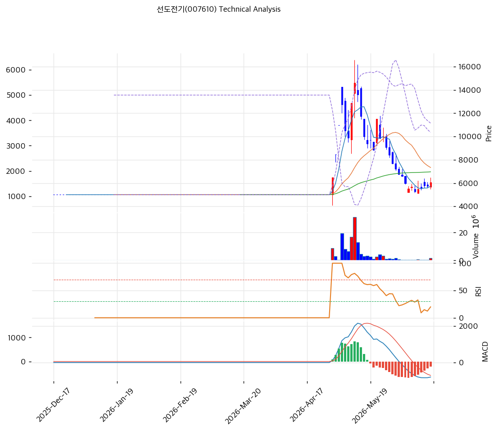

# 기술적분석

2026-06-17 | T2 Technical Analysis

> ⚠️ 전력망 테마로 14,600원까지 급등 후 -59% 폭락한 종목. 밴드폭 103.8%의 극단적 변동성으로 기술적 신호 신뢰도가 제한된다.

***

## 차트

***

## 1. 가격 현황

| 항목        | 값               |
| --------- | --------------- |
| 현재가       | 6,040원 (+5.41%) |
| 52주 고가    | 14,600원         |
| 52주 저가    | 5,000원          |
| 52주 범위 위치 | 11.0% (저점권)     |
| 거래량       | 20일 평균 대비 1.2x  |

> 52주 고점(14,600원) 대비 **-59% 폭락**해 저점권(위치 11%). 테마 급등분을 대부분 반납하고 5,000\~6,500원 박스에서 바닥 다지기. 당일 +5.41% 반등이나 추세는 약세.

***

## 2. 차트 패턴 분석

### 2.1 캔들스틱 패턴

| 패턴                 | 위치                  | 신뢰도 | 해석        |
| ------------------ | ------------------- | --- | --------- |
| 고점 대비 -59% 폭락 후 바닥 | 14,600 → 6,040      | 중   | 테마 급등분 반납 |
| MA20·MA60 하회       | 6,040 < 7,340·6,968 | 중   | 단기 약세     |
| 과매도 반등 시도          | 스토캐스틱 14.9          | 중   | 단기 기술적 반등 |

※ 주요 캔들 패턴: 망치형, 역망치형, 장악형, 도지, 샛별/석별, 적삼병/흑삼병, 하라미, 유성형, 교수형 등

### 2.2 가격 구조 패턴

* **테마 급등 후 폭락·바닥 박스** (신뢰도: 중) 14,600원 테마 고점 후 -59% 폭락, 5,000\~6,500원 박스 형성. MA120(5,984원)·MA200(5,590원) 부근에서 바닥 지지 시도.
* **단기 약세(MA20·MA60 하회)** (신뢰도: 중) 현재가가 MA20(7,340원)·MA60(6,968원)을 하회해 중단기 하락 추세. MA120·MA200 위에서 장기 바닥 다지기.

※ 주요 구조 패턴: 이중천정/바닥, 헤드앤숄더, 삼각수렴, 쐐기형, 깃발형, 페넌트, 컵앤핸들, 박스권 등

### 2.3 다이버전스

* **과매도 반등 시도** (신뢰도: 중) 스토캐스틱 과매도(K=14.9) + 골든크로스로 단기 기술적 반등 신호. 다만 MACD 매도 잔존으로 추세 전환은 미확인. RSI 42.7 중립.

※ RSI·MACD 기반 | 상승 다이버전스 = 가격↓ 지표↑, 하락 다이버전스 = 가격↑ 지표↓

### 2.4 패턴 종합 판단

전력망 테마로 14,600원까지 급등 후 **-59% 폭락해 저점권 바닥 다지기** 국면이다. MA20·MA60 하회의 단기 약세에 스토캐스틱 과매도 반등 신호가 혼재한다. 밴드폭 103.8%의 극단 변동성으로 신호 신뢰도가 낮다. MA120·MA200(5,590\~5,984원) 지지가 핵심이며, 테마 재점화 없이는 박스 등락 가능성. 당일 +5.41% 반등은 과매도 반발로 해석.

***

## 3. 이동평균선 — 비정배열(단기 약세·장기 바닥)

| MA    | 값      | 현재가 괴리율 | 위치 |
| ----- | ------ | ------- | -- |
| MA5   | 5,734원 | +5.7%   | 위  |
| MA20  | 7,340원 | -17.4%  | 아래 |
| MA60  | 6,968원 | -13.0%  | 아래 |
| MA120 | 5,984원 | +1.3%   | 위  |
| MA200 | 5,590원 | +8.4%   | 위  |

**해석**: 현재가가 MA20·MA60 아래, MA120·MA200 위의 **비정배열**. 중단기선(MA20 7,340원) 하회로 단기 약세이나, 장기선(MA120·MA200 5,590\~5,984원) 위에서 바닥 다지기. MA20 회복이 단기 반등 분기점, MA120·MA200 이탈 시 추가 하락. 당일 MA5(5,734원) 상회로 단기 반등.

***

## 4. 보조 지표

### RSI(14) — 42.7 (중립)

폭락 후 중립권. 과매도(30)는 아니나 약세 영역. 방향성 모색.

### MACD(12,26,9)

| 항목        | 값          |
| --------- | ---------- |
| MACD      | -789       |
| Signal    | -580       |
| Histogram | -209       |
| 크로스 상태    | 매도 (0선 아래) |

**해석**: MACD가 0선 아래 매도 구간, 히스토그램 음으로 하락 모멘텀 잔존. 추세 전환 미확인.

### 볼린저밴드(20, 2σ)

| 항목        | 값          |
| --------- | ---------- |
| 상단        | 11,151원    |
| 중단 (MA20) | 7,340원     |
| 하단        | 3,529원     |
| 밴드 폭      | **103.8%** |
| 현재 위치     | 중간 하단      |

**해석**: 밴드 폭 103.8%의 극단적 변동성(테마 급등락 흔적). 현재가 6,040원은 중단(7,340원) 아래·하단(3,529원) 위. 변동성 매우 커 밴드 기반 신호 신뢰도 낮음.

### 스토캐스틱(14, 3, 3)

| 항목      | 값            |
| ------- | ------------ |
| Slow %K | 14.9         |
| Slow %D | 11.2         |
| 크로스 상태  | 골든크로스        |
| 판단      | 과매도권 (반등 시도) |

***

## 5. 지지/저항 — 추세선 · 피보나치 · PRZ 통합

### 5.1 종합 지지/저항 테이블

| 구분      | 가격         | 근거                    |
| ------- | ---------- | --------------------- |
| 저항      | 7,054원     | 피보 0.786·MA60 (PRZ 중) |
| 저항      | 7,340원     | MA20                  |
| 저항      | 6,550원     | 피봇 R1                 |
| **현재가** | **6,040원** | —                     |
| 지지      | 5,984원     | MA120                 |
| 지지      | 5,590원     | MA200                 |
| 지지      | 5,555원     | 피봇 S1·MA200 (PRZ 약)   |
| 지지      | 5,000원     | 52주 저가                |
| 지지      | 4,980원     | 피봇 S2                 |

※ 테마 급등 스윙으로 피보 되돌림 저항(7,054\~12,334원)이 위쪽에 산재. MA120·MA200(5,590\~5,984원)이 핵심 바닥 지지.

***

## 6. 시그널 종합

| 지표    | 내용               | 시그널 |
| ----- | ---------------- | --- |
| 차트 패턴 | 폭락 후 바닥 박스       | ⚪   |
| 이동평균선 | 비정배열(MA20·60 하회) | ⚪   |
| RSI   | 42.7 — 중립        | ⚪   |
| MACD  | 매도(0선 아래)        | 🔴  |
| 볼린저밴드 | 중단 하회, 밴드폭 104%  | ⚪   |
| 스토캐스틱 | 과매도(14.9) 골든크로스  | 🟢  |
| 거래량   | 1.2x — 보통        | ⚪   |

**종합 판단**: 🟢 매수 1개 / 🔴 매도 1개 / ⚪ 중립 4개 → **중립 (폭락 후 바닥·과매도 반등)**

전력망 테마 급등 후 -59% 폭락해 저점권 바닥 다지기 국면이다. MA20·MA60 하회의 단기 약세에 스토캐스틱 과매도 반등이 혼재한다. 밴드폭 104%의 극단 변동성으로 신호 신뢰도가 낮다. MA120·MA200(5,590\~5,984원) 지지가 핵심이며, 펀더멘털(영업흑전 초기)·테마 재점화가 동반돼야 추세 반전. 당일 반등은 과매도 반발.

***

## 7. 전략 제안

### 보유 중인 경우

* **MA120·MA200 지지 주시 / 반등 시 비중조절**
* 저항 라인: 6,550원(피봇 R1)·7,054\~7,340원(MA60·MA20)
* 손절 라인: 5,590원(MA200) 이탈
* 리스크/리워드: 테마 폭락·변동성으로 손익비 불확실, 반등 시 분할 대응

### 진입 대기인 경우

* **과매도 반등 노림 시 소액 / 추세 확인 대기**
* 1차 관찰가: 5,590\~5,984원 (MA200·MA120 지지)
* 2차 관찰가: 5,000원 (52주 저가)
* 진입 조건: 테마 급등락·순이익 질 낮음·영업 흑자 미정착으로 펀더멘털 베팅 위험. 과매도 기술적 반등은 소액 단기. 본격 진입은 영업이익 흑자 정착·수주 확대·전력망 테마 재점화 확인 후. MA200 이탈 시 손절.
