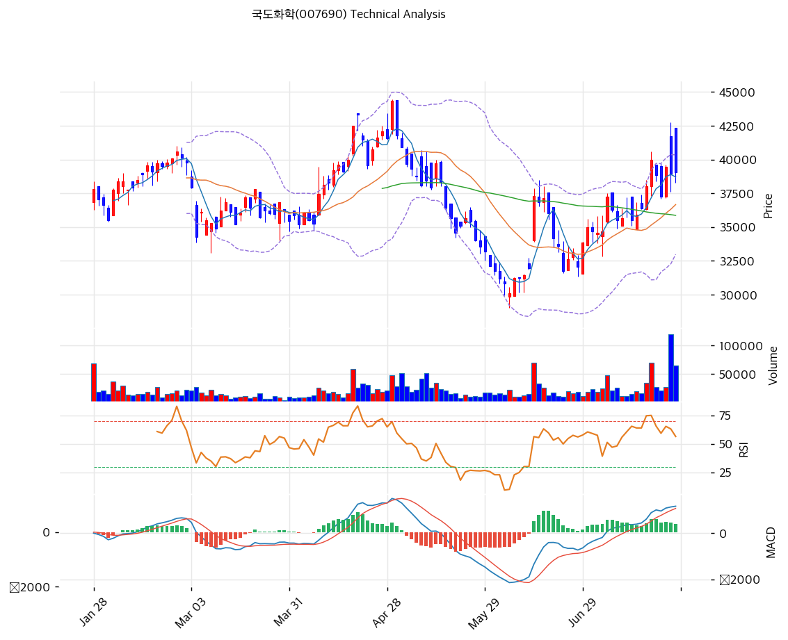

# 국도화학(007690) 기술적 분석

2026-07-27 | T2 Technical Analysis

---

## 차트

---

## 1. 가격 현황

| 항목 | 값 |
|------|-----|
| 현재가 | 39,050원 (+0.26%) |
| 52주 고가 | 44,350원 |
| 52주 저가 | 30,100원 |
| 52주 범위 위치 | 62.8% |
| 거래량 | 20일 평균 대비 **2.26x** |

---

## 2. 차트 패턴 분석

### 2.1 캔들스틱 패턴

| 패턴 | 위치 | 신뢰도 | 해석 |
|------|------|--------|------|
| 장대양봉 + 긴 윗꼬리 | 직전 거래일 | 중 | 42,500원까지 급등 후 39,000원대로 밀림 — 매수 강도는 확인됐으나 차익 매물도 확인 |
| 대량 거래 동반 상승 | 최근 3거래일 | 강 | 거래량 2.26배 — 5월 저점 이후 최대 관심 유입 |

### 2.2 가격 구조 패턴

- **W자(이중바닥) 반등** (신뢰도: 중)
  5월 말 30,100원 저점 → 6월 중순 반등 → 6월 말 32,000원대 재시험 → 7월 급반등. 넥라인(약 37,300원)을 상향 돌파한 상태로, 이중바닥 측정 목표는 약 44,500원 부근이다.

- **1월 고점(42,000원)권 매물대 진입** (신뢰도: 강)
  1\~2월 40,000\~42,000원에서 형성된 매물대에 재진입. 직전 거래일 42,500원 터치 후 밀린 것이 이 매물대의 저항을 보여준다 — 소화에 시간이 필요한 구간.

- **볼린저 상단 근접 후 되돌림** (신뢰도: 중)
  상단(40,351원)을 시험한 뒤 중간대(39,000원)로 복귀 — 밴드 폭 20.1%로 확장 중이라 변동성 국면 진입.

### 2.3 다이버전스

- **MACD 매수 유지, 히스토그램 축소 전환** (신뢰도: 중)
  6월 말 골든크로스 후 매수 구간(1,167 vs 868)을 유지하나 히스토그램(+298)이 확대에서 축소로 돌아섰다 — 단기 모멘텀의 1차 소진 신호.

- **스토캐스틱 데드크로스 (K 63.4 < D 67.0)** (신뢰도: 중)
  중립권에서의 데드크로스 — 급등 후 숨고르기를 예고하는 초기 신호.

### 2.4 패턴 종합 판단

5월 저점(30,100원)에서 시작된 반등이 이중바닥 넥라인을 돌파하고 1월 매물대(40,000\~42,000원)까지 도달한 국면이다. 거래량 2.26배가 붙은 것은 긍정적이나, **직전 거래일의 긴 윗꼬리와 스토캐스틱 데드크로스·MACD 히스토그램 축소는 단기 과열 소화의 필요성**을 동시에 시사한다. 실적(2026Q1 마진 후퇴)이 아직 확인되지 않은 상태의 상승이라, 8월 반기 실적 전까지는 매물대 소화 구간으로 보는 것이 안전하다.

---

## 3. 이동평균선 — 전 이평 상회 (배열은 미완성)

| MA | 값 | 현재가 괴리율 | 위치 |
|----|-----|--------------|------|
| MA5 | 38,710원 | +0.9% | 위 |
| MA20 | 36,668원 | +6.5% | 위 |
| MA60 | 35,871원 | +8.9% | 위 |
| MA120 | 36,867원 | +5.9% | 위 |
| MA200 | 35,407원 | +10.3% | 위 |

**해석**: 5개 이평을 모두 상회하나 **MA120(36,867원)이 MA60(35,871원)보다 위에 있어 완전 정배열은 아니다** — 상반기 조정의 흔적이 아직 남아 있다는 뜻이다. MA20 괴리 +6.5%는 과열이 아닌 건전한 수준이며, 눌림 시 MA20(36,668원)·MA120(36,867원)이 겹치는 36,700\~36,900원 구간이 1차 지지대로 작동한다.

---

## 4. 보조 지표

### RSI(14) — 59.3 (중립)

과매수(70)까지 여유가 있는 중립 상단 — 급등 직후임에도 과열되지 않았다는 점은 상승 여력을 시사한다.

### MACD(12,26,9)

| 항목 | 값 |
|------|-----|
| MACD | 1,167 |
| Signal | 868 |
| Histogram | +298 (**축소 전환**) |
| 크로스 상태 | 매수 구간 |

**해석**: 매수 구간은 유지되나 히스토그램이 축소로 돌아섰다 — 상승 모멘텀의 1차 정점 통과. 데드크로스 전환 여부가 다음 관찰점이다.

### 볼린저밴드(20, 2σ)

| 항목 | 값 |
|------|-----|
| 상단 | 40,351원 |
| 중단 (MA20) | 36,668원 |
| 하단 | 32,984원 |
| 밴드 폭 | 20.1% |
| 현재 위치 | 중간~상단 |

**해석**: 상단(40,351원)을 시험한 뒤 되돌아온 위치. 밴드 폭이 20.1%로 확장 중이라 변동성이 커지는 국면 — 상단 돌파 시 밴드 워킹, 실패 시 중단(36,668원)까지의 되돌림이 기본 시나리오다.

### 스토캐스틱(14, 3, 3)

| 항목 | 값 |
|------|-----|
| Slow %K | 63.4 |
| Slow %D | 67.0 |
| 크로스 상태 | **데드크로스** |
| 판단 | 중립 (단기 숨고르기 신호) |

---

## 5. 지지/저항 — 추세선 · 피보나치 · PRZ 통합

### 5.1 피보나치 되돌림/확장

| 구분 | 비율 | 가격 | 현재가 대비 |
|------|------|------|-----------|
| 확장 | 2.0 | 44,500원 | +14.0% |
| 확장 | 1.618 | 41,750원 | +6.9% |
| 확장 | 1.382 | 40,050원 | +2.6% |
| 확장 | 1.272 | 39,258원 | +0.5% |
| Swing High | — | 37,300원 | -4.5% |
| 되돌림 | 0.236 | 35,601원 | -8.8% |
| 되돌림 | 0.382 | 34,550원 | -11.5% |
| 되돌림 | 0.5 | 33,700원 | -13.7% |
| Swing Low | — | 30,100원 | -22.9% |

※ 피보나치 기준: 상승 추세 (Swing Low 30,100원 → Swing High 37,300원) — 현재가는 1.272 확장을 막 넘어선 위치

### 5.2 추세선

| 추세선 | 방향 | 현재 교차가 | 포인트 수 | 해석 |
|--------|------|-----------|---------|------|
| 지지선 | 하락 | 30,124원 | 6개 | 상반기 저점 연결선 — 이미 상향 이탈 |
| 저항선 | 상승 | **41,768원** | 6개 | 고점 연결 상승 채널 상단 — 1차 저항 |

### 5.3 PRZ (Potential Reversal Zone)

| 방향 | 가격 범위 | 신뢰도 | 근거 |
|------|---------|--------|------|
| 저항 | 43,950\~44,500원 | 약 | 피봇 R2 + 피보나치 2.0 확장 |
| 저항 | 41,500\~41,768원 | **중** | 피봇 R1 + 피보나치 1.618 + 추세선 저항 |
| 지지 | 38,710\~39,258원 | 약 | MA5 + 피보나치 1.272 (현재가 부근) |
| 지지 | 36,668\~37,450원 | **중** | MA20 + MA120 + 피봇 S1 |
| 지지 | 35,407\~35,871원 | **강** | MA200 + MA60 + 피보나치 0.236 + 피봇 S2 |

※ PRZ = 추세선 · 피보나치 · 피봇 · MA 등 복수 지표가 겹치는 가격 구간

### 5.4 종합 지지/저항 테이블

| 구분 | 가격 | 근거 |
|------|------|------|
| 저항 | 44,350원 | 52주 고가 |
| 저항 | 43,950\~44,500원 | PRZ(약) — 피봇 R2 + 피보나치 2.0 |
| 저항 | 41,500\~41,768원 | PRZ(중) — 피봇 R1 + 추세선 + 피보나치 1.618 |
| 저항 | 40,351원 | 볼린저 상단 |
| **현재가** | **39,050원** | — |
| 지지 | 38,710원 | MA5 |
| 지지 | 36,668\~37,450원 | PRZ(중) — MA20 + MA120 + 피봇 S1 |
| 지지 | 35,407\~35,871원 | PRZ(강) — MA200·MA60·피보나치 0.236 |
| 지지 | 32,984원 | 볼린저 하단 |

---

## 6. 시그널 종합

| 지표 | 내용 | 시그널 |
|------|------|--------|
| **차트 패턴** | 이중바닥 넥라인 돌파 + 1월 매물대 진입 | 🟢 (구조) / ⚪ (매물대) |
| 이동평균선 | 전 이평 상회, 배열 미완성(MA120>MA60), MA20 +6.5% | ⚪ |
| RSI | 59.3 — 중립 | ⚪ |
| MACD | 매수 구간, 히스토그램 축소 전환 | ⚪ |
| 볼린저밴드 | 중간~상단, 폭 20.1% 확장 | ⚪ |
| 스토캐스틱 | **데드크로스**, K=63.4 | ⚪ |
| 거래량 | **2.26x** — 강력 동반 | 🟢 |

**종합 판단**: 🟢 매수 1개 / 🔴 매도 0개 / ⚪ 중립 5개 → **매수우위 (반등 유효, 매물대 소화 필요)**

매도 신호가 없다는 점은 우호적이나, 신호 대부분이 중립이라는 것은 **방향이 정해지지 않았다**는 뜻이다. 구조(이중바닥 돌파·전 이평 상회·거래량 2.26배)는 상방을 가리키고, 단기 지표(스토캐스틱 데드크로스·MACD 히스토그램 축소·긴 윗꼬리)는 숨고르기를 예고한다. **41,500\~41,768원(PRZ 중)이 1차 관문**이며, 이 구간을 거래량과 함께 넘으면 44,350원(52주 고가)까지 열린다. 8월 반기 실적의 마진 회복 여부가 돌파의 펀더멘털 근거가 될 것이다.

---

## 7. 전략 제안

### 보유 중인 경우
- **홀드 (매물대 소화 관찰)**
- 익절 라인: 41,500\~41,768원 1차 (PRZ 중·추세선 저항 — 일부 축소), 돌파 시 44,350원(52주 고가)
- 손절 라인: 36,600원 (MA20+MA120 PRZ 이탈 = 반등 구조 훼손)
- 리스크/리워드: 약 1.1 (+2,700 / -2,450) — 매물대 직전이라 손익비는 보통. 배당 3.3%가 보조 쿠션

### 진입 대기인 경우
- **눌림 분할 매수 우선 (매물대 추격 자제)**
- 1차 진입가: 36,700\~37,400원 (MA20 + MA120 + 피봇 S1 겹침 — 통상 눌림 하단)
- 2차 진입가: 35,400\~35,900원 (PRZ 강 — MA200·MA60·피보나치 0.236 4중 지지)
- 진입 조건: 1월 매물대(40,000\~42,000원) 소화에는 시간이 필요하다 — **8월 반기 실적에서 2026Q1의 마진 후퇴(OPM 2.5%)가 회복됐는지 확인한 뒤 비중을 정하는 것**이 안전하다. 41,768원(추세선) 거래량 돌파 시에는 추세 추종도 유효
