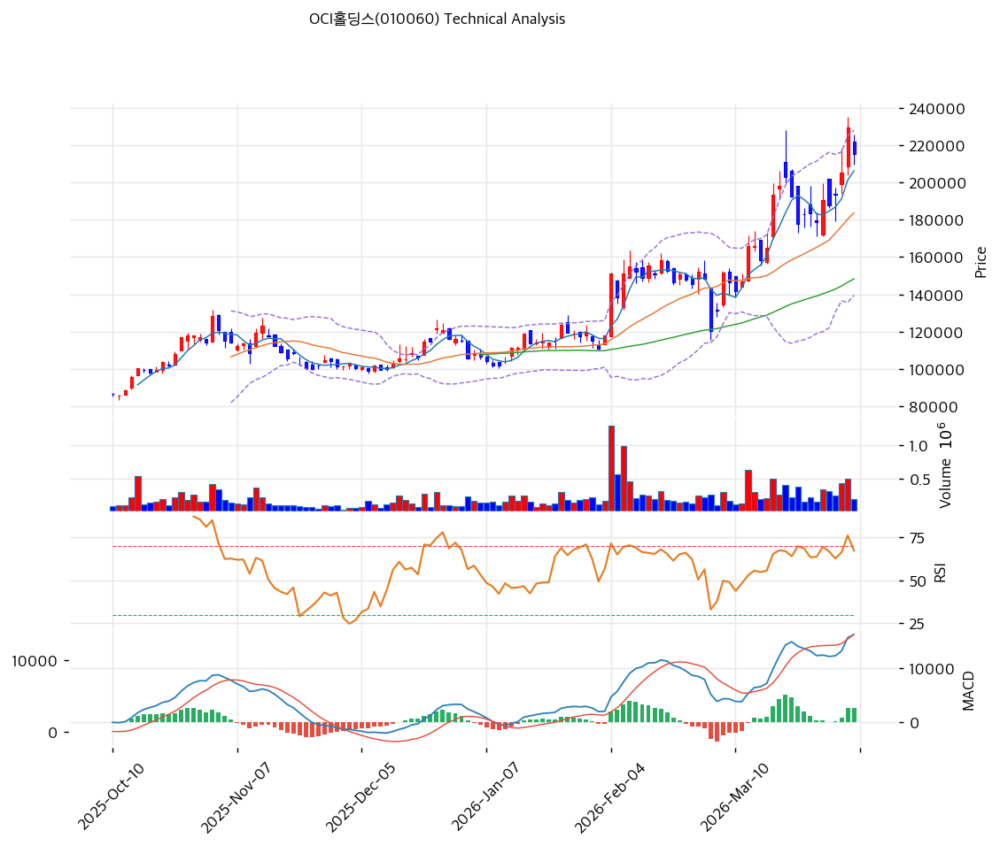

# OCI홀딩스(010060) 기술적 분석

2026-04-06 | T2 Technical Analysis

---

## 차트

---

## 1. 가격 현황

| 항목 | 값 |
|------|-----|
| 현재가 | 215,000원 (-6.32%) |
| 52주 고가 | 229,500원 |
| 52주 저가 | 59,000원 |
| 52주 범위 위치 | 91.5% |
| 거래량 | 20일 평균 대비 0.67x |

---

## 2. 차트 패턴 분석

### 2.1 캔들스틱 패턴

| 패턴 | 위치 | 신뢰도 | 해석 |
|------|------|--------|------|
| 신고가 근접 후 음봉 조정 | 최근 5거래일 | 중 | 강한 상승 뒤 이익실현이 유입되며 단기 숨고르기 진행 |
| 상단부 조정 캔들 | 최근 1~2거래일 | 중 | 고가 부근 매물 부담이 존재하지만 추세는 유지 |

### 2.2 가격 구조 패턴

- **대세 상승 후 눌림** (신뢰도: 중)
  6만원대에서 20만원대까지 큰 폭 상승한 뒤, 22만원대 저항권에서 조정 중입니다. 중장기 상승 추세 내 정상 조정으로 볼 수 있습니다.

- **상승 채널 유지** (신뢰도: 중)
  MA20과 MA60이 우상향하고 있고 정배열 구조가 유지됩니다. 다만 단기 이격이 있어 조정 폭이 더 나올 가능성도 있습니다.

### 2.3 다이버전스

- **RSI 하락 다이버전스 뚜렷하지 않음** (신뢰도: 약)
  RSI 64.5로 아직 극단 과열은 아니며, 명확한 하락 다이버전스는 확인되지 않습니다.

- **MACD 매수구간 유지** (신뢰도: 중)
  MACD는 매수구간이나 히스토그램 확장이 둔화된 모습입니다. 추세는 유지되지만 탄력은 일부 둔화됐습니다.

### 2.4 패턴 종합 판단

OCI홀딩스는 **강한 중장기 상승 추세 속 단기 조정** 구간입니다. 급락 신호라기보다 고점 부근 눌림으로 보는 편이 적절합니다.

---

## 3. 이동평균선 — 정배열 (강세)

| MA | 값 | 현재가 괴리율 | 위치 |
|----|-----|--------------|------|
| MA5 | 206,160원 | +4.3% | 위 |
| MA20 | 183,695원 | +17.0% | 위 |
| MA60 | 148,292원 | +45.0% | 위 |
| MA120 | 127,912원 | +68.1% | 위 |
| MA200 | 112,590원 | +91.0% | 위 |

**해석**: 완전 정배열입니다. 추세는 견조하지만 MA20 대비 17% 이격으로 단기 조정 여지는 남아 있습니다.

---

## 4. 보조 지표

### RSI(14) — 64.5 (중립)

과열 직전 수준입니다. 추세는 좋지만 추가 상승보다는 한 차례 조정이 자연스러울 수 있습니다.

### MACD(12,26,9)

| 항목 | 값 |
|------|-----|
| MACD | 16,255.0 |
| Signal | 13,654.0 |
| Histogram | +2,600.0 |
| 크로스 상태 | 매수 구간 |

**해석**: 매수구간은 유지되고 있습니다. 다만 히스토그램 확장은 둔화돼 속도 조절 가능성이 보입니다.

### 볼린저밴드(20, 2σ)

| 항목 | 값 |
|------|-----|
| 상단 | 227,882원 |
| 중단 (MA20) | 183,695원 |
| 하단 | 139,508원 |
| 밴드 폭 | 48.1% |
| 현재 위치 | 중간 |

**해석**: 상단 과열에서 약간 내려와 중간 구간으로 진입했습니다. 변동성은 높지만 과열은 일부 진정된 상태입니다.

### 스토캐스틱(14, 3, 3)

| 항목 | 값 |
|------|-----|
| Slow %K | 76.8 |
| Slow %D | 68.4 |
| 크로스 상태 | 골든크로스 |
| 판단 | 중립 |

---

## 5. 지지/저항

| 구분 | 가격 | 근거 |
|------|------|------|
| 저항 | 229,500원 | 52주 고가 |
| 저항 | 223,833원 | 피봇 R1 |
| **현재가** | **215,000원** | — |
| 지지 | 207,833원 | 피봇 S1 |
| 지지 | 200,667원 | 피봇 S2 |
| 지지 | 183,695원 | MA20 |

---

## 6. 시그널 종합

| 지표 | 내용 | 시그널 |
|------|------|--------|
| **차트 패턴** | 신고가 근접 후 조정, 추세는 유지 | ⚪ |
| 이동평균선 | 정배열, MA20 +17.0% | 🟢 |
| RSI | 64.5 — 중립 | ⚪ |
| MACD | 매수구간 유지 | ⚪ |
| 볼린저밴드 | 중간 위치, 변동성 높음 | ⚪ |
| 스토캐스틱 | 골든크로스, K=76.8 | ⚪ |
| 거래량 | 0.67x — 약함 | ⚪ |

**종합 판단**: 🟢 매수 1개 / 🔴 매도 0개 / ⚪ 중립 6개 → **매수우위**

중장기 추세는 여전히 강세입니다. 다만 단기 매수 타이밍으로는 고점권 조정이 진행 중이라, 눌림 확인 후 접근이 더 적절합니다.

---

## 7. 전략 제안

### 보유 중인 경우
- **홀드**
- 익절 라인: 234,090원 (전략상 제시값, 전고점 상향 돌파 구간)
- 손절 라인: 200,667원 (피봇 S2 이탈 시)
- 리스크/리워드: 1.5:1 이상

### 진입 대기인 경우
- **관망**
- 1차 진입가: 207,833원 (피봇 S1)
- 2차 진입가: 183,695원 (MA20)
- 진입 조건: 조정 후 지지 확인 및 반등 캔들 출현
