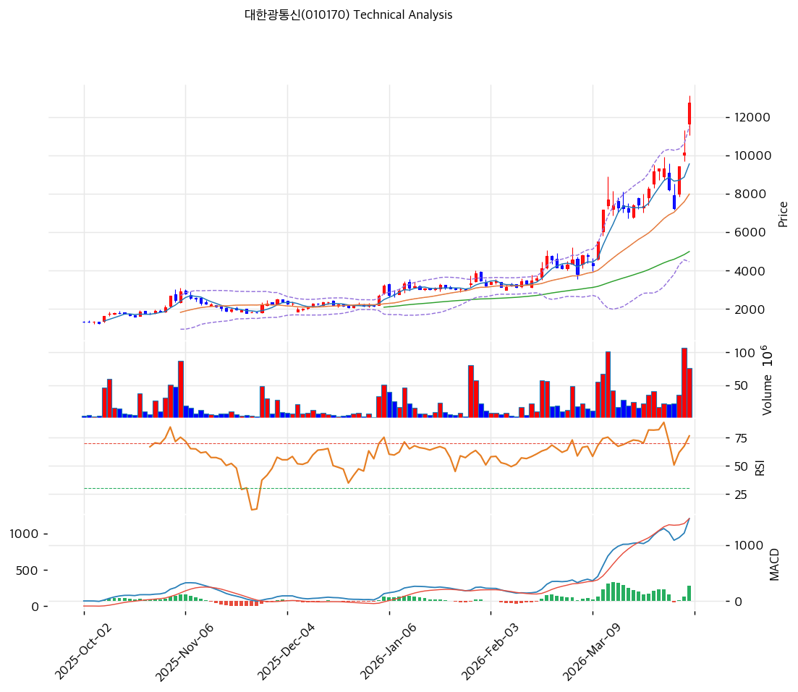

# 대한광통신(010170) 기술적 분석

2026-04-06 | T2 Technical Analysis

---

## 차트

---

## 1. 가격 현황

| 항목 | 값 |
|------|-----|
| 현재가 | 12,740원 (+0.00%) |
| 52주 고가 | 12,740원 |
| 52주 저가 | 444원 |
| 52주 범위 위치 | 100.0% |
| 거래량 | 20일 평균 대비 0.00x |

---

## 2. 차트 패턴 분석

### 2.1 캔들스틱 패턴

| 패턴 | 위치 | 신뢰도 | 해석 |
|------|------|--------|------|
| 연속 장대양봉 | 최근 5일 | 강 | 매수 시그널 — 2026년 3월 말~4월 초 연속적 장대양봉 출현, 강력한 매수세 유입 확인 |
| 갭상승(Gap Up) | 4/1~4/3 | 강 | 매수 시그널 — 연속 갭상승으로 돌파 모멘텀 극대화, 갭 미메움 시 강세 지속 |
| 십자형(도지) 부재 | 최근 3일 | 중 | 중립 — 최근 캔들에서 뚜렷한 반전 캔들 미출현, 상승 모멘텀 유지 중 |

### 2.2 가격 구조 패턴

- **V자 반등 → 파라볼릭 상승** (신뢰도: 강)
  2025년 10월경 약 2,000원대 저점에서 V자 반등 후 급격한 파라볼릭 곡선을 그리며 상승 중. 약 6개월간 444원→12,740원으로 약 2,770% 상승. 파라볼릭 상승은 급격한 조정을 동반할 수 있어 경계 필요.

- **박스권 돌파 후 급등** (신뢰도: 중)
  2025년 12월~2026년 2월 약 2,000~4,000원 박스권에서 횡보 후 2월 말~3월 초 상방 돌파하며 거래량 급증 동반. 돌파 이후 지지선 전환 확인 필요.

### 2.3 다이버전스

- **RSI 다이버전스 미확인** (신뢰도: 중)
  현재 가격과 RSI가 동조하여 함께 상승 중이며, 뚜렷한 하락 다이버전스는 미관찰. 다만 RSI 77.4로 과매수 구간 진입 상태에서 가격이 추가 상승 시 하락 다이버전스 형성 가능성 모니터링 필요.

- **MACD 다이버전스 미확인** (신뢰도: 중)
  MACD 히스토그램이 확대 중이며 가격 상승과 동조. 현 시점 하락 다이버전스 없으나, 히스토그램 축소 전환 시 경계 신호.

### 2.4 패턴 종합 판단

캔들스틱 패턴은 연속 장대양봉과 갭상승으로 극단적 강세를 시사하며, 가격 구조는 파라볼릭 상승 국면에 진입했음을 보여준다. 다이버전스는 아직 미형성 상태로 모멘텀 지속을 뒷받침하나, 52주 고가(=현재가) 도달 및 파라볼릭 구간 특성상 급격한 되돌림 리스크가 상존한다. **방향성은 강세이나, 과열 경고 수준이 매우 높다.**

---

## 3. 이동평균선 — 정배열 (강세)

| MA | 값 | 현재가 괴리율 | 위치 |
|----|-----|--------------|------|
| MA5 | 10,450원 | +21.9% | 위 |
| MA20 | 8,397원 | +51.7% | 위 |
| MA60 | 5,147원 | +147.5% | 위 |
| MA120 | 3,623원 | +251.6% | 위 |
| MA200 | 2,605원 | +389.1% | 위 |

**해석**: 전 구간 정배열로 추세 강세가 명확하다. 그러나 MA5 대비 +21.9%, MA20 대비 +51.7%로 단기·중기 이평선과의 괴리가 극도로 확대된 상태다. MA200 대비 +389.1%는 역사적 과열 수준으로, 평균 회귀 압력이 매우 강하다. 단기적으로 MA5(10,450원)가 1차 회귀 타겟, MA20(8,397원)이 의미 있는 지지선이 될 수 있다.

---

## 4. 보조 지표

### RSI(14) — 77.4 (🔴과매수)

RSI 77.4로 과매수 구간(70 이상)에 진입한 상태. 추가 상승 여력보다 단기 조정 가능성이 높은 구간이며, 80 이상 진입 시 극단적 과매수로 급락 리스크 확대.

### MACD(12,26,9)

| 항목 | 값 |
|------|-----|
| MACD | 1,659 |
| Signal | 1,295 |
| Histogram | +365 |
| 크로스 상태 | 매수 구간 (확대 중) |

**해석**: MACD가 시그널선 상위에서 히스토그램 확대 중으로 상승 모멘텀이 강화되고 있다. 그러나 MACD 절대값이 크게 확장된 상태로, 히스토그램 축소 전환 시 추세 둔화 신호가 될 수 있다.

### 볼린저밴드(20, 2σ)

| 항목 | 값 |
|------|-----|
| 상단 | 12,075원 |
| 중단 (MA20) | 8,397원 |
| 하단 | 4,719원 |
| 밴드 폭 | 87.6% |
| 현재 위치 | 상단 돌파 |

**해석**: 현재가 12,740원이 볼린저밴드 상단(12,075원)을 돌파한 상태로, 밴드 폭 87.6%는 극단적 확장 국면. 밴드 워킹(band walking) 가능성이 있으나 상단 이탈 지속은 어려우며, 중단(MA20=8,397원)으로의 회귀 압력이 존재한다.

### 스토캐스틱(14, 3, 3)

| 항목 | 값 |
|------|-----|
| Slow %K | 87.8 |
| Slow %D | 77.0 |
| 크로스 상태 | 골든크로스 |
| 판단 | 과매수 |

---

## 5. 지지/저항

| 구분 | 가격 | 근거 |
|------|------|------|
| 저항 | 12,740원 | 52주 고가 = 현재가 (심리적 저항) |
| 저항 | 12,995원 | 전략 익절 타겟 (현재가 +2%) |
| **현재가** | **12,740원** | — |
| 지지 | 12,075원 | 볼린저밴드 상단 |
| 지지 | 10,450원 | MA5 (단기 이평선) |
| 지지 | 8,397원 | MA20 (중기 이평선, 볼린저 중단) |
| 지지 | 5,147원 | MA60 (장기 이평선) |

---

## 6. 시그널 종합

| 지표 | 내용 | 시그널 |
|------|------|--------|
| **차트 패턴** | 파라볼릭 상승, 연속 장대양봉, 다이버전스 미형성 | 🟢 |
| 이동평균선 | 정배열, MA20 +51.7% 극단 괴리 | 🟢 (추세) / 🔴 (과열) |
| RSI | 77.4 — 과매수 🔴 | 🔴 |
| MACD | 매수구간, 히스토그램 확대 | 🟢 |
| 볼린저밴드 | 상단 돌파, 밴드 폭 87.6% | ⚪ |
| 스토캐스틱 | 골든크로스, K=87.8 과매수 | 🔴 |
| 거래량 | 0.0x — 약함 (비거래일 데이터) | ⚪ |

**종합 판단**: 🟢 매수 2개 / 🔴 매도 3개 / ⚪ 중립 2개 → **매도우위**

추세 자체는 정배열 + MACD 강세로 명확한 상승 국면이나, RSI·스토캐스틱 이중 과매수, 볼린저밴드 상단 이탈, 52주 고가 도달(100.0%), MA20 대비 +51.7% 극단 괴리 등 과열 지표가 압도적이다. 단기적으로 이익 실현 매물 출회에 따른 조정 가능성이 높으며, 중기적으로는 상승 추세가 유지되더라도 건전한 되돌림이 선행될 전망이다.

---

## 7. 전략 제안

### 보유 중인 경우
- **비중축소**
- 익절 라인: 12,995원 (현재가 대비 +2.0%, 추가 모멘텀 시 상방 여력)
- 손절 라인: 12,740원 (현재가 = 52주 고가 하회 시 추세 둔화)
- 리스크/리워드: 현 가격 대비 상방 여력 제한적, 하방 리스크 우세

### 진입 대기인 경우
- **관망**
- 1차 진입가: 12,740원 (52주 고가 지지 확인 시, 그러나 추격매수 리스크 매우 높음)
- 2차 진입가: 8,397원 (MA20 지지 확인 시 — 건전한 조정 후 재진입 적정가)
- 진입 조건: MA5(10,450원) 이상 지지 확인 + 거래량 동반 재반등 확인 시 분할 진입. 현 수준 추격매수는 극단적 과열 구간으로 비권장.
