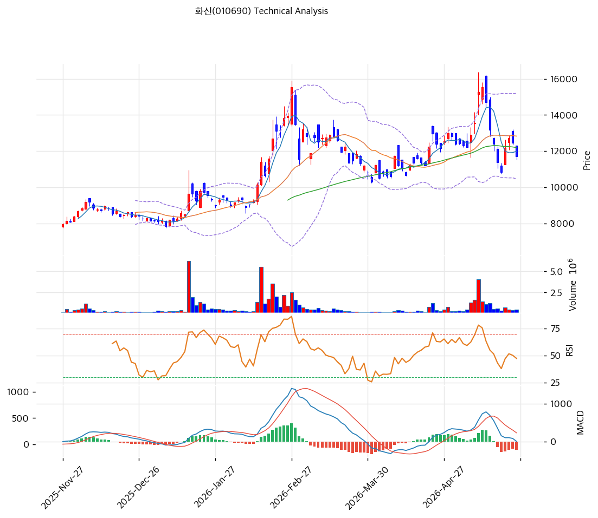

# 기술적분석

***

## 가격 위치

현재가 **11,720원** (-5.94%) — 52주 고가 15,550원 대비 **-24.6% 조정**. 1년 +55.2% (7,550→11,720) 누적 상승 후 단기 조정 중. **외국인 -87,862주 + 기관 -119,081주 동반 매도**(-20일)로 1Q26 부진 + 신공장 감가상각 부담 우려 반영. 52주 위치 52.1% — 중립 영역.

## 이동평균선 / 모멘텀

MA5 11,990 / MA20 12,832 / MA60 12,193 / MA120 10,742 / MA200 9,798 — **단기 MA(5/20/60) 모두 현재가 위**(-2.3% / -8.7% / -3.9%), 중장기 MA(120/200) 아래(+9.1% / +19.6%). **단기 약세 + 중장기 강세** 혼재 구조. MA20과 MA60 사이(12,193\~12,832원)이 1차 회복 저항.

**RSI 45.6 (중립)** — 50선 약간 미달, 과매도 영역 아니지만 모멘텀 약화. MACD 7 / 시그널 216 / 히스토 -209 = **매도 시그널 + 확장 진행** = 단기 약세 진행. 스토캐 K=27.7 / D=26.4 골든크로스 **중립 영역**(과매도 직전). 볼륨비 0.56x로 매도세 거래량은 평균 미달 — **본격 패닉 매도는 아님**.

## 시그널 종합 / S\&R

매수 0 / 매도 1 / 중립 5 → **매도우위(약)**. 신호 자체는 강하지 않으나 회복 모멘텀 부재.

* 저항: **12,167원(PRZ 강: MA5·피봇 R1·MA60)** / 12,797원(PRZ 중: 피봇 R2·MA20·피보 0.5) / **13,536원(피보 0.618)** / 15,550원(52주 고가)
* 지지: **11,471원(PRZ 약: 피봇 S1·피보 0.236)** / 11,080원(피봇 S2) / 10,742원(MA120) / 9,798원(MA200)
* 핵심 분기점: **MA60 12,193원 돌파 여부**가 회복 신호. 이탈 시 추가 -8\~12% 조정 가능

전략: **HOLD(비중축소) — TP 15,861원 / SL 11,080원**. WAIT(진입가능) e1=11,400원 / e2=12,832원. **PRZ 11,471원 지지 사수 시 분할 진입 가능**, MA120 10,742원 추가 분할. 2Q26 실적 발표(8월) 전후 변동성 확대 예상.
