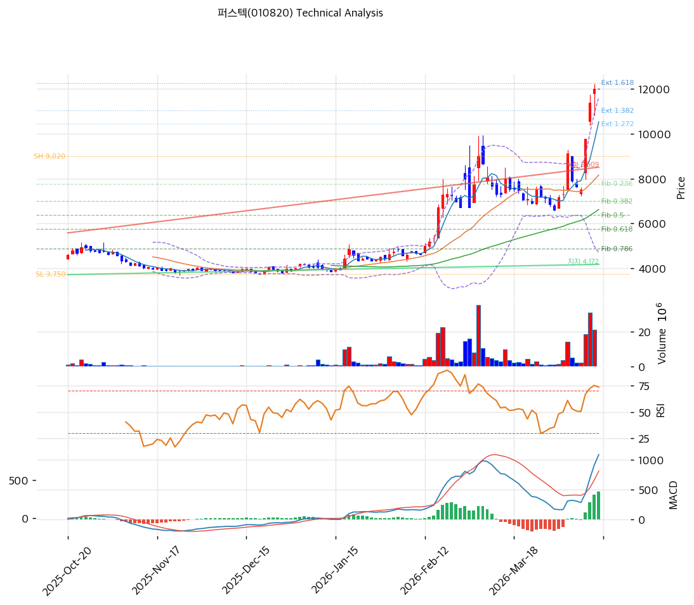

# 퍼스텍(010820) 기술적 분석

2026-04-14 | T2 Technical Analysis

---

## 차트

---

## 1. 가격 현황

| 항목 | 값 |
|------|-----|
| 현재가 | 12,000원 (0.0%) |
| 52주 고가 | 12,000원 |
| 52주 저가 | 3,105원 |
| 52주 범위 위치 | 100.0% |
| 거래량 | 20일 평균 대비 0.0x |

---

## 2. 차트 패턴 분석

### 2.1 캔들스틱 패턴

| 패턴 | 위치 | 신뢰도 | 해석 |
|------|------|--------|------|
| 상단 저항 도달 | 현재가 = 52주 고가 | 강 | 52주 신고가 갱신 구간으로 역사적 저항선이 없어 차트 공백지대에 진입. 추가 상승 여지 있으나 오버슈트 후 급반락 위험도 동시 존재 |
| 과매수 구간 지속 | RSI 73.4, 스토캐스틱 K=95.0 | 강 | 복수 지표 동시 과매수로 단기 되돌림 압력이 상당. 매도 시그널 3개 vs 매수 2개 |

※ 주요 캔들 패턴: 52주 신고가 돌파 이후 거래량 데이터 미수집 상태로 캔들별 세부 패턴 판독 제한

### 2.2 가격 구조 패턴

- **장기 우상향 추세 지속** (신뢰도: 강)
  이동평균선 전 구간 정배열(MA5>MA20>MA60>MA120>MA200) 달성. 현재가가 MA5(10,536원) 대비 +13.9%, MA20(8,164원) 대비 +47.0%, MA200(4,966원) 대비 +141.6%까지 이격 확대 중이다. 직전 저점 3,105원 대비 주가가 3.9배 급등한 상태로 52주 신고가를 연속 경신 중이다.

- **피보나치 확장 구간 진입** (신뢰도: 중)
  스윙로우 3,750원→스윙하이 9,020원 기준 1.618 확장가 12,277원이 바로 위에 위치한다. 현재가 12,000원은 1.382 확장(11,033원)을 상향 돌파한 상태로 다음 저항은 1.618 확장(12,277원). 이 수준 돌파 시 2.0 확장(14,290원)이 중기 목표가가 된다.

### 2.3 다이버전스

- **RSI 하락 다이버전스 경계** (신뢰도: 중)
  RSI 73.4로 과매수 구간에 진입했으나 거래량 데이터 미수집으로 모멘텀 확인이 제한된다. 주가 신고가 경신 시 RSI가 이전 고점을 하회하는 패턴이 형성될 경우 하락 다이버전스가 확인될 수 있어 모니터링 필요.

- **스토캐스틱 과매수 지속** (신뢰도: 강)
  K=95.0, D=89.1로 모두 80 이상 과매수 구간에서 골든크로스 상태를 유지하고 있다. 과매수 구간의 장기 지속은 강한 추세의 신호이기도 하나, 이 수준에서의 교차 하락 시 단기 조정 신호로 전환된다.

### 2.4 패턴 종합 판단

현재 차트는 장기 정배열 추세의 강력한 상승 모멘텀과 단기 과매수 경고 신호가 혼재된 상태다. 이동평균선과 MACD는 추세 지속을 지지하나, RSI(73.4)·스토캐스틱(K=95)·볼린저밴드 상단 밀착이 동시에 과매수를 경고하고 있어 방향성보다 **타이밍 리스크**가 핵심 이슈다. 52주 고가 = 현재가로 저항선이 부재한 상황에서 추세 추종 관점과 과열 조정 관점이 충돌하고 있다.

---

## 3. 이동평균선 — 정배열 (강세)

| MA | 값 | 현재가 괴리율 | 위치 |
|----|-----|--------------|------|
| MA5 | 10,536원 | +13.9% | 위 |
| MA20 | 8,164원 | +47.0% | 위 |
| MA60 | 6,619원 | +81.3% | 위 |
| MA120 | 5,372원 | +123.4% | 위 |
| MA200 | 4,966원 | +141.6% | 위 |

**해석**: 5개 이동평균선 전 구간 정배열로 중장기 상승 추세가 확고하다. 그러나 MA20 대비 +47%, MA200 대비 +142%의 이격은 역사적으로 단기 조정 전 나타나는 수준이다. MA20(8,164원)이 1차 핵심 지지선이며, 이를 이탈하면 추세 훼손 신호로 해석될 수 있다.

---

## 4. 보조 지표

### RSI(14) — 73.4 (과매수 🔴)

RSI 73.4는 과매수 기준선(70)을 상회 중으로, 단기 조정 압력이 누적되고 있다. 다만 강한 상승 추세에서는 RSI가 70 이상을 상당 기간 유지하는 경우가 있으므로 단독 매도 신호로 해석하기보다 다른 지표와 복합적으로 판단해야 한다.

### MACD(12,26,9)

| 항목 | 값 |
|------|-----|
| MACD | 1,091 |
| Signal | 619 |
| Histogram | +472 |
| 크로스 상태 | 매수 구간 (확대 중) |

**해석**: MACD가 시그널 위에서 히스토그램이 +472로 확대 중인 강력한 매수 구간이다. 히스토그램 확대는 상승 모멘텀이 가속되고 있음을 의미하며, 단기 추세 전환 신호 없음.

### 볼린저밴드(20, 2σ)

| 항목 | 값 |
|------|-----|
| 상단 | 11,632원 |
| 중단 (MA20) | 8,164원 |
| 하단 | 4,696원 |
| 밴드 폭 | 84.9% |
| 현재 위치 | 상단 근접 |

**해석**: 현재가 12,000원이 볼린저밴드 상단(11,632원)을 상향 돌파한 상태다. 밴드 폭 84.9%는 극단적 변동성 확장을 의미하며, 이 수준에서 상단 이탈 지속은 강한 추세의 신호이나 동시에 되돌림 위험도 높다. 중단(MA20=8,164원)으로의 수렴 시 조정 폭이 상당할 수 있다.

### 스토캐스틱(14, 3, 3)

| 항목 | 값 |
|------|-----|
| Slow %K | 95.0 |
| Slow %D | 89.1 |
| 크로스 상태 | 골든크로스 |
| 판단 | 과매수 |

---

## 5. 지지/저항 — 추세선 · 피보나치 · PRZ 통합

### 5.1 피보나치 되돌림/확장

| 구분 | 비율 | 가격 | 현재가 대비 |
|------|------|------|-----------|
| Swing High | — | 9,020원 | (기준점) |
| 되돌림 | 0.236 | 7,776원 | -35.2% |
| 되돌림 | 0.382 | 7,007원 | -41.6% |
| 되돌림 | 0.5 | 6,385원 | -46.8% |
| 되돌림 | 0.618 | 5,763원 | -51.9% |
| 되돌림 | 0.786 | 4,878원 | -59.4% |
| Swing Low | — | 3,750원 | (기준점) |
| 확장 | 1.272 | 10,453원 | -12.9% |
| 확장 | 1.382 | 11,033원 | -8.1% |
| 확장 | 1.618 | **12,277원** | **+2.3%** |
| 확장 | 2.0 | 14,290원 | +19.1% |

※ 피보나치 기준: 상승 추세 (Swing Low 3,750원 → Swing High 9,020원)
※ 현재가(12,000원)는 1.382 확장(11,033원)~1.618 확장(12,277원) 사이에 위치

### 5.2 추세선

| 추세선 | 방향 | 현재 교차가 | 포인트 수 | 해석 |
|--------|------|-----------|---------|------|
| 지지선 | 상승 | 4,172원 | 6개 | 장기 상승 추세선. 기울기 3.86/일로 완만하게 우상향 중. 현재가와 7,828원 이격으로 장기 지지선 역할 |
| 저항선 | 상승 | 8,509원 | 6개 | 기울기 24.67/일의 가파른 상승 저항선. 현재가가 이를 상향 돌파한 상태. 3,491원 이격 |

### 5.3 PRZ (Potential Reversal Zone)

| 방향 | 가격 범위 | 신뢰도 | 근거 |
|------|---------|--------|------|
| 지지 | 12,000원 | 강 | 피봇 R1, 피봇 R2, 피봇 S1, 피봇 S2 — 피봇 지표 집중 |
| 지지 | 10,453~10,536원 | 약 | 피보나치 1.272 확장(10,453원) + MA5(10,536원) 수렴 구간 |

※ PRZ = 추세선·피보나치·피봇·MA 등 복수 지표가 겹치는 가격 구간. 12,000원 피봇 PRZ는 강 신뢰도이나 피봇 지표만으로 구성되어 있어 해석에 유의 필요.

### 5.4 종합 지지/저항 테이블

| 구분 | 가격 | 근거 |
|------|------|------|
| 저항 | 14,290원 | 피보나치 2.0 확장 — 중기 목표가 |
| 저항 | 12,277원 | 피보나치 1.618 확장 — 단기 핵심 저항 |
| **현재가** | **12,000원** | — |
| 지지 | 11,033원 | 피보나치 1.382 확장 |
| 지지 | 10,453~10,536원 | PRZ(약) — 피보나치 1.272 확장 + MA5 |
| 지지 | 8,509원 | 추세선 저항 (돌파 후 지지 전환) |
| 지지 | 8,164원 | MA20 — 1차 핵심 지지선 |
| 지지 | 7,776원 | 피보나치 0.236 되돌림 |
| 지지 | 6,619원 | MA60 |
| 지지 | 4,172원 | 장기 상승 추세선 |

---

## 6. 시그널 종합

| 지표 | 내용 | 시그널 |
|------|------|--------|
| **차트 패턴** | 정배열 완성, 피보나치 1.618 확장 저항 직전 | 🟢 (추세) / ⚪ (저항 경계) |
| 이동평균선 | 정배열, MA20 +47.0% — 강세이나 과열 | 🟢 |
| RSI | 73.4 — 과매수 🔴 | 🔴 |
| MACD | 매수구간, 히스토그램 +472 확대 중 | 🟢 |
| 볼린저밴드 | 상단 돌파, 밴드 폭 84.9% — 극단 확장 | ⚪ |
| 스토캐스틱 | 골든크로스, K=95.0 — 과매수 | 🔴 |
| 거래량 | 0.0x — 데이터 미수집 | ⚪ |

**종합 판단**: 🟢 매수 3개 / 🔴 매도 2개 / ⚪ 중립 2개 → **매도우위 (단기 조정 경계)**

강력한 중장기 상승 추세가 MACD·이동평균 정배열로 확인되지만, RSI 과매수(73.4)와 스토캐스틱 K=95.0, 볼린저밴드 상단 돌파가 단기 과열을 경고한다. 현재가 12,000원이 52주 고가 동시에 피보나치 1.618 확장(12,277원) 직전에 위치해 있어 단기적으로는 저항 테스트 국면이다. 중기 관점에서 12,277원 돌파 확인 시 14,290원(2.0 확장)까지 추세 연장 가능성이 있다.

---

## 7. 전략 제안

### 보유 중인 경우
- **비중축소 (단기 과열 구간)**
- 익절 라인: 12,277원 (피보나치 1.618 확장 — 단기 저항)
- 손절 라인: 11,033원 (피보나치 1.382 확장 이탈 시)
- 리스크/리워드: 1 : 1.1 (12,000원 기준, 익절 277원 / 손절 967원)

### 진입 대기인 경우
- **관망 (과열 구간 조정 대기)**
- 1차 진입가: 10,453~10,536원 (PRZ 약 — 피보나치 1.272 확장 + MA5 수렴)
- 2차 진입가: 8,164원 (MA20 — 핵심 지지선)
- 진입 조건: 거래량 동반 지지 확인 후 진입. MA20 지지 확인 시 중기 추세 유효
