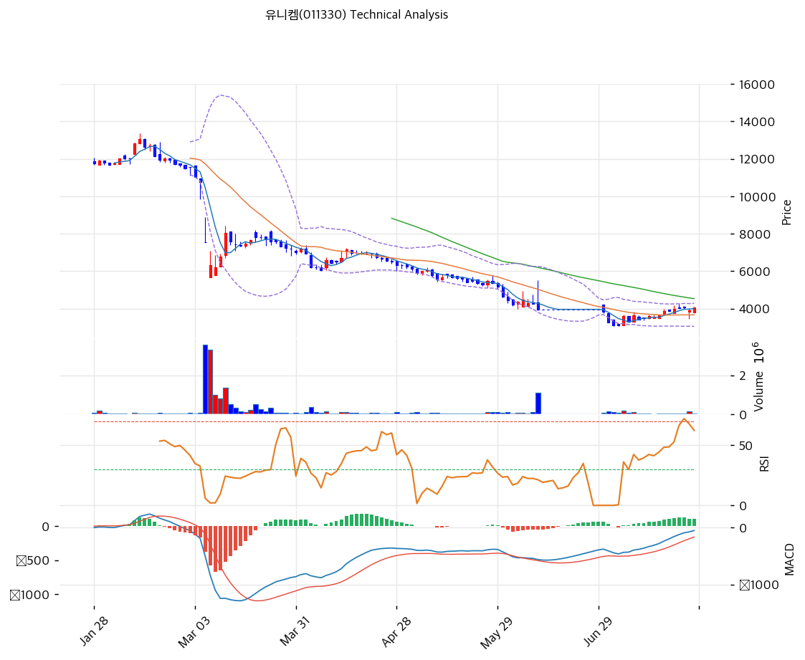

# 유니켐(011330) 기술적 분석

2026-07-27 | T2 Technical Analysis

---

## 차트

---

## 1. 가격 현황

| 항목 | 값 |
|------|-----|
| 현재가 | 4,065원 (**+3.83%**) |
| 52주 고가 | 18,890원 (병합 조정) |
| 52주 저가 | 3,060원 (병합 조정) |
| 52주 범위 위치 | **6.1%** — 저점 근처 |
| 거래량 | 20일 평균 대비 **0.89x** |

⚠️ **차트 해석의 대전제**: 2026-06-16자 **10:1 주식병합**(액면 500원 → 5,000원)이 있었고 6/12\~6/29 매매거래가 정지됐다. 차트의 과거 가격은 모두 병합 배수로 소급 조정된 값이며, MA120(6,679원)·MA200(9,164원) 같은 장기 이평은 **병합 전 저유동성 구간의 가격을 10배 환산한 것**이라 지지·저항으로서의 실효성이 낮다. 재상장(6/30) 이후 형성된 3,000\~4,300원 구간이 실질적인 가격 발견 영역이다.

---

## 2. 차트 패턴 분석

### 2.1 캔들스틱 패턴

| 패턴 | 위치 | 신뢰도 | 해석 |
|------|------|--------|------|
| 양봉 (거래량 미달) | 금일 | 약 | +3.83%이나 거래량 0.89배로 뒷받침이 없음 |
| 재상장 후 저점 반등 | 6월 말\~7월 | 중 | 3,060원 저점 이후 4,000원대 회복 — 병합 직후 매물 소화 국면 |

### 2.2 가격 구조 패턴

- **재상장 후 바닥 다지기** (신뢰도: 중)
  6/30 재상장 이후 3,060원 저점을 찍고 4,000원대까지 회복. MA20(3,669원) 위에서 +10.8%로 단기 상승 흐름은 살아 있으나, 형성된 지 한 달도 안 된 가격대라 지지·저항의 신뢰도가 낮다.

- **볼린저 밴드 폭 33.7% — 극단적 변동성** (신뢰도: 강)
  상단 4,286원·하단 3,052원으로 밴드 폭이 33.7%다. 통상 5\~15%가 일반적인 것을 감안하면 **가격이 하루 단위로 크게 흔들리는 구간**이라는 뜻이며, 기술적 신호보다 공시 이벤트가 주가를 지배하는 국면임을 보여준다.

- **장기 하락 추세는 압도적으로 유효** (신뢰도: 강)
  MA60(4,532원)·MA120(6,679원)·MA200(9,164원)이 모두 위에 있고, MA200 대비 -55.6%다. 52주 위치 6.1%는 사실상 바닥권이라는 의미이면서 동시에 **1년 내내 하락만 했다**는 기록이다.

### 2.3 다이버전스

- **MACD 매수 구간 진입** (신뢰도: 약)
  MACD -51 vs 시그널 -160으로 매수 구간이나 히스토그램(+109)이 확대되지 않고 있다. 병합·거래정지로 지표 산출 기준 자체가 불연속이라 신뢰도를 낮게 봐야 한다.

- **스토캐스틱 78.2 — 데드크로스** (신뢰도: 중)
  %K 78.2 / %D 79.7로 상단권에서 데드크로스가 발생했다. 단기 과열 해소 압력을 시사한다.

### 2.4 패턴 종합 판단

**이 종목의 차트는 지금 정보량이 매우 적다.** 6/30 재상장 이후 약 한 달치 데이터로 형성된 3,060\~4,300원 박스가 유일하게 유효한 구조이며, 그 밖의 이평·피보나치 수치는 병합 환산값이라 참고치에 불과하다. 볼린저 폭 33.7%가 말해주듯 가격은 기술적 균형이 아니라 **공시(횡령·유증·경영권 분쟁)에 반응해 움직이고 있다.** 7/30 제3자배정 유증 납입(발행가 5,000원)과 8/18 신주 상장이 예정돼 있어 8월 중순까지는 이벤트 드리븐 구간이 이어진다.

---

## 3. 이동평균선 — 완전 역배열 (비정배열)

| MA | 값 | 현재가 괴리율 | 위치 |
|----|-----|--------------|------|
| MA5 | 4,009원 | +1.4% | 위 |
| MA20 | 3,669원 | +10.8% | 위 |
| MA60 | 4,532원 | -10.3% | 아래 |
| MA120 | 6,679원 | -39.1% | 아래 |
| MA200 | 9,164원 | -55.6% | 아래 |

**해석**: 단기(MA5·MA20)는 넘어섰지만 MA60부터 MA200까지 층층이 위에 있는 전형적 역배열이다. MA20 대비 +10.8%는 단기 과열 신호로도 읽힌다. 1차 저항은 MA60(4,532원)이며, MA120·MA200은 병합 전 가격의 환산값이라 실제 매물대로 기능할지 불확실하다.

---

## 4. 보조 지표

### RSI(14) — 54.3 (중립)

중립선을 소폭 넘긴 수준으로 방향성 정보가 거의 없다. 과매수(70)·과매도(30) 어느 쪽에서도 멀다.

### MACD(12,26,9)

| 항목 | 값 |
|------|-----|
| MACD | -51.0 |
| Signal | -160.0 |
| Histogram | +109.0 (확대 없음) |
| 크로스 상태 | 매수 구간 |

**해석**: 음수 영역의 매수 구간이나 히스토그램이 확대되지 않아 모멘텀 축적이 확인되지 않는다. 거래정지 구간을 포함한 지표라 해석에 주의가 필요하다.

### 볼린저밴드(20, 2σ)

| 항목 | 값 |
|------|-----|
| 상단 | 4,286원 |
| 중단 (MA20) | 3,669원 |
| 하단 | 3,052원 |
| 밴드 폭 | **33.7%** (극단적 확장) |
| 현재 위치 | 중간~상단 |

**해석**: 밴드 폭 33.7%는 정상 범위(5\~15%)의 두 배 이상으로, 최근 한 달간 일간 변동성이 극단적이었음을 뜻한다. 이런 국면에서는 밴드 상·하단이 지지·저항으로 잘 작동하지 않으며, 포지션 사이징을 평소보다 줄이는 것이 원칙이다.

### 스토캐스틱(14, 3, 3)

| 항목 | 값 |
|------|-----|
| Slow %K | 78.2 |
| Slow %D | 79.7 |
| 크로스 상태 | **데드크로스** |
| 판단 | 상단권 데드크로스 — 단기 조정 압력 |

---

## 5. 지지/저항 — 추세선 · 피보나치 · PRZ 통합

### 5.1 피보나치 되돌림

| 구분 | 비율 | 가격 | 현재가 대비 |
|------|------|------|-----------|
| Swing High | — | 13,050원 | +221.0% |
| 되돌림 | 0.786 | 10,924원 | +168.7% |
| 되돌림 | 0.618 | 9,255원 | +127.7% |
| 되돌림 | 0.5 | 8,082원 | +98.8% |
| 되돌림 | 0.382 | 6,910원 | +70.0% |
| 되돌림 | 0.236 | 5,460원 | +34.3% |
| Swing Low | — | 3,115원 | -23.4% |

※ 하락 추세(13,050 → 3,115원)의 되돌림. **모든 되돌림 레벨이 현재가보다 34% 이상 위**에 있어 단기 매매 기준으로는 활용도가 낮다. 첫 관문인 0.236(5,460원)조차 +34%다

### 5.2 추세선

| 추세선 | 방향 | 현재 교차가 | 포인트 수 | 해석 |
|--------|------|-----------|---------|------|
| 지지선 | 하락 | 1,007원 | 6개 | 기울기 -73.7 — 하락 각도가 매우 가팔라 실효성 없음 |
| 저항선 | 하락 | 9,270원 | 6개 | 기울기 -33.5 — 원거리 저항 |

### 5.3 PRZ (Potential Reversal Zone)

| 방향 | 가격 범위 | 신뢰도 | 근거 |
|------|---------|--------|------|
| 지지 | 3,669\~3,695원 | 약 | MA20 + 피봇 S2 |

※ PRZ = 추세선 · 피보나치 · 피봇 · MA 등 복수 지표가 겹치는 가격 구간. 재상장 후 데이터가 짧아 신뢰도 '약' 한 곳만 형성됐다

### 5.4 종합 지지/저항 테이블

| 구분 | 가격 | 근거 |
|------|------|------|
| 저항 | 5,460원 | 피보나치 0.236 (원거리) |
| 저항 | **5,000원** | **제3자배정 유증 발행가 — 심리적 기준선** |
| 저항 | 4,532원 | MA60 — 1차 관문 |
| 저항 | 4,286원 | 볼린저 상단 |
| 저항 | 4,170원 | 피봇 R1 |
| **현재가** | **4,065원** | |
| 지지 | 4,009원 | MA5 |
| 지지 | 3,880원 | 피봇 S1 |
| 지지 | 3,669\~3,695원 | PRZ(약) — MA20 + 피봇 S2 |
| 지지 | 3,052\~3,060원 | 볼린저 하단 + 52주 저가 |

---

## 6. 시그널 종합

| 지표 | 내용 | 시그널 |
|------|------|--------|
| 차트 패턴 | 재상장 후 바닥 다지기, 변동성 극단 | ⚪ |
| 이동평균선 | 완전 역배열, MA20 +10.8% | ⚪ |
| RSI | 54.3 — 중립 | ⚪ |
| MACD | 매수 구간, 히스토그램 정체 | ⚪ |
| 볼린저밴드 | 중간~상단, 폭 33.7% | ⚪ |
| 스토캐스틱 | 데드크로스, K=78.2 | ⚪ |
| 거래량 | 0.89x — 약함 | ⚪ |

**종합 판단**: 🟢 매수 0개 / 🔴 매도 0개 / ⚪ 중립 6개 → **중립 (기술적 신호 부재)**

모든 지표가 중립이라는 것은 이 국면에서 **차트가 판단 근거를 제공하지 못한다**는 뜻이다. 병합·거래정지로 지표의 연속성이 끊겼고, 재상장 후 한 달치 데이터로는 추세를 말할 수 없다. 실제 주가를 움직이는 변수는 7/30 유증 납입, 8/18 신주 상장, 횡령 사건 후속 공시, 경영권 분쟁 진행 상황이며 — 이 종목은 지금 **차트로 매매할 대상이 아니라 공시로 판단할 대상**이다.

---

## 7. 전략 제안

### 보유 중인 경우
- **비중 축소 검토 (반등 시)**
- 익절 라인: 4,532원(MA60) 1차, 5,000원(유증 발행가) 2차 — 반등이 오면 물량을 줄이는 구간으로 활용
- 손절 라인: 3,669원 (MA20·PRZ 이탈 = 재상장 후 지지 구조 붕괴)
- 리스크/리워드: 약 1.2 (+467 / -396) — 1차 목표 기준. 다만 BW 290.9억 풋(2027-05)과 횡령 후속 공시가 남아 있어 **하방 꼬리가 정규분포보다 두껍다**는 점을 감안해야 한다

### 진입 대기인 경우
- **관망 (신규 진입 비권장)**
- 참고 진입가: 3,052\~3,100원 (볼린저 하단 + 52주 저가 재시험 시)
- 진입 조건: 기술적 신호로 진입을 정당화할 수 없는 구간이다. **BW 290.9억의 차환·상환 계획이 공시되고, 횡령 사건의 규모가 확정되며, 경영권 분쟁이 정리되기 전까지는 관망이 원칙**이다. 매매를 하더라도 볼린저 폭 33.7%의 변동성을 감안해 포지션을 평소의 1/3 이하로 제한하고, 8/18 유증 신주 상장(100만주, 발행가 5,000원) 전후의 수급 변화를 확인할 것
