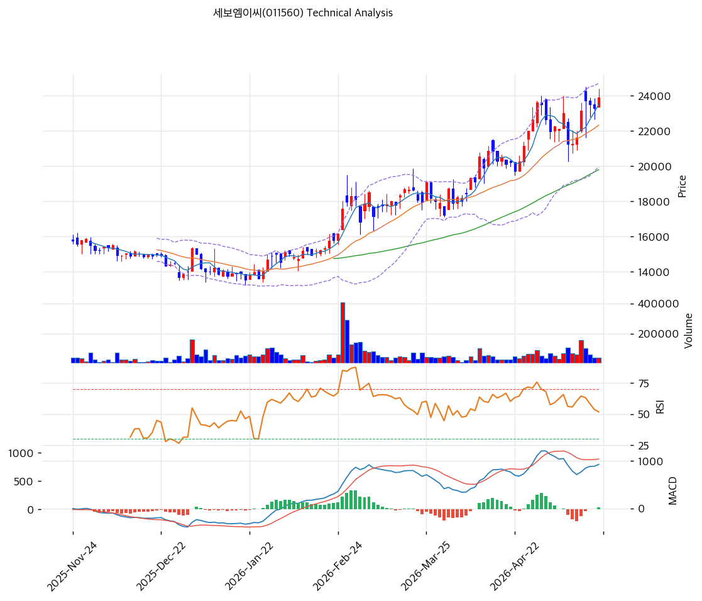

# 세보엠이씨(011560) 기술적 분석

2026-05-21 | T2 Technical Analysis

---

## 차트

---

## 1. 가격 현황

| 항목 | 값 |
|------|-----|
| 현재가 | 23,900원 (52주 신고가) |
| 52주 고가 | 23,900원 (당일) |
| 52주 저가 | 9,840원 |
| 52주 범위 위치 | 100.0% |
| 거래량 | 데이터 결손 (차트상 2월 폭증, 5월 안정) |

---

## 2. 차트 패턴 분석

### 2.1 캔들스틱 패턴

| 패턴 | 위치 | 신뢰도 | 해석 |
|------|------|--------|------|
| **장대양봉 (당일 신고가)** | 당일 | 강 | 23,000→23,900원 신고가 갱신 |
| **단계적 상승** | 6개월 | 강 | 14,000→23,900원 +71% 단계적 상승 |
| 적삼병 | 최근 5일 | 중 | 양봉 누적 |

### 2.2 가격 구조 패턴

- **단계적 상승 채널** (신뢰도: 강)
  2025-11~2026-01 박스권 (14,000~16,000원) → 2026-02 거래량 폭증 + 20,000원 1차 돌파 → 2026-02~04 18,000~22,000원 박스권 → 2026-05 단계적 상승 + 23,900원 신고가. **저변동성 우량 패턴**.

- **52주 신고가 + RSI 64 미과열** (신뢰도: 강)
  RSI 64로 70 임계 미돌파 = **건전한 추세 가속**. 추가 상승 여지.

### 2.3 다이버전스

- **RSI 64.0 중립** (신뢰도: 강)
  RSI 70 미돌파. 추가 상승 여지.

- **MACD 매수 + 히스토그램 확대** (신뢰도: 중)
  MACD 928 > Signal 891, 히스토그램 +37 (확대 약함). 매수 모멘텀 유지.

### 2.4 패턴 종합 판단

단계적 상승 + RSI 64 미과열 + MACD 매수 + 26Q1 호재 정합 = **건전한 추세 가속**. BB 폭 21.3% 평균 영역. MA200 +54% 일부 과열 누적이나 펀더멘털 (PER 7.08x·PBR 0.86x·순현금 1,042억) 정합.

---

## 3. 이동평균선 — 정배열 (강세)

| MA | 값 | 현재가 괴리율 | 위치 |
|----|-----|--------------|------|
| MA5 | 23,510원 | +1.7% | 위 |
| MA20 | 22,322원 | +7.1% | 위 |
| MA60 | 19,793원 | +20.7% | 위 |
| MA120 | (확인) | 약 +35% | 위 |
| MA200 | 15,531원 | **+53.9%** | 위 |

**해석**: 완벽한 정배열. MA20 +7.1% 정상 추세. MA200 +53.9% 회복 추세 잔여. **MA20 (22,322원)을 1차 강력 지지로 인식**.

---

## 4. 보조 지표

### RSI(14) — 64.0 (중립)

70 임계 미돌파. 추가 상승 여지.

### MACD(12,26,9)

| 항목 | 값 |
|------|-----|
| MACD | 928 |
| Signal | 891 |
| Histogram | +37 |
| 크로스 상태 | 매수 (확대 중) |

**해석**: 골든크로스 유지 + 히스토그램 양 방향 확대. 매수 모멘텀 안정.

### 볼린저밴드(20, 2σ)

| 항목 | 값 |
|------|-----|
| 상단 | 24,697원 |
| 중단 (MA20) | 22,322원 |
| 하단 | 19,948원 |
| 밴드 폭 | 21.3% |
| 현재 위치 | 중간 |

**해석**: 밴드 폭 21.3% 평균. 중간 위치 = 추가 상승 여지.

### 스토캐스틱(14, 3, 3)

| 항목 | 값 |
|------|-----|
| Slow %K | 78.0 |
| Slow %D | 77.8 |
| 크로스 상태 | 골든크로스 |
| 판단 | 중립 (과매수 임계) |

---

## 5. 지지/저항

### 종합 지지/저항

| 구분 | 가격 | 근거 |
|------|------|------|
| 저항 | 27,833원 | BPS (펀더멘털 정점) |
| 저항 | 25,000원 | 심리적 라운드넘버 |
| 저항 | 24,697원 | BB 상단 |
| **현재가** | **23,900원** | 52주 신고가 |
| 지지 | 23,510원 | MA5 |
| 지지 | 22,322원 | **MA20 + BB 중단 (1차 강력 지지)** |
| 지지 | 19,948원 | BB 하단 |
| 지지 | 19,793원 | MA60 |
| 지지 | 15,531원 | MA200 |
| 지지 | 9,840원 | 52주 저점 |

---

## 6. 시그널 종합

| 지표 | 시그널 |
|------|--------|
| 차트 패턴 (단계적 상승) | 🟢 |
| 이동평균선 (정배열) | 🟢 |
| RSI 64.0 (중립) | ⚪ |
| MACD 매수 + 히스토그램 확대 | 🟢 |
| 볼린저밴드 중간 (BW 21.3%) | ⚪ |
| 스토캐스틱 78.0 | ⚪ |
| 거래량 (2월 폭증·5월 안정) | ⚪ |

**종합 판단**: 🟢 매수 3 / 🔴 매도 0 / ⚪ 중립 4 → **매수우위 (건전)**

단계적 상승 + RSI 미과열 + MACD 매수 + 펀더멘털 정합 = 건전한 추세 가속. 추가 상승 여지.

---

## 7. 전략 제안

### 보유 중
- **홀드 + 분할 익절**
- 1차 익절: 25,000원 (심리적, +5%)
- 2차 익절: 27,833원 (BPS 영역, +16%)
- 손절: 22,322원 (MA20, -7%)

### 진입 대기
- **분할 매수 가능**
- 1차 진입: 23,900원 (현재가, 직접 진입)
- 2차 진입: 22,322원 (MA20, -7%)
- 3차 진입: 19,948원 (BB 하단, -17%)
- 진입 조건: MA20 도달 + 양봉 + 거래량 회복
- **펀더멘털 우호**: PBR 0.86x + 순현금 +1,042억 + 26Q1 +40.9% — 분할 매수 적기
