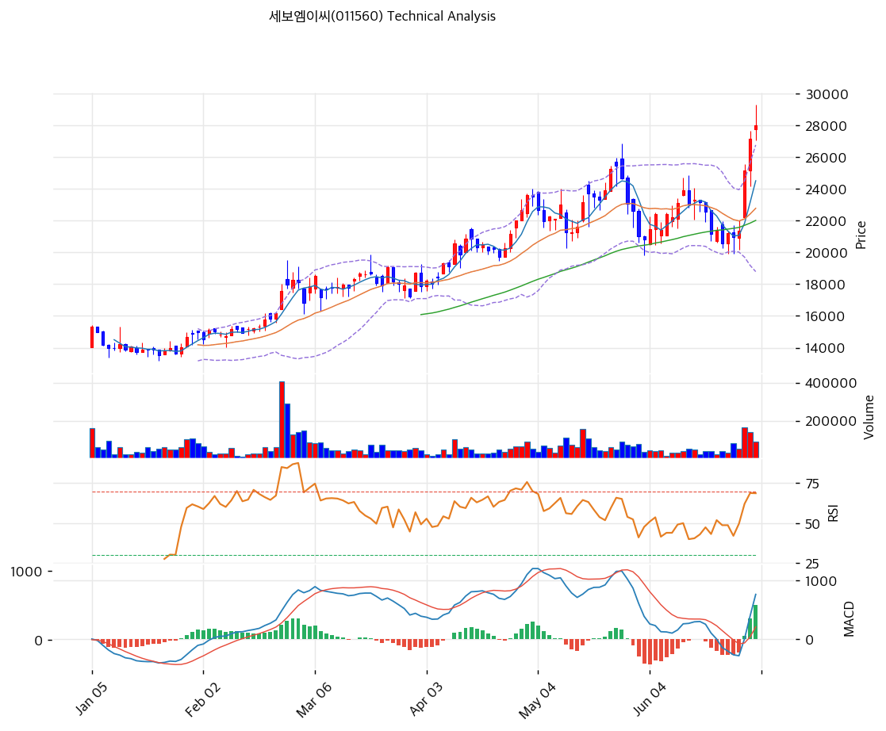

# 기술적분석

2026-07-01 | T2 Technical Analysis

***

## 차트

***

## 1. 가격 현황

| 항목        | 값                |
| --------- | ---------------- |
| 현재가       | 28,000원 (+3.13%) |
| 52주 고가    | 28,000원          |
| 52주 저가    | 11,760원          |
| 52주 범위 위치 | 100.0% (신고가)     |
| 거래량       | 20일 평균 대비 1.79x  |

***

## 2. 차트 패턴 분석

### 2.1 캔들스틱 패턴

| 패턴      | 위치       | 신뢰도 | 해석                                        |
| ------- | -------- | --- | ----------------------------------------- |
| 장대양봉 갭업 | 최근 1\~2일 | 강   | 대량거래(1.79x) 동반 신고가 돌파 — 반도체 fab 재개 모멘텀 반영 |

※ 6월 중순 22,000\~23,000원 박스권 이후 최근 급등하며 52주 신고가 경신.

### 2.2 가격 구조 패턴

* **연중 상승 채널** (신뢰도: 강) 1월 \~13,000원에서 시작해 2\~5월 계단식 상승(13,000→22,000→26,000원), 6월 조정 후 재차 신고가. 상승 추세선이 견고하게 유지되는 구조.
* **박스권 상단 돌파** (신뢰도: 중) 5\~6월 20,000\~26,000원 박스권을 거래량 동반 상향 돌파. 돌파 초기 국면으로 추가 상승 여력과 되돌림 리스크가 공존.

### 2.3 다이버전스

* **RSI 과매수 진입, 다이버전스 없음** (신뢰도: 중) 가격 신고가와 RSI 동반 상승(70.6)으로 다이버전스는 없으나 과매수 영역 진입 — 단기 속도조절 가능성.

### 2.4 패턴 종합 판단

연중 상승 채널 + 최근 박스권 상단 돌파가 결합된 강세 국면이나, RSI 70.6·스토캐스틱 90.9로 **단기 과매수가 뚜렷**하다. 신고가 경신 자체는 긍정적이나 추격 매수보다 되돌림 후 진입이 유리한 시점.

***

## 3. 이동평균선 — 정배열 (강세)

| MA    | 값       | 현재가 괴리율 | 위치 |
| ----- | ------- | ------- | -- |
| MA5   | 24,520원 | +14.2%  | 아래 |
| MA20  | 22,785원 | +22.9%  | 아래 |
| MA60  | 22,021원 | +27.2%  | 아래 |
| MA120 | 19,054원 | +47.0%  | 아래 |
| MA200 | 16,985원 | +64.9%  | 아래 |

**해석**: 완전 정배열로 강한 상승 추세. 단 MA20 괴리율 +22.9%로 **과열 경고(20% 초과)** 구간 — 단기 조정 시 MA5(24,520원)·MA20(22,785원)이 1차·2차 지지선.

***

## 4. 보조 지표

### RSI(14) — 70.6 (🔴과매수)

과매수(70) 진입. 신고가 경신과 함께 매수세가 강하나, 추가 상승 시 속도 조절 가능성 유의.

### MACD(12,26,9)

| 항목        | 값            |
| --------- | ------------ |
| MACD      | 765          |
| Signal    | 187          |
| Histogram | +579         |
| 크로스 상태    | 매수 구간 (확대 중) |

**해석**: 매수 크로스 이후 히스토그램 확대 중으로 상승 모멘텀 유효.

### 볼린저밴드(20, 2σ)

| 항목        | 값             |
| --------- | ------------- |
| 상단        | 26,777원       |
| 중단 (MA20) | 22,785원       |
| 하단        | 18,793원       |
| 밴드 폭      | 35.0%         |
| 현재 위치     | 상단 근접 (상단 돌파) |

**해석**: 주가가 볼린저 상단(26,777원)을 이미 상회 — 단기 과열 신호. 밴드 폭도 확대돼 변동성 커진 국면.

### 스토캐스틱(14, 3, 3)

| 항목      | 값     |
| ------- | ----- |
| Slow %K | 90.9  |
| Slow %D | 70.2  |
| 크로스 상태  | 골든크로스 |
| 판단      | 과매수   |

***

## 5. 지지/저항 — 추세선 · 피보나치 · PRZ 통합

### 5.1 피보나치 되돌림/확장

| 구분         | 비율    | 가격      | 현재가 대비 |
| ---------- | ----- | ------- | ------ |
| Swing High | —     | 29,300원 | +4.6%  |
| 되돌림        | 0.236 | 25,123원 | -10.3% |
| 되돌림        | 0.382 | 22,539원 | -19.5% |
| 되돌림        | 0.5   | 20,450원 | -27.0% |
| Swing Low  | —     | 11,600원 | -58.6% |
| 확장         | 1.272 | 34,114원 | +21.8% |
| 확장         | 1.382 | 36,061원 | +28.8% |

※ 피보나치 기준: 상승 추세 (Swing Low 11,600원 → Swing High 29,300원)

### 5.2 추세선

| 추세선 | 방향 | 현재 교차가  | 포인트 수 | 해석                         |
| --- | -- | ------- | ----- | -------------------------- |
| 지지선 | 상승 | 19,149원 | 6개    | 연초 이후 상승 채널 하단             |
| 저항선 | 상승 | 26,981원 | 6개    | 현재가가 이미 이 저항선 상회 — 돌파 진행 중 |

### 5.3 PRZ (Potential Reversal Zone)

| 방향 | 가격 범위           | 신뢰도 | 근거                           |
| -- | --------------- | --- | ---------------------------- |
| 지지 | 26,933\~26,981원 | 약   | 피봇 S1 + 추세선 저항               |
| 지지 | 22,021\~22,785원 | 중   | MA60 + MA20 + 피보나치 0.382 되돌림 |

### 5.4 종합 지지/저항 테이블

| 구분      | 가격          | 근거            |
| ------- | ----------- | ------------- |
| 저항      | 34,114원     | 피보나치 1.272 확장 |
| 저항      | 29,183원     | 피봇 R1         |
| **현재가** | **28,000원** | 52주 신고가       |
| 지지      | 26,933원     | 피봇 S1 (PRZ 약) |
| 지지      | 25,867원     | 피봇 S2         |
| 지지      | 22,785원     | MA20 (PRZ 중)  |
| 지지      | 22,021원     | MA60          |

***

## 6. 시그널 종합

| 지표        | 내용                          | 시그널 |
| --------- | --------------------------- | --- |
| **차트 패턴** | 연중 상승채널 + 박스권 상단 돌파, 과매수 병행 | 🟢  |
| 이동평균선     | 정배열, MA20 +22.9% (과열)       | 🔴  |
| RSI       | 70.6 — 과매수                  | 🔴  |
| MACD      | 매수구간, 히스토그램 확대              | 🟢  |
| 볼린저밴드     | 상단 밀착·돌파, 밴드 폭 35.0%        | ⚪   |
| 스토캐스틱     | 골든크로스, K=90.9 (과매수)         | 🔴  |
| 거래량       | 1.79x                       | ⚪   |

**종합 판단**: 🟢 매수 2개 / 🔴 매도 3개 / ⚪ 중립 2개 → **매도우위**

52주 신고가를 대량거래로 돌파하며 추세는 명확한 강세이나, RSI·스토캐스틱·MA20 괴리 모두 과매수·과열 영역에 진입해 **단기 되돌림 가능성이 높다.** 반도체 fab 재개 테마가 펀더멘털을 뒷받침하지만(T1·T3 참조), 기술적으로는 추격보다 26,000\~27,000원대 되돌림을 기다리는 편이 유리하다.

***

## 7. 전략 제안

### 보유 중인 경우

* **비중축소**
* 익절 라인: 28,560원 (직전 고점 부근)
* 손절 라인: 25,867원 (피봇 S2 이탈 시)
* 리스크/리워드: 과매수 해소 국면까지 일부 이익실현 권고

### 진입 대기인 경우

* **관망**
* 1차 진입가: 26,933원 (피봇 S1 되돌림)
* 2차 진입가: 22,785원 (MA20 눌림목)
* 진입 조건: RSI 과매수 해소 + 거래량 동반 재상승 확인 시 분할 진입
