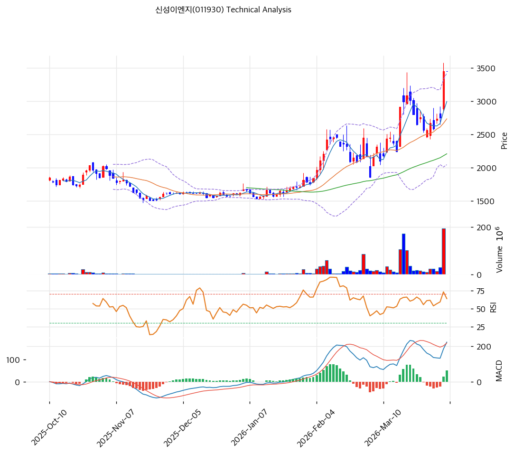

# 신성이엔지(011930) 기술적 분석

2026-04-06 | T2 Technical Analysis

---

## 차트

---

## 1. 가격 현황

| 항목 | 값 |
|------|-----|
| 현재가 | 3,445원 (+0.00%) |
| 52주 고가 | 3,445원 |
| 52주 저가 | 1,097원 |
| 52주 범위 위치 | 100.0% |
| 거래량 | 20일 평균 대비 0.00x |

---

## 2. 차트 패턴 분석

### 2.1 캔들스틱 패턴

| 패턴 | 위치 | 신뢰도 | 해석 |
|------|------|--------|------|
| 장대양봉 돌파 | 최근 5거래일 | 강 | 중장기 박스 상단을 강하게 돌파한 추세 강화 시그널 |
| 단기 윗꼬리 | 최근 1~2거래일 | 중 | 52주 신고가 부근 차익실현 압력이 일부 존재 |

### 2.2 가격 구조 패턴

- **박스권 돌파** (신뢰도: 강)
  약 2,200~2,800원대 박스권을 상향 돌파하며 신고가를 경신했습니다. 추세 전환 후 가속 구간으로 볼 수 있으며, 돌파 가격대가 향후 주요 지지선이 됩니다.

- **상승 추세 채널** (신뢰도: 중)
  MA20·MA60이 우상향하고 정배열이 형성되어 있습니다. 다만 현재 가격이 MA20 대비 26.1% 높아 단기 눌림 가능성은 열려 있습니다.

### 2.3 다이버전스

- **RSI 다이버전스 미형성** (신뢰도: 중)
  가격 신고가 갱신 과정에서 RSI가 69.6으로 아직 과매수 극단은 아니며, 뚜렷한 하락 다이버전스는 보이지 않습니다.

- **MACD 추세 지속 시그널** (신뢰도: 중)
  MACD 매수구간이 유지되고 히스토그램도 확대 중이라, 단기적으로는 상승 추세 지속 가능성을 시사합니다.

### 2.4 패턴 종합 판단

차트는 전형적인 **박스권 돌파 후 신고가 안착 시도** 구간입니다. 다이버전스 부재와 정배열은 긍정적이지만, 현재가가 MA20에서 크게 이격돼 있어 단기 추격 매수는 부담이 있습니다.

---

## 3. 이동평균선 — 정배열 (강세)

| MA | 값 | 현재가 괴리율 | 위치 |
|----|-----|--------------|------|
| MA5 | 2,992원 | +15.1% | 위 |
| MA20 | 2,731원 | +26.1% | 위 |
| MA60 | 2,206원 | +56.2% | 위 |
| MA120 | 1,951원 | +76.6% | 위 |
| MA200 | 1,809원 | +90.5% | 위 |

**해석**: 완전 정배열입니다. 중기 추세는 매우 강하지만, MA20 대비 26.1% 이격은 단기 과열 신호로도 해석됩니다.

---

## 4. 보조 지표

### RSI(14) — 69.6 (중립)

과매수 직전 수준으로 올라와 있습니다. 강한 추세 종목에서는 상승 지속도 가능하지만, 70 돌파 시 단기 부담이 커질 수 있습니다.

### MACD(12,26,9)

| 항목 | 값 |
|------|-----|
| MACD | 224.0 |
| Signal | 174.0 |
| Histogram | +50.0 |
| 크로스 상태 | 매수 구간 (확대 중) |

**해석**: MACD는 추세 강화 국면입니다. 단기 조정이 오더라도 추세 훼손 전까지는 긍정적으로 볼 수 있습니다.

### 볼린저밴드(20, 2σ)

| 항목 | 값 |
|------|-----|
| 상단 | 3,421원 |
| 중단 (MA20) | 2,731원 |
| 하단 | 2,042원 |
| 밴드 폭 | 50.5% |
| 현재 위치 | 상단근접 |

**해석**: 상단을 상회한 상태로, 추세가 강하다는 뜻이지만 동시에 단기 과열도 의미합니다.

### 스토캐스틱(14, 3, 3)

| 항목 | 값 |
|------|-----|
| Slow %K | 73.9 |
| Slow %D | 56.9 |
| 크로스 상태 | 골든크로스 |
| 판단 | 중립 |

---

## 5. 지지/저항

| 구분 | 가격 | 근거 |
|------|------|------|
| 저항 | 3,445원 | 52주 고가 |
| 저항 | 3,575원 | 상한/심리 저항대 |
| **현재가** | **3,445원** | — |
| 지지 | 3,445원 | 단기 돌파 가격대 |
| 지지 | 2,731원 | MA20 |
| 지지 | 2,206원 | MA60 |

---

## 6. 시그널 종합

| 지표 | 내용 | 시그널 |
|------|------|--------|
| **차트 패턴** | 박스권 돌파 + 신고가 경신, 다이버전스 부재 | 🟢 |
| 이동평균선 | 정배열, 다만 MA20 +26.1% 과열 | ⚪ |
| RSI | 69.6 — 과열 직전 | ⚪ |
| MACD | 매수구간 확대 | 🟢 |
| 볼린저밴드 | 상단 근접, 추세 강하나 과열 | ⚪ |
| 스토캐스틱 | 골든크로스, K=73.9 | ⚪ |
| 거래량 | 0.0x — 약함 | 🔴 |

**종합 판단**: 🟢 매수 2개 / 🔴 매도 1개 / ⚪ 중립 4개 → **매수우위**

중기 추세는 분명히 좋습니다. 다만 이미 신고가 구간이며 단기 이격이 큰 편이라, 보유자는 홀드 가능하지만 신규 진입자는 눌림을 기다리는 편이 유리합니다.

---

## 7. 전략 제안

### 보유 중인 경우
- **홀드**
- 익절 라인: 3,575원 (신고가 돌파 후 심리 저항)
- 손절 라인: 3,445원 (돌파 실패 시)
- 리스크/리워드: 보수적 1:1 이상

### 진입 대기인 경우
- **관망**
- 1차 진입가: 3,445원 (돌파 안착 재확인)
- 2차 진입가: 2,731원 (MA20 눌림)
- 진입 조건: 신고가 안착 또는 MA20 부근 조정 후 반등 확인
