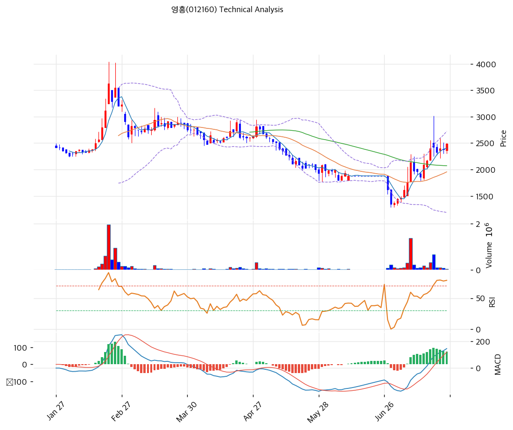

# 영흥(012160) 기술적 분석

2026-07-25 | T2 Technical Analysis

---

## 차트

---

## 1. 가격 현황

| 항목 | 값 |
|------|-----|
| 현재가 | 2,490원 (+4.62%) |
| 52주 고가 | 3,625원 |
| 52주 저가 | 1,350원 |
| 52주 범위 위치 | 50.1% |
| 거래량 | 20일 평균 대비 0.17x — 매우 약함 |

---

## 2. 차트 패턴 분석

### 2.1 캔들스틱 패턴

| 패턴 | 위치 | 신뢰도 | 해석 |
|------|------|--------|------|
| 소폭 양봉 (거래량 0.17x) | 금일 | 약 | +4.6% 상승이나 거래가 실종된 상태 — 매수 강도 확인 불가 |
| V자 반등 후 고점 눌림 | 6월 말\~7월 | 중 | 1,350원 → 2,890원 급반등 후 2,400원대 횡보 — 급등분 일부 소화 |

### 2.2 가격 구조 패턴

- **V자 급반등 후 고원 형성** (신뢰도: 중)
  6월 말 저점 1,350원에서 7월 중순 2,890원까지 2주 만에 +114% 급등 후, 2,400\~2,500원대에서 3주째 횡보 중. 급등의 절반을 지킨 채 매물을 소화하는 그림이나, 거래량이 마르며 방향성이 정체됐다.

- **MA200(2,499원) 정면 대치** (신뢰도: 강)
  현재가 2,490원은 MA200과 사실상 동일선 — 1년 평균 매입단가에 걸려 있다. 이 선의 돌파·안착 여부가 반등이 추세로 승격되는지를 가르는 단일 기준선이다.

- **하락 추세선 저항 3,071원** (신뢰도: 중)
  2월 고점(3,625원)부터 이어진 하락 추세선 — MA200을 넘어도 3,000원대에서 한 번 더 검증받아야 하는 구조.

### 2.3 다이버전스

- **MACD 상승 다이버전스 (완성 후 진행)** (신뢰도: 중)
  5\~6월 가격 저점 하락 구간에서 MACD 저점이 높아졌고, 7월 골든크로스 후 매수 구간(146/71) 유지 — 다만 히스토그램이 확대에서 정체로 전환(+74, 축소 조짐)돼 모멘텀은 둔화 중.

- **RSI 66.9 — 과매수 직전에서 정체** (신뢰도: —)
  급반등으로 RSI가 중립 상단까지 왔으나 70을 넘지 못하고 횡보 — 추가 상승 동력의 부재를 반영.

### 2.4 패턴 종합 판단

6월 바닥에서 V자 반등한 뒤 MA200(2,499원)이라는 1년 평균선에 정확히 막혀 3주째 정체 중이다. 문제는 거래량 — 20일 평균의 0.17배로 매수·매도 모두 실종된 상태라, 현재 가격은 '합의'가 아니라 '방치'에 가깝다. **거래량 회복 없이는 MA200 돌파도, 하락 재개도 신뢰하기 어려운 관망 구간**이며, 펀더멘털 이벤트(8월 반기 실적)가 방향의 방아쇠가 될 가능성이 높다.

---

## 3. 이동평균선 — 비정배열 (반등 후 중간지대)

| MA | 값 | 현재가 괴리율 | 위치 |
|----|-----|--------------|------|
| MA5 | 2,404원 | +3.6% | 위 |
| MA20 | 1,955원 | +27.4% | 위 |
| MA60 | 2,072원 | +20.2% | 위 |
| MA120 | 2,390원 | +4.2% | 위 |
| MA200 | 2,499원 | **-0.4%** | 아래 (대치) |

**해석**: MA200만 남기고 4개 이평을 위로 뚫은 상태 — 급반등의 결과다. MA20 괴리 +27.4%는 과열 신호이나, 이는 급락 후 급등으로 MA20 자체가 아래(1,955원)에 머물러 있어 생긴 착시에 가깝다. 실질 관문은 MA200(2,499원) — 여기를 종가로 넘어서면 MA120(2,390원)이 지지로 전환되며 중기 반등 국면이 열린다.

---

## 4. 보조 지표

### RSI(14) — 66.9 (중립 상단)

과매수 직전에서 3주째 횡보 — 상승 동력 소진과 하락 압력 부재가 균형을 이룬 상태.

### MACD(12,26,9)

| 항목 | 값 |
|------|-----|
| MACD | 146.0 |
| Signal | 71.0 |
| Histogram | +74.0 |
| 크로스 상태 | 매수 구간 (히스토그램 축소 조짐) |

**해석**: 7월 골든크로스 후 매수 구간을 유지 중이나 히스토그램 확대가 멈췄다 — 반등 모멘텀의 1차 소진 신호로, 데드크로스 전환 여부가 다음 관찰점.

### 볼린저밴드(20, 2σ)

| 항목 | 값 |
|------|-----|
| 상단 | 2,724원 |
| 중단 (MA20) | 1,955원 |
| 하단 | 1,187원 |
| 밴드 폭 | **78.6%** |
| 현재 위치 | 중간~상단 |

**해석**: 밴드 폭 78.6%는 극단적 변동성의 흔적(6월 급락+7월 급등) — 통상 이런 확장 후에는 밴드가 수축하며 가격이 중단(MA20, 1,955원) 방향으로 수렴하는 경향이 있다. 상단(2,724원)까지 여유는 있으나 밴드 자체가 좁아지는 국면임에 유의.

### 스토캐스틱(14, 3, 3)

| 항목 | 값 |
|------|-----|
| Slow %K | 63.3 |
| Slow %D | 62.6 |
| 크로스 상태 | 골든크로스 |
| 판단 | 중립 |

---

## 5. 지지/저항 — 추세선 · 피보나치 · PRZ 통합

### 5.1 피보나치 되돌림/확장

| 구분 | 비율 | 가격 | 현재가 대비 |
|------|------|------|-----------|
| Swing High | — | 2,890원 | +16.1% |
| 되돌림 | 0.786 | 2,560원 | +2.8% |
| 되돌림 | 0.618 | 2,302원 | -7.5% |
| 되돌림 | 0.5 | 2,120원 | -14.9% |
| 되돌림 | 0.382 | 1,938원 | -22.2% |
| 되돌림 | 0.236 | 1,713원 | -31.2% |
| Swing Low | — | 1,350원 | -45.8% |

※ 피보나치 기준: 직전 급락 스윙(2,890→1,350원)의 되돌림 — 현재가는 0.786(2,560원) 직전까지 되돌린 상태

### 5.2 추세선

| 추세선 | 방향 | 현재 교차가 | 포인트 수 | 해석 |
|--------|------|-----------|---------|------|
| 지지선 | 하락 | 1,521원 | 6개 | 저점 연결선 — 6월 저점권의 구조적 방어선 |
| 저항선 | 하락 | 3,071원 | 6개 | 2월 고점발 — 중기 추세 전환의 최종 관문 |

### 5.3 PRZ (Potential Reversal Zone)

| 방향 | 가격 범위 | 신뢰도 | 근거 |
|------|---------|--------|------|
| 저항 | 2,560원 | 약 | 피보나치 0.786 + 피봇 R1 — MA200 위 1차 저항 |
| 지지 | 2,360\~2,404원 | **중** | 피봇 S1 + MA120 + MA5 — 현재가 바로 아래 |
| 지지 | 2,072\~2,120원 | 약 | MA60 + 피보나치 0.5 |
| 지지 | 1,938\~1,955원 | 약 | 피보나치 0.382 + MA20 |

※ PRZ = 추세선 · 피보나치 · 피봇 · MA 등 복수 지표가 겹치는 가격 구간

### 5.4 종합 지지/저항 테이블

| 구분 | 가격 | 근거 |
|------|------|------|
| 저항 | 3,625원 | 52주 고가 |
| 저항 | 3,071원 | 하락 추세선 |
| 저항 | 2,890원 | 7월 스윙 고점 |
| 저항 | 2,560원 | PRZ(약) — 피보나치 0.786 + 피봇 R1 |
| 저항 | **2,499원** | **MA200 — 현재 대치 중인 분기점** |
| **현재가** | **2,490원** | — |
| 지지 | 2,360\~2,404원 | PRZ(중) — 피봇 S1 + MA120 + MA5 |
| 지지 | 2,230원 | 피봇 S2 |
| 지지 | 2,072\~2,120원 | PRZ(약) — MA60 + 피보나치 0.5 |
| 지지 | 1,938\~1,955원 | PRZ(약) — MA20 + 피보나치 0.382 |

---

## 6. 시그널 종합

| 지표 | 내용 | 시그널 |
|------|------|--------|
| **차트 패턴** | V자 반등 후 MA200 대치·거래량 실종 | ⚪ |
| 이동평균선 | 비정배열, MA20 +27.4% (급락 후 착시) | 🟢 (반등) / 🔴 (괴리) |
| RSI | 66.9 — 중립 상단 정체 | ⚪ |
| MACD | 매수 구간, 히스토그램 축소 조짐 | ⚪ |
| 볼린저밴드 | 중간, 폭 78.6% (수축 국면 진입) | ⚪ |
| 스토캐스틱 | 골든크로스, K=63.3 | ⚪ |
| 거래량 | 0.17x — 매우 약함 | ⚪ |

**종합 판단**: 🟢 매수 0개 / 🔴 매도 1개 / ⚪ 중립 6개 → **중립 (MA200 대치 — 방향 대기)**

지표가 온통 중립인 것은 우연이 아니다 — 급락 후 급반등이 만든 왜곡(MA20 괴리)과 거래 실종(0.17x)이 겹쳐 기술적 신호가 힘을 잃은 구간이다. 판단은 단순화된다: **MA200(2,499원) 위에서 거래량과 함께 안착하면 2,560 → 2,890원의 반등 연장, 2,360원(PRZ 중) 아래로 밀리면 2,100원대 재조정.** 어느 쪽이든 8월 반기 실적(영업적자 5분기 연속의 종료 여부)이 방아쇠가 될 공산이 크다.

---

## 7. 전략 제안

### 보유 중인 경우
- **홀드 (MA200 돌파 확인까지)**
- 익절 라인: 2,890원 (7월 스윙 고점 — 실패 시 분할 익절), 돌파 시 3,071원(추세선)
- 손절 라인: 2,350원 (PRZ 중 지지 이탈 = 반등 되돌림 개시)
- 리스크/리워드: 약 2.9 (+400 / -140) — 손절선이 가까워 손익비는 우호적

### 진입 대기인 경우
- **관망 (거래량 회복 전 진입 자제)**
- 1차 진입가: 2,499원 이상 종가 안착 + 거래량 20일 평균 회복 시 (추세 확인형 진입)
- 2차 진입가: 2,072\~2,120원 (MA60 + 피보나치 0.5 되돌림 — 조정 시 매수)
- 진입 조건: 이 종목은 4년 연속 순손실·5분기 연속 영업적자 상태 — 기술적 반등만으로 진입하지 말고 **8월 반기 실적의 영업이익 방향을 확인한 뒤 비중을 정할 것.** 일 거래대금이 매우 얇아 포지션 규모 자체를 제한해야 한다
