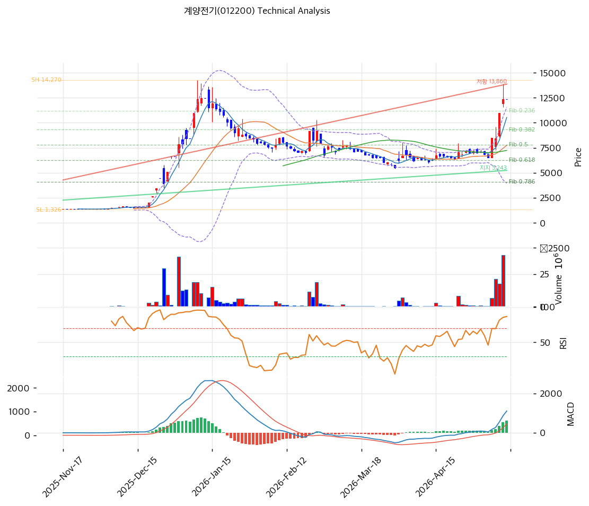

# 기술적분석

2026-05-14 | T2 Technical Analysis

***

## 차트

***

## 1. 가격 현황

| 항목        | 값                |
| --------- | ---------------- |
| 현재가       | 12,380원 (0.0%)   |
| 52주 고가    | 12,440원          |
| 52주 저가    | 1,370원 (9.0배 상승) |
| 52주 범위 위치 | 99.5%            |

***

## 2. 차트 패턴 분석

* **장기 박스 극단 폭증**: 1,370 → 12,440 +807% 6개월
* **신고가 갱신** + RSI 82.7 🔴 극단 과매수
* **MA200 +177.8% 누적** 극단 과열

### 종합 판단

박스 돌파 + 극단 가속 + 신고가의 강력 모멘텀이나 **RSI 82.7 + MA20 +59.7% + MA200 +177.8% 4중 극단 과열**. 펀더멘털 (자본 침식·부채 1,060%)과 무관한 단기 모멘텀 베팅 — 단기 평균회귀 압력 매우 강함.

***

## 3. 이동평균선 — 정배열 (극단 과열)

| MA    |         괴리율 |
| ----- | ----------: |
| MA5   |      +17.5% |
| MA20  |  **+59.7%** |
| MA60  |      +71.0% |
| MA120 |      +91.4% |
| MA200 | **+177.8%** |

**평균회귀 1차 MA5 (-15%), 2차 MA20 (-37%), 3차 MA60 (-42%)**.

***

## 4. 보조 지표

* **RSI 82.7** 🔴 극단 과매수
* MA200 +177.8% 누적 극단

***

## 5. 지지/저항

| 구분      |         가격 | 근거           |
| ------- | ---------: | ------------ |
| **현재가** | **12,380** | 52주 신고가 직전   |
| 지지      |     10,536 | MA5          |
| 지지      |      7,752 | MA20 (1차 매수) |
| 지지      |      7,242 | MA60         |

***

## 6. 시그널 종합

**🟢 매수 2 / 🔴 매도 3 / ⚪ 중립 2 → 매도우위 (4중 극단 과열)**

펀더멘털 위기 (5년 적자·부채 1,060%) + 극단 과열의 양면 리스크.

***

## 7. 전략 제안

### 보유 중인 경우

* **비중축소 강력 권장**
* 익절: 12,689원
* 손절: 12,380 직하

### 진입 대기인 경우

* **신규 진입 매우 신중** (펀더멘털 위기)
* 1차 진입: 12,380원 직하
* 2차 진입: 7,752원 (MA20, -37.4%)
* 펀더멘털 트리거 (자본 회복·흑전·해성그룹 자금) 확인 후만 권장
