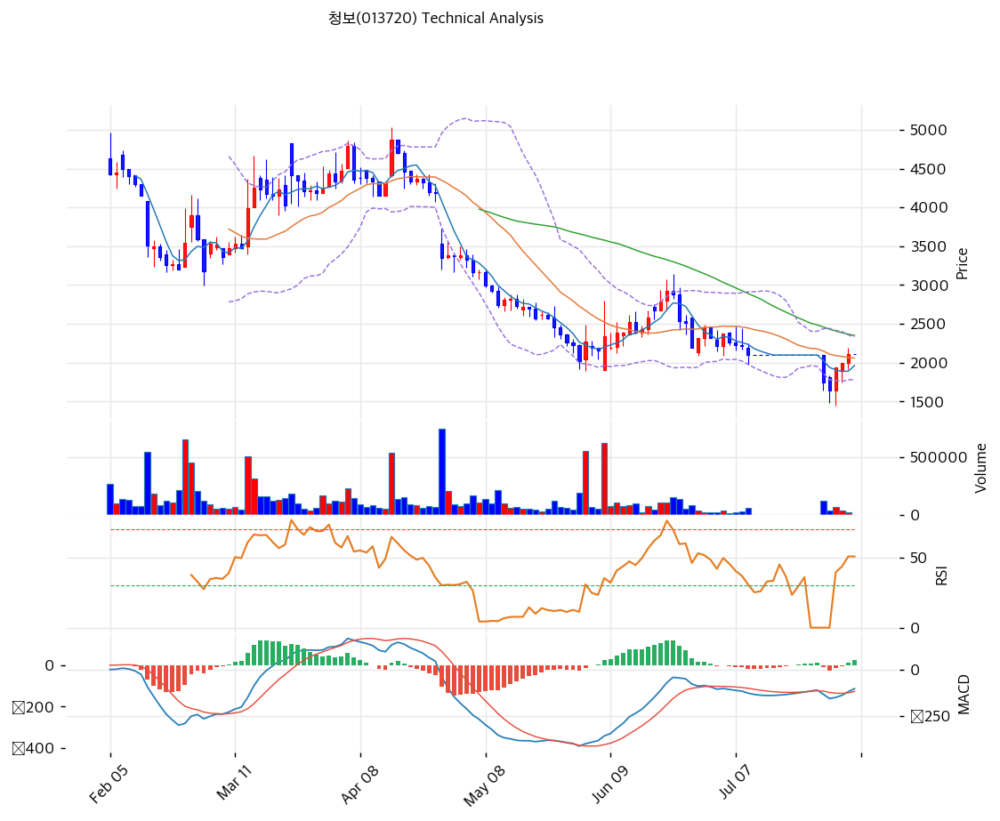

# 청보(013720) 기술적 분석

2026-08-04 | T2 Technical Analysis

---

## 차트

---

## 1. 가격 현황

| 항목 | 값 |
|------|-----|
| 현재가 | **2,115원** (2026-08-03 종가) |
| 52주 고가 | 5,934원 (2025-08-05, 종가 6,090원) |
| 52주 저가 | **1,648원** (2026-07-29) |
| 52주 범위 위치 | **10.9%** |
| 1년 수익률 | **-65.3%** (6,090원 → 2,115원) |
| 최근 4거래일 평균 거래량 | 66,190주 |
| **최근 4거래일 평균 거래대금** | **약 1.2억원** |
| 감자 직전 종가 (2026-07-09) | 2,155원 |
| 재개 후 저점 (2026-07-29) | 1,648원 |
| **저점 대비 반등** | **+28.3%** (3거래일) |

> 🚨 **이 종목의 주가 데이터에는 세 가지 함정이 있다 — 반드시 먼저 읽을 것**
>
> **① 5:1 무상감자 (2026년 7월).** 60,828,143주 → 12,165,628주. yfinance 일봉은 감자 전 구간을 소급 조정(×5)해 표시하므로, 위 표의 52주 고가 5,934원과 현재가 2,115원은 **동일 기준으로 비교 가능**하다. 다만 2025년 8월 실제 거래가는 표시값의 5분의 1(약 1,218원)이었다.
>
> **② 거래정지 구간 (2026-07-10 ~ 07-27, 12거래일).** 감자에 따른 매매거래정지 기간 동안 일봉이 **직전 종가 2,155원으로 평탄하게 채워졌다.** 이 12개의 가짜 데이터가 MA20·볼린저밴드·RSI를 심하게 왜곡한다. MA20(2,061원)은 실제 시장가가 아니라 절반 이상이 정지 기간 상수로 계산된 값이다.
>
> **③ KIS 당일 데이터 부재.** 수집 시각(2026-08-04 08:19)이 장 시작 전이라 KIS가 **당일 고가·저가·거래량을 모두 0으로 반환**했다. 그 결과 피봇 포인트가 P=R1=R2=S1=S2=**2,115원**으로 전부 같은 값이 나왔고, 거래량 배수는 0.0x로 표시됐다. **피봇과 거래량 지표는 전량 폐기한다.**

---

## 2. 차트 패턴 분석

### 2.1 캔들스틱 패턴 — 감자 재개 후 4거래일

| 일자 | 시가 | 고가 | 저가 | 종가 | 거래량 | 해석 |
|------|-----:|-----:|-----:|-----:|------:|------|
| 07-09 | 2,250 | 2,305 | 2,030 | **2,155** | 53,407 | 거래정지 직전 마지막 거래일 |
| 07-10\~27 | — | — | — | 2,155 | **0** | **거래정지 (12거래일)** |
| **07-28** | 2,100 | 2,100 | **1,644** | **1,750** | **123,044** | **재개 첫날 -18.8%. 고가=시가, 긴 아래꼬리** |
| 07-29 | 1,820 | 1,833 | **1,482** | **1,648** | 36,402 | **52주 최저 종가.** 갭업 후 재차 하락 |
| **07-30** | 1,648 | **1,944** | **1,450** | **1,944** | 66,972 | **장중 신저가 1,450 → 고가 마감. 반전 캔들** |
| 07-31 | 1,900 | 2,000 | 1,749 | 1,999 | 38,344 | 양봉 지속 |
| 08-03 | — | — | — | **2,115** | — | **+5.8%. 감자 직전가 2,155원의 98.1% 회복** |

| 패턴 | 위치 | 신뢰도 | 해석 |
|------|------|--------|------|
| **하락 마루보즈(상단)** | 2026-07-28 | 강 | 시가 2,100 = 고가 2,100. 재개 시초부터 단 한 번도 시가를 넘지 못하고 1,750원 마감. 거래량 123,044주는 최근 3개월 최대치로, **감자 후 대규모 손바뀜**이 일어났다 |
| **상승 마루보즈(상단) — 반전 캔들** | **2026-07-30** | **강** | 시가 1,648 → 장중 1,450(신저가)까지 밀렸다가 **고가 1,944원에 종가 마감**. 아래꼬리 198원 + 실체 296원의 전형적 반전형이며 거래량 66,972주를 동반했다. **이 봉이 바닥을 만들었다** |
| 적삼병 (3연속 양봉) | 07-30\~08-03 | 중 | 1,648 → 1,944 → 1,999 → 2,115. **3거래일 +28.3%** |
| 갭업 후 음봉 | 2026-07-29 | 중 | 시가 1,820으로 갭업했으나 1,648원 마감. 첫 반등 시도 실패 |

**핵심 관찰**: 감자 재개 후 2거래일간 기준가(2,155원) 대비 **-23.5%까지 밀렸다가**, 7월 30일 장중 1,450원을 찍고 반전해 4거래일 만에 **2,115원(기준가의 98.1%)을 회복**했다. 무상감자 자체는 기업가치를 바꾸지 않는데도 초기 급락이 나왔고, 그것이 빠르게 되돌려진 전형적인 **감자 이벤트 오버슈팅**이다.

### 2.2 가격 구조 패턴

- **1년 하락 추세 — 훼손되지 않았다** (신뢰도: 강)
  2025년 8월 5일 6,090원(감자 조정 기준)에서 2026년 7월 29일 1,648원까지 **-72.9%** 하락했다. 중간 경로는 3,925원(2025-11) → 3,265원(2026-01) → 3,415원(2026-05) → 2,075원(2026-06)으로, 반등 시도가 매번 직전 고점을 넘지 못한 **하락 채널**이다. 현재 2,115원은 MA60(2,351원)·MA120(3,164원)·MA200(3,480원) **전부 아래**에 있다.

- **감자 이벤트 저점 형성 가능성** (신뢰도: 중)
  7월 30일 장중 1,450원이 52주 장중 최저이며, 그날 종가가 고가로 마감했다. 이후 3거래일 연속 상승으로 감자 직전 수준(2,155원)을 거의 회복했다. **단기 저점으로서의 요건은 갖췄으나**, 거래대금 1.2억원의 얇은 시장에서 만들어진 것이라 신뢰도가 낮다.

- **⚠️ 추세선 산출값은 사용 불가** (신뢰도: —)
  알고리즘이 산출한 지지 추세선은 현재 **1,371원**(현재가 대비 -35.2%), 저항 추세선은 **3,574원**(+69.0%)이다. 둘 다 현재가에서 너무 멀어 실용성이 없다. 1년간 -65% 하락한 종목에서 하락 추세선을 그으면 나오는 당연한 결과이며, **거래정지 12일치 상수 데이터가 기울기 계산에 섞여 있어** 신뢰할 수 없다.

### 2.3 다이버전스

- **RSI 상승(불리시) 다이버전스** (신뢰도: 중)
  가격은 2026년 6월 1일 2,075원 → 7월 29일 **1,648원(-20.6%)**으로 저점을 낮췄으나, RSI는 같은 기간 저점이 얕아졌다. 7월 29일 RSI 22.0에서 8월 3일 48.7로 **26.7포인트 급반등**한 것이 이를 뒷받침한다. **하락 모멘텀이 소진되는 국면**을 시사한다.

- **MACD 히스토그램 전환** (신뢰도: 중)
  히스토그램이 7월 29일 **-31**에서 7월 30일 -21 → 7월 31일 -10 → 8월 3일 **+24**로 4거래일 만에 부호가 바뀌었다. MACD 본선(-103)은 여전히 0선 아래이나 시그널선(-127)을 상향 돌파해 **매수 구간에 진입**했다.

- **⚠️ 다만 두 신호 모두 거래정지 데이터에 오염돼 있다**
  7월 10\~27일 12거래일이 2,155원 상수로 채워지면서 RSI가 38.5로 고정됐고, MACD는 인위적으로 수렴했다. **재개 후 실제 거래일은 4일뿐**이므로 지표의 통계적 신뢰도는 매우 낮다. 최소 15\~20거래일이 더 쌓여야 유효한 판단이 가능하다.

### 2.4 패턴 종합 판단

**단기 반등은 실재하나 추세 전환의 근거는 아니다.**

7월 30일 반전 캔들과 3거래일 +28.3% 상승은 명확한 사실이다. 감자 재개 초기 오버슈팅(-23.5%)이 되돌려지면서 감자 직전 수준(2,155원)을 거의 회복했다. RSI 다이버전스와 MACD 골든크로스도 같은 방향을 가리킨다.

**그러나 세 가지가 이를 추세 전환으로 읽지 못하게 한다.**

**첫째, 1년 하락 추세가 전혀 훼손되지 않았다.** 현재가는 MA60·MA120·MA200 아래에 있고, MA200(3,480원) 대비 **-39.2%**다. 하락 채널의 상단조차 3,574원으로 현재가보다 69% 위다.

**둘째, 반등 폭이 감자 직전 수준에서 멈췄다.** 2,115원은 7월 9일 종가 2,155원의 98.1%다. **감자 전 상태로 돌아왔을 뿐, 그 이상을 만들지 못했다.**

**셋째, 지표 대부분이 거래정지 데이터로 오염됐다.** MA20, 볼린저밴드, RSI, MACD 전부 12일치 상수를 포함한다. 재개 후 실거래일은 4일뿐이다.

**결론적으로 현 국면은 "감자 이벤트의 기술적 정상화"이지 "저점 확인 후 상승 전환"이 아니다.** 방향성 판단은 최소 3\~4주의 실거래 데이터가 쌓인 뒤에나 가능하다.

---

## 3. 이동평균선 — 비정배열 (약세)

| MA | 값 | 현재가 괴리율 | 위치 | 신뢰도 |
|----|-----|--------------|------|------|
| MA5 | 1,964원 | **+7.7%** | 위 | ⚠️ 정지 데이터 일부 포함 |
| MA20 | 2,061원 | **+2.6%** | 위 | 🚨 **12/20일이 정지 상수 — 무의미** |
| MA60 | 2,351원 | **-10.0%** | **아래** | 보통 |
| MA120 | 3,164원 | **-33.2%** | **아래** | 유효 |
| MA200 | 3,480원 | **-39.2%** | **아래** | 유효 |

**해석**: MA5 > MA20 > 현재가 > MA60 > MA120 > MA200의 **명백한 비정배열**이다. 장기 이평선이 위에서 아래로 순차 배열되어 있고 전부 우하향한다. **추세는 여전히 하락**이다.

**MA20(2,061원)은 사용하면 안 된다.** 20거래일 중 12일이 거래정지로 2,155원 상수 처리됐다. 실제 시장 데이터는 8일뿐이며, 그 8일도 감자 전 4일(2,290·2,270·2,155)과 감자 후 4일(1,750·1,648·1,944·1,999)로 기준이 다르다.

**실질적인 저항선은 MA60(2,351원, +11.2%)이다.** 여기를 종가로 회복해야 중기 추세 전환의 첫 조건이 성립한다. 그 위로는 MA120(3,164원)·MA200(3,480원)이 각각 +49.6%·+64.5%에 있어, **완전한 추세 전환에는 주가가 지금의 1.5\~1.6배가 되어야 한다.**

---

## 4. 보조 지표

### RSI(14) — 48.7 (중립)

7월 29일 **22.0(과매도)**에서 8월 3일 48.7로 **26.7포인트 급반등**했다. 4거래일 만의 회복 속도가 매우 빠르며, 이는 3거래일 +28.3% 상승을 반영한 것이다.

**48.7은 중립 한가운데다.** 과매도 반등이 절반쯤 진행된 상태로, 위로는 70(과매수)까지, 아래로는 30까지 여유가 있다. **방향성 정보가 없는 구간**이며, 이 종목의 경우 정지 기간 RSI가 38.5로 고정돼 있었던 탓에 기준선 자체가 왜곡돼 있다.

### MACD(12,26,9)

| 항목 | 값 |
|------|-----|
| MACD | **-103** |
| Signal | -127 |
| Histogram | **+24** |
| 크로스 상태 | **매수 구간 (확대 중)** |

**해석**: 히스토그램이 -31(7/29) → -21 → -10 → **+24**(8/3)로 4거래일 만에 부호가 전환됐다. 시그널선 상향 돌파가 확인된 **매수 신호**다.

**그러나 MACD 본선 -103은 여전히 0선 아래**다. 골든크로스가 0선 아래에서 발생한 경우 통계적으로 '하락 추세 중의 기술적 반등'일 확률이 높다. **0선(MACD 0) 돌파는 대략 주가 2,350\~2,450원 구간에서 일어나며, 그 전까지는 추세 전환으로 인정하기 어렵다.**

### 볼린저밴드(20, 2σ)

| 항목 | 값 |
|------|-----|
| 상단 | 2,336원 |
| 중단 (MA20) | 2,061원 |
| 하단 | 1,785원 |
| 밴드 폭 | **26.7%** |
| 현재 위치 | 중단 위 (+2.6%) |

**⚠️ 이 지표도 신뢰도가 낮다.** 중심선이 MA20이고 MA20의 60%가 거래정지 상수이기 때문이다. 밴드 폭 26.7%는 KOSDAQ 평균(10\~15%)의 두 배로 높은 변동성을 반영하나, 이 역시 정지 전후의 가격 단절이 표준편차를 부풀린 결과다.

**참고 수준으로만 보면** 상단 2,336원은 MA60(2,351원)과 근접해 **2,336\~2,351원 구간이 1차 저항대**를 형성한다. 하단 1,785원은 7월 28일 종가(1,750원)와 근접해 하방 참고선이 된다.

### 스토캐스틱(14, 3, 3)

| 항목 | 값 |
|------|-----|
| Slow %K | **88.1** |
| Slow %D | 77.4 |
| 크로스 상태 | 골든크로스 |
| 판단 | 🔴 **과매수** |

%K 88.1로 **과매수 기준선(80)을 크게 상회**했다. 3거래일 +28.3% 급등의 직접적 결과다.

스토캐스틱은 단기 지표라 급등 후 즉시 과매수로 진입하는 것이 정상이다. **다만 하락 추세 중의 스토캐스틱 과매수는 반등 종료 신호로 작동하는 경우가 많다.** %K가 80 아래로 데드크로스를 내면 단기 조정 진입으로 본다.

---

## 5. 지지/저항 — 재구성

### 5.1 피보나치 되돌림 — 하락 추세 기준

| 구분 | 비율 | 가격 | 현재가 대비 | 역할 |
|------|------|------|-----------|------|
| **Swing High** | — | 6,187원 | +192.5% | 2025-08 고점 |
| 되돌림 0.786 | 0.786 | 5,173원 | +144.6% | 저항 |
| 되돌림 0.618 | 0.618 | 4,377원 | +107.0% | 저항 |
| 되돌림 0.5 | 0.5 | 3,818원 | +80.5% | 저항 |
| 되돌림 0.382 | 0.382 | 3,260원 | +54.1% | 저항 |
| **되돌림 0.236** | 0.236 | **2,568원** | **+21.4%** | **가장 임박한 피보 저항** |
| **Swing Low** | — | **1,450원** | **-31.4%** | 2026-07-30 장중 저점 |

※ 하락 추세(6,187원 → 1,450원)에서 산출한 값이므로 되돌림 레벨은 전부 **저항**으로 작동한다.

> ⚠️ **확장(Extension) 레벨은 전량 폐기한다.** 알고리즘 산출값이 1.272 = **162원**, 1.382 = **-360원**, 1.618 = **-1,477원**, 2.0 = **-3,287원**으로 **음수가 나왔다.** 하락 추세 확장은 하방 목표를 뜻하는데, 이 종목은 이미 저점 근처라 산식이 마이너스 영역으로 넘어갔다. 사용할 수 없다.

**의미 있는 첫 피보 저항은 0.236 되돌림 2,568원(+21.4%)**이다. 1년 하락분의 4분의 1도 되돌리지 못한 위치이며, 그 위 0.382(3,260원)는 +54.1%로 사실상 다른 국면의 가격이다.

### 5.2 🚨 피봇 포인트 — 산출 불가

| 항목 | 파이프라인 산출값 |
|------|------:|
| Pivot | 2,115원 |
| R1 / R2 | 2,115원 / 2,115원 |
| S1 / S2 | 2,115원 / 2,115원 |

**다섯 개 값이 전부 동일하다.** KIS가 당일(2026-08-04) 고가·저가를 0으로 반환해 P=(H+L+C)/3에서 H=L=C=2,115가 됐기 때문이다. **PRZ 목록에도 "PRZ(강) — 피봇 R1, 피봇 R2, 피봇 S1"이라는 무의미한 항목이 생성됐다. 전량 폐기한다.**

**대안**: 직전 실거래일(2026-07-31, H 2,000 / L 1,749 / C 1,999) 기준으로 재산출하면 P = 1,916원, R1 = 2,083원, R2 = 2,167원, S1 = 1,832원, S2 = 1,665원이다. 다만 8월 3일 종가(2,115원)가 이미 R1을 돌파했으므로 참고치로만 사용한다.

### 5.3 종합 지지/저항 테이블 (재구성)

| 구분 | 가격 | 근거 | 현재가 대비 |
|------|------|------|--------:|
| 저항 | 3,480원 | MA200 | +64.5% |
| 저항 | 3,164원 | MA120 | +49.6% |
| 저항 | **2,568원** | **피보나치 0.236 되돌림** | +21.4% |
| 저항 | **2,351원** | **MA60 — 중기 추세 전환 관문** | **+11.2%** |
| 저항 | 2,336원 | 볼린저 상단 | +10.4% |
| 저항 | **2,155원** | **감자 직전 종가 = 재개 기준가** | **+1.9%** |
| **현재가** | **2,115원** | 2026-08-03 종가 | — |
| 지지 | 2,061원 | MA20 (⚠️ 정지 데이터 오염) | -2.6% |
| 지지 | **1,999원** | **7/31 종가 — 심리적 2,000원선** | -5.5% |
| 지지 | 1,964원 | MA5 | -7.1% |
| 지지 | **1,944원** | **7/30 반전 캔들 종가** | -8.1% |
| 지지 | 1,785원 | 볼린저 하단 | -15.6% |
| 지지 | **1,750원** | **7/28 재개 첫날 종가** | -17.3% |
| 지지 | **1,648원** | **52주 최저 종가 (7/29)** | **-22.1%** |
| **최후 지지** | **1,450원** | **52주 장중 최저 (7/30)** | **-31.4%** |

**구조 요약**: 위쪽 2,155원(감자 기준가) 바로 위에 있고, 그 다음 관문이 2,336\~2,351원(볼린저 상단 + MA60)이다. 아래쪽은 1,944\~1,999원에 최근 저항선이 밀집하고, 1,648\~1,750원이 재개 후 저점대다.

**현재가 2,115원은 위아래 어느 쪽으로도 여유가 크지 않은 좁은 위치**에 있으며, 2,155원 돌파 여부가 단기 방향을 가른다.

---

## 6. 시그널 종합

| 지표 | 내용 | 시그널 | 신뢰도 |
|------|------|--------|------|
| 이동평균선 | **비정배열**, MA60/120/200 전부 위 | ⚪ | 보통 |
| RSI | 48.7 — 중립 (7/29 22.0에서 급반등) | ⚪ | ⚠️ 낮음 |
| MACD | 매수 구간, 히스토그램 -31 → +24 전환 | 🟢 | ⚠️ 낮음 |
| 볼린저밴드 | 중단 위, 밴드 폭 26.7% | ⚪ | 🚨 매우 낮음 |
| 스토캐스틱 | 골든크로스, **%K 88.1 과매수** | 🔴 | 보통 |
| 거래량 | **0.0x — 산출 불가** (장전 데이터) | ⚪ | 🚨 폐기 |

**종합 판단**: 🟢 매수 1개 / 🔴 매도 1개 / ⚪ 중립 4개 → **중립**

**종합 해석**: 파이프라인 판정도 "중립"이며, 이는 정확하다. **매수 신호(MACD)와 매도 신호(스토캐스틱 과매수)가 정확히 상쇄되고, 나머지 4개는 방향성이 없거나 데이터가 오염됐다.**

기술적으로 확실하게 말할 수 있는 것은 두 가지뿐이다.

1. **추세는 하락이다** — 현재가가 MA60·MA120·MA200 전부 아래에 있고, MA200 대비 -39.2%다
2. **단기 반등이 진행 중이다** — 7/29 저점 1,648원에서 3거래일 +28.3%, 감자 직전가의 98.1% 회복

**나머지는 판단할 데이터가 없다.** 감자로 12거래일 거래가 정지됐고 재개 후 실거래일은 4일뿐이다. 일평균 거래대금 1.2억원의 얇은 시장에서 4일치 데이터로 방향을 예측하는 것은 무리다.

**T1에서 확인한 펀더멘털 — 5년 연속 순손실 855.7억, CB 141억의 풋옵션 개시, 최대주주 지분 8.02%, 2분기 연속 영업적자 — 를 감안하면, 기술적 반등을 추세 전환으로 해석해서는 안 된다.**

---

## 7. 전략 제안

> 🚨 **파이프라인 전략 산출값은 폐기했다.** 자동 산출된 익절가 **6,053원**(52주 고가 부근, +186%)과 손절가 **2,115원**(현재가와 동일)은 피봇 오류에서 파생된 값으로 사용할 수 없다. 아래는 재구성한 전략이다.

### 보유 중인 경우

- **비중 축소 권고**
- 1차 정리 구간: **2,155원** (감자 직전 종가 = 재개 기준가, +1.9%) → **보유분의 30\~40% 정리**
- 2차 정리 구간: **2,336\~2,351원** (볼린저 상단 + MA60, +10.4\~11.2%) → **추가 30\~40% 정리**. 이 구간을 거래량 동반 없이 접근하면 반등의 종착점일 가능성이 높다
- 3차 목표: **2,568원** (피보나치 0.236 되돌림, +21.4%) — 도달 시 대부분 정리 권장
- 손절 라인: **1,944원** (7/30 반전 캔들 종가, -8.1%). 이 종가를 이탈하면 반등이 실패한 것으로 본다
- 최종 방어선: **1,648원** (52주 최저 종가, -22.1%) 이탈 시 **전량 정리**
- 리스크/리워드: 2차 정리 기준 **1.38 : 1** (익절 폭 236원 / 손절 폭 171원) — 수치상으로는 나쁘지 않으나, **CB 풋옵션·영업적자 등 펀더멘털 하방 리스크가 기술적 손절선보다 훨씬 크다**

### 진입 대기인 경우

- **관망 — 신규 진입 권하지 않음**

이 판단의 근거는 기술적 지표가 아니라 다음 네 가지다.

| 근거 | 내용 |
|------|------|
| **데이터 부재** | 감자 후 실거래일 4일. 모든 지표가 거래정지 상수 12일치에 오염됨 |
| **추세 미전환** | MA60/120/200 전부 위. 중기 전환에는 +11.2%, 완전 전환에는 +49\~65% 필요 |
| **유동성** | 최근 4일 평균 거래대금 **1.2억원**. 500만원 매도에도 호가가 밀린다 |
| **펀더멘털 하방** | CB 141억 풋옵션 개시(현금의 51.5%), 2분기 연속 영업적자, 5년 연속 순손실 |

**그럼에도 진입한다면**:
- 1차: **1,944원** (7/30 반전 캔들 종가, -8.1%) — **거래량이 줄면서** 도달할 때만
- 2차: **1,750원** (7/28 재개 첫날 종가, -17.3%)
- 3차: **1,648원** (52주 최저 종가, -22.1%)
- 진입 조건: ① **2,351원(MA60)을 거래량 3배 이상 동반해 종가로 돌파**하는 경우에만 추격 매수 검토, 손절은 2,155원 종가 이탈 ② 또는 위 지지선에서 **거래대금이 20일 평균 이하로 줄며** 도달할 때 소액 분할

### 🚨 리스크 관리 — 이 종목 특유의 주의사항

- **일평균 거래대금 1.2억원.** 시장가 주문 절대 금지. 반드시 지정가 분할 주문이며, 단일 종목 비중을 평소의 **4분의 1 이하**로 제한할 것
- **감자·거래정지가 재발할 수 있다.** 결손금이 다시 쌓이면 추가 감자 가능성이 있고, 그 경우 또다시 2주 내외 거래가 정지된다. **거래정지 중에는 어떤 대응도 불가능하다**
- **CB 풋옵션 일정이 주가와 직결된다.** 제14회 100억은 매월, 제15회 41억은 2026년 9월 15일부터 청구 가능하다. 상환 공시가 나오면 현금 유출 우려로, 미상환이면 오버행 우려로 양방향 압력이 있다
- **경영권 분쟁 가능성.** 최대주주 8.02% vs 개인 주주 7.59%. 분쟁이 표면화되면 주가 변동성이 극대화되며, 이는 기술적 분석의 범위를 벗어난다
- **2026 Q2 실적(8월 중순 반기보고서)이 최대 변수다.** 3분기 연속 영업적자가 확인되면 기술적 반등과 무관하게 하방이 열린다
