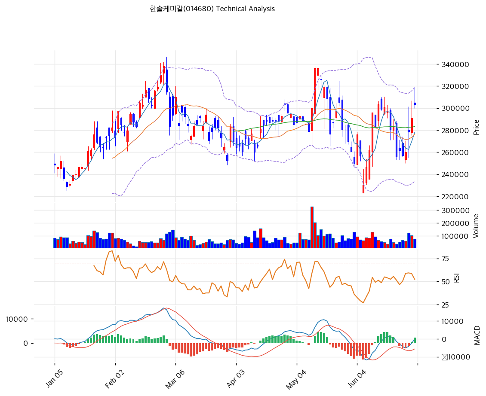

# 한솔케미칼(014680) 기술적 분석

2026-07-01 | T2 Technical Analysis

---

## 차트

---

## 1. 가격 현황

| 항목 | 값 |
|------|-----|
| 현재가 | 303,000원 (+4.12%) |
| 52주 고가 | 338,000원 |
| 52주 저가 | 159,500원 |
| 52주 범위 위치 | 80.4% |
| 거래량 | 20일 평균 대비 1.0x (약함) |

---

## 2. 차트 패턴 분석

### 2.1 캔들스틱 패턴

| 패턴 | 위치 | 신뢰도 | 해석 |
|------|------|--------|------|
| 급등 후 박스권 등락 | 5\~6월 | 중 | 5월 급등(220,000원대 저점→330,000원대 고점) 이후 6월 중 재차 눌림, 최근 재반등 |

※ 1\~2월 상승 추세(230,000원대→338,000원 고점) 이후 3\~4월 조정(260,000원대 박스권), 5월 급등락(단기 220,000원대까지 급락 후 재반등), 6월 말 이후 재차 300,000원선 회복하는 흐름.

### 2.2 가격 구조 패턴

- **비정배열 상태의 재반등** (신뢰도: 중)
  MA60·MA120이 MA5·MA20보다 높게 위치하는 비정배열 상태에서 최근 반등이 나타나, 완전한 추세 전환보다는 박스권 상단 재도전 국면으로 해석된다.

- **박스권 상단 접근** (신뢰도: 중)
  4\~6월 형성된 260,000\~320,000원 박스권 상단(피봇 R1 314,667원)에 근접한 상태로, 돌파 여부가 다음 방향성을 결정할 전망이다.

### 2.3 다이버전스

- **뚜렷한 다이버전스 없음** (신뢰도: 중)
  RSI 57.2는 가격 반등과 대체로 동행하고 있어 특별한 배분/축적 신호는 관찰되지 않는다.

### 2.4 패턴 종합 판단

MACD 매수구간 확대와 스토캐스틱 골든크로스가 동시에 나타나는 단기 모멘텀 개선 국면이나, 거래량이 평균 수준(1.0x)에 그쳐 강한 확신을 주는 상승은 아니다. 비정배열 상태이므로 박스권 상단(314,000\~338,000원) 돌파 전까지는 추세 전환으로 단정하기 이르다.

---

## 3. 이동평균선 — 비정배열

| MA | 값 | 현재가 괴리율 | 위치 |
|----|-----|--------------|------|
| MA5 | 277,900원 | +9.0% | 아래 |
| MA20 | 276,075원 | +9.8% | 아래 |
| MA60 | 283,300원 | +7.0% | 아래 |
| MA120 | 281,108원 | +7.8% | 아래 |
| MA200 | 254,968원 | +18.8% | 아래 |

**해석**: 현재가가 모든 이동평균선 위에 있으나 MA60·MA120이 MA5·MA20보다 높아 정배열 조건(MA5>MA20>MA60>MA120>MA200)을 충족하지 못하는 비정배열이다. MA200 대비 +18.8% 괴리는 다소 과열이나, MA20 대비 +9.8%는 과열 경고 기준(20%)에는 못 미친다.

---

## 4. 보조 지표

### RSI(14) — 57.2 (중립)

과매수·과매도 어느 쪽도 아닌 중립 구간으로, 추가 상승 여력과 조정 가능성이 공존한다.

### MACD(12,26,9)

| 항목 | 값 |
|------|-----|
| MACD | -125 |
| Signal | -2,442 |
| Histogram | +2,317 |
| 크로스 상태 | 매수 구간 (확대 중) |

**해석**: MACD·Signal 모두 음수이나 히스토그램이 확대되며 매수 전환 초입 국면을 시사한다.

### 볼린저밴드(20, 2σ)

| 항목 | 값 |
|------|-----|
| 상단 | 318,727원 |
| 중단 (MA20) | 276,075원 |
| 하단 | 233,423원 |
| 밴드 폭 | 30.9% |
| 현재 위치 | 중간 |

**해석**: 현재가가 중단과 상단 사이에 위치해 추세 방향성 판단에는 다소 이른 구간이다.

### 스토캐스틱(14, 3, 3)

| 항목 | 값 |
|------|-----|
| Slow %K | 67.8 |
| Slow %D | 55.6 |
| 크로스 상태 | 골든크로스 |
| 판단 | 중립(과매수 근접) |

---

## 5. 지지/저항 — 추세선 · 피보나치 · PRZ 통합

### 5.1 피보나치 되돌림/확장

| 구분 | 비율 | 가격 | 현재가 대비 |
|------|------|------|-----------|
| Swing High | — | 336,000원 | +10.9% |
| 되돌림 | 0.236 | 255,016원 | -15.8% |
| 되돌림 | 0.382 | 270,492원 | -10.7% |
| 되돌림 | 0.5 | 283,000원 | -6.6% |
| 되돌림 | 0.618 | 295,508원 | -2.5% |
| 되돌림 | 0.786 | 313,316원 | +3.4% |
| Swing Low | — | 230,000원 | -24.1% |
| 확장 | 1.272 | 201,168원 | -33.6% |
| 확장 | 1.382 | 189,508원 | -37.4% |
| 확장 | 1.618 | 164,492원 | -45.7% |

※ 피보나치 기준: 하락 추세 되돌림(Swing High 336,000원 → Swing Low 230,000원). 현재가는 0.618 되돌림(295,508원)과 0.786 되돌림(313,316원) 사이에 위치.

### 5.2 추세선

| 추세선 | 방향 | 현재 교차가 | 포인트 수 | 해석 |
|--------|------|-----------|---------|------|
| 지지선 | 상승 | 250,715원 | 6개 | 연초 이후 상승 채널 하단 |
| 저항선 | 상승 | 375,178원 | 6개 | 아직 여유 있는 상단 |

### 5.3 PRZ (Potential Reversal Zone)

| 방향 | 가격 범위 | 신뢰도 | 근거 |
|------|---------|--------|------|
| 지지 | 295,508\~295,667원 | 약 | 피보나치 0.618 되돌림 + 피봇 S1 |
| 저항 | 313,316\~314,667원 | 약 | 피보나치 0.786 되돌림 + 피봇 R1 |
| 지지 | 270,492\~288,333원 | 강 | 피보나치 0.382 되돌림 + MA20/MA5/MA120/MA60 + 피봇 S2 |
| 지지 | 250,715\~255,016원 | 중 | 추세선 지지 + MA200 + 피보나치 0.236 되돌림 |

### 5.4 종합 지지/저항 테이블

| 구분 | 가격 | 근거 |
|------|------|------|
| 저항 | 338,000원 | 52주 고가 |
| 저항 | 314,667원 | 피봇 R1 |
| **현재가** | **303,000원** | — |
| 지지 | 295,667원 | 피봇 S1 |
| 지지 | 288,333원 | 피봇 S2 |
| 지지 | 283,300원 | MA60 |
| 지지 | 276,075원 | MA20 |
| 지지 | 250,715원 | 추세선 지지 (상승) |
| 저항 | 375,178원 | 추세선 저항 (상승) |

---

## 6. 시그널 종합

| 지표 | 내용 | 시그널 |
|------|------|--------|
| 이동평균선 | 비정배열, MA20 +9.8% | ⚪ |
| RSI | 57.2 — 중립 | ⚪ |
| **MACD** | 매수구간, 히스토그램 확대 | 🟢 |
| 볼린저밴드 | 중간, 밴드 폭 30.9% | ⚪ |
| 스토캐스틱 | 골든크로스, K=67.8 | ⚪ |
| 거래량 | 1.0x — 약함 | ⚪ |

**종합 판단**: 🟢 매수 1개 / 🔴 매도 0개 / ⚪ 중립 5개 → **매수우위**

매도 시그널이 전혀 없는 가운데 MACD만 뚜렷한 매수 신호를 보이는, 약하지만 방향성 있는 반등 국면이다. 거래량이 평균 수준(1.0x)에 그쳐 확신을 주는 상승은 아니며, 비정배열 상태에서 박스권 상단(피봇 R1 314,667원\~52주 고가 338,000원)을 돌파하는지가 다음 구간의 핵심 관전 포인트다. T1·T3에서 다룬 반도체 소재 펀더멘털 촉매(과산화수소 판가 인상 2Q26 반영)가 실적으로 확인되는 시점과 기술적 돌파가 맞물릴 경우 추세 전환 가능성이 높아진다.

---

## 7. 전략 제안

### 보유 중인 경우
- **홀드(단기 반등 추종)**
- 익절 라인: 344,760원 (52주 고가 상회 구간)
- 손절 라인: 288,333원 (피봇 S2 이탈 시)
- 리스크/리워드: 비정배열 상태의 반등이라 박스권 상단 도달 시 분할 익절 권고

### 진입 대기인 경우
- **진입가능(분할)**
- 1차 진입가: 295,667원 (피봇 S1)
- 2차 진입가: 276,075원 (MA20 눌림목)
- 진입 조건: 거래량 동반 확대 시 추격 진입, 그렇지 않으면 눌림목 분할 매수
