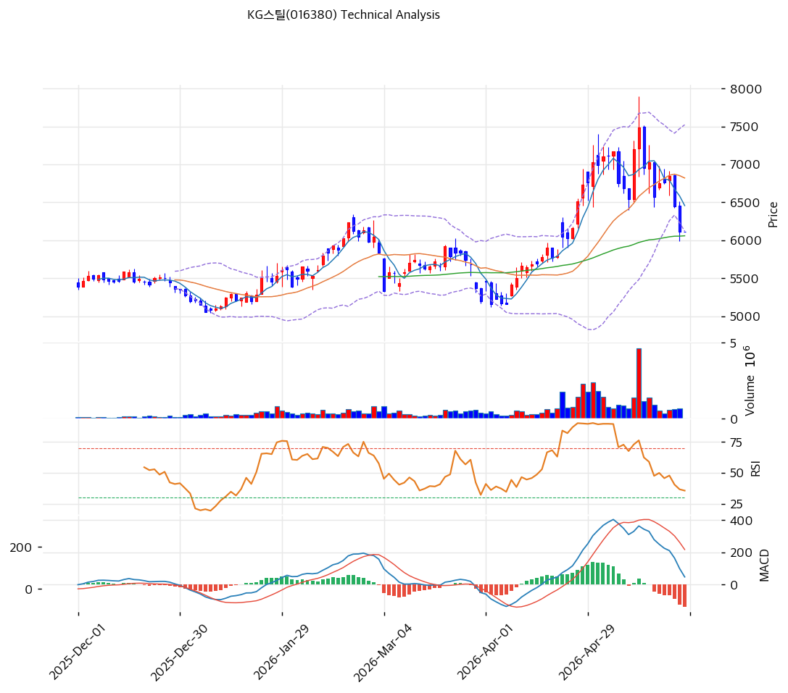

# KG스틸(016380) 기술적 분석 보고서

---

## 가격 위치

현재가 **6,110원** (0.00%) — 52주 위치 **43.4%** (고가 7,490 / 저가 5,050). 52주 고가 -18% 조정 후 MA60·MA120·MA200 위에서 박스권 하단. **기관 20일 +2,220,048주 매수** (시총의 2.3%) vs 외국인 -99,616주 소폭 매도 — 기관 매집 진행 중. 반덤핑·판가 인상 기대 일부 선반영.

## 이동평균선 / 모멘텀

MA5 6,456 / MA20 6,820 / MA60 6,058 / MA120 5,790 / MA200 5,660 — 단기 MA(5/20) 위에 현재가 위치(-5.4% / -10.4% 이격), 중장기 MA(60/120/200)는 현재가 아래(+0.9% / +5.5% / +8.0%). **단기 조정 + 중장기 상승 추세 유지** 혼재. MA60 6,058원이 핵심 지지선.

**RSI 42.0 (중립)** — 과매도 직전, 추가 하락 여지 제한. MACD 48 / 시그널 187 / 히스토 -139 = **매도 시그널 + 확장** = 단기 약세 진행. 스토캐 K=5.3 / D=12.5 데드크로스 **과매도 영역** = 단기 반등 임박 신호. BB 하단 근접 (폭 20.6% 좁음) — 변동성 수축 후 방향 전환 임박.

## 시그널 종합 / S&R

매수 2 / 매도 1 / 중립 3 → **매수우위**. 과매도 + 기관 매집 결합으로 반등 가능성.

- 저항: **6,463원(PRZ 약: MA5·피보 0.5)** / 6,814원(PRZ 약: 피보 0.618·MA20) / 7,288원(피보 0.786) / 7,490원(52주 고가)
- 지지: **6,105원(PRZ 강: MA60·피봇)** / 5,722원(PRZ 중: MA200·MA120·피보 0.236) / 5,176원(추세선 지지)
- 핵심 분기점: **MA60 6,105원 지지 사수 여부**. 사수 시 반덤핑 모멘텀으로 7,000원+ 회복, 이탈 시 MA200 5,722원 추가 조정

전략: **HOLD(홀드) — TP 7,640원 / SL 6,110원**. WAIT(진입가능) e1=6,110원 / e2=6,820원. **과매도 + MA60 지지 + 기관 매집 = 분할 매수 적기**. 반덤핑 관세 시행(6\~7월) 모멘텀 + 2분기 판가 인상 손익 반영이 박스권 돌파 트리거. PBR 0.29x 하방 견고.
