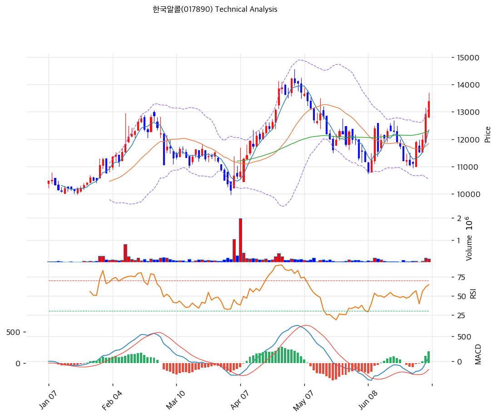

# 한국알콜(017890) 기술적 분석

2026-07-03 | T2 Technical Analysis

---

## 차트

---

## 1. 가격 현황

| 항목 | 값 |
|------|-----|
| 현재가 | 13,380원 (+3.48%) |
| 52주 고가 | 14,210원 |
| 52주 저가 | 8,870원 |
| 52주 범위 위치 | 84.5% |
| 거래량 | 20일 평균 대비 2.30x |

---

## 2. 차트 패턴 분석

### 2.1 캔들스틱 패턴

| 패턴 | 위치 | 신뢰도 | 해석 |
|------|------|--------|------|
| 장대양봉 2연속 | 최근 2거래일(6월 말) | 강 | 6월 중순 저점(11,000원대)에서 반등한 뒤 거래량을 동반한 대형 양봉이 이틀 연속 출현, 박스권 상단을 강하게 돌파하며 매수세 유입을 확인 |
| 위꼬리 동반 양봉(당일) | 당일 | 중 | 장중 고점이 13,800원대까지 도달했다가 13,380원(+3.48%)에 마감, 위꼬리가 남아 피봇 R1(13,787원)·52주 고가(14,210원) 부근에서 일부 차익실현 매물이 출회했음을 시사 |

※ 주요 캔들 패턴: 망치형, 역망치형, 장악형(상승/하락), 도지, 샛별/석별, 적삼병/흑삼병, 하라미, 유성형, 교수형 등

### 2.2 가격 구조 패턴

- **박스권(11,000\~12,300원) 상단 돌파** (신뢰도: 강)
  6월 중순부터 약 2주간 11,000\~12,300원 구간에서 좁게 다져진 박스권을 거래량 2.30배를 동반하며 상향 돌파했다. 박스 폭(약 1,300원)을 상단 돌파가에 투사하면 단기 목표가는 13,600\~14,600원대로, 52주 고가(14,210원)·피보나치 확장 1.272(16,129원) 이전 구간과 겹친다.

- **저점 절상형 상승 채널** (신뢰도: 중)
  1월 저점 이후 지지선·저항선 모두 우상향 기울기(각각 접점 6개)를 유지하는 상승 채널이 형성되어 있다. 4\~5월 급등 후 5\~6월 조정 국면에서도 채널 하단(추세선 지지 10,849원)을 이탈하지 않고 저점을 높여왔으며, 이번 반등도 채널 내에서의 재상승으로 해석된다.

### 2.3 다이버전스

- **RSI 다이버전스 없음(정상 동행)** (신뢰도: 해당없음)
  RSI가 64.0으로 가격 상승과 같은 방향으로 움직이고 있다. 3월 저점과 6월 저점의 RSI 수준이 유사(30 부근)해 뚜렷한 저점 다이버전스는 관찰되지 않으며, 현재 상승은 모멘텀이 정상적으로 강화되는 국면으로 판단된다.

- **MACD 다이버전스 없음(정상 동행)** (신뢰도: 해당없음)
  MACD가 최근 골든크로스 이후 히스토그램이 +191로 급격히 확대되며 가격 상승과 같은 방향을 유지하고 있어 이례적 괴리는 확인되지 않는다.

### 2.4 패턴 종합 판단

6월 중순 저점권에서 형성된 박스권을 거래량을 동반한 장대양봉 2연속으로 강하게 돌파했으며, 1월 이후 이어진 상승 채널 구조도 여전히 유효하다. RSI·MACD 모두 다이버전스 없이 가격과 동행하며 모멘텀이 강화되는 모습이다. 다만 당일 캔들에 남은 위꼬리는 피봇 R1(13,787원)·52주 고가(14,210원) 부근에서 단기 저항을 재확인하는 과정을 시사하므로, 추가 상승을 위해서는 이 구간의 거래량 동반 돌파 여부를 확인할 필요가 있다.

---

## 3. 이동평균선 — 비정배열 (강세)

| MA | 값 | 현재가 괴리율 | 위치 |
|----|-----|--------------|------|
| MA5 | 12,344원 | +8.4% | 위 |
| MA20 | 11,848원 | +12.9% | 위 |
| MA60 | 12,300원 | +8.8% | 위 |
| MA120 | 11,752원 | +13.9% | 위 |
| MA200 | 11,079원 | +20.8% | 위 |

**해석**: 현재가가 5개 이동평균선을 모두 상회하는 강세 구조다. 다만 MA60(12,300원)이 MA20(11,848원)보다 높게 위치해 정배열(MA5>MA20>MA60>MA120>MA200)에서 벗어나 있는데, 이는 4\~5월 급등분이 MA60 산출 구간에 더 많이 반영된 반면 MA20은 5\~6월 조정 구간의 영향을 크게 받았기 때문이다. 최근 반등으로 MA5가 이미 MA60을 재돌파한 상태라, 상승이 이어질 경우 MA20이 MA60을 상향 돌파하며 정배열로 수렴할 가능성이 높다. 단기 지지선은 MA60(12,300원)~MA20(11,848원) 구간이다.

---

## 4. 보조 지표

### RSI(14) — 64.0 (중립)

RSI 64.0은 중립 상단 구간으로, 과매수(70)까지 여유가 남아 있어 단기 추가 상승에도 지표 부담은 제한적이다.

### MACD(12,26,9)

| 항목 | 값 |
|------|-----|
| MACD | 89 |
| Signal | -102 |
| Histogram | +191 |
| 크로스 상태 | 매수 구간 (확대 중) |

**해석**: MACD(89)가 Signal(-102)을 상회하는 매수 구간이며, 히스토그램(+191)이 확대되고 있어 상승 모멘텀이 강화되는 국면이다.

### 볼린저밴드(20, 2σ)

| 항목 | 값 |
|------|-----|
| 상단 | 13,155원 |
| 중단 (MA20) | 11,848원 |
| 하단 | 10,540원 |
| 밴드 폭 | 22.1% |
| 현재 위치 | 상단 근접 |

**해석**: 현재가(13,380원)가 볼린저 상단(13,155원)을 이미 상회한 상태로 단기 과열 신호가 나타나고 있다. 밴드 폭 22.1%는 6월 조정기 대비 확장된 수준으로 변동성 확대를 동반한 추세 국면임을 시사하며, 되돌림 발생 시 중단(MA20·11,848원)이 1차 지지대가 된다.

### 스토캐스틱(14, 3, 3)

| 항목 | 값 |
|------|-----|
| Slow %K | 79.1 |
| Slow %D | 63.0 |
| 크로스 상태 | 골든크로스 |
| 판단 | 중립 |

---

## 5. 지지/저항 — 추세선 · 피보나치 · PRZ 통합

### 5.1 피보나치 되돌림/확장

| 구분 | 비율 | 가격 | 현재가 대비 |
|------|------|------|-----------|
| Swing High | — | 14,570원 | — |
| 되돌림 | 0.236 | 13,218원 | -1.2% |
| 되돌림 | 0.382 | 12,381원 | -7.5% |
| 되돌림 | 0.5 | 11,705원 | -12.5% |
| 되돌림 | 0.618 | 11,029원 | -17.6% |
| 되돌림 | 0.786 | 10,066원 | -24.8% |
| Swing Low | — | 8,840원 | — |
| 확장 | 1.272 | 16,129원 | +20.5% |
| 확장 | 1.382 | 16,759원 | +25.3% |
| 확장 | 1.618 | 18,111원 | +35.4% |
| 확장 | 2.0 | 20,300원 | +51.7% |

※ 피보나치 기준: 상승 추세 (Swing Low 8,840원 → Swing High 14,570원)
※ 되돌림 = 직전 추세에서 되돌아온 비율, 확장 = 추세 방향 목표가

### 5.2 추세선

| 추세선 | 방향 | 현재 교차가 | 포인트 수 | 해석 |
|--------|------|-----------|---------|------|
| 지지선 | 상승 | 10,849원 | 6개 | 1월 저점부터 이어진 상승 지지선으로 현재가 대비 -18.9% 하단에 위치, 안전마진이 충분히 확보된 상태 |
| 저항선 | 상승 | 14,653원 | 6개 | 4\~5월 고점을 연결한 상승 저항선으로 현재가 대비 +9.5% 상단에 위치, 도달 시 재차 저항 테스트가 예상되는 구간 |

### 5.3 PRZ (Potential Reversal Zone)

| 방향 | 가격 범위 | 신뢰도 | 근거 |
|------|---------|--------|------|
| 지지 | 12,300\~12,393원 | 강 | MA60, MA5, 피보나치 0.382 되돌림, 피봇 S2 |
| 지지 | 11,705\~11,848원 | 중 | 피보나치 0.5 되돌림, MA120, MA20 |
| 지지 | 10,849\~11,079원 | 중 | 추세선 지지, 피보나치 0.618 되돌림, MA200 |

※ PRZ = 추세선 · 피보나치 · 피봇 · MA 등 복수 지표가 겹치는 가격 구간. 겹치는 소스가 많을수록 반전 확률 상승.

### 5.4 종합 지지/저항 테이블

| 구분 | 가격 | 근거 |
|------|------|------|
| 저항 | 13,787원 | 피봇 R1 |
| 저항 | 14,210원 | 52주 고가 (피봇 R2 14,193원 근접) |
| **현재가** | **13,380원** | — |
| 지지 | 12,887원 | 피봇 S1 |
| 지지 | 12,354원 | PRZ(강) — MA60·MA5·피보나치 0.382·피봇 S2 |
| 지지 | 11,768원 | PRZ(중) — 피보나치 0.5·MA120·MA20 |

---

## 6. 시그널 종합

| 지표 | 내용 | 시그널 |
|------|------|--------|
| **차트 패턴** | 박스권 상단 돌파 + 상승 채널 유지, 위꼬리로 단기 저항 재확인 | 🟢 |
| 이동평균선 | 비정배열, MA20 +12.9% 상회 | ⚪ |
| RSI | 64.0 — 중립 (과매수 미진입) | ⚪ |
| MACD | 매수구간, 히스토그램 확대 | 🟢 |
| 볼린저밴드 | 상단 밀착·이탈, 밴드 폭 22.1% | ⚪ |
| 스토캐스틱 | 골든크로스, K=79.1 | ⚪ |
| 거래량 | 2.30x — 강력 동반 | 🟢 |

**종합 판단**: 🟢 매수 3개 / 🔴 매도 0개 / ⚪ 중립 4개 → **매수우위**

박스권 돌파와 거래량 급증, MACD 골든크로스가 동시에 확인되며 단기 추세는 매수 우위로 판단된다. 중기적으로도 1월 이후 상승 채널이 유지되고 있어 추세 자체는 건재하나, RSI·볼린저밴드가 이미 과열권에 근접해 있고 당일 캔들의 위꼬리가 피봇 R1(13,787원)\~52주 고가(14,210원) 구간에서의 저항을 시사하므로, 단기적으로는 해당 구간 돌파 확인 전까지 숨 고르기 가능성에 유의해야 한다.

---

## 7. 전략 제안

### 보유 중인 경우
- **홀드**
- 익절 라인: 14,494원 (피봇 R2 14,193원\~52주 고가 14,210원~추세선 저항 14,653원 구간 목표가)
- 손절 라인: 12,393원 (피봇 S2, PRZ(강) 상단 이탈 시)
- 리스크/리워드: 약 1:1.13

### 진입 대기인 경우
- **진입가능 (단계적 접근)**
- 1차 진입가: 12,887원 (피봇 S1)
- 2차 진입가: 11,848원 (MA20, PRZ(중) 상단)
- 진입 조건: 박스권 상단(12,300원) 재이탈 없이 피봇 S1~MA20 구간에서 지지 확인 후 거래량 동반 반등 캔들 형성 시 분할 매수
