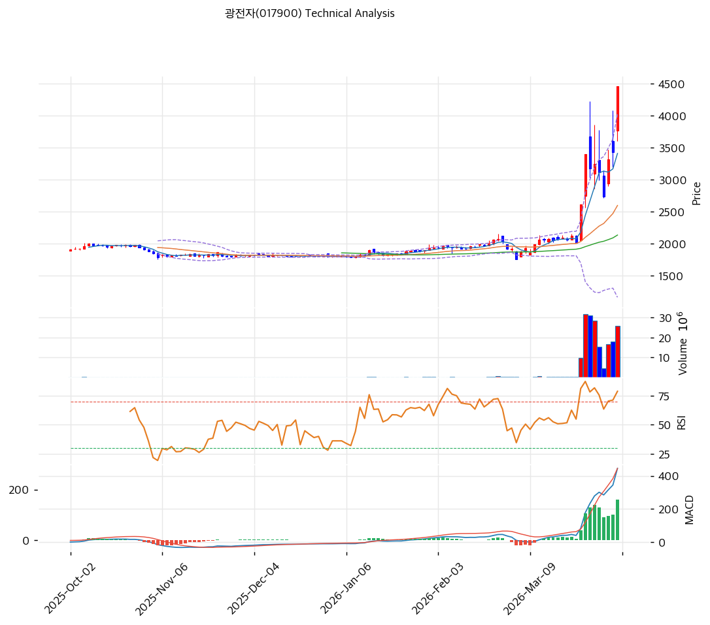

# 광전자(017900) 기술적 분석

2026-04-05 | T2 Technical Analysis

---

## 차트

---

## 1. 가격 현황

| 항목 | 값 |
|------|-----|
| 현재가 | 4,455원 (+29.88%) |
| 52주 고가 | 4,455원 |
| 52주 저가 | 1,687원 |
| 52주 범위 위치 | 100.0% |
| 거래량 | 20일 평균 대비 3.27x |

---

## 2. 차트 패턴 분석

### 2.1 캔들스틱 패턴

| 패턴 | 위치 | 신뢰도 | 해석 |
|------|------|--------|------|
| 장대양봉 (상한가) | 최근 1일 (4/3) | 강 | 상한가 도달 장대양봉으로 극단적 매수세 확인, 거래량 3.27x 동반으로 강력 매수 시그널 |
| 연속 장대양봉 | 최근 5일 | 강 | 3월 중순 이후 대형 양봉이 연속 출현하며 파라볼릭 상승 구간 진입 |
| 윗꼬리 양봉 | 최근 3~5일 내 | 중 | 일부 양봉에서 장대 윗꼬리 출현, 고가 부근 차익실현 매물 존재 시사 |

※ 상한가 장대양봉이 압도적이나, 최근 일부 캔들의 윗꼬리가 고점 부근 매도 압력을 암시

### 2.2 가격 구조 패턴

- **장기 박스권 돌파 후 파라볼릭 상승** (신뢰도: 강)
  2025년 10월~2026년 3월 중순까지 약 5개월간 1,750~2,200원 박스권에서 횡보. 이후 3월 중순 폭발적 거래량 동반 상방 돌파, 가격이 2배 이상 급등하며 파라볼릭 상승 구조 형성. 전형적인 '볼린저밴드 스퀴즈 → 확장' 패턴으로, 장기 축적 에너지가 일시에 분출된 형태.

- **52주 신고가 갱신 (상한가)** (신뢰도: 강)
  현재가 4,455원이 52주 고가와 동일, 직전 저점(1,687원) 대비 164% 상승. 신고가 돌파 자체는 강한 상승 추세를 확인하나, 파라볼릭 상승의 특성상 급격한 되돌림 리스크가 상존.

### 2.3 다이버전스

- **RSI — 다이버전스 미확인** (신뢰도: 강)
  가격이 신고가를 경신하는 가운데 RSI(78.8)도 함께 고점을 갱신하고 있어 정방향(Confirmation) 상태. 현재까지 가격↑·RSI↓의 하락 다이버전스는 관측되지 않음.

- **MACD — 다이버전스 미확인** (신뢰도: 강)
  MACD 라인(445)과 시그널(284) 모두 가파르게 상승 중이며, 히스토그램(+162)이 확대되고 있어 모멘텀이 가격 상승을 뒷받침. 하락 다이버전스 징후 없음.

※ RSI·MACD 기반 | 현재 다이버전스 부재 — 추세 강도가 유지되고 있으나, 극단적 과매수 구간이므로 향후 다이버전스 발생 여부를 주시 필요

### 2.4 패턴 종합 판단

장기 박스권 돌파 후 파라볼릭 상승이 진행 중이며, 장대양봉 연속 출현과 폭발적 거래량이 추세의 강도를 확인시킨다. RSI·MACD 모두 가격과 동행하여 다이버전스가 부재하므로, 아직 추세 전환 시그널은 없다. 다만 52주 고가 = 상한가 = 현재가라는 극단적 위치와, 최근 캔들의 윗꼬리가 고점 부근 매도 압력을 시사하므로 단기 과열에 따른 되돌림 가능성을 경계해야 한다.

---

## 3. 이동평균선 — 정배열 (강세)

| MA | 값 | 현재가 괴리율 | 위치 |
|----|-----|--------------|------|
| MA5 | 3,411원 | +30.6% | 위 |
| MA20 | 2,599원 | +71.4% | 위 |
| MA60 | 2,137원 | +108.4% | 위 |
| MA120 | 1,998원 | +122.9% | 위 |
| MA200 | 1,974원 | +125.7% | 위 |

**해석**: 완전 정배열(MA5 > MA20 > MA60 > MA120 > MA200) 상태로 모든 이동평균이 강세 배열. 그러나 MA20 대비 +71.4%, MA60 대비 +108.4% 괴리율은 역사적으로 극단적인 수준이며, 이동평균선으로의 회귀(mean reversion) 압력이 매우 높다. 장기 이동평균이 아직 1,900~2,000원대에 위치하여 중기적 지지는 현재가 대비 상당히 아래에 있다.

---

## 4. 보조 지표

### RSI(14) — 78.8 (🔴과매수)

RSI 78.8은 명확한 과매수 영역(70 이상)으로, 단기 상승 모멘텀이 극대화된 상태. 70선 이상 체류 기간이 길어질수록 되돌림 시 하락 폭이 확대될 수 있음. 다만 강한 추세장에서는 과매수 상태가 수일~수주 지속 가능.

### MACD(12,26,9)

| 항목 | 값 |
|------|-----|
| MACD | 445 |
| Signal | 284 |
| Histogram | +162 |
| 크로스 상태 | 매수 구간 (확대 중) |

**해석**: MACD가 시그널선 위에서 빠르게 상승 중이며, 히스토그램이 +162로 확대세 지속. 골든크로스 이후 매수 모멘텀이 가속되고 있으나, MACD 라인의 기울기가 극단적이어서 히스토그램 축소(수렴) 전환 시점을 주시해야 함.

### 볼린저밴드(20, 2σ)

| 항목 | 값 |
|------|-----|
| 상단 | 4,033원 |
| 중단 (MA20) | 2,599원 |
| 하단 | 1,166원 |
| 밴드 폭 | 110.3% |
| 현재 위치 | 상단 돌파 (상단 밀착) |

**해석**: 볼린저밴드 폭 110.3%는 장기 스퀴즈(5개월 횡보) 후 폭발적 확장 구간. 현재가(4,455원)가 상단밴드(4,033원)를 상향 이탈한 '밴드 워킹' 상태로, 강한 추세 지속을 시사하나 동시에 극단적 변동성 확대를 의미. 상단밴드 이탈 후 밴드 내 복귀 시 단기 조정 신호로 해석.

### 스토캐스틱(14, 3, 3)

| 항목 | 값 |
|------|-----|
| Slow %K | 74.4 |
| Slow %D | 58.0 |
| 크로스 상태 | 골든크로스 |
| 판단 | 중립 (상승 구간) |

---

## 5. 지지/저항

| 구분 | 가격 | 근거 |
|------|------|------|
| 저항 | 5,025원 | 피봇 R2 |
| 저항 | 4,740원 | 피봇 R1 |
| **현재가** | **4,455원** | — |
| 지지 | 3,885원 | 피봇 S1 |
| 지지 | 3,315원 | 피봇 S2 |
| 지지 | 2,599원 | MA20 (볼린저 중단) |
| 지지 | 2,137원 | MA60 |

---

## 6. 시그널 종합

| 지표 | 내용 | 시그널 |
|------|------|--------|
| **차트 패턴** | 박스권 돌파 + 파라볼릭 상승, 다이버전스 부재, 윗꼬리 경계 | 🟢 |
| 이동평균선 | 완전 정배열, MA20 +71.4% 극단적 괴리 | 🟢 (추세) / 🔴 (과열) |
| RSI | 78.8 — 과매수 🔴 | 🔴 |
| MACD | 매수구간, 히스토그램 +162 확대 중 | 🟢 |
| 볼린저밴드 | 상단 돌파 밴드워킹, 밴드 폭 110.3% | ⚪ |
| 스토캐스틱 | 골든크로스, K=74.4 | ⚪ |
| 거래량 | 3.27x — 강력 동반 | 🟢 |

**종합 판단**: 🟢 매수 3개 / 🔴 매도 2개 / ⚪ 중립 2개 → **매수우위**

장기 박스권 돌파 후 폭발적 상승이 진행 중이며, 거래량·MACD·이동평균 정배열 등 추세 관련 지표가 모두 강세를 확인한다. 그러나 RSI 78.8의 극단적 과매수, MA20 대비 +71.4% 괴리, 52주 고가 상한가 위치 등 과열 시그널이 동시에 나타나 단기 조정/숨 고르기 가능성이 높다. 중기적으로는 추세가 유효하나, 단기적으로는 차익실현 매물에 대한 경계가 필요한 구간이다.

---

## 7. 전략 제안

### 보유 중인 경우
- **홀드** (단, 비중 관리 필요)
- 익절 라인: 4,544원 (피봇 기준 목표가, 현재가 대비 +2.0%)
- 손절 라인: 3,315원 (피봇 S2, 현재가 대비 -25.6%)
- 리스크/리워드: 약 1:0.08 — 현재가가 이미 목표치 근접, 추격 보유보다 부분 익절 후 되돌림 시 재진입 전략 권장

### 진입 대기인 경우
- **관망**
- 1차 진입가: 3,885원 (피봇 S1 지지 확인 시)
- 2차 진입가: 2,599원 (MA20·볼린저 중단 지지 시)
- 진입 조건: RSI 70 이하 복귀 + 피봇 S1(3,885원) 부근 지지 확인 + 거래량 수반 반등 캔들 출현 시 분할 진입. 현 상한가 부근 추격매수는 리스크 대비 보상이 극히 불리하므로 지양.
