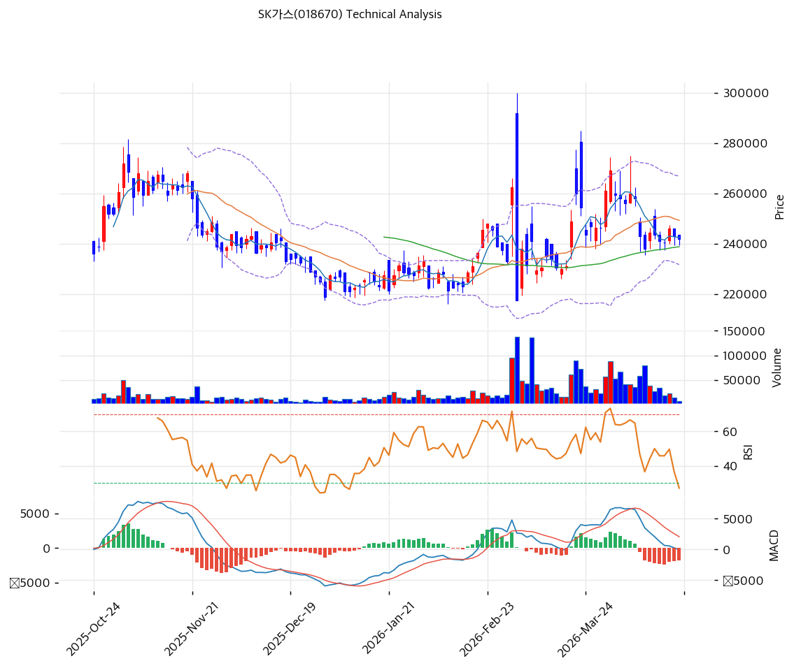

# SK가스(018670) 기술적 분석

2026-04-20 | T2 Technical Analysis

---

## 차트

---

## 1. 가격 현황

| 항목 | 값 |
|------|-----|
| 현재가 | 242,000원 (-0.41%) |
| 52주 고가 | 296,000원 |
| 52주 저가 | 207,000원 |
| 52주 범위 위치 | 39.3% |
| 거래량 | 20일 평균 대비 0.18x |

---

## 2. 차트 패턴 분석

### 2.1 캔들스틱 패턴

| 패턴 | 위치 | 신뢰도 | 해석 |
|------|------|--------|------|
| 장대음봉 후 소형 캔들 연속 | 최근 5~7일 | 중 | 2월 말 급등 이후 상단에서 매수세 소멸, 약세 지속 시그널 |
| 유성형(Shooting Star) 유사 | 2026-02-23 전후 고점 | 중 | 300,000원 근접 후 긴 윗꼬리 형성 — 단기 천정 신호로 작용 |
| 도지성 캔들 혼재 | 최근 3~5일 | 약 | 방향성 상실, 박스권 하단 재테스트 가능성 |

### 2.2 가격 구조 패턴

- **박스권 횡보(240,000~260,000원)** (신뢰도: 강)
  2025년 10월부터 2026년 2월 초까지 약 230,000~265,000원 박스권에서 횡보, 2월 중순 300,000원까지 급등 후 재차 박스권 중단부(240,000원 부근)로 복귀한 전형적인 실패 돌파(Failed Breakout) 구조. 현재가는 박스권 중앙에서 약보합.

- **이중천정(Double Top) 가능성** (신뢰도: 중)
  2026-02-23 고점(약 300,000원)과 2026-03-24 전후 2차 고점(약 275,000원)이 하락하는 이중천정 형태. 넥라인 약 240,000원 부근으로, 이탈 시 하락 목표 약 210,000원(= 240,000 - (275,000-240,000)).

- **하락 추세선 저항** (신뢰도: 중)
  2026년 2월 고점 이후 고점-고점 연결한 하락 추세선(현재 약 274,464원)이 유효. 단기 상단을 제한.

### 2.3 다이버전스

- **MACD 하락 다이버전스** (신뢰도: 중)
  2월 말 가격 고점(300,000원) 대비 3월 말 2차 고점(275,000원)은 낮아졌으나, MACD는 급격히 매도 구간으로 전환되며 히스토그램이 -1,717까지 확대. 가격-모멘텀 모두 동반 하락으로 추세적 약세 확인.

- **RSI 중립 — 다이버전스 부재** (신뢰도: 약)
  RSI 47.5는 중립 구간으로, 현재 시점에서는 명확한 다이버전스가 관찰되지 않음. 단, 상승 추세 없이 중립 구간에 머무는 것 자체가 반등 동력 부족을 시사.

### 2.4 패턴 종합 판단

실패 돌파 후 박스권 중단부에 재진입한 상태로, 이중천정 가능성과 MACD 하락 다이버전스가 결합되어 단기 약세 시그널이 우위. 다만 박스권 하단(230,000원) 지지가 아직 유지되고 있어 즉각적 하락 전환보다는 추가 박스권 횡보 가능성이 크며, 거래량이 20일 평균 대비 0.18배로 극단적으로 위축된 점이 방향성 불확실성을 증폭시킴.

---

## 3. 이동평균선 — 비정배열 (약세)

| MA | 값 | 현재가 괴리율 | 위치 |
|----|-----|--------------|------|
| MA5 | 242,500원 | -0.2% | 아래 |
| MA20 | 249,325원 | -2.9% | 아래 |
| MA60 | 238,842원 | +1.3% | 위 |
| MA120 | 240,762원 | +0.5% | 위 |
| MA200 | 245,850원 | -1.6% | 아래 |

**해석**: MA20·MA200 아래, MA60·MA120 위에 위치한 비정배열로 중단기 약세 구간. MA20(249,325원)이 단기 저항, MA60(238,842원)·MA120(240,762원)이 단기 지지 역할. MA들이 238,000~250,000원 사이에 밀집하여 MA 수렴 구간 형성 — 이탈 시 방향성 확대 가능.

---

## 4. 보조 지표

### RSI(14) — 47.5 (중립)

50선 직전에서 하방 기울기를 형성하며 모멘텀 약화. 과매수·과매도 영역에서 모두 벗어나 있어 가격 반전 트리거로는 약함.

### MACD(12,26,9)

| 항목 | 값 |
|------|-----|
| MACD | -72 |
| Signal | 1,645 |
| Histogram | -1,717 |
| 크로스 상태 | 매도 구간 (확대 중단) |

**해석**: MACD선이 시그널선을 하향 돌파한 매도 구간으로, 히스토그램 -1,717은 최근 3개월 내 최대 수준의 음의 확장. 다만 추가 확대는 멈춘 상태로 단기적으로 낙폭 둔화 가능.

### 볼린저밴드(20, 2σ)

| 항목 | 값 |
|------|-----|
| 상단 | 266,909원 |
| 중단 (MA20) | 249,325원 |
| 하단 | 231,741원 |
| 밴드 폭 | 14.1% |
| 현재 위치 | 중간 (하단 측) |

**해석**: 2월 말 급등으로 밴드가 크게 확장된 이후 다시 수렴 중으로 밴드 폭 14.1%. 현재가 242,000원은 중단(249,325) 아래, 하단(231,741) 위의 중하단 구간. 하단 재테스트 여부가 단기 방향성 키.

### 스토캐스틱(14, 3, 3)

| 항목 | 값 |
|------|-----|
| Slow %K | 20.7 |
| Slow %D | 19.3 |
| 크로스 상태 | 골든크로스 |
| 판단 | 과매도 근접 (중립) |

**해석**: %K 20.7로 과매도 영역(20) 경계. %K가 %D를 상향 돌파한 골든크로스로 단기 반등 가능성 시사. 단, 절대 수준이 낮아 상승 탄력은 제한적일 수 있음.

---

## 5. 지지/저항 — 추세선 · 피보나치 · PRZ 통합

### 5.1 피보나치 되돌림/확장

| 구분 | 비율 | 가격 | 현재가 대비 |
|------|------|------|-----------|
| Swing High | — | 269,000원 | +11.2% |
| 되돌림 | 0.236 | 256,846원 | +6.1% |
| 되돌림 | 0.382 | 249,327원 | +3.0% |
| 되돌림 | 0.5 | 243,250원 | +0.5% |
| 되돌림 | 0.618 | 237,173원 | -2.0% |
| 되돌림 | 0.786 | 228,521원 | -5.6% |
| Swing Low | — | 217,500원 | -10.1% |
| 확장 | 1.272 | 283,008원 | +16.9% |
| 확장 | 1.382 | 288,673원 | +19.3% |
| 확장 | 1.618 | 300,827원 | +24.3% |
| 확장 | 2.0 | 320,500원 | +32.4% |

※ 피보나치 기준: 상승 추세 (Swing Low 217,500원 → Swing High 269,000원)
※ 현재가는 0.5 되돌림(243,250원)에 근접 — 핵심 되돌림 구간에서 방향성 테스트 중.

### 5.2 추세선

| 추세선 | 방향 | 현재 교차가 | 포인트 수 | 해석 |
|--------|------|-----------|---------|------|
| 지지선 | 하락 | 212,646원 | 6개 | 저점-저점 연결선이 하락 기울기 — 중기 약세 구조 |
| 저항선 | 하락 | 274,464원 | 6개 | 2월 고점 이후 하락 저항선, 단기 상단 제한 |

### 5.3 PRZ (Potential Reversal Zone)

| 방향 | 가격 범위 | 신뢰도 | 근거 |
|------|---------|--------|------|
| 저항 | 237,173~249,327원 | 강 | 피보나치 0.618·0.5·0.382 되돌림, 피봇 S1·S2·R1·R2, MA5·MA20·MA60·MA120·MA200 동시 밀집 |

※ 현재가 242,000원이 PRZ 한가운데 위치 — 방향 결정적 구간. PRZ 이탈 방향이 중기 추세 결정.

### 5.4 종합 지지/저항 테이블

| 구분 | 가격 | 근거 |
|------|------|------|
| 저항 | 296,000원 | 52주 고가 |
| 저항 | 274,464원 | 추세선 저항(하락) |
| 저항 | 256,846원 | 피보나치 0.236 되돌림 |
| 저항 | 249,325원 | MA20 · 피보나치 0.382 되돌림 |
| 저항 | 243,833원 | 피봇 R1 · 피보나치 0.5 되돌림 |
| **현재가** | **242,000원** | — |
| 지지 | 239,833원 | 피봇 S1 |
| 지지 | 238,842원 | MA60 |
| 지지 | 237,667원 | 피봇 S2 · 피보나치 0.618 되돌림 |
| 지지 | 231,741원 | 볼린저 하단 |
| 지지 | 228,521원 | 피보나치 0.786 되돌림 |
| 지지 | 212,646원 | 추세선 지지(하락) |

---

## 6. 시그널 종합

| 지표 | 내용 | 시그널 |
|------|------|--------|
| **차트 패턴** | 박스권 중단, 이중천정 가능성, MACD 하락 다이버전스 | 🔴 |
| 이동평균선 | 비정배열, MA20 -2.9% | ⚪ |
| RSI | 47.5 — 중립 | ⚪ |
| MACD | 매도구간, 히스토그램 -1,717 | 🔴 |
| 볼린저밴드 | 중간(하단 측), 밴드 폭 14.1% | ⚪ |
| 스토캐스틱 | 골든크로스, K=20.7 과매도 근접 | ⚪ |
| 거래량 | 0.18x — 약함 | ⚪ |

**종합 판단**: 🟢 매수 0개 / 🔴 매도 2개 / ⚪ 중립 5개 → **매도우위**

MACD 매도 구간과 이중천정 가능성이 결합된 중기 약세 구조이나, 스토캐스틱 과매도 근접 골든크로스와 MA·피보나치·피봇이 중첩된 강한 PRZ(237,000~249,000원)가 단기 완충 역할. 거래량 극단적 위축(0.18x)은 방향성 결정 지연을 의미하며, PRZ 상·하단 이탈 여부가 향후 추세 결정 포인트.

---

## 7. 전략 제안

### 보유 중인 경우
- **비중축소(Hold with Reduction)**
- 익절 라인: 301,920원 (피보나치 1.618 확장 · 52주 고가권 근접)
- 손절 라인: 237,667원 (피봇 S2 · 피보나치 0.618 되돌림 · PRZ 하단)
- 리스크/리워드: 약 13.9배 — TP까지 +24.8%, SL까지 -1.8% 구조상 양호하나 TP 도달 확률은 현 모멘텀상 낮음

### 진입 대기인 경우
- **관망(중립 우위)**
- 1차 진입가: 239,833원 (피봇 S1 · MA60 근접) — 단기 반등 노린 소폭 진입
- 2차 진입가: 249,325원 (MA20 · 피보나치 0.382 되돌림) — 하락 추세선 돌파 확인 시
- 진입 조건: 거래량 20일 평균 대비 1.0배 이상 회복 + MACD 히스토그램 반등 전환 확인 필수. PRZ 하단(237,173원) 이탈 시 진입 대기 연장, 229,000원대 박스 하단 재지지 후 재검토
