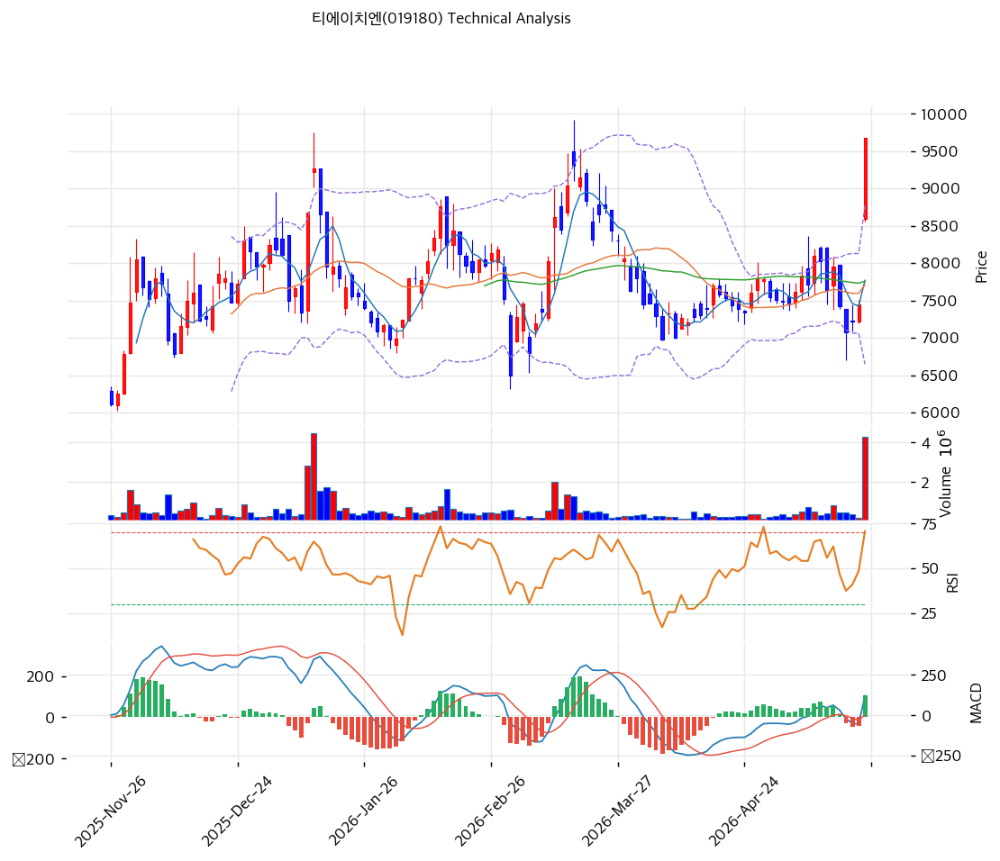

# 기술적분석

2026-05-26 | T2 Technical Analysis

## 차트

## 1. 가격 현황

| 항목        | 값                           |
| --------- | --------------------------- |
| 현재가       | 9,680원 (+29.93%)            |
| 52주 고가/저가 | 9,680 / 2,720원 (pos 100.0%) |
| 거래량       | 20일 평균 대비 11.1x             |

## 2. 차트 패턴 분석

**2.1 캔들스틱** — 장대양봉(Marubozu, 강): +29.93% 상한가 근접 / 갭상승 박스 돌파(강): 6,500\~8,500원 6개월 박스 갭이탈. **2.2 가격 구조** — 박스권 상향 이탈(강): 11.1x 거래량 동반, 측정 목표가 약 10,500원 = 추세선 저항 10,947원 / 52주 신고가 돌파(강): 위에 매물 없음. **2.3 다이버전스** — MACD 강세 전환(중): 3\~4월 0선 아래 약세 → 5월 Hist +108 반전 / RSI 고점 다이버전스 위험(약): RSI 70.5, 추가 신고가에서 미갱신 시 형성. **2.4 종합** — 장대양봉·갭·박스 돌파·신고가 동시 출현 단기 강력 매수. RSI 70.5 / MA60 +24.8% / BB +10% 이탈로 과열 병존. 박스 상단 8,400원 재진입 시 fake-out 경고.

## 3. 이동평균선 — 비정배열 (단기 급등형)

| MA5           | MA20          | MA60          | MA120         | MA200         |
| ------------- | ------------- | ------------- | ------------- | ------------- |
| 7,768(+24.6%) | 7,710(+25.6%) | 7,758(+24.8%) | 7,727(+25.3%) | 6,743(+43.6%) |

5개 MA가 7,700\~7,800원 밀집 수렴에서 +30% 갭상승으로 일거 상방 이탈. 정배열 미형성이나 모멘텀 폭발형. MA20·60 +25% 괴리 단기 과열, 조정 시 8,000원대 되돌림 여지.

## 4. 보조 지표

* **RSI(14) 70.5 🔴과매수**: 70선 돌파 직후, 80 진입 전 모멘텀 연장 가능, 70 재이탈 시 단기 조정 트리거.
* **MACD(12,26,9)**: 121 / Sig 12 / Hist +108, 매수 골든크로스 + 확대 — 추세 가속이나 과확장 동반.
* **볼린저밴드(20,2σ)**: 8,774 / 7,710 / 6,646원, 폭 27.6%. **상단 +10.3% 이탈** — 통계적 회귀 압력.
* **스토캐스틱(14,3,3)**: K=58.8 / D=37.2 / 골든크로스 / 중립 (80선 진입 전).

## 5. 지지/저항

**5.1 피보나치** (Swing 9,300→6,980, 하락): 0.236=7,528 / 0.382=7,866 / 0.5=8,140 / 0.618=8,414 / 0.786=8,804원. 현재가가 Swing High도 돌파 → 피보 저항 의미 약화.

**5.2 추세선** — 지지(상승) 8,019원 / 저항(상승) 10,947원 (각 6개 포인트, 6개월 추세).

**5.3 PRZ** — 8,804\~8,927원(약): 피보 0.786 + 피봇 S1 / 7,528\~8,173원(강): 피보 0.236/0.382/0.5 + MA5/20/60/120 + 추세선 + 피봇 S2.

**5.4 종합 S\&R**

| 구분      | 가격            | 근거               |
| ------- | ------------- | ---------------- |
| 저항      | 10,947원       | 추세선 저항 = 박스 목표가  |
| 저항      | 10,057원       | 피봇 R1            |
| **현재가** | **9,680원**    | 52주 신고가          |
| 지지      | 8,927원        | 피봇 S1            |
| 지지      | 8,173원        | 피봇 S2 + 박스 상단    |
| 지지      | 7,710\~7,866원 | MA20/60 + PRZ(강) |

## 6. 시그널 종합

| 지표    | 내용                | 시그널 |
| ----- | ----------------- | --- |
| 차트 패턴 | 장대양봉+박스 돌파+신고가    | 🟢  |
| 이동평균선 | 5개 MA 위, 단기 급등형   | 🟢  |
| RSI   | 70.5 과매수          | 🔴  |
| MACD  | 골든크로스 + Hist +108 | 🟢  |
| 볼린저밴드 | 상단 +10% 이탈        | 🔴  |
| 스토캐스틱 | K=58.8 골든크로스, 중립  | ⚪   |
| 거래량   | 11.1x — 강력        | 🟢  |

**종합**: 🟢4 / 🔴2 / ⚪1 → **매수우위 (과열 동반)**. 장대양봉+11.1x 거래량 폭발 단기 모멘텀 압도. RSI 70.5/BB +10% 이탈/MA +25% 괴리로 과열 경고 동시. PER 2.5배·ROE 30%·26Q1 OP +417% 펀더멘털 재평가 동반이라 단순 모멘텀과 차별화.

## 7. 전략 제안

**보유 중 — 홀드 + 부분 익절**: 익절1 10,057원(피봇 R1, +3.9%) / 익절2 10,947원(추세선 저항·박스 목표가, +13.1%) / 손절 8,173원(박스 상단 이탈, -15.6%). R:R 약 1:0.8, 8,927원 단기 손절 시 1:1.5.

**진입 대기 — 관망 후 분할** (추격 자제): 1차 8,927원(피봇 S1+PRZ 상단) / 2차 8,019\~8,173원(추세선+박스 재테스트). 조건 — 거래량 감소형 눌림목 + RSI 60 이하 + MACD Hist 유지.
