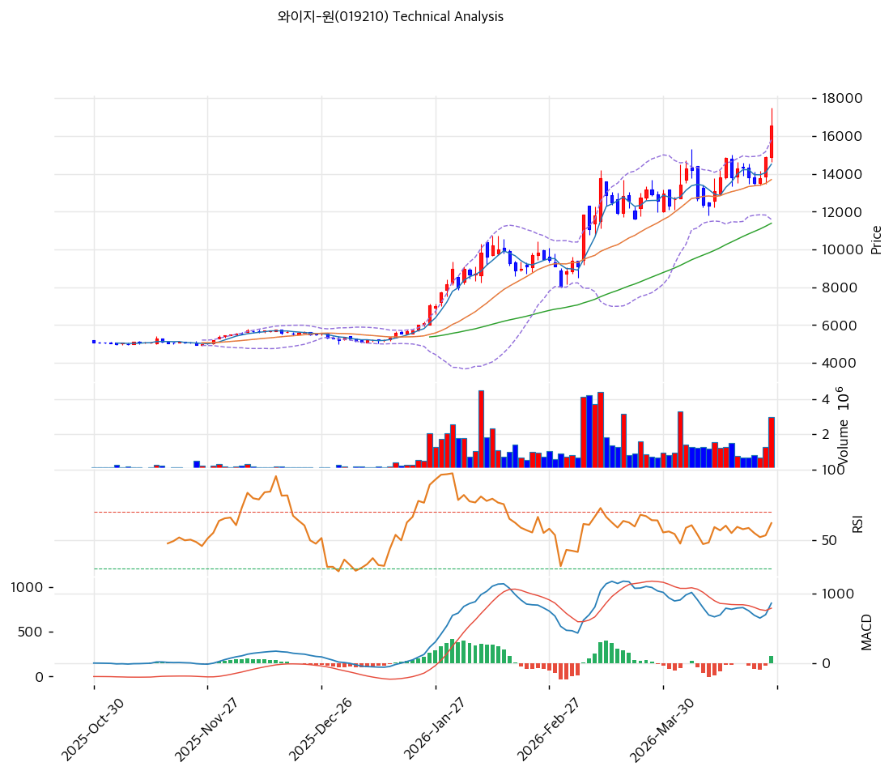

# 와이지-원(019210) 기술적 분석

2026-04-25 | T2 Technical Analysis

---

## 차트

---

## 1. 가격 현황

| 항목 | 값 |
|------|-----|
| 현재가 | 16,560원 (+11.29%) |
| 52주 고가 | 16,560원 (당일 신고가 갱신) |
| 52주 저가 | 4,950원 (pykrx 기준) |
| 52주 범위 위치 | 100.0% (52주 최고가) |
| 거래량 | 20일 평균 대비 2.59x |

---

## 2. 차트 패턴 분석

### 2.1 캔들스틱 패턴

| 패턴 | 위치 | 신뢰도 | 해석 |
|------|------|--------|------|
| 장악형 (상승) | 최근 1~2일 | 강 | 전일 봉을 완전히 포함하는 양봉 출현, 강력 매수 시그널. 거래량 2.59x 동반으로 신뢰도 상승 |
| 갭 상승 돌파 | 당일 | 강 | +11.29% 대량거래 급등. 52주 신고가 갱신 — 추세 전환 확인 |
| 장대 양봉 | 당일 | 강 | 단일 세션 11% 급등, 강력 모멘텀 확인. 단기 과열 경계 필요 |

※ 당일 텅스텐 가격 급등 관련 뉴스 반응으로 급등한 상황

### 2.2 가격 구조 패턴

- **상승 삼각형 돌파** (신뢰도: 강)
  2024년 저점(4,950원)에서 2025년 고점(13,790원)까지 급격한 상승 후 2024~2025년 상반기 횡보 구간(6,000~9,000원)을 형성했다가 2025년 하반기부터 본격 상승 돌파가 시작되었다. 현재 52주 신고가를 갱신하며 상승 모멘텀이 강하게 유지 중이다.

- **V자 반등 구조** (신뢰도: 강)
  2024년 저점(약 4,950원)에서 현재(16,560원)까지 약 235% 급등한 V자 반등 구조를 형성했다. 단기간에 지나치게 가파른 상승으로 되돌림 가능성을 항상 내포하고 있다.

- **52주 고가 저항 돌파 시도** (신뢰도: 중)
  KIS 기준 52주 고가 17,500원이 다음 주요 저항선이다. 당일 16,560원으로 직전 52주 최고가(pykrx 기준 16,560원)를 갱신했으며, KIS 기준으로는 17,500원이 상단 저항이다.

### 2.3 다이버전스

- **RSI 상승 다이버전스 없음** (신뢰도: 해당없음)
  현재 주가가 52주 신고가를 갱신 중이며, RSI(68.3)도 높은 수준으로 가격과 모멘텀이 일치하는 상태다. 다이버전스는 현재 발생하지 않았다.

- **MACD 상승 확인** (신뢰도: 강)
  MACD(863) > Signal(762), 히스토그램 +101로 확대 중이다. 가격 상승과 MACD 확대가 동행하며 추세 지속 시사. 히스토그램 수축 시 주의 신호.

### 2.4 패턴 종합 판단

당일 급등(+11.29%)과 함께 52주 신고가를 갱신했으며, 거래량 2.59배 동반으로 매수 의지가 강하게 확인된다. 단기적으로 장대 양봉 및 갭 상승 이후 조정 가능성이 있으나, MACD 히스토그램 확대와 정배열 이동평균선이 추세 상승을 지지한다. MA20 괴리율이 +20.9%에 달하는 단기 과열 상태로, 17,500원(KIS 52주 고가) 돌파 여부가 다음 관전 포인트다.

---

## 3. 이동평균선 — 정배열 (강세)

| MA | 값 | 현재가 괴리율 | 위치 |
|----|-----|--------------|------|
| MA5 | 14,510원 | +14.1% | 위 |
| MA20 | 13,694원 | +20.9% | 위 |
| MA60 | 11,385원 | +45.5% | 위 |
| MA120 | 8,379원 | +97.6% | 위 |
| MA200 | 7,229원 | +129.1% | 위 |

**해석**: 5개 이동평균선 모두 현재가 아래에 위치하는 완전한 정배열 상태다. MA120 대비 괴리율 +97.6%, MA200 대비 +129.1%로 중장기 관점에서 주가가 크게 상승했음을 의미한다. MA20 괴리율 +20.9%는 단기 과열 경고 수준이며, 과거 사례상 이 수준에서 단기 되돌림이 발생하는 경우가 많다. MA5(14,510원)가 가장 근접한 단기 지지선이다.

---

## 4. 보조 지표

### RSI(14) — 68.3 (중립)

RSI 68.3은 과매수 기준(70)에 근접한 수준으로, 과매수 진입 직전 구간이다. 상승 추세에서 RSI 70 전후는 강세 지속 신호이기도 하나, 단기 조정 가능성도 내포한다. 당일 급등 이후 RSI가 70을 돌파하면 과매수 구간 진입으로 단기 과열 경고가 발동된다.

### MACD(12,26,9)

| 항목 | 값 |
|------|-----|
| MACD | 863 |
| Signal | 762 |
| Histogram | +101 |
| 크로스 상태 | 매수 구간 (확대 중) |

**해석**: MACD가 Signal을 상회하며 매수 구간을 유지 중이다. 히스토그램이 +101로 확대 추세여서 단기 상승 모멘텀이 살아있다. 히스토그램이 수축으로 전환되는 시점이 단기 고점 신호가 될 수 있다.

### 볼린저밴드(20, 2σ)

| 항목 | 값 |
|------|-----|
| 상단 | 15,801원 |
| 중단 (MA20) | 13,694원 |
| 하단 | 11,587원 |
| 밴드 폭 | 30.8% |
| 현재 위치 | 상단 초과 |

**해석**: 현재가(16,560원)가 볼린저밴드 상단(15,801원)을 이미 초과했다. 밴드 폭 30.8%로 이미 확장 국면이며, 상단 이탈 상태는 강한 상승 모멘텀을 의미하나 단기 과열을 경고한다. 볼린저밴드 중단(MA20=13,694원)이 1차 지지선이다.

### 스토캐스틱(14, 3, 3)

| 항목 | 값 |
|------|-----|
| Slow %K | 75.8 |
| Slow %D | 64.8 |
| 크로스 상태 | 골든크로스 |
| 판단 | 중립 (과매수 근접) |

---

## 5. 지지/저항 — 추세선 · 피보나치 · PRZ 통합

### 5.1 피보나치 되돌림/확장

| 구분 | 비율 | 가격 | 현재가 대비 |
|------|------|------|-----------|
| Swing High | — | 13,790원 | — |
| 되돌림 | 0.236 | 12,435원 | -24.9% |
| 되돌림 | 0.382 | 11,597원 | -30.0% |
| 되돌림 | 0.5 | 10,920원 | -34.1% |
| 되돌림 | 0.618 | 10,243원 | -38.2% |
| 되돌림 | 0.786 | 9,278원 | -44.0% |
| Swing Low | — | 8,050원 | — |
| 확장 | 1.272 | 15,351원 | -7.3% |
| 확장 | 1.382 | 15,983원 | -3.5% |
| 확장 | 1.618 | 17,337원 | +4.7% |
| 확장 | 2.0 | 19,530원 | +17.9% |

※ 피보나치 기준: 상승 추세 (Swing Low 8,050원 → Swing High 13,790원) 기준

### 5.2 추세선

| 추세선 | 방향 | 현재 교차가 | 포인트 수 | 해석 |
|--------|------|-----------|---------|------|
| 지지선 | 상승 | 7,919원 | 6개 | 장기 상승 채널 하단. 현재가와 거리 크게 이격 |
| 저항선 | 상승 | 15,518원 | 6개 | 이미 상향 돌파. 현재 지지선으로 전환 가능 |

### 5.3 PRZ (Potential Reversal Zone)

| 방향 | 가격 범위 | 신뢰도 | 근거 |
|------|---------|--------|------|
| 지지 | 15,351~15,518원 | 약 | 피보나치 1.272 확장 + 추세선 저항 (돌파 후 지지 전환) |

### 5.4 종합 지지/저항 테이블

| 구분 | 가격 | 근거 |
|------|------|------|
| 저항 | 17,500원 | KIS 52주 고가 |
| 저항 | 17,337원 | 피보나치 1.618 확장 |
| 저항 | 17,835원 | 피봇 R1 |
| **현재가** | **16,560원** | — |
| 지지 | 15,801원 | 볼린저밴드 상단 (돌파 후 지지) |
| 지지 | 15,518원 | 추세선 저항 → 지지 전환 |
| 지지 | 15,351원 | 피보나치 1.272 확장 |
| 지지 | 14,950원 | 피봇 S1 |
| 지지 | 14,510원 | MA5 |
| 지지 | 13,694원 | MA20, 볼린저밴드 중단, 피봇 S2 인근 |

---

## 6. 시그널 종합

| 지표 | 내용 | 시그널 |
|------|------|--------|
| **차트 패턴** | 장대 양봉 + 52주 신고가 갱신 + 거래량 동반 | 🟢 |
| 이동평균선 | 완전 정배열, MA20 +20.9% 과열 | 🔴 (과열) |
| RSI | 68.3 — 과매수 근접 | ⚪ |
| MACD | 매수구간, 히스토그램 확대 | 🟢 |
| 볼린저밴드 | 상단 초과, 밴드폭 30.8% | ⚪ |
| 스토캐스틱 | 골든크로스, K=75.8 | ⚪ |
| 거래량 | 2.59x — 강력 동반 | 🟢 |

**종합 판단**: 🟢 매수 3개 / 🔴 매도 1개 / ⚪ 중립 3개 → **매수우위 (단기 과열 경고)**

정배열, MACD 확대, 강한 거래량이 상승 추세를 지지하나, MA20 괴리 +20.9%, 볼린저밴드 상단 이탈, RSI 70 근접으로 단기 조정 리스크가 상존한다. 텅스텐 가격 관련 모멘텀이 지속된다면 17,500원(KIS 52주 고가) 돌파 시도가 가능하며, 조정 시 15,350~15,800원 PRZ 구간이 1차 지지 역할을 할 것으로 예상된다.

---

## 7. 전략 제안

### 보유 중인 경우
- **홀드**
- 익절 라인: 16,891원 (피봇 R1 17,835원과 현재가 사이 중간, 단기 과열 구간)
- 손절 라인: 13,340원 (피봇 S2, MA20 하단)
- 리스크/리워드: 약 1:2 (손절 -19.4% vs 익절 +2.0%) — 단기 관점에서 리워드 제한적

### 진입 대기인 경우
- **관망**
- 1차 진입가: 14,950원 (피봇 S1, 단기 되돌림 후 지지 확인 시)
- 2차 진입가: 13,694원 (MA20, 볼린저밴드 중단 — 강한 지지)
- 진입 조건: 급등 후 거래량 감소와 함께 PRZ(15,350~15,800원) 또는 피봇 S1(14,950원) 구간에서 반등 캔들 확인 후 진입
