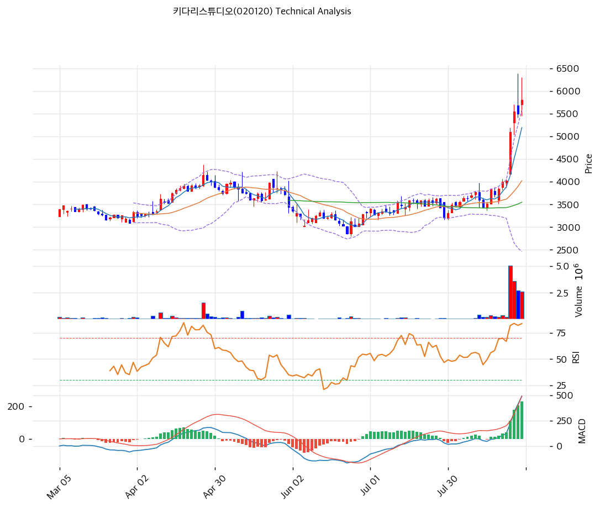

# 키다리스튜디오(020120) 기술적 분석

## 차트

## 가격 현황

| 항목 | 값 |
|---|---|
| 현재가 | **5,800원** (**+5.45%**) |
| 당일 시가 / 고가 / 저가 | 5,700 / **6,300** / 5,450원 |
| 52주 고 / 저 | **6,390원** (2026-08-26) / **2,800원** (2026-06-24) |
| **52주 위치** | **83.6%** |
| 고점 대비 | -9.2% |
| **저점 대비** | **+107.1%** |
| **4거래일 상승률** | **+44.3%** (8/21 4,020원 → 8/27 5,800원) |
| RSI(14) | **82.8** (과매수) |
| MACD | 492 / 262 / **+229** (전 +206) |
| Stochastic | K=80.5 D=81.6 |
| 볼린저(20) | 상단 5,585 / 중단 4,022 / 하단 2,460, 폭 **77.7%** |
| **거래량** | **2,603,036주** (20일 평균 대비 **3.09배**) |
| **회전율** | **7.19%** (유통 36,213,313주) |

⚠️ **종가 5,800원이 볼린저 상단 5,585원을 3.8% 넘어섰다.** 밴드 폭이 77.7%로 극도로 벌어져 있다.

## 수익률

| 기간 | 수익률 | 당시 가격 |
|---|--:|--:|
| **1개월** | **+69.1%** | 3,430원 |
| 3개월 | +51.4% | 3,830원 |
| 6개월 | +52.4% | 3,805원 |
| 1년 | +40.6% | 4,125원 |
| 2년 | +68.1% | 3,450원 |

**1개월 수익률(+69.1%)이 1년(+40.6%)보다 크다.** 상승분 대부분이 최근 한 달, 그중에서도 최근 4거래일에 몰려 있다.

## 이동평균선

| MA | 가격(원) | 갭 | 위치 |
|---|--:|--:|---|
| MA5 | 5,194 | **+11.7%** | 위 |
| **MA20** | **4,022** | **+44.2%** | 위 |
| **MA60** | **3,548** | **+63.5%** | 위 |
| MA120 | 3,567 | +62.6% | 위 |
| MA200 | 3,534 | +64.1% | 위 |

→ **5개선 완전 정배열이지만 이격이 극단적이다.** MA60·MA120·MA200이 3,534\~3,567원 좁은 구간에 몰려 있고 현재가는 그보다 63% 위에 있다.

**MA60·120·200이 붙어 있다는 것은 장기간 3,500원대에서 균형을 이뤘다는 뜻**이며, 최근 4거래일에 그 균형이 깨졌다.

## 상승 경로

| 일자 | 종가 | 등락 | 거래량 | 비고 |
|---|--:|--:|--:|---|
| **2026-06-24** | 2,800원(장중) | | | **52주 최저 · 자사주 신탁 재체결일** |
| 2026-08-03 | 3,450원 | | 64,833 | |
| 2026-08-10 | 3,770원 | +2.0% | 127,769 | |
| **2026-08-11** | **3,605원** | **-4.4%** | **438,738** | **Q2 잠정실적 공시 (영업이익 +193.2%)** |
| 2026-08-12 | 3,425원 | -5.0% | 219,218 | |
| 2026-08-13 | 3,510원 | +2.5% | 222,799 | |
| **2026-08-14** | 3,840원 | **+9.4%** | 375,167 | **반기보고서 제출** |
| 2026-08-18 | 3,715원 | -3.3% | 303,485 | |
| 2026-08-19 | 3,845원 | +3.5% | 212,766 | |
| 2026-08-20 | 3,995원 | +3.9% | 381,725 | |
| 2026-08-21 | 4,020원 | +0.6% | 212,998 | |
| **2026-08-24** | **5,100원** | **+26.9%** | **5,005,960** | **20일 평균의 6배** |
| 2026-08-25 | 5,550원 | +8.8% | 3,581,039 | |
| **2026-08-26** | 5,500원 | -0.9% | 2,682,977 | **장중 6,390원 52주 신고가** |
| **2026-08-27** | **5,800원** | **+5.45%** | 2,603,036 | 장중 6,300원 |

**순서가 특이하다.**

**8월 11일 Q2 잠정실적 공시일에 주가는 4.4% 빠졌다.** 영업이익이 전년 동기 대비 193.2% 늘었다는 내용이었는데 시장은 반대로 반응했다. 다음 날에도 5.0% 더 빠졌다.

**8월 14일 반기보고서 제출일에 9.4% 올랐고**, 그 뒤 일주일간 3,700\~4,000원대에서 완만하게 올라갔다.

**그리고 8월 24일 아무 공시 없이 26.9% 급등했다.** 거래량 5,005,960주는 20일 평균의 6배이며, 8월 21일 거래량(212,998주)의 23배다.

⚠️ **8월 14일 반기보고서 이후 새 공시가 없다.** 8월 24일 급등의 계기를 DART 공시에서 찾을 수 없다.

## 수급

| 항목 | 수치 |
|---|--:|
| 8/27 거래량 | 2,603,036주 |
| 20일 평균 거래량 | 841,897주 |
| 비율 | **3.09배** |
| 유통주식수 | 36,213,313주 |
| **회전율** | **7.19%** |
| **외국인 20일 순매수** | **+1,381,192주 (약 75.1억)** |
| **외국인 5일 순매수** | **+1,436,114주** |
| 기관 20일 순매수 | -128,523주 |
| 기관 5일 순매수 | -401,246주 |

⚠️ **외국인 5일 순매수(1,436,114주)가 20일 순매수(1,381,192주)보다 많다.** 그 이전 15거래일은 순매도였고 최근 5일에 매수가 몰렸다는 뜻이다.

**일별 외국인 순매수**

| 일자 | 외국인 | 기관 | 개인 |
|---|--:|--:|--:|
| 8/24 | **+398,806** | -135,203 | -252,929 |
| 8/25 | **+447,452** | -320,569 | +191,005 |
| 8/26 | **+396,787** | -37,988 | -216,536 |
| 8/27 | **+186,331** | +83,473 | +165,085 |
| **4일 합계** | **+1,429,376** | **-410,287** | |

**외국인이 4거래일간 1,429,376주(유통주식의 3.9%)를 순매수했고 기관은 410,287주를 순매도했다.** 이번 급등은 외국인이 주도했다.

## 시그널 종합

| 구분 | 카운트 |
|---|--:|
| 매수 | 3 |
| 매도 | 0 |
| 과열 경고 | 3 |
| **결론** | **강한 상승 추세, 극단적 과열** |

- 🟢 **이동평균** 5개선 완전 정배열, MA60·120·200 밀집대를 대량 거래로 돌파
- 🟢 **MACD** 492 > 시그널 262, 히스토그램 +229로 확대 중
- 🟢 **거래량** 20일 평균의 3.09배, 회전율 7.19%
- 🔴 **RSI 82.8** 과매수 구간 깊숙이
- 🔴 **볼린저 상단 이탈** 종가 5,800이 상단 5,585를 3.8% 초과, 밴드 폭 77.7%
- 🔴 **MA20 이격 +44.2%** 정상 범위를 크게 벗어남

**매수 신호와 과열 신호가 동시에 최대치다.** 추세 자체는 강하지만 이격이 지속 불가능한 수준이다.

## 지지·저항

| 구분 | 가격(원) | 근거 |
|---|--:|---|
| 저항 | 7,150 | 당일 상한가 |
| 저항 | 6,700 | 피봇 R2 |
| **강 저항** | **6,390** | **52주 최고 (8/26 장중)** |
| 저항 | 6,300 | 8/27 장중 고가 |
| 저항 | 6,250 | 피봇 R1 |
| **현재가** | **5,800** | |
| 지지 | 5,622 | 피보나치 0.786 되돌림 |
| 지지 | 5,585 | 볼린저 상단 (이탈 후 지지 전환 여부) |
| 지지 | 5,450 | 8/27 장중 저가 |
| 지지 | 5,400 | 피봇 S1 |
| 지지 | 5,194 | MA5 |
| 지지 | 5,019 | 피보나치 0.618 되돌림 |
| 지지 | 5,000 | 피봇 S2 |
| **주요 지지** | **4,595** | **피보나치 0.5 되돌림** |
| 지지 | 4,171 | 피보나치 0.382 되돌림 |
| **강 지지** | **3,995\~4,022** | **MA20 · 8/20\~21 박스권** |
| 지지 | 3,647 | 피보나치 0.236 되돌림 |
| **최종 지지** | **3,534\~3,567** | **MA60 · MA120 · MA200 밀집** |
| 최종 지지 | 2,800 | 52주 최저 (2026-06-24) |

※ 피보나치는 상승 추세 기준(저점 2,800원 → 고점 6,390원)

⚠️ **현재가 아래 지지가 촘촘해 보이지만 대부분 최근 4거래일에 만들어진 것이다.** 실질적으로 두꺼운 지지는 **3,995\~4,022원(MA20 + 급등 직전 박스권)**과 **3,534\~3,567원(MA60·120·200 밀집)** 두 곳이다.

**4,595원(피보나치 0.5)이 급등분 절반 되돌림 지점**이며 현재가에서 -20.8%다.

## 전략

| 시나리오 | 액션 |
|---|---|
| 보유자 | **홀드** (TP 1차 6,390원 52주 고가 / SL 4,595원 피보 0.5) |
| 신규 진입 | **대기.** 현재가 추격 진입은 손익비가 나쁘다 |
| 진입 검토 1차 | **4,595\~5,019원** (피보 0.5\~0.618, -13\~21%) |
| 진입 검토 2차 | **3,995\~4,171원** (MA20·급등 직전 박스, -28\~31%) |
| 추세 확장 확인 | **6,390원 거래량 동반 돌파 후 안착** |
| 손절 기준 | 4,595원 이탈 |
| 이벤트 | **11월 중순 3분기 보고서** |

## 핵심 판단

차트는 **긴 바닥 뒤의 폭발적 돌파**를 보여주지만 동시에 **지속 불가능한 이격**을 보여준다.

MA60(3,548) · MA120(3,567) · MA200(3,534)이 33원 안에 몰려 있었다. 반년 넘게 3,500원대에서 균형을 이뤘다는 뜻이다. 그 균형이 8월 24일 거래량 5,005,960주(20일 평균의 6배)와 함께 깨졌고, 4거래일 만에 44.3%가 올랐다.

**주목할 세 가지가 있다.**

**① 실적 공시일에는 오히려 빠졌다.** 8월 11일 Q2 잠정실적에서 영업이익이 전년 대비 193.2% 늘었다고 발표했는데 그날 주가는 4.4%, 다음 날 5.0% 빠졌다. 재무 데이터로 움직인 상승이 아니다.

**② 급등의 계기가 공시에 없다.** 8월 14일 반기보고서 이후 DART에 새 공시가 없다. 8월 24일 +26.9%의 근거를 공개 자료에서 확인하지 못했다.

**③ 외국인이 주도했다.** 4거래일간 외국인 순매수 1,429,376주(유통주식의 3.9%), 기관 순매도 410,287주다. 외국인 5일 순매수가 20일 순매수보다 많다는 것은 그 이전에는 팔고 있었다는 뜻이다.

**기술적으로 읽을 수 있는 것은 두 가지다.**

**돌파의 질 자체는 나쁘지 않다.** 물량이 실렸고(회전율 7.19%) MACD 히스토그램도 확대 중이며 5개선이 정배열이다.

**그러나 이격이 극단적이다.** RSI 82.8, MA20 대비 +44.2%, MA60 대비 +63.5%, 볼린저 상단 3.8% 초과에 밴드 폭 77.7%다. 이 상태는 며칠 이상 유지되기 어렵다.

**보유자는 홀드, 신규는 대기가 맞다.** 6,390원(52주 고가)을 거래량 동반해 넘으면 추세가 연장되고, 그렇지 않으면 4,595원(피보 0.5)까지 되돌림을 봐야 한다. 급등 직전 박스권인 3,995\~4,022원이 마지막 방어선이며, 이 자리는 MA20과도 겹친다.

⚠️ **추격 매수는 권하지 않는다.** 상승 근거가 공시로 확인되지 않은 상태에서 4거래일 +44.3% 지점에 들어가는 것은 손익비가 맞지 않는다.
