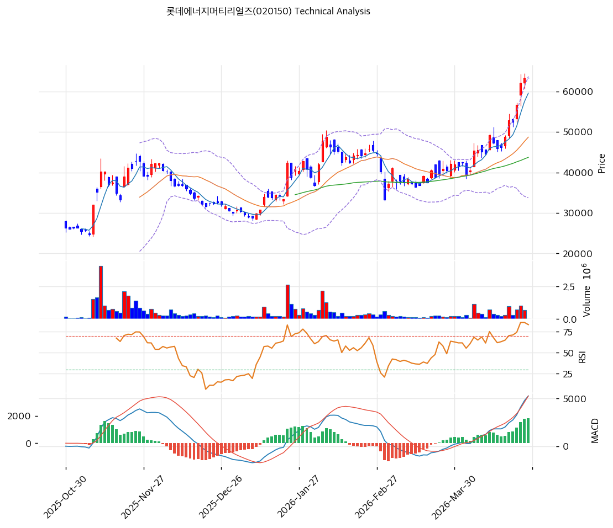

# 롯데에너지머티리얼즈(020150) 기술적 분석

2026-04-24 | T2 Technical Analysis

---

## 차트

---

## 1. 가격 현황

| 항목 | 값 |
|------|-----|
| 현재가 | 63,400원 (+0.00%) |
| 52주 고가 | 63,400원 |
| 52주 저가 | 19,730원 |
| 52주 범위 위치 | 100.0% |
| 거래량 | 20일 평균 대비 0.0x (데이터 미집계) |

---

## 2. 차트 패턴 분석

### 2.1 캔들스틱 패턴

| 패턴 | 위치 | 신뢰도 | 해석 |
|------|------|--------|------|
| 상승 추세 지속 | 최근 20일 | 강 | 19,730원 저점에서 63,400원까지 급등, 연속 양봉 흐름 지속으로 추세 매수 우위 유지 |
| 장대양봉 돌파 | 중기 구간 | 중 | 40,000~50,000원 박스권 상단 돌파 이후 추가 양봉 연속으로 상승 모멘텀 확인 |
| 특이 캔들 패턴 | 최근 3일 | 중 | 52주 고가(63,400원) 인근에서 거래 집중 — 고점 부근 횡보 캔들로 추가 상승 동력 확인 필요 |

### 2.2 가격 구조 패턴

- **상승 추세 채널** (신뢰도: 강)
  2025년 10월 저점 19,730원에서 2026년 4월 63,400원까지 약 6개월간 +221% 상승. 상승 추세 지지선(기울기 55.42, 현재 교차가 32,087원)과 추세 저항선(기울기 157.28, 현재 교차가 57,891원) 사이에서 가격이 형성되다가 최근 상단을 상향 돌파한 상태. 현재 가격이 저항 추세선(57,891원)을 약 9.5% 상회하여 기술적 과열 구간.

- **박스권 돌파 후 상승** (신뢰도: 중)
  2025년 초~중반 20,000~30,000원 박스권에서 긴 횡보 후, 2025년 하반기부터 단계적 상승 전환. 각 박스권 상단 돌파 시 거래량 증가 동반 여부 확인이 중요하나, 현재 거래량 데이터는 평균치 집계 미비 상태.

- **52주 신고가 돌파** (신뢰도: 강)
  현재 가격 63,400원이 52주 고가이자 저항 없는 구간(All-time-recent-high). 기술적 저항선이 없는 반면, 가격이 기 확인된 지지선(MA20: 48,738원, MA60: 43,738원)에서 크게 이격된 상태로 조정 시 낙폭 가능성 주의.

### 2.3 다이버전스

- **RSI 하락 다이버전스** (신뢰도: 중)
  가격은 52주 신고가를 기록 중이나 RSI는 78.6으로 이전 과매수 고점과 유사 수준 유지. 엄밀한 다이버전스보다는 과매수 구간 진입으로 상승 모멘텀 둔화 가능성 시사. 단기 조정 또는 고점 확인 신호로 해석.

- **MACD 히스토그램 상승 확대** (신뢰도: 중)
  MACD(5,267)와 Signal(3,444)의 괴리(히스토그램 +1,823)가 확대 중으로 추세 강도가 여전히 살아있음을 확인. 그러나 과열 구간에서의 히스토그램 확대는 추세 후반부에 나타나는 패턴이기도 하여 주의 필요.

### 2.4 패턴 종합 판단

차트는 강력한 상승 추세를 유지하고 있으나, 현재 52주 신고가(100% 위치)·RSI 과매수(78.6)·볼린저밴드 상단 밀착의 삼중 과열 신호가 동시에 발생 중이다. MACD 매수 구간 유지와 정배열이라는 상승 요인과, RSI·스토캐스틱 과매수 및 이격도 과대(MA20 대비 +30%)라는 경계 신호가 상충한다. 단기적으로는 차익실현 압력이 커질 수 있는 구간이나, 강한 모멘텀이 이어질 경우 추가 상승 가능성도 열려 있다.

---

## 3. 이동평균선 — 정배열 (강세)

| MA | 값 | 현재가 괴리율 | 위치 |
|----|-----|--------------|------|
| MA5 | 59,620원 | +6.3% | 위 |
| MA20 | 48,738원 | +30.1% | 위 |
| MA60 | 43,738원 | +45.0% | 위 |
| MA120 | 39,123원 | +62.1% | 위 |
| MA200 | 33,394원 | +89.9% | 위 |

**해석**: MA5→MA20→MA60→MA120→MA200 완전 정배열 달성. 모든 이동평균선 위에 현재가가 위치하여 추세 강도는 최강. 단, MA20 대비 +30.1%, MA200 대비 +89.9%의 이격률은 단기 조정 시 되돌림 폭이 클 수 있음을 시사. MA20(48,738원)이 1차 이격 조정 목표이자 핵심 지지선.

---

## 4. 보조 지표

### RSI(14) — 78.6 (🔴과매수)

RSI 78.6은 명확한 과매수 구간(기준선 70 초과)으로, 단기 상승 속도 둔화 또는 조정 가능성을 경고. 다만 강한 상승 추세에서는 과매수 구간이 장기화될 수 있어 단독으로 매도 신호로 판단하기보다 다른 지표와 병행 판단 필요.

### MACD(12,26,9)

| 항목 | 값 |
|------|-----|
| MACD | 5,267 |
| Signal | 3,444 |
| Histogram | +1,823 |
| 크로스 상태 | 매수 구간 (확대 중) |

**해석**: MACD가 Signal 위에 위치하고 히스토그램이 확대 중으로 상승 추세 모멘텀이 유지되고 있음. 히스토그램 값이 양수이며 증가 추세이나, 절대값 수준이 높아 피크아웃 여부 모니터링 필요.

### 볼린저밴드(20, 2σ)

| 항목 | 값 |
|------|-----|
| 상단 | 63,736원 |
| 중단 (MA20) | 48,738원 |
| 하단 | 33,739원 |
| 밴드 폭 | 61.5% |
| 현재 위치 | 상단 근접 |

**해석**: 현재가(63,400원)가 볼린저밴드 상단(63,736원)에 거의 밀착. 밴드 폭 61.5%는 변동성이 크게 확장된 상태로, 스퀴즈 해소 후 추세 연장 구간. 상단 근접 위치는 단기 과열이지만 강한 추세에서 밴드 상단이 워킹(walking the band)하는 패턴 가능성도 존재.

### 스토캐스틱(14, 3, 3)

| 항목 | 값 |
|------|-----|
| Slow %K | 93.7 |
| Slow %D | 93.4 |
| 크로스 상태 | 골든크로스 |
| 판단 | 과매수 |

---

## 5. 지지/저항 — 추세선 · 피보나치 · PRZ 통합

### 5.1 피보나치 되돌림/확장

※ 피보나치 기준: 하락 추세 (Swing High 48,850원 → Swing Low 33,250원) 기준 되돌림

| 구분 | 비율 | 가격 | 현재가 대비 |
|------|------|------|-----------|
| Swing High | — | 48,850원 | -23.0% |
| 되돌림 | 0.236 | 36,932원 | -41.7% |
| 되돌림 | 0.382 | 39,209원 | -38.1% |
| 되돌림 | 0.5 | 41,050원 | -35.2% |
| 되돌림 | 0.618 | 42,891원 | -32.3% |
| 되돌림 | 0.786 | 45,512원 | -28.2% |
| Swing Low | — | 33,250원 | -47.6% |

※ 현재가(63,400원)는 피보나치 되돌림 범위를 크게 상회하는 상승 국면으로, 되돌림 레벨은 조정 시 지지 기준점으로 활용.

### 5.2 추세선

| 추세선 | 방향 | 현재 교차가 | 포인트 수 | 해석 |
|--------|------|-----------|---------|------|
| 지지선 | 상승 | 32,087원 | 6개 | 장기 상승 추세 하단 지지, 현재가와 이격 97.6% |
| 저항선 | 상승 | 57,891원 | 6개 | 단기 상승 추세 상단, 현재가가 이를 +9.5% 상향 돌파 |

### 5.3 PRZ (Potential Reversal Zone)

| 방향 | 가격 범위 | 신뢰도 | 근거 |
|------|---------|--------|------|
| 지지 | 63,400원 | 강 | 피봇 R1, 피봇 R2, 피봇 S1 집중 구간 (현재가와 동일) |
| 지지 | 48,700~49,000원 | 강 | MA20, 볼린저밴드 중단 수렴 구간 |
| 지지 | 43,700~44,000원 | 중 | MA60 위치 |

### 5.4 종합 지지/저항 테이블

| 구분 | 가격 | 근거 |
|------|------|------|
| 저항 | 63,736원 | 볼린저밴드 상단 |
| **현재가** | **63,400원** | — |
| 지지 | 57,891원 | 추세선 저항(상승) 교차가 |
| 지지 | 48,738원 | MA20 (1차 지지) |
| 지지 | 43,738원 | MA60 (2차 지지) |
| 지지 | 39,123원 | MA120 |
| 지지 | 33,394원 | MA200 / 장기 추세 하단 |

---

## 6. 시그널 종합

| 지표 | 내용 | 시그널 |
|------|------|--------|
| **차트 패턴** | 52주 신고가, 강한 상승 추세 but 과열 | ⚪ |
| 이동평균선 | 완전 정배열, MA20 +30.1% 이격 | 🟢 |
| RSI | 78.6 — 과매수 | 🔴 |
| MACD | 매수 구간, 히스토그램 확대 중 | 🟢 |
| 볼린저밴드 | 상단 밀착, 밴드 폭 61.5% 확장 | ⚪ |
| 스토캐스틱 | K=93.7, 과매수 구간 | 🔴 |
| 거래량 | 데이터 미집계 (0.0x) | ⚪ |

**종합 판단**: 🟢 매수 2개 / 🔴 매도 2개 / ⚪ 중립 3개 → **중립 (단기 과열 경계)**

정배열과 MACD 매수 구간이라는 추세 강세 신호가 유효하나, RSI·스토캐스틱 과매수 및 볼린저밴드 상단 밀착으로 단기 조정 가능성이 상존한다. 52주 신고가 구간에서 차익실현 매물이 출회될 수 있어 신규 진입보다는 보유 포지션 관리 전략이 적합한 구간이다. 중기 추세는 여전히 상승 모멘텀이 살아있으므로, 조정 시 MA20(48,738원) 내외가 재진입 고려 구간.

---

## 7. 전략 제안

### 보유 중인 경우
- **비중축소**
- 익절 라인: 64,668원 (볼린저밴드 상단 상향 돌파 시 단기 목표)
- 손절 라인: 59,620원 (MA5 이탈 시 단기 추세 약화)
- 리스크/리워드: 약 0.5:1 (현 구간에서 신규 비중 확대 불리)

### 진입 대기인 경우
- **관망**
- 1차 진입가: 57,000~58,000원 (추세선 저항 교차가 57,891원 근방, 조정 시)
- 2차 진입가: 48,000~49,000원 (MA20 지지 확인 시)
- 진입 조건: RSI 70 이하 복귀 + 거래량 동반 반등 확인 후 진입 고려
