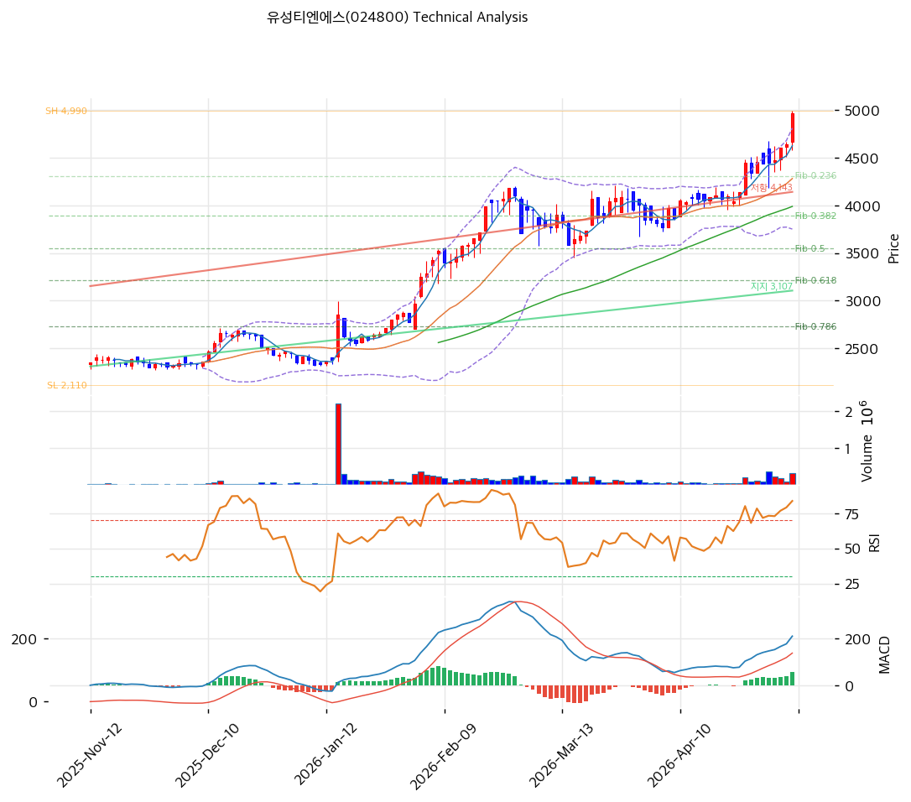

# 유성티엔에스(024800) 기술적 분석

2026-05-11 | T2 Technical Analysis

---

## 차트

---

## 1. 가격 현황

| 항목 | 값 |
|------|-----|
| 현재가 | 4,965원 (+7.0%) |
| 52주 고가 | 4,990원 |
| 52주 저가 | 2,270원 |
| 52주 범위 위치 | 100.0% (당일 신고가) |
| 거래량 | 20일 평균 대비 3.19x |

---

## 2. 차트 패턴 분석

### 2.1 캔들스틱 패턴

| 패턴 | 위치 | 신뢰도 | 해석 |
|------|------|--------|------|
| 장대양봉 (52주 신고가 갱신) | 당일 (5/11) | 강 | +7.0%, 4,990원 직전 도달 |
| 적삼병 (양봉 연속) | 최근 7~10일 | 강 | 4,200→4,965원 +18% 연속 상승 |
| 박스 상향 가속 | 최근 4주 | 강 | 2,500~3,500원 박스 돌파 후 가속 |

### 2.2 가격 구조 패턴

- **장기 박스권 상향 돌파 후 가속** (신뢰도: 강)
  2025-11~2026-02 약 2,300~3,000원 박스권 → 2026-03 박스 돌파 + 거래량 동반 가속. 박스 폭(약 700원)을 측정 타깃 적용 시 약 3,700원 도달했어야 하나, 실제 4,965원으로 **측정 타깃 +34% 초과** — 강한 추세 과확장.

- **상승 추세 채널 유지** (신뢰도: 중)
  지지 추세선(slope 6.69, 6포인트) 현재 3,107원, 저항 추세선(slope 8.31) 현재 4,143원. 현재가 4,965원은 **채널 저항 추세선 +20% 이탈** — 채널 이탈 가속 구간.

### 2.3 다이버전스

- **RSI 다이버전스 미관찰** — RSI 79.2로 가격 동행
- **MACD 모멘텀 확대** — MACD 209 > Signal 153, 히스토그램 +56 확대

### 2.4 패턴 종합 판단

신고가 + 거래량 3.19x + 적삼병의 매수 시그널 정렬. 다만 **RSI 79.2 + MA200 괴리 +66.8% + 스토캐스틱 K=94.3의 극단 과열**. 채널 상단 +20% 이탈 + 측정 타깃 초과로 평균회귀 압력 강함. 단기 조정 후 재평가 시점 임박.

---

## 3. 이동평균선 — 정배열 (극단적 강세, 과열)

| MA | 값 | 현재가 괴리율 | 위치 |
|----|-----|--------------|------|
| MA5 | 4,626원 | +7.3% | 위 |
| MA20 | 4,282원 | +16.0% | 위 |
| MA60 | 3,989원 | +24.5% | 위 |
| MA120 | 3,274원 | +51.6% | 위 |
| MA200 | 2,977원 | **+66.8%** | 위 |

**해석**: 완벽한 정배열, MA200 대비 +66.8% 누적 상승. MA20 +16%는 임계(+20%) 미만이라 단기 과열은 중간 수준이나 장기 누적 상승이 큼. 평균회귀 1차 타깃 MA5(4,626원, -6.8%), 2차 MA20(4,282원, -13.8%).

---

## 4. 보조 지표

### RSI(14) — 79.2 (🔴 과매수)

70 임계 초과 + 80 임계 근접. 매도 시그널 활성화 영역.

### MACD(12,26,9)

| 항목 | 값 |
|------|-----|
| MACD | 209 |
| Signal | 153 |
| Histogram | +56 |
| 크로스 상태 | 매수 (확대 중) |

**해석**: 매수 모멘텀 견고. 히스토그램 확대 중이라 단기 추세 유지.

### 볼린저밴드(20, 2σ)

| 항목 | 값 |
|------|-----|
| 상단 | 4,812원 |
| 중단 (MA20) | 4,282원 |
| 하단 | 3,751원 |
| 밴드 폭 | 24.8% |
| 현재 위치 | 상단 +3.2% 이탈 |

**해석**: 상단 이탈 + 밴드폭 24.8% 정상보다 확장. 단기 조정 후 밴드 안쪽 회귀 가능성.

### 스토캐스틱(14, 3, 3)

| 항목 | 값 |
|------|-----|
| Slow %K | 94.3 |
| Slow %D | 85.7 |
| 크로스 상태 | 골든크로스 |
| 판단 | **과매수** |

K 94.3은 극단 과매수. 단기 매도 시그널.

---

## 5. 지지/저항 — 추세선 · 피보나치 · PRZ 통합

### 5.1 피보나치 되돌림/확장

| 구분 | 비율 | 가격 | 현재가 대비 |
|------|------|------|-----------|
| Swing High | — | 4,990원 | +0.5% |
| 되돌림 | 0.236 | 4,310원 | -13.2% |
| 되돌림 | 0.382 | 3,890원 | -21.7% |
| 되돌림 | 0.5 | 3,550원 | -28.5% |
| 되돌림 | 0.618 | 3,210원 | -35.3% |
| 되돌림 | 0.786 | 2,726원 | -45.1% |
| Swing Low | — | 2,110원 | -57.5% |
| 확장 | 1.272 | 5,773원 | +16.3% |
| 확장 | 1.382 | 6,090원 | +22.7% |
| 확장 | 1.618 | 6,770원 | +36.4% |
| 확장 | 2.0 | 7,870원 | +58.5% |

※ 상승 추세 (Swing Low 2,110원 → High 4,990원)

### 5.2 추세선

| 추세선 | 방향 | 현재 교차가 | 포인트 수 | 해석 |
|--------|------|-----------|---------|------|
| 지지선 | 상승 | 3,107원 | 6개 | 장기 상승 추세선 |
| 저항선 | 상승 | 4,143원 | 6개 | 채널 상단, +20% 이탈 |

### 5.3 PRZ (Potential Reversal Zone)

| 방향 | 가격 범위 | 신뢰도 | 근거 |
|------|---------|--------|------|
| 지지 | 4,626~4,700원 | 약 | MA5, 피봇 S1 |
| 지지 | 4,282~4,310원 | 약 | MA20, 피보 0.236 |
| 지지 | 3,890~3,989원 | 약 | 피보 0.382, MA60 |

### 5.4 종합 지지/저항 테이블

| 구분 | 가격 | 근거 |
|------|------|------|
| 저항 | 5,773원 | 피보 1.272 확장 |
| 저항 | 5,110원 | 피봇 R1 |
| **현재가** | **4,965원** | 52주 신고가 |
| 지지 | 4,700원 | 피봇 S1 |
| 지지 | 4,435원 | 피봇 S2 |
| 지지 | 4,282원 | MA20 (1차 매수 영역) |
| 지지 | 3,890~3,989원 | 피보 0.382 + MA60 |
| 지지 | 3,107원 | 추세선 지지 (장기) |

---

## 6. 시그널 종합

| 지표 | 내용 | 시그널 |
|------|------|--------|
| **차트 패턴** | 신고가 + 적삼병 + 박스 돌파 가속 | 🟢 |
| 이동평균선 | 정배열, MA20 +16.0% | 🟢 |
| RSI | 79.2 — 🔴 과매수 | 🔴 |
| MACD | 매수, 히스토그램 확대 | 🟢 |
| 볼린저밴드 | 상단 +3.2% 이탈 | ⚪ |
| 스토캐스틱 | K=94.3 극단 과매수 | 🔴 |
| 거래량 | 3.19x — 강력 동반 | 🟢 |

**종합 판단**: 🟢 매수 3개 / 🔴 매도 2개 / ⚪ 중립 1개 → **매수우위 (과열 경고 동반)**

추세는 강하나 RSI·스토캐스틱 극단 과열. **단기 조정 임박** — 신고가 모멘텀 차익실현 시점.

---

## 7. 전략 제안

### 보유 중인 경우
- **홀드 / 부분 차익실현**
- 익절 라인: 5,064원 (52주 신고가 직전 + 1차 익절)
- 손절 라인: 4,435원 (피봇 S2 이탈, -10.7%)
- 리스크/리워드: 0.09 (매우 불리) → 분할 익절

### 진입 대기인 경우
- **관망 → 평균회귀 후 분할 진입**
- 1차 진입가: 4,700원 (피봇 S1, -5.3%)
- 2차 진입가: 4,282원 (MA20, -13.8%)
- 진입 조건:
  - RSI 60대 이하 + 거래량 동반
  - 4,282원 MA20 터치 후 양봉 반등
- **펀더멘털 리스크 주의**: 감사 한정 + 본업 와해. 자산주로 청산가치 안전마진은 있으나 즉시 트리거 없음. 포지션 사이즈 제한
