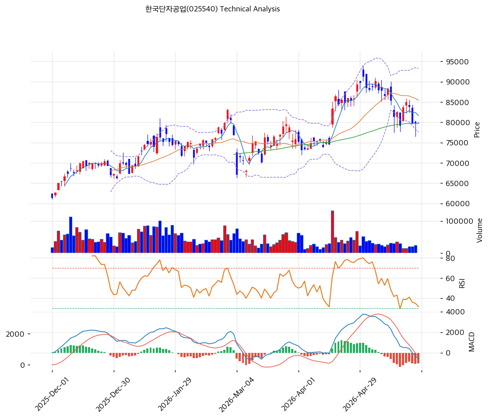

# 한국단자공업(025540) 기술적 분석 보고서

---

## 가격 위치

현재가 **79,900원** (0.00%) — 52주 위치 **65.7%** (고가 91,400 / 저가 57,900). 52주 고가 -13% 조정 후 MA60 부근 박스권. **외국인 20일 +100,663주 매수** vs 기관 -28,495주 매도 — 외국인 매집 진행. 2025년 실적 둔화 반영했으나 1년 +38% (저점 57,900 대비) 누적 상승 구간.

## 이동평균선 / 모멘텀

MA5 81,680 / MA20 85,430 / MA60 79,753 / MA120 75,918 / MA200 70,216 — 현재가가 MA5·MA20 아래(-2.2% / -6.5%), MA60·MA120·MA200 위(+0.2% / +5.2% / +13.8%). **단기 조정 + 중장기 상승 추세 유지**. MA60 79,753원이 핵심 지지선과 현재가 거의 일치.

**RSI 42.9 (중립)** — 과매도 직전, 추가 하락 여지 제한. MACD -546 / 시그널 495 / 히스토 -1,042 = **매도 시그널** 진행. 스토캐 K=21.3 / D=29.6 데드크로스 중립 영역(과매도 근접). BB 중간 (폭 18.3% 좁음) — 변동성 수축 후 방향 전환 임박.

## 시그널 종합 / S&R

매수 0 / 매도 1 / 중립 5 → **매도우위(약)**. 단기 조정 진행이나 신호 강하지 않음.

- 저항: **81,918원(PRZ 약: MA5·피보 0.382)** / 85,560원(PRZ 약: MA20·피보 0.236) / 91,400원(52주 고가)
- 지지: **79,776원(PRZ 강: 피보 0.5·MA60·피봇)** / 76,181원(PRZ 약: MA120·피보 0.618) / 72,807원(피보 0.786·추세선)
- 핵심 분기점: **MA60 79,776원 지지 사수 여부**. 사수 시 박스권 유지, 이탈 시 MA120 76,181원 추가 조정

전략: **HOLD(비중축소) — TP 93,228원 / SL 79,900원**. WAIT(진입가능) e1=79,900원 / e2=85,430원. **MA60 79,776원 지지 + 외국인 매집 = 분할 매수 가능**, MA120 76,181원 추가 진입. 배당 4.75% + PBR 0.70x 하방 견고. 현대차 물량 회복 + 전장화 단가 믹스가 박스권 돌파 트리거.
