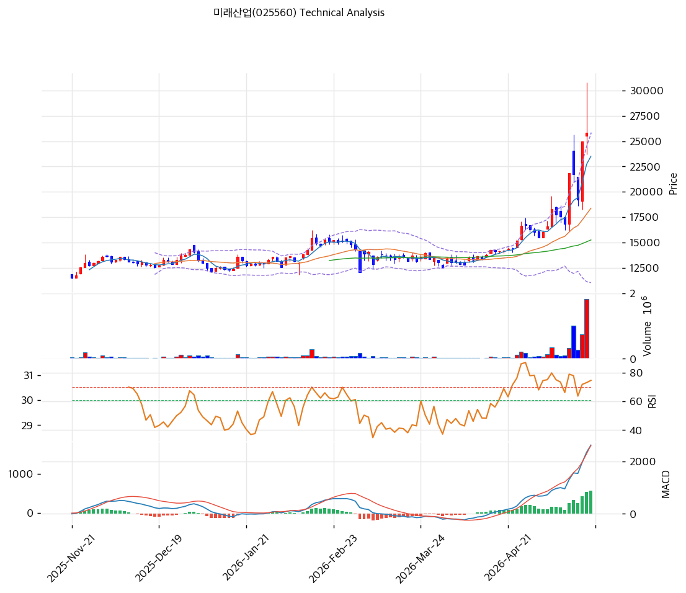

# 미래산업(025560) 기술적 분석

2026-05-20 | T2 Technical Analysis

---

## 차트

---

## 1. 가격 현황

| 항목 | 값 |
|------|-----|
| 현재가 | 25,850원 (52주 신고가, 장중 30,000원 터치 후 조정) |
| 52주 고가 | 25,850원 (당일 갱신) |
| 52주 저가 | 10,010원 |
| 52주 범위 위치 | 100.0% |
| 거래량 | 데이터 결손 (차트상 5월 거래량 폭증) |

---

## 2. 차트 패턴 분석

### 2.1 캔들스틱 패턴

| 패턴 | 위치 | 신뢰도 | 해석 |
|------|------|--------|------|
| **장대양봉 (당일)** | 당일 | 강 | 거래량 동반 + 장중 30,000원 터치 |
| **포물선 가속** | 최근 4주 | 강 | 15,000→25,850원 가파른 가속 |
| 윗꼬리 음봉 | 최근 1~2일 | 중 | 30,000원 터치 후 차익실현 매물 |

### 2.2 가격 구조 패턴

- **장기 박스권 돌파 + 포물선 가속** (신뢰도: 강)
  2025-11~2026-03 박스권 (12,000~15,000원) → 2026-04 거래량 폭증 + 돌파 → 2026-05 25,850원 (장중 30,000원). **MA200 +98% 극단 이격 = 포물선 후반부 평균회귀 임박**.

- **30,000원 정점 후 조정** (신뢰도: 중)
  장중 30,000원 터치 후 25,850원 종가 = -14% 윗꼬리 조정. 단기 차익실현 매물 출현.

### 2.3 다이버전스

- **RSI 75.2 과매수** (신뢰도: 중)
  RSI 70 임계 강하게 돌파. 단기 평균회귀 압력 매우 강력.

- **MACD 매수 + 히스토그램 확대** (신뢰도: 중)
  MACD 2,623 > Signal 1,733, 히스토그램 +891. 매수 추세 유지.

### 2.4 패턴 종합 판단

박스권 돌파 + 포물선 가속 + 윗꼬리 음봉. **RSI 75 + MA200 +98% + BB 폭 80% = 포물선 후반부 평균회귀 임박**. 30,000원 터치 후 -14% 윗꼬리는 단기 차익실현 시작 시그널. 단기 -15~-25% 조정 후 재상승이 합리적.

---

## 3. 이동평균선 — 정배열 (극단)

| MA | 값 | 현재가 괴리율 | 위치 |
|----|-----|--------------|------|
| MA5 | 23,512원 | +9.9% | 위 |
| MA20 | 18,377원 | +40.7% | 위 |
| MA60 | 15,241원 | +69.6% | 위 |
| MA120 | (확인) | 약 +85% | 위 |
| MA200 | 13,052원 | **+98.1%** | 위 |

**해석**: 정배열 극단. MA200 +98.1% = 통계적 평균회귀 임박 (상위 0.5%). MA20 (18,377원)을 1차 지지로 인식.

---

## 4. 보조 지표

### RSI(14) — 75.2 (🔴 과매수)

70 임계 돌파. 단기 평균회귀 압력 매우 강력.

### MACD(12,26,9)

| 항목 | 값 |
|------|-----|
| MACD | 2,623 |
| Signal | 1,733 |
| Histogram | +891 |
| 크로스 상태 | 매수 (확대 중) |

### 볼린저밴드(20, 2σ)

| 항목 | 값 |
|------|-----|
| 상단 | 25,731원 |
| 중단 (MA20) | 18,377원 |
| 하단 | 11,023원 |
| 밴드 폭 | **80.0%** (극단 확장) |
| 현재 위치 | 상단 +0.5% 근접 |

**해석**: 밴드 폭 80% = 변동성 매우 극단. 상단 도달 시 1~3봉 내 안쪽 회귀 통계적 임박.

### 스토캐스틱(14, 3, 3)

| 항목 | 값 |
|------|-----|
| Slow %K | 76.2 |
| Slow %D | 69.3 |
| 크로스 상태 | 골든크로스 |
| 판단 | 중립 (과매수 임계) |

---

## 5. 지지/저항

### 종합 지지/저항

| 구분 | 가격 | 근거 |
|------|------|------|
| 저항 | 30,000원 | 직전 장중 정점 (재시도 어려움) |
| 저항 | 27,450원 | BPS (펀더멘털 정점) |
| **현재가** | **25,850원** | 52주 신고가 |
| 지지 | 25,731원 | BB 상단 |
| 지지 | 23,512원 | MA5 |
| 지지 | 18,377원 | **MA20 + BB 중단 (1차 강력 지지)** |
| 지지 | 15,241원 | MA60 |
| 지지 | 13,052원 | MA200 (장기 추세 마지노선) |
| 지지 | 11,023원 | BB 하단 |
| 지지 | 10,010원 | 52주 저점 |

---

## 6. 시그널 종합

| 지표 | 시그널 |
|------|--------|
| 차트 패턴 (포물선 가속 + 윗꼬리) | 🟢 / 🔴 |
| 이동평균선 (정배열 극단) | 🟢 / 🔴 |
| RSI 75.2 (과매수) | 🔴 |
| MACD 매수 + 확대 | 🟢 |
| 볼린저밴드 상단 + BW 80% | 🔴 |
| 스토캐스틱 76.2 | ⚪ |
| 거래량 (5월 폭증) | 🟢 |

**종합 판단**: 🟢 매수 2 / 🔴 매도 2 / ⚪ 중립 3 → **중립 (극단 과열 경고)**

추세 강세이나 RSI 75 + MA200 +98% + BB 폭 80% 극단 과열 누적 + 30,000원 터치 후 윗꼬리 음봉 = **단기 -15~-25% 평균회귀 압력 매우 강력**.

---

## 7. 전략 제안

### 보유 중
- **즉시 50% 분할 익절 + 잔량 홀드**
- 1차 익절: 30,000원 (직전 정점, +16%) — 도달 시 즉시 차익
- 2차 익절: 27,450원 (BPS 영역, +6%) — 추가 차익
- 손절: 18,377원 (MA20, -29%)

### 진입 대기
- **평균회귀 대기 강력 권장**
- 1차 진입: 18,377원 (MA20, -29%)
- 2차 진입: 15,241원 (MA60, -41%)
- 3차 진입: 13,052원 (MA200, -50%)
- 진입 조건: MA20 도달 + RSI 50 이하 + 양봉 + 거래량 회복
- **펀더멘털 우호**: PBR 0.94x + 25Q3 OPM 26.5% + 기관 +13만주 매집 — 단기 평균회귀 후 진입 합리적
