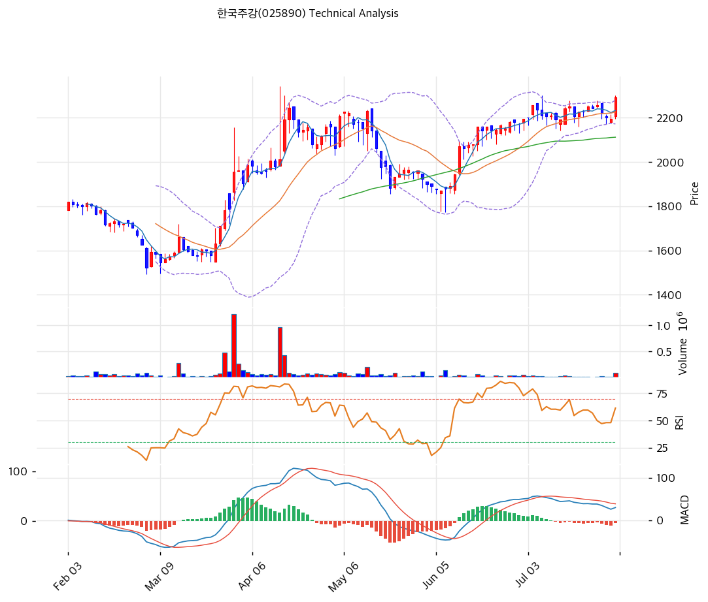

# 한국주강(025890) 기술적 분석

2026-08-02 | T2 Technical Analysis

---

## 차트

---

## 1. 가격 현황

| 항목 | 값 |
|------|-----|
| 현재가 | 2,290원 (+4.33%) |
| 52주 고가 | 2,290원 (2026-07-31, 종가 기준 = 당일 신고가) |
| 52주 저가 | 1,521원 (2026-03-04) |
| 52주 범위 위치 | 100.0% |
| 장중 52주 고가 | 2,340원 (2026-04-14, 삼성중공업 2차 계약 공시일) |
| 장중 52주 저가 | 1,494원 (2026-03-04) |
| 거래량 | 83,222주 — 20일 평균 대비 **4.33x** |
| 일평균 거래대금(20일) | **약 4,300만원** |

> ⚠️ **KIS API 52주 필드 오류**: KIS가 반환한 52주 고 2,300 / 저 2,195는 **2026-07-31 당일 장중 고·저가**와 동일하다. 위 표는 yfinance 일봉 원본에서 직접 산출했다.

> 🚨 **유동성 경고 — 이 종목의 가장 중요한 기술적 특성**
> 20일 평균 거래대금이 **약 4,300만원**이다. 시가총액 255억, 유통물량 108억(42.18%)에 비해 극단적으로 얇다. 7월 31일 거래대금 1.9억원은 평시의 4.3배였지만 그조차 **웬만한 개인 투자자 한 명이 만들 수 있는 규모**다. 아래의 모든 기술적 지표는 이 전제 위에서 읽어야 한다.

**당일 종가 2,290원은 종가 기준 52주 신고가**다. 다만 장중 기준으로는 4월 14일 2,340원이 여전히 최고치이므로, 완전한 신고가 돌파까지는 2.2%(50원)가 남았다.

---

## 2. 차트 패턴 분석

### 2.1 캔들스틱 패턴

| 패턴 | 위치 | 신뢰도 | 해석 |
|------|------|--------|------|
| 장대양봉 (갭 상승) | 2026-07-31 | **강** | 시가 2,205(전일 종가 2,195 대비 갭 상승) → 종가 2,290. 실체 85원(3.9%), 위꼬리 10원·아래꼬리 10원의 **마루보즈에 가까운 형태**. 시가에서 종가까지 되돌림 없이 밀어올렸다는 뜻이며, 거래량 4.33x를 동반했다 |
| 3일 하락 되돌림 | 2026-07-28\~30 | 중 | 2,255 → 2,220 → 2,200 → 2,195로 사흘 연속 밀렸다. 7월 31일 하루에 이 3일치 하락을 전부 되돌리고 그 위로 올라섰다 |
| 도지형 (소폭 음봉) | 2026-07-29 | 약 | 시가 2,205 / 종가 2,200, 실체 5원. 매수·매도가 균형을 이룬 변곡점이었고 이후 이틀 만에 방향이 정해졌다 |

**해석 시 유의**: 일평균 거래대금 4,300만원 종목의 캔들은 소수 주문에 의해 형성된다. 7월 31일 장대양봉도 83,222주 = 1.9억원의 결과이며, 이 중 **외국인 순매수가 23,538주**였다. 패턴의 통계적 의미보다 **누가 왜 샀는가**가 더 중요하다.

### 2.2 가격 구조 패턴

- **4개월 박스권 상단 돌파 시도** (신뢰도: 중)
  3월 4일 저점 1,521원에서 4월 14일 장중 2,340원까지 **약 6주간 +53.9% 급등**한 뒤, 4월 중순부터 7월 말까지 **3.5개월간 2,100\~2,290원 박스**에 갇혀 있었다. 7월 31일 종가 2,290원은 이 박스의 상단이며, 거래량 4.33x를 동반했다는 점에서 돌파 시도로 볼 수 있다. **다만 종가가 박스 상단 '위'가 아니라 '상단선'에 정확히 걸렸으므로, 확정 돌파는 아직 아니다.** 박스 폭 190원을 더한 1차 목표가는 2,480원이다.

- **급등 후 장기 횡보 = 매물 소화 국면** (신뢰도: 중)
  3\~4월 급등은 자기주식 소각 결정(3/25)과 삼성중공업 본계약 2차(4/14)라는 명확한 이벤트에서 나왔다. 이후 3.5개월 횡보는 그 재료를 소화하는 과정이며, MA120(1,972원)과 MA200(1,901원)이 이 기간 동안 꾸준히 올라와 현재가와의 괴리가 각각 +16.1%, +20.4%로 좁혀졌다. **횡보 중 이평선이 따라 올라오는 것은 건강한 조정의 전형**이다.

- **하락 추세선의 무력화** (신뢰도: 약)
  6개 저점을 잇는 추세선이 **하락 방향(일 -0.55원)**으로 산출됐고 현재 1,610원을 지난다. 현재가 대비 -29.7%로 너무 멀어 실용적 지지선 역할을 하지 못한다. 이는 알고리즘이 장기 하락기의 저점들을 잡았기 때문이며, **2026년 3월 이후의 상승 국면을 반영하지 못한다.** 반면 상승 저항선(일 +0.68원)은 현재 2,316원으로 **현재가 바로 위 1.1%**에 있어 실질적 저항이다.

### 2.3 다이버전스

- **MACD 하락(베어리시) 다이버전스** (신뢰도: 약~중)
  가격은 7월 23일 종가 2,250원 → 7월 31일 2,290원으로 **+1.8% 상승해 고점을 갱신**했으나, 같은 기간 MACD는 **39.1 → 29.7로 24% 하락**했다. 가격이 신고가인데 모멘텀 절대 수준이 낮아진 형태다. 다만 MACD 절대값 자체가 30 안팎(주가의 1.3%)으로 매우 작아 **노이즈와 구분하기 어렵다.** 신뢰도를 낮춰 읽는다.

- **RSI 다이버전스 없음**
  7월 23일 RSI 63.0, 7월 31일 64.0으로 사실상 동일하다. 가격과 나란히 움직여 다이버전스가 성립하지 않는다.

- **MACD 데드크로스 해소 임박** (신뢰도: 중)
  MACD 29.7이 시그널 33.6 아래에 있어 형식상 매도 구간이지만, 히스토그램이 7월 30일 -8에서 7월 31일 **-5로 축소**됐고 MACD 자체가 25.8 → 29.7로 반등했다. **1\~2거래일 내 골든크로스 전환 가능성이 높다.** 현재의 '매도 시그널'은 곧 뒤집힐 수 있는 상태다.

### 2.4 패턴 종합 판단

**단기 방향은 상방이나, 확정 돌파는 아직이다.** 3일 하락을 하루에 되돌린 장대양봉, 거래량 4.33x, 외국인 순매수 23,538주, 완전 정배열 — 여기까지는 명확한 매수 신호다. 그러나 종가 2,290원은 **3.5개월 박스의 상단선에 정확히 걸린 위치**이고, 바로 위 2,316원에 상승 추세선 저항이, 2,340원에 장중 52주 고가가 대기한다.

무엇보다 이 급등에는 **명백한 캘린더 이벤트**가 있다. 대표이사 하만규가 2026년 7월 2일 공시한 **229,357주(5억원) 장내 매수 계획의 거래 개시일이 2026년 8월 1일**이다. 7월 31일은 그 하루 전이다. **거래량 4.33x와 외국인 순매수 23,538주가 이 일정을 앞둔 선취매일 가능성이 높다.**

이 해석이 맞다면 두 가지가 따라온다 — 8월 중 오너 매수가 실제로 집행되면 얇은 물량 구조상 추가 상승 여지가 있고, 반대로 **매수가 지연되거나 규모가 작으면 선취매 물량이 되돌아 나올 수 있다.**

---

## 3. 이동평균선 — 정배열 (강세)

| MA | 값 | 현재가 괴리율 | 위치 |
|----|-----|--------------|------|
| MA5 | 2,232원 | +2.6% | 위 |
| MA20 | 2,224원 | +2.9% | 위 |
| MA60 | 2,111원 | +8.5% | 위 |
| MA120 | 1,972원 | +16.1% | 위 |
| MA200 | 1,901원 | +20.4% | 위 |

**해석**: MA5 > MA20 > MA60 > MA120 > MA200의 **완전 정배열**이고 현재가가 모든 이평선 위에 있다.

주목할 점은 **단기 이평과의 괴리가 작다**는 것이다. MA5 대비 +2.6%, MA20 대비 +2.9%로, 4.33배 거래량을 동반한 +4.33% 급등 직후임에도 과열 신호가 없다. 3.5개월 횡보 동안 MA5와 MA20이 2,220원대로 수렴해 올라왔기 때문이다. **이는 하루 급등이 아니라 축적된 바닥 위에서 나온 상승이라는 뜻**이며, 되돌림 부담이 작다.

반면 MA120(+16.1%)·MA200(+20.4%)과의 괴리는 크다. 3월 저점 1,521원 이후의 상승분이 아직 장기 이평에 다 반영되지 않았기 때문이며, **깊은 조정이 오면 1,900\~2,000원대까지 열려 있다**는 의미이기도 하다.

---

## 4. 보조 지표

### RSI(14) — 64.0 (중립)

과매수 기준선 70까지 6포인트 여유가 있다. 4.33% 급등에도 70을 넘지 않은 것은 직전 3거래일 하락으로 RSI가 51.1까지 눌렸다가 반등했기 때문이다. RSI 70 도달 시 대응 주가는 약 2,380\~2,420원으로 추산되며, 이는 **장중 52주 고가(2,340원)와 피보나치 1.382 확장(2,402원) 사이** 구간과 겹친다.

### MACD(12,26,9)

| 항목 | 값 |
|------|-----|
| MACD | 29.7 |
| Signal | 33.6 |
| Histogram | **-5** |
| 크로스 상태 | 매도 구간 (**축소 중 — 전환 임박**) |

**해석**: 형식상 데드크로스 상태이나 실질은 전환 직전이다. 히스토그램이 7월 29일 -12 → 7월 30일 -8 → 7월 31일 **-5**로 3거래일 연속 축소됐고, MACD 본선이 25.8 → 29.7로 반등했다. 현 속도라면 1\~2거래일 내 골든크로스가 나온다.

다만 MACD 절대값 29.7은 주가 2,290원의 **1.3%**에 불과하다. 이 종목의 저변동성·저유동성 특성상 MACD 신호의 진폭이 작아 **오신호 비율이 높다.** 다른 지표와 함께 봐야 한다.

### 볼린저밴드(20, 2σ)

| 항목 | 값 |
|------|-----|
| 상단 | 2,278원 |
| 중단 (MA20) | 2,224원 |
| 하단 | 2,171원 |
| 밴드 폭 | **4.8%** |
| 현재 위치 | **상단 이탈 (+0.5%)** |

**해석**: 종가 2,290원이 상단 밴드 2,278원을 12원(0.5%) 상회해 밴드 밖으로 나갔다.

**밴드 폭 4.8%는 매우 좁다.** KOSPI 평균(8\~12%)의 절반 이하이며, 3.5개월 횡보로 변동성이 극도로 압축된 **스퀴즈(Squeeze) 상태**였음을 보여준다. 볼린저 스퀴즈 후 밴드 이탈은 **방향성 확장의 출발점**으로 해석되는 대표적 패턴이며, 이 점에서 앞의 MACD 다이버전스보다 신호 강도가 높다.

향후 2\~3거래일 종가가 상단 위에 머물면 밴드 워킹(추세 확장)이고, 하루 만에 밴드 안(2,278원 아래)으로 되돌아오면 스퀴즈 실패다. **하단 2,171원은 피봇 S2(2,157원)와 근접해 견고한 하방 지지대를 형성한다.**

### 스토캐스틱(14, 3, 3)

| 항목 | 값 |
|------|-----|
| Slow %K | 59.6 |
| Slow %D | 53.4 |
| 크로스 상태 | **골든크로스** |
| 판단 | 중립 |

%K가 %D를 6.2포인트 차이로 상향 돌파했다. %K 59.6은 중립 구간이며 과매수(80) 까지 여유가 있어 단기 상승 여력을 뒷받침한다. MACD가 아직 데드크로스인 것과 달리 스토캐스틱은 이미 전환됐다 — **단기 지표가 중기 지표보다 먼저 움직이는 정상적 순서**다.

---

## 5. 지지/저항 — 추세선 · 피보나치 · PRZ 통합

### 5.1 피보나치 되돌림/확장

| 구분 | 비율 | 가격 | 현재가 대비 |
|------|------|------|-----------|
| **Swing High** | — | 2,255원 | -1.5% |
| 되돌림 | 0.236 | 2,164원 | -5.5% |
| 되돌림 | 0.382 | 2,108원 | -7.9% |
| 되돌림 | 0.5 | 2,062원 | -10.0% |
| 되돌림 | 0.618 | 2,017원 | -11.9% |
| 되돌림 | 0.786 | 1,952원 | -14.8% |
| **Swing Low** | — | 1,870원 | -18.3% |
| 확장 | 1.272 | 2,360원 | **+3.1%** |
| 확장 | 1.382 | 2,402원 | +4.9% |
| 확장 | 1.618 | 2,493원 | +8.9% |
| 확장 | 2.0 | 2,640원 | +15.3% |

※ 피보나치 기준: 상승 추세 (Swing Low 1,870원 → Swing High 2,255원)
※ 현재가 2,290원은 Swing High를 1.5% 상회했으므로 **되돌림 구간을 벗어나 확장 구간에 진입**했다. 유효한 것은 확장 레벨이다.

확장 1.272(2,360원)가 **장중 52주 고가 2,340원 바로 위**에 있다는 점이 중요하다. 두 저항이 20원 간격으로 붙어 있어 2,340\~2,360원 구간이 실질적 1차 관문이 된다.

### 5.2 추세선

| 추세선 | 방향 | 현재 교차가 | 포인트 수 | 해석 |
|--------|------|-----------|---------|------|
| 지지선 | **하락** (일 -0.55원) | 1,610원 | 6개 | 장기 하락기의 저점을 연결한 선. 현재가 대비 **-29.7%**로 너무 멀어 실용성이 없다. 2026년 3월 이후 상승 국면을 반영하지 못한 산출값이므로 **참고에서 제외**한다 |
| 저항선 | 상승 (일 +0.68원) | **2,316원** | 6개 | 현재가 바로 위 **+1.1%**. 가장 임박한 저항이며 다음 거래일의 1차 관문이다 |

지지 추세선이 하락 방향인데 저항 추세선이 상승 방향이라는 것은 **가격 밴드가 위로 벌어지는 형태**를 뜻한다. 다만 지지선 산출이 신뢰할 수 없으므로, 실질 하방은 뒤의 PRZ와 이평선으로 판단해야 한다.

### 5.3 PRZ (Potential Reversal Zone)

| 방향 | 가격 범위 | 신뢰도 | 근거 |
|------|---------|--------|------|
| **저항** | **2,316\~2,402원** | **강** | 추세선 저항(2,316) + 피봇 R1(2,328) + 피보나치 1.272 확장(2,360) + 피봇 R2(2,367) + 피보나치 1.382 확장(2,402) — **5개 소스 중첩. 여기에 장중 52주 고가 2,340원까지 더해져 사실상 6중 저항대** |
| **지지** | **2,223\~2,232원** | **중** | 피봇 S1(2,223) + MA20(2,224) + MA5(2,232) — 3개 소스가 9원 폭에 밀집. 되돌림 시 1차 방어선 |
| 지지 | 2,157\~2,164원 | 약 | 피봇 S2(2,157) + 피보나치 0.236 되돌림(2,164) + 볼린저 하단(2,171) |
| 지지 | 2,108\~2,111원 | 약 | 피보나치 0.382 되돌림(2,108) + MA60(2,111) |
| **지지** | **1,952\~2,062원** | **강** | 피보나치 0.5(2,062) + 0.618(2,017) + 0.786(1,952) 되돌림 + MA120(1,972) — **4개 소스 중첩. 최후 방어선** |

※ PRZ = 추세선·피보나치·피봇·MA 등 복수 지표가 겹치는 구간. 겹치는 소스가 많을수록 반전 확률이 높다.

### 5.4 종합 지지/저항 테이블

| 구분 | 가격 | 근거 |
|------|------|------|
| 저항 | 2,640원 | 피보나치 2.0 확장 |
| 저항 | 2,493원 | 피보나치 1.618 확장 |
| 저항 | 2,402원 | 피보나치 1.382 확장 |
| 저항 | 2,367원 | 피봇 R2 |
| 저항 | **2,360원** | **피보나치 1.272 확장** |
| 저항 | **2,340원** | **장중 52주 최고가 (2026-04-14)** |
| 저항 | 2,328원 | 피봇 R1 |
| 저항 | **2,316원** | **상승 추세선 저항 — 가장 임박** |
| 저항 | 2,278원 | 볼린저 상단 (이미 돌파) |
| **현재가** | **2,290원** | 종가 기준 52주 신고가 |
| 지지 | 2,262원 | 피봇 Pivot |
| 지지 | **2,226원** | **PRZ(중)** — 피봇 S1 + MA20 + MA5 |
| 지지 | 2,171원 | 볼린저 하단 |
| 지지 | **2,160원** | **PRZ(약)** — 피봇 S2 + 피보나치 0.236 |
| 지지 | 2,110원 | PRZ(약) — MA60 + 피보나치 0.382 |
| 지지 | **2,001원** | **PRZ(강)** — 피보나치 0.5·0.618·0.786 + MA120 |
| 지지 | 1,901원 | MA200 |
| **하방 경계** | **1,795원** | **시가총액 200억 = 관리종목 지정 요건선** |

**가격대 밀집도**: 위쪽 2,316\~2,402원의 86원 구간에 **6개 저항이 몰려 있다.** 이 구간을 거래량 동반으로 뚫지 못하면 상승은 여기서 멈춘다. 아래쪽으로는 2,223\~2,232원에 3개, 1,952\~2,062원에 4개가 밀집해 있다.

**특별 주의선 1,795원**: 시가총액 200억에 해당하는 주가다. 이 아래에서 30거래일이 지나면 관리종목으로 지정된다. 기술적 지지선이 아니라 **제도적 하방 경계**이며, 2026년 3월 실제로 이 선 아래(1,521원)에 있었다.

---

## 6. 시그널 종합

| 지표 | 내용 | 시그널 |
|------|------|--------|
| **차트 패턴** | 3.5개월 박스 상단 돌파 시도, 장대양봉 + 갭 상승 | 🟢 |
| 이동평균선 | 완전 정배열, MA20 괴리 +2.9% (과열 없음) | 🟢 |
| RSI | 64.0 — 중립, 과매수까지 6p 여유 | ⚪ |
| MACD | 데드크로스이나 히스토그램 3일 연속 축소, 전환 임박 | 🔴 |
| 볼린저밴드 | 밴드 폭 4.8% 스퀴즈 후 상단 0.5% 이탈 | ⚪ |
| 스토캐스틱 | 골든크로스, %K 59.6 중립 | ⚪ |
| 거래량 | **4.33x — 강력 동반** (외국인 23,538주 순매수) | 🟢 |

**종합 판단**: 🟢 매수 3개 / 🔴 매도 1개 / ⚪ 중립 3개 → **매수우위**

**종합 해석**: 유일한 매도 신호인 MACD도 히스토그램이 3거래일 연속 축소되며 전환 직전이므로, 실질적으로는 매도 신호가 없는 상태다. 정배열·거래량 4.33x·볼린저 스퀴즈 이탈이 같은 방향을 가리키고, RSI·스토캐스틱은 과열이 아니어서 여유가 있다.

**핵심 변수는 기술적 지표가 아니라 캘린더다.** 대표이사의 229,357주(5억원) 장내 매수가 **2026년 8월 1일부터 시작**된다. 일평균 거래대금 4,300만원 종목에서 5억원은 **평시 거래대금의 11.6일치**다. 매수가 실제 집행되면 2,316\~2,402원의 6중 저항대도 뚫릴 수 있고, 집행이 지연되면 7월 31일의 선취매 물량이 되돌아 나온다.

**따라서 8월 첫 2주의 거래량과 소유상황보고서가 이번 국면의 판정 기준**이다.

---

## 7. 전략 제안

### 보유 중인 경우

- **홀드**
- 익절 라인 1차: **2,316원** (상승 추세선 저항, +1.1%) → 돌파 실패 시 일부 정리
- 익절 라인 2차: **2,340원** (장중 52주 최고가, +2.2%)
- 익절 라인 3차: **2,360\~2,402원** (PRZ 강 — 피보나치 1.272·1.382 확장 + 피봇 R1·R2, +3.1\~4.9%) → **보유분의 40\~50% 정리 권장**
- 손절 라인: **2,157원** (PRZ 약 — 피봇 S2 + 볼린저 하단 근접, -5.8%). 이 구간 종가 이탈 시 박스 상단 돌파 시도가 실패한 것으로 본다
- 리스크/리워드: 3차 익절 기준 **0.87 : 1** (익절 폭 112원 / 손절 폭 133원) — 균형에 가깝다
- 중간 방어선: **2,226원**(PRZ 중, MA5+MA20+피봇 S1)을 종가로 이탈하면 정배열이 훼손되므로 비중을 절반으로 줄일 것

### 진입 대기인 경우

- **소액 진입 가능 (분할 필수)**
- 1차 진입가: **2,226원** (PRZ 중 — MA5 + MA20 + 피봇 S1, -2.8%)
- 2차 진입가: **2,160원** (PRZ 약 — 피봇 S2 + 피보나치 0.236, -5.7%)
- 3차 진입가: **2,110원** (PRZ 약 — MA60 + 피보나치 0.382, -7.9%)
- 최후 매수 구간: **2,001원** (PRZ 강 — 피보나치 0.5·0.618·0.786 + MA120, -12.6%)
- 진입 조건:
  - ① **2,340원(장중 52주 고가)을 거래량 3x 이상 동반해 종가로 돌파**할 경우 추격 매수. 이 경우 손절은 2,278원(볼린저 상단) 종가 이탈
  - ② 또는 조정 시 위 PRZ 구간에서 **거래량이 20일 평균 이하로 줄어들며** 도달할 때 분할 진입
  - ③ **8월 중 대표이사 소유상황보고서로 실제 매수가 확인된 이후**가 가장 안전한 진입 시점이다

### 🚨 유동성 및 제도 리스크 — 반드시 읽을 것

- **일평균 거래대금 4,300만원.** 500만원어치만 시장가로 매수해도 호가가 몇 단계 밀린다. **시장가 주문 절대 금지**, 반드시 지정가 분할 주문으로 접근할 것
- **단일 종목 비중을 평소의 1/3 이하로 제한**할 것을 권한다. 매수보다 **매도할 때 빠져나오지 못하는 것**이 더 큰 위험이다
- **1,795원(시총 200억)은 기술적 지지선이 아니라 제도적 경계선**이다. 이 아래에서 30거래일이 지나면 관리종목으로 지정되며, 지정 시 신용거래 제한·투자자 이탈로 유동성이 추가로 마른다. 2026년 3월 4일 종가가 1,521원이었으므로 이는 가정이 아니라 **5개월 전의 실제 상황**이다
- 조선기자재 Peer(태웅 -55.2%, 삼영엠텍 -73.5%, KSP -70.0%)가 52주 고점 대비 대폭 하락한 상태에서 이 종목만 신고가 근처에 있다. **섹터 요인이 아닌 개별 이벤트로 지지되는 주가**임을 인지하고 접근할 것
