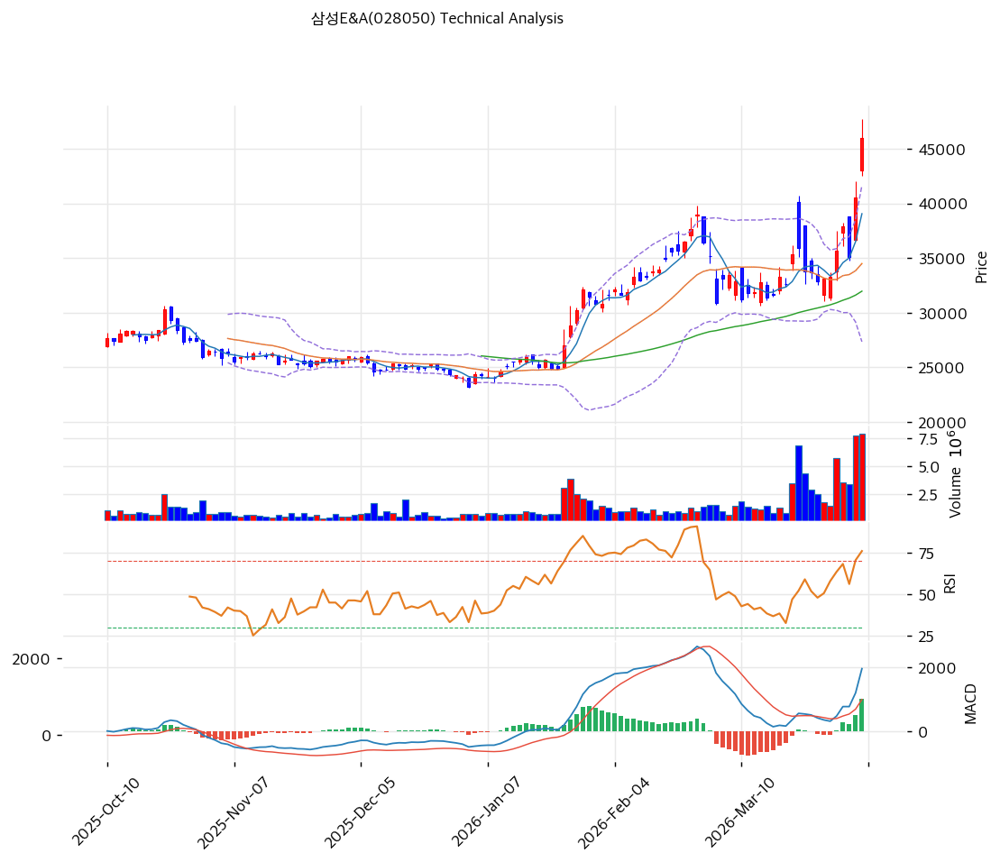

# 삼성E&A(028050) 기술적 분석

2026-04-06 | T2 Technical Analysis

---

## 차트

---

## 1. 가격 현황

| 항목 | 값 |
|------|-----|
| 현재가 | 46,000원 (+13.44%) |
| 52주 고가 | 46,000원 |
| 52주 저가 | 17,950원 |
| 52주 범위 위치 | 100.0% |
| 거래량 | 20일 평균 대비 2.88x |

---

## 2. 차트 패턴 분석

### 2.1 캔들스틱 패턴

| 패턴 | 위치 | 신뢰도 | 해석 |
|------|------|--------|------|
| 장대양봉 돌파 | 최근 5거래일 | 강 | 강한 거래량과 함께 신고가를 돌파한 전형적 추세 강화 시그널 |
| 연속 상승 후 과열 캔들 | 최근 1~2거래일 | 중 | 단기 급등에 따른 이격 부담이 커진 상태 |

### 2.2 가격 구조 패턴

- **박스권 상단 돌파** (신뢰도: 강)
  4만 초반 저항대를 강하게 상향 돌파하며 52주 신고가를 경신했습니다. 수급과 거래량이 동반된 돌파라 의미가 큽니다.

- **추세 가속 구간 진입** (신뢰도: 중)
  중장기 정배열 위에서 단기 상승 각도가 급격히 커졌습니다. 추세는 좋지만 단기적으로는 과열 해소 과정이 필요할 수 있습니다.

### 2.3 다이버전스

- **RSI 하락 다이버전스 가능성 경계** (신뢰도: 약)
  현재 RSI가 73.0으로 과매수 영역에 진입했습니다. 아직 명확한 하락 다이버전스는 아니지만, 추가 급등 시 피로 누적을 경계해야 합니다.

- **MACD 추세 강화** (신뢰도: 강)
  MACD 매수구간과 히스토그램 확대가 이어지고 있어 당장의 추세 훼손 가능성은 낮아 보입니다.

### 2.4 패턴 종합 판단

삼성E&A 차트는 **강한 거래량을 동반한 신고가 돌파형 강세 패턴**입니다. 추세 신호는 매우 좋지만 RSI 과매수와 이격 확대로 단기 추격은 부담스럽습니다.

---

## 3. 이동평균선 — 정배열 (강세)

| MA | 값 | 현재가 괴리율 | 위치 |
|----|-----|--------------|------|
| MA5 | 39,050원 | +17.8% | 위 |
| MA20 | 34,492원 | +33.4% | 위 |
| MA60 | 31,964원 | +43.9% | 위 |
| MA120 | 29,005원 | +58.6% | 위 |
| MA200 | 27,889원 | +64.9% | 위 |

**해석**: 완전 정배열이며 추세는 매우 강합니다. 다만 MA20 대비 33.4% 이격은 단기 과열 수준입니다.

---

## 4. 보조 지표

### RSI(14) — 73.0 (🔴과매수)

과매수 구간입니다. 추세주에서는 과매수 상태가 오래 지속될 수 있지만, 단기 조정 가능성도 함께 높아집니다.

### MACD(12,26,9)

| 항목 | 값 |
|------|-----|
| MACD | 1,942.0 |
| Signal | 932.0 |
| Histogram | +1,010.0 |
| 크로스 상태 | 매수 구간 (확대 중) |

**해석**: MACD는 매우 강한 추세 강화 국면입니다. 단기 조정이 와도 추세 자체는 쉽게 훼손되지 않을 가능성이 큽니다.

### 볼린저밴드(20, 2σ)

| 항목 | 값 |
|------|-----|
| 상단 | 41,645원 |
| 중단 (MA20) | 34,492원 |
| 하단 | 27,340원 |
| 밴드 폭 | 41.5% |
| 현재 위치 | 상단근접 |

**해석**: 상단을 상회한 강한 상승 상태입니다. 추세는 강하지만 단기 과열도 명확합니다.

### 스토캐스틱(14, 3, 3)

| 항목 | 값 |
|------|-----|
| Slow %K | 72.8 |
| Slow %D | 64.9 |
| 크로스 상태 | 골든크로스 |
| 판단 | 중립 |

---

## 5. 지지/저항

| 구분 | 가격 | 근거 |
|------|------|------|
| 저항 | 46,000원 | 52주 고가 |
| 저항 | 48,283원 | 피봇 R1 |
| **현재가** | **46,000원** | — |
| 지지 | 43,133원 | 피봇 S1 |
| 지지 | 40,267원 | 피봇 S2 |
| 지지 | 34,492원 | MA20 |

---

## 6. 시그널 종합

| 지표 | 내용 | 시그널 |
|------|------|--------|
| **차트 패턴** | 거래량 동반 신고가 돌파 | 🟢 |
| 이동평균선 | 정배열, 다만 MA20 +33.4% 과열 | ⚪ |
| RSI | 73.0 — 과매수 | 🔴 |
| MACD | 매수구간 확대 | 🟢 |
| 볼린저밴드 | 상단 밀착, 강한 추세 | ⚪ |
| 스토캐스틱 | 골든크로스, K=72.8 | ⚪ |
| 거래량 | 2.88x — 강력 동반 | 🟢 |

**종합 판단**: 🟢 매수 3개 / 🔴 매도 1개 / ⚪ 중립 3개 → **매수우위**

중기 추세는 매우 좋고 거래량까지 동반됐습니다. 다만 단기적으로는 과열 해소가 나올 수 있어, 신규 진입은 눌림 대기가 더 합리적입니다.

---

## 7. 전략 제안

### 보유 중인 경우
- **홀드**
- 익절 라인: 46,920원 (신고가 돌파 후 상단 확장 구간)
- 손절 라인: 40,267원 (피봇 S2 이탈 시)
- 리스크/리워드: 1.5:1 이상

### 진입 대기인 경우
- **관망**
- 1차 진입가: 43,133원 (피봇 S1)
- 2차 진입가: 34,492원 (MA20)
- 진입 조건: 단기 조정 후 거래량을 동반한 반등 확인
