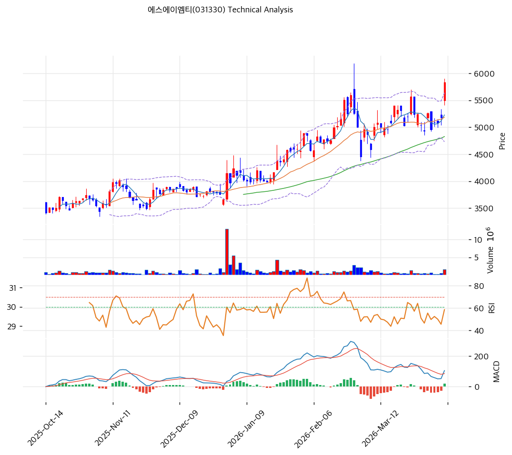

# 에스에이엠티(031330) 기술적 분석

2026-04-08 | T2 Technical Analysis

---

## 차트

---

## 1. 가격 현황

| 항목 | 값 |
|------|-----|
| 현재가 | 5,830원 (전일 대비 +12.55%) |
| 52주 고가 | 5,830원 |
| 52주 저가 | 2,830원 |
| 52주 범위 위치 | 100.0% |
| 거래량 배수 | 20일 평균 대비 2.77x |

---

## 2. 차트 패턴 분석

### 2.1 캔들스틱 패턴

| 패턴 | 위치 | 신뢰도 | 해석 |
|------|------|--------|------|
| 장대 양봉 | 당일 (2026-04-08) | 강 | +12.55% 급등 캔들. 강한 매수세 유입 시그널. 거래량 2.77x 동반으로 신뢰도 높음 |
| 상승 추세 연속 양봉 | 최근 5일 | 중 | 단기 상승 모멘텀 유지. 다만 52주 고가 도달로 저항 확인 필요 |

### 2.2 가격 구조 패턴

- **상승 추세 지속형** (신뢰도: 강)
  2026년 초 2,830원 저점에서 꾸준히 상승, 현재 5,830원에서 52주 신고가를 경신 중. 장기 우상향 추세가 확립된 상태. 현재가가 MA5(5,228원), MA20(5,184원), MA60(4,827원), MA120(4,290원), MA200(3,798원) 모두를 상회하는 완전 정배열 구조. 52주 신고가 돌파는 매물 저항대 부재를 의미하며, 다음 저항은 피봇 R1(6,017원) 및 R2(6,203원).

- **볼린저밴드 상단 이탈** (신뢰도: 중)
  현재가 5,830원이 볼린저밴드 상단(5,639원)을 +3.4% 이탈. 단기 과열 신호이나, 강한 추세 중에는 상단 밀착이 지속되는 경향. 조정 시 밴드 중단(MA20, 5,184원)이 1차 지지.

### 2.3 다이버전스

- **다이버전스 없음** (현재 추세 지속 단계)
  RSI 63.1은 상승 모멘텀 구간에서 중립권. 가격 급등에도 RSI가 과매수(70 이상)에 미달하여 추가 상승 여력이 남아있음을 시사. 뚜렷한 하락 다이버전스는 미관찰.

### 2.4 패턴 종합 판단

52주 신고가 경신 + 완전 정배열 + 거래량 2.77x 동반이라는 세 가지 강세 시그널이 동시에 확인되고 있다. 단기적으로는 볼린저밴드 상단 이탈에 따른 조정 가능성이 있으나, 전체 구조는 명확한 상승 추세. RSI가 과매수 미달 상태임을 감안하면 추세 지속 가능성이 높다. **상방 시그널 우세**, 다만 고가 돌파 후 단기 숨고르기 구간 경계.

---

## 3. 이동평균선 — 정배열 (강세)

| MA | 값 | 현재가 괴리율 | 위치 |
|----|-----|--------------|------|
| MA5 | 5,228원 | +11.5% | 위 |
| MA20 | 5,184원 | +12.5% | 위 |
| MA60 | 4,827원 | +20.8% | 위 |
| MA120 | 4,290원 | +35.9% | 위 |
| MA200 | 3,798원 | +53.5% | 위 |

**해석**: 단기(MA5/20)부터 장기(MA120/200)까지 모든 이동평균선 위에 주가가 위치하는 완전 정배열. MA200 괴리율 +53.5%는 상당한 과열 수준이나, 신고가 돌파 추세에서 이평선과의 이격은 추세 강도를 의미하기도 한다. 조정 시 MA20(5,184원)이 1차 지지, MA60(4,827원)이 2차 지지선으로 작동할 전망.

---

## 4. 보조 지표

### RSI(14) — 63.1 (중립)

중립권 상단(60~70 구간)에 위치. 과매수(70) 미달로 추가 상승 여력 잔존. 현재 상승 모멘텀이 살아있으며, RSI 70 이상 진입 시 단기 과열 경계 필요.

### MACD(12,26,9)

| 항목 | 값 |
|------|-----|
| MACD | 105 |
| Signal | 85 |
| Histogram | +19 |
| 크로스 상태 | 매수 구간 (수축 중) |

**해석**: MACD(105)가 시그널(85) 위에서 골든크로스 매수 구간을 유지 중. 다만 히스토그램이 +19로 수축 국면에 진입 — 모멘텀이 소폭 약화 조짐. MACD 자체는 여전히 양수 및 상승 구간으로 추세 방향은 상방.

### 볼린저밴드(20, 2σ)

| 항목 | 값 |
|------|-----|
| 상단 | 5,639원 |
| 중단 (MA20) | 5,184원 |
| 하단 | 4,730원 |
| 밴드 폭 | 17.5% |
| 현재 위치 | 상단 근접 (이탈) |

**해석**: 현재가(5,830원)가 볼린저밴드 상단(5,639원)을 191원 이탈. 밴드 폭 17.5%로 적정 확장 상태. 강한 추세 중 상단 이탈 후 잠시 되돌림(MA20까지)이 전형적 패턴. 밴드 확장이 유지되는 한 추세 지속으로 해석.

### 스토캐스틱(14, 3, 3)

| 항목 | 값 |
|------|-----|
| Slow %K | 53.1 |
| Slow %D | 35.7 |
| 크로스 상태 | 골든크로스 |
| 판단 | 중립 |

K(53.1)가 D(35.7)를 상향 돌파하는 골든크로스 상태. 중립권에서 골든크로스 발생은 단기 상승 모멘텀 확인 시그널. 과매수(80 이상) 진입 전 추가 상승 여지.

---

## 5. 지지/저항

| 구분 | 가격 | 근거 |
|------|------|------|
| 저항 | 6,203원 | 피봇 R2 |
| 저항 | 6,017원 | 피봇 R1 |
| **현재가** | **5,830원** | 52주 신고가 |
| 지지 | 5,527원 | 피봇 S1 |
| 지지 | 5,223원 | 피봇 S2 |
| 지지 | 5,184원 | MA20 / 볼린저밴드 중단 |
| 지지 | 4,827원 | MA60 |

---

## 6. 시그널 종합

| 지표 | 내용 | 시그널 |
|------|------|--------|
| **차트 패턴** | 52주 신고가 + 정배열 + 장대 양봉 | 🟢 |
| 이동평균선 | 완전 정배열, MA20 +12.5% | 🟢 |
| RSI | 63.1 — 중립 (과매수 미달) | ⚪ |
| MACD | 매수구간, 히스토그램 수축 중 | ⚪ |
| 볼린저밴드 | 상단 이탈, 밴드 폭 17.5% | ⚪ |
| 스토캐스틱 | 골든크로스, K=53.1 | ⚪ |
| 거래량 | 2.77x — 강력 동반 | 🟢 |

**종합 판단**: 🟢 매수 3개 / 🔴 매도 0개 / ⚪ 중립 4개 → **매수우위**

52주 신고가 경신 + 완전 정배열 + 강한 거래량(2.77x)이 일치하는 전형적 추세 상승 구조. RSI 63.1로 과매수 미달이어서 추세 지속 여력이 남아있다. 다만 MA200 대비 +53% 이격, 볼린저밴드 상단 이탈 상태로 단기 조정(5,184~5,527원 구간)이 언제든 발생 가능. 조정 시 MA20(5,184원) 이상 유지 여부가 추세 지속의 핵심 확인 포인트.

---

## 7. 전략 제안

### 보유 중인 경우
- **홀드**
- 익절 라인: 5,947원 (피봇 R1 단기 목표) → 6,017~6,203원 (추세 지속 시)
- 손절 라인: 5,223원 (피봇 S2 이탈 시)
- 리스크/리워드: 약 1:0.5 (단기) → 1:1.3 (R2 목표 시)

### 진입 대기인 경우
- **진입 가능 (조정 매수)**
- 1차 진입가: 5,527원 (피봇 S1, 단기 조정 지지 구간)
- 2차 진입가: 5,184원 (MA20 / 볼린저밴드 중단, 조정 깊어질 경우)
- 진입 조건: ① 조정 후 MA20 지지 확인, ② 거래량 1.5x 이상 동반 반등, ③ RSI 50 이상 유지 확인
