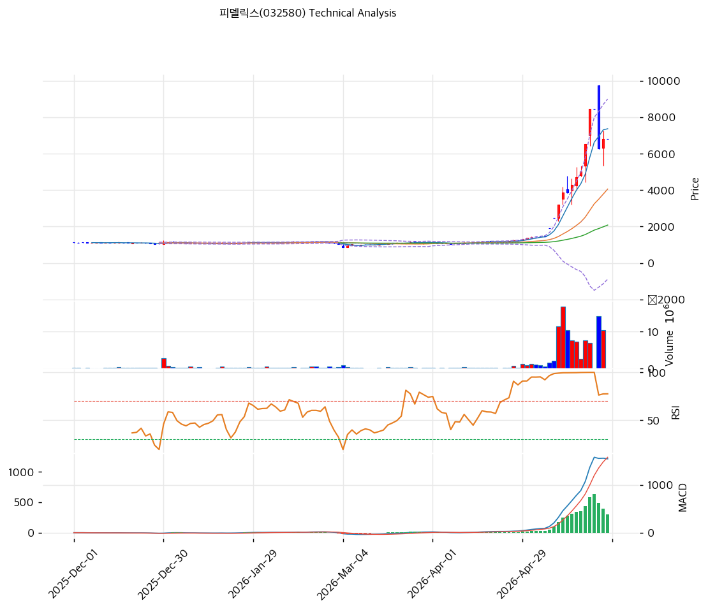

# 피델릭스(032580) 기술적 분석 보고서

---

## 가격 위치

현재가 **6,810원** (0.00%) — 52주 위치 **78.3%** (고가 8,460 / 저가 850). **1년 +701%** (850→8,460 고가) 폭등 후 -20% 조정. **외국인 20일 +477,231주 매수** (시총의 1.4%) + 기관 -4,682주. 2026Q1 OP 43억(+793.8%) 폭발 실적이 랠리 동력. 소형 사이클·테마주 극단 변동성.

## 이동평균선 / 모멘텀

MA5 7,364 / MA20 4,057 / MA60 2,081 / MA120 1,594 / MA200 1,435 — **MA5 < MA20 < MA60 < MA120 < MA200 완전 정배열 True**. MA200 대비 **+374.5%**, MA60 대비 +227.3% 극단 이격. 단기 폭등으로 이격도 사상 최대 수준. MA5(7,364)는 현재가 위(-7.5%) = 단기 조정 진입.

**RSI 71.6 (과매수 🔴)** — 70 초과 과매수. MACD 1,541 / 시그널 1,236 / 히스토 305 = **매수 시그널, 확장 둔화**. 스토캐 K=61.6 / D=73.9 **데드크로스** = 단기 조정 신호. **BB 폭 243.6% 극단** (하단 -885원 = 변동성 폭발) — 단기 변동성 매우 큼.

## 시그널 종합 / S&R

매수 1 / 매도 2 / 중립 4 → **매도우위(약)**. 극단 폭등 후 단기 과열.

- 저항: **7,680원(피보 0.236)** / 8,460원(52주 고가) / 추가 저항 9,000원+
- 지지: **6,375원(피보 0.382)** / 5,320원(피보 0.5) / **4,265원(피보 0.618)** / 4,057원(MA20)
- 깊은 조정 지지: 2,763원(피보 0.786) / 2,081원(MA60)

전략: **HOLD(비중축소) — TP 8,629원 / SL 6,810원**. WAIT(관망) e1=6,810원 / e2=4,057원. 추격 매수 강력 비추, **단기 -20\~40% 조정 시 MA20 4,057원 ~ 5,320원(피보 0.5) 분할 매수**. 극단 변동성(BB 243.6%) 주의. 2026Q2 실적(8월) OP 지속성이 핵심 변곡점 — 검증 시 8,460원 돌파, 미달 시 급락.
