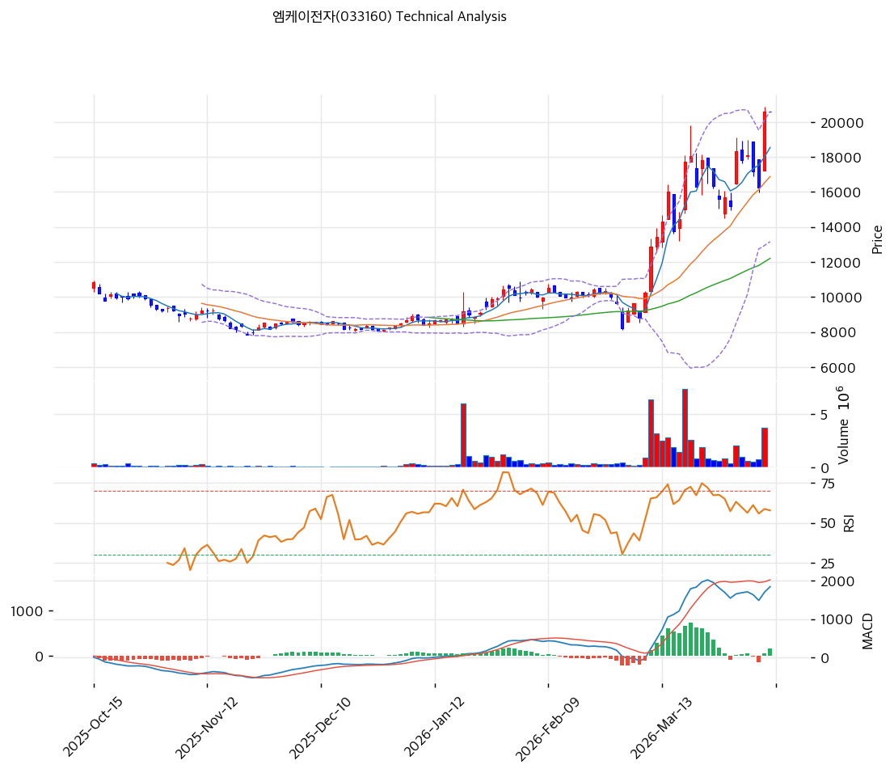

# 엠케이전자(033160) 기술적 분석

2026-04-09 | T2 Technical Analysis

---

## 차트

---

## 1. 가격 현황

| 항목 | 값 |
|------|-----|
| 현재가 | 20,600원 (0.00%) |
| 52주 고가 | 20,600원 |
| 52주 저가 | 7,860원 |
| 52주 범위 위치 | 100.0% |
| 거래량 | 20일 평균 대비 0.00x (데이터 없음) |

---

## 2. 차트 패턴 분석

### 2.1 캔들스틱 패턴

| 패턴 | 위치 | 신뢰도 | 해석 |
|------|------|--------|------|
| 52주 신고가 돌파 | 2026-04-09 | 강 | 강한 매수 시그널 — 52주 고가 20,600원을 갱신하며 종가 마감, 추세 상승 지속 시사 |
| 상승 추세 지속 | 최근 1개월 | 중 | MA5(18,542원)·MA20(16,880원) 연속 상향 돌파 후 현재가가 모든 이동평균 위에 위치 |

※ 주요 캔들 패턴: 망치형, 역망치형, 장악형(상승/하락), 도지, 샛별/석별, 적삼병/흑삼병, 하라미, 유성형, 교수형 등

### 2.2 가격 구조 패턴

- **상승 추세 채널** (신뢰도: 강)
  MA5(18,542원) → MA20(16,880원) → MA60(12,207원) → MA120(10,523원) 순서로 정배열을 형성하며 일정한 상승 채널 구조가 유지되고 있다. 현재가 20,600원은 52주 저가(7,860원) 대비 +162% 상승한 수준으로, 저점에서 추세적 매수세가 형성된 전형적인 추세 상승 구간이다. 다만 현재가가 볼린저밴드 상단(20,598원)에 정확히 밀착해 있어 단기 과매수 피로감 주의가 필요하다.

- **볼린저밴드 상단 밀착** (신뢰도: 중)
  볼린저밴드 밴드 폭 44.0%로 밴드가 크게 확장된 상태에서 현재가가 상단(20,598원)에 밀착해 있다. 일반적으로 밴드 상단 돌파·밀착은 강세 지속 또는 단기 조정의 분기점으로, 추가 거래량 동반이 없을 경우 단기 저항 구간으로 작용할 수 있다.

### 2.3 다이버전스

- **RSI 중립 (다이버전스 미발생)** (신뢰도: 중)
  RSI(14) 66.8로 과매수(70) 직전 수준에서 중립 판정. 가격이 52주 고가를 터치하는 상황에서 RSI가 70을 하회하고 있어 숨은 상승 다이버전스(히든 다이버전스) 가능성이 있다. 추세 지속 시사.

- **MACD 히스토그램 확대** (신뢰도: 강)
  MACD(1,848) > Signal(1,679), 히스토그램 +169로 확대 중. 매수 모멘텀이 강화되고 있으며 하락 다이버전스 신호는 현재 없음. 추세 지속에 우호적인 구조.

### 2.4 패턴 종합 판단

세 카테고리(캔들스틱·가격구조·다이버전스) 모두 현재 상승 추세를 지지하고 있다. 52주 신고가 갱신, 정배열 이동평균, MACD 히스토그램 확대가 추세 강도를 확인해 준다. 단, 볼린저밴드 상단 밀착과 RSI 66.8(과매수 진입 직전)은 단기 조정 가능성을 배제할 수 없음을 시사하며, 거래량 데이터 부재로 추세의 신뢰도 확인이 제한적이다.

---

## 3. 이동평균선 — 정배열 (강세)

| MA | 값 | 현재가 괴리율 | 위치 |
|----|-----|--------------|------|
| MA5 | 18,542원 | +11.1% | 위 |
| MA20 | 16,880원 | +22.0% | 위 |
| MA60 | 12,207원 | +68.8% | 위 |
| MA120 | 10,523원 | +95.8% | 위 |
| MA200 | N/A | N/A | — |

**해석**: MA5·MA20·MA60·MA120 전 구간 정배열이며, 현재가가 모든 이동평균 위에 위치한다. MA20 대비 +22%, MA60 대비 +68.8%로 단기적으로 과열 구간이나, 중장기 추세 자체는 명확한 상승 기조다. MA20(16,880원)이 1차 지지선, MA60(12,207원)이 2차 지지선 역할을 한다.

---

## 4. 보조 지표

### RSI(14) — 66.8 (중립)

RSI 66.8로 과매수 경계선(70) 직전에 위치하며 중립 판정. 추세 상승 과정에서 70 근처에서 소화 과정을 거치는 패턴이 반복될 경우 조정 후 재상승 가능성이 있다.

### MACD(12,26,9)

| 항목 | 값 |
|------|-----|
| MACD | 1,848 |
| Signal | 1,679 |
| Histogram | +169 |
| 크로스 상태 | 매수 구간 (확대 중) |

**해석**: MACD가 Signal 위에 위치하며 히스토그램이 확대 중으로, 매수 모멘텀이 강화되고 있다. 히스토그램 축소 전환이 단기 고점 신호로 작용할 수 있으므로 모니터링이 필요하다.

### 볼린저밴드(20, 2σ)

| 항목 | 값 |
|------|-----|
| 상단 | 20,598원 |
| 중단 (MA20) | 16,880원 |
| 하단 | 13,163원 |
| 밴드 폭 | 44.0% |
| 현재 위치 | 상단 근접 |

**해석**: 밴드 폭 44.0%로 상당히 확장된 상태이며 현재가가 상단에 밀착해 있다. 밴드 확장 중 상단 밀착은 강한 상승 추세를 나타내나, 동시에 단기 조정 진입 가능성도 높다. 상단 이탈 유지 여부가 추세 지속의 핵심 확인 포인트다.

### 스토캐스틱(14, 3, 3)

| 항목 | 값 |
|------|-----|
| Slow %K | 75.1 |
| Slow %D | 64.7 |
| 크로스 상태 | 골든크로스 |
| 판단 | 중립 (과매수 진입 직전) |

---

## 5. 지지/저항

| 구분 | 가격 | 근거 |
|------|------|------|
| 저항 | 20,600원 | 52주 고가 / 현재가 (신고가 돌파 여부 확인 필요) |
| **현재가** | **20,600원** | — |
| 지지 | 18,542원 | MA5 |
| 지지 | 16,880원 | MA20 / 볼린저밴드 중단 |
| 지지 | 13,163원 | 볼린저밴드 하단 |
| 지지 | 12,207원 | MA60 |

---

## 6. 시그널 종합

| 지표 | 내용 | 시그널 |
|------|------|--------|
| **차트 패턴** | 52주 신고가, 정배열, MACD 히스토그램 확대 | 🟢 |
| 이동평균선 | 정배열, MA20 +22.0% — 강세(단기 과열) | 🟢 / 🔴 (과열) |
| RSI | 66.8 — 중립 (과매수 진입 직전) | ⚪ |
| MACD | 매수구간, 히스토그램 +169 확대 중 | 🟢 |
| 볼린저밴드 | 상단 밀착(20,598원), 밴드 폭 44.0% | ⚪ |
| 스토캐스틱 | 골든크로스, K=75.1 — 중립 | ⚪ |
| 거래량 | 0.0x — 데이터 없음 | ⚪ |

**종합 판단**: 🟢 매수 2개 / 🔴 매도 1개 / ⚪ 중립 4개 → **매수우위**

현재 차트는 52주 신고가 갱신, 완전 정배열, MACD 상승 확대 등 강한 매수 모멘텀을 보여준다. 중기 추세는 명확한 상승이나, 볼린저밴드 상단 밀착과 RSI 70 직전, 스토캐스틱 75 수준은 단기 숨고르기 가능성을 시사한다. 거래량 데이터 부재로 추세 신뢰도의 완전한 확인이 어렵다는 점이 제한 요인이다.

---

## 7. 전략 제안

### 보유 중인 경우
- **홀드**
- 익절 라인: 21,012원 (현재가 대비 +2% — 볼린저밴드 상단 이탈 시 추가 목표가)
- 손절 라인: 18,542원 (MA5 이탈 시 단기 추세 훼손 신호)
- 리스크/리워드: 약 1 : 2 (손절 폭 -10% 대비 익절 목표 +2% — 단기 과열로 R/R 비대칭)

### 진입 대기인 경우
- **관망**
- 1차 진입가: 18,542원 (MA5 부근 — 단기 조정 시 진입 기회)
- 2차 진입가: 16,880원 (MA20 / 볼린저밴드 중단 — 중기 지지선)
- 진입 조건: 볼린저밴드 상단 이탈 후 재진입 확인, 또는 MA20 지지 후 거래량 동반 반등 확인. 현재 52주 고가에서의 신규 진입은 CB 오버행(8.8% 희석 잠재 물량)과 단기 과열을 감안해 분할 진입 접근 권장
