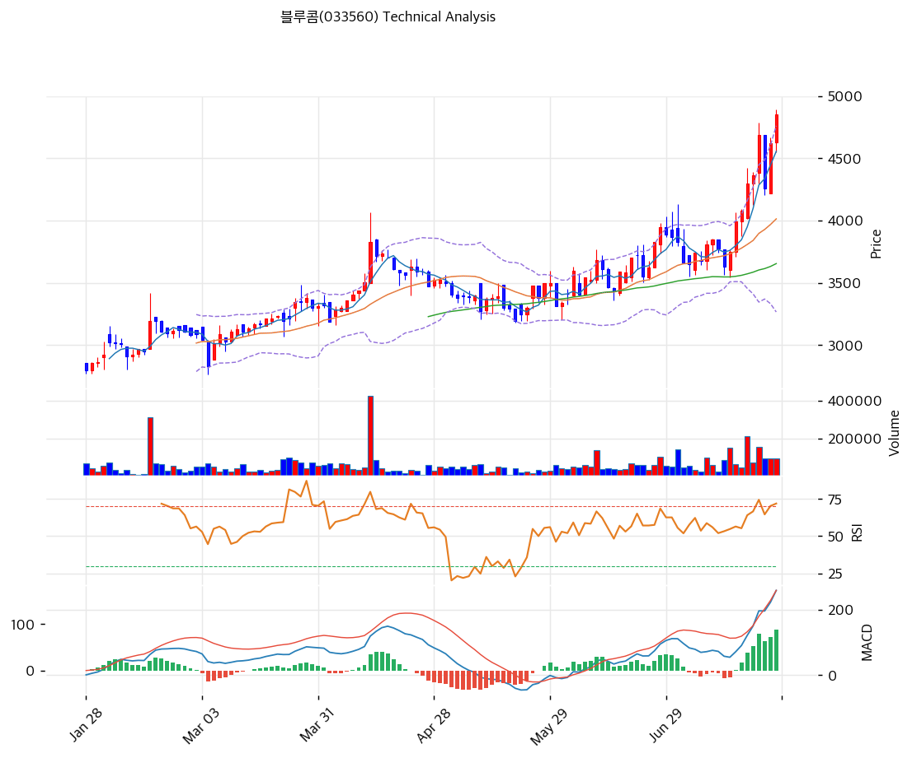

# 블루콤(033560) 기술적 분석

2026-07-27 | T2 Technical Analysis

---

## 차트

---

## 1. 가격 현황

| 항목 | 값 |
|------|-----|
| 현재가 | 4,850원 (**+4.98%**) |
| 52주 고가 | **4,850원 (= 현재가, 신고가)** |
| 52주 저가 | 2,760원 |
| 52주 범위 위치 | **100.0%** |
| 거래량 | 20일 평균 대비 1.1x |

**오늘 종가가 곧 52주 최고가다.** 저점(2,760원) 대비 +75.7% 오른 자리이며, 모든 이동평균선을 위로 두고 있는 완전 정배열 상태다.

---

## 2. 차트 패턴 분석

### 2.1 캔들스틱 패턴

| 패턴 | 위치 | 신뢰도 | 해석 |
|------|------|--------|------|
| 신고가 양봉 | 금일 | 중 | +4.98%로 52주 고점 경신 — 다만 거래량 1.1배로 뒷받침이 약함 |
| 볼린저 상단 밀착 | 최근 | 중 | 상단(4,761원)을 넘어선 상태 — 단기 과열 구간 |

### 2.2 가격 구조 패턴

- **상승 채널 지속** (신뢰도: 강)
  추세선이 지지·저항 모두 상승 방향(기울기 +0.46 / +0.64)으로 잡힌다. 저점과 고점이 함께 올라가는 전형적 상승 추세이며, 현재가는 채널 상단(3,697원)을 크게 웃돌아 채널을 위로 이탈한 상태다.

- **완전 정배열** (신뢰도: 강)
  MA5(4,556) < 현재가, MA20(4,013) < MA60(3,654) < MA120(3,441) < MA200(3,274) 순으로 모든 이평이 아래에 정렬돼 있다. 추세의 강도로는 최상급이나, **MA200 대비 +48.1%·MA20 대비 +20.9%의 괴리는 과열 신호**이기도 하다.

- **거래량 부족이라는 균열** (신뢰도: 중)
  신고가를 경신하는 날의 거래량이 20일 평균의 1.1배에 그친다. 통상 신고가 돌파에는 거래량 증가가 동반되는데 그렇지 못하다는 것은 **매수세가 강하지 않은 상태에서 가격만 올라간 것**일 수 있음을 시사한다.

### 2.3 다이버전스

- **MACD 매수 + 히스토그램 확대** (신뢰도: 중)
  MACD +259 vs 시그널 +172, 히스토그램 +87로 확대 중이다. 양수 영역에서의 매수 구간이라 상승 모멘텀이 살아 있음을 보여준다.

- **스토캐스틱 80.2 — 과매수 구간 골든크로스** (신뢰도: 중)
  %K 80.2 / %D 80.0으로 과매수 영역에 진입했다. 골든크로스이지만 위치가 상단이라 추가 상승 여력보다 조정 위험을 경고하는 쪽으로 읽는 것이 안전하다.

### 2.4 패턴 종합 판단

**추세는 강하지만 과열 신호가 함께 켜져 있다.** 완전 정배열·MACD 매수·상승 채널 이탈은 모두 강세 신호이고, 반대로 스토캐스틱 80.2(과매수)·MA20 대비 +20.9%·볼린저 상단 돌파는 단기 조정 압력을 가리킨다. 여기에 신고가 경신일의 거래량이 1.1배에 그쳤다는 점이 상승의 견고함에 물음표를 남긴다.

이 급등의 배경으로 추정되는 재료는 명확하다 — **9월 30일로 예정된 베트남 자산 매각 잔금 187억원**(시가총액의 22.6%)이다. 즉 현재 주가는 이벤트 기대를 상당 부분 반영한 상태이며, 실제 잔금이 들어오는 시점 전후가 변곡점이 될 가능성이 높다.

---

## 3. 이동평균선 — 완전 정배열 (과열 동반)

| MA | 값 | 현재가 괴리율 | 위치 |
|----|-----|--------------|------|
| MA5 | 4,556원 | +6.5% | 위 |
| MA20 | 4,013원 | **+20.9%** | 위 |
| MA60 | 3,654원 | +32.7% | 위 |
| MA120 | 3,441원 | +41.0% | 위 |
| MA200 | 3,274원 | **+48.1%** | 위 |

**해석**: 이평 배열 자체는 이상적이지만 괴리율이 문제다. MA20 대비 +20.9%, MA200 대비 +48.1%는 중기·장기 평균에서 크게 벗어난 위치로, **되돌림이 나온다면 폭이 클 수 있는 구조**다. 1차 지지는 MA5(4,556원)와 피봇 S1(4,635원)이 겹치는 4,556\~4,635원, 2차는 MA20(4,013원) 부근이다.

---

## 4. 보조 지표

### RSI(14) — 69.5 (중립 상단, 과매수 임박)

과매수 기준선(70) 바로 아래다. 추가 상승 시 즉시 과매수 영역에 진입하며, 이 구간에서는 상승 지속보다 숨고르기가 나오는 경우가 많다.

### MACD(12,26,9)

| 항목 | 값 |
|------|-----|
| MACD | +259.0 |
| Signal | +172.0 |
| Histogram | **+87.0 (확대 중)** |
| 크로스 상태 | 매수 구간 |

**해석**: 양수 영역에서 히스토그램이 확대되는 것은 상승 모멘텀이 유지되고 있다는 뜻이다. 이 지표만 보면 추세 지속에 무게가 실린다.

### 볼린저밴드(20, 2σ)

| 항목 | 값 |
|------|-----|
| 상단 | 4,761원 |
| 중단 (MA20) | 4,013원 |
| 하단 | 3,265원 |
| 밴드 폭 | **37.3%** (매우 확장) |
| 현재 위치 | **상단 돌파** |

**해석**: 현재가(4,850원)가 상단(4,761원)을 넘어섰다. 밴드 폭 37.3%는 정상 범위(5\~15%)의 2\~3배로, 최근 변동성이 극도로 커졌음을 보여준다. 상단 이탈 후에는 ① 밴드를 타고 추가 상승하거나 ② 중단선(4,013원)까지 되돌리는 두 갈래로 갈리며, 거래량이 뒷받침되지 않는 현 상황에서는 후자의 확률을 높게 봐야 한다.

### 스토캐스틱(14, 3, 3)

| 항목 | 값 |
|------|-----|
| Slow %K | 80.2 |
| Slow %D | 80.0 |
| 크로스 상태 | 골든크로스 |
| 판단 | **과매수 영역 (80 이상)** |

---

## 5. 지지/저항 — 추세선 · 피보나치 · PRZ 통합

### 5.1 피보나치 되돌림

| 구분 | 비율 | 가격 | 현재가 대비 |
|------|------|------|-----------|
| Swing High | — | 4,895원 | +0.9% |
| 되돌림 | 0.236 | 4,373원 | -9.8% |
| 되돌림 | 0.382 | 4,051원 | -16.5% |
| 되돌림 | 0.5 | 3,790원 | -21.9% |
| 되돌림 | 0.618 | 3,529원 | -27.2% |
| 되돌림 | 0.786 | 3,158원 | -34.9% |
| Swing Low | — | 2,685원 | -44.6% |

※ 상승 추세(2,685 → 4,895원)의 되돌림. **현재가가 Swing High 바로 아래**라 되돌림 레벨은 전부 지지 후보로 작동한다

**피보나치 확장 (상승 지속 시 목표)**

| 비율 | 가격 | 현재가 대비 |
|------|------|-----------|
| 1.272 | 5,496원 | +13.3% |
| 1.382 | 5,739원 | +18.3% |
| 1.618 | 6,261원 | +29.1% |

### 5.2 추세선

| 추세선 | 방향 | 현재 교차가 | 포인트 수 | 해석 |
|--------|------|-----------|---------|------|
| 지지선 | **상승** | 2,943원 | 6개 | 기울기 +0.46 — 장기 상승 채널 하단 |
| 저항선 | **상승** | 3,697원 | 6개 | 기울기 +0.64 — **이미 위로 이탈** |

### 5.3 PRZ (Potential Reversal Zone)

| 방향 | 가격 범위 | 신뢰도 | 근거 |
|------|---------|--------|------|
| 지지 | 4,556\~4,635원 | 약 | MA5 + 피봇 S1 — **1차 방어선** |
| 지지 | 4,373\~4,420원 | 약 | 피보나치 0.236 + 피봇 S2 |
| 지지 | 4,013\~4,051원 | 약 | MA20 + 피보나치 0.382 |
| 지지 | **3,654\~3,790원** | **중** | **MA60 + 추세선 저항(지지 전환) + 피보나치 0.5** |
| 지지 | 3,441\~3,529원 | 약 | MA120 + 피보나치 0.618 |

※ PRZ = 추세선 · 피보나치 · 피봇 · MA 등 복수 지표가 겹치는 가격 구간. 신뢰도 '중'인 3,654\~3,790원이 조정 시 핵심 방어선

### 5.4 종합 지지/저항 테이블

| 구분 | 가격 | 근거 |
|------|------|------|
| 저항 | 6,261원 | 피보나치 확장 1.618 |
| 저항 | 5,496원 | 피보나치 확장 1.272 |
| 저항 | 5,110원 | 피봇 R2 |
| 저항 | 4,980원 | 피봇 R1 |
| **현재가** | **4,850원** | **52주 신고가** |
| 지지 | 4,761원 | 볼린저 상단 (지지 전환 시험) |
| 지지 | 4,556\~4,635원 | PRZ(약) — MA5 + 피봇 S1 |
| 지지 | 4,373\~4,420원 | PRZ(약) — 피보나치 0.236 + 피봇 S2 |
| 지지 | 4,013\~4,051원 | PRZ(약) — MA20 + 피보나치 0.382 |
| 지지 | 3,654\~3,790원 | **PRZ(중) — MA60 + 추세선 + 피보나치 0.5** |
| 지지 | 3,265원 | 볼린저 하단 |

---

## 6. 시그널 종합

| 지표 | 내용 | 시그널 |
|------|------|--------|
| 차트 패턴 | 상승 채널 이탈, 신고가 | 🟢 |
| 이동평균선 | **정배열**이나 MA20 +20.9% 과열 | 🟢 / 🔴 |
| RSI | 69.5 — 과매수 임박 | ⚪ |
| MACD | 매수 구간, 히스토그램 확대 | 🟢 |
| 볼린저밴드 | 상단 돌파, 폭 37.3% | ⚪ |
| 스토캐스틱 | **골든크로스, K=80.2 과매수** | 🔴 |
| 거래량 | 1.1x — 약함 (신고가 대비 부족) | ⚪ |

**종합 판단**: 🟢 매수 2개 / 🔴 매도 2개 / ⚪ 중립 3개 → **중립 (강세 추세 + 단기 과열 병존)**

매수와 매도 신호가 정확히 균형을 이루고 있다. 추세 지표(정배열·MACD)는 강세를, 과열 지표(스토캐스틱 80.2·MA 괴리·거래량 부족)는 조정을 가리킨다. **이 구간에서 판단의 중심은 차트가 아니라 9월 30일 베트남 매각 잔금 187억의 실현 여부**이며, 그 이벤트까지 두 달이 남아 있다는 점이 포지션 관리의 전제가 된다.

---

## 7. 전략 제안

### 보유 중인 경우
- **홀드 (분할 익절 병행)**
- 익절 라인: 4,980원(피봇 R1) 1차, 5,110원(피봇 R2) 2차, 5,496원(피보나치 확장 1.272) 3차 — 신고가 구간이라 저항이 명확하지 않으므로 분할 접근
- 손절 라인: 4,013원 (MA20·피보나치 0.382 동반 이탈 = 단기 추세 붕괴)
- 리스크/리워드: 약 1.6 (+130 / -837 기준으로는 불리하나, 손절을 4,556원(MA5·피봇 S1)으로 좁히면 0.4 — **현 위치는 신규 매수보다 보유 유지에 적합한 자리**)

### 진입 대기인 경우
- **눌림 대기 (신고가 추격 비권장)**
- 1차 진입가: 4,373\~4,420원 (피보나치 0.236 + 피봇 S2)
- 2차 진입가: 4,013\~4,051원 (MA20 + 피보나치 0.382)
- 3차 진입가: 3,654\~3,790원 (PRZ 신뢰도 '중' — MA60 + 추세선 + 피보나치 0.5)
- 진입 조건: MA200 대비 +48.1%, MA20 대비 +20.9% 괴리에 스토캐스틱 80.2 과매수, 거래량 1.1배. **추세는 살아 있으나 지금 자리는 위험 대비 보상이 나쁘다.** 9월 30일 베트남 매각 잔금(187억, 시총의 22.6%) 확정 공시가 나오면 재료가 실현되는 것이므로, 그 전 눌림에서 분할 접근하거나 실현 후 사용처(배당·자사주) 공시를 확인하고 들어가는 편이 합리적이다. 자산주 성격상 **PBR 0.44x라는 하방 근거가 있어 조정 시 낙폭은 제한적일 가능성**이 있다
