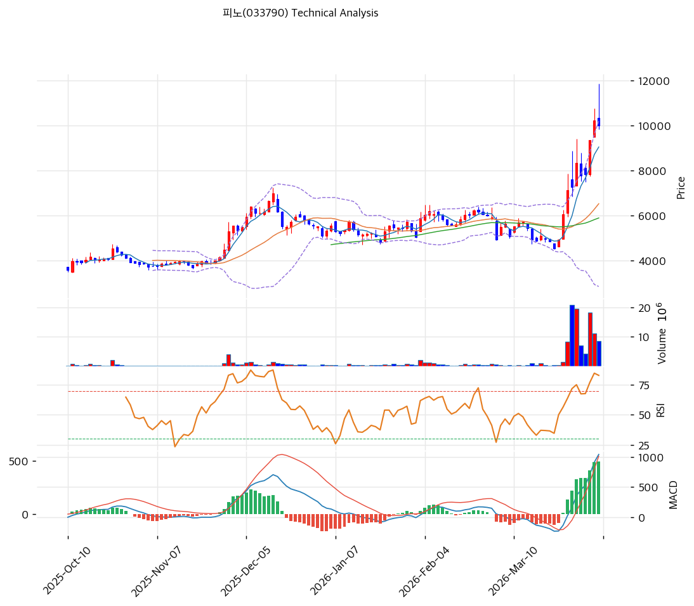

# 피노(033790) 기술적 분석

2026-04-06 | T2 Technical Analysis

---

## 차트

---

## 1. 가격 현황

| 항목 | 값 |
|------|-----|
| 현재가 | 10,010원 (-2.25%) |
| 52주 고가 | 10,240원 |
| 52주 저가 | 3,575원 |
| 52주 범위 위치 | 96.5% |
| 거래량 | 20일 평균 대비 1.79x |

---

## 2. 차트 패턴 분석

### 2.1 캔들스틱 패턴

| 패턴 | 위치 | 신뢰도 | 해석 |
|------|------|--------|------|
| 급등 후 음봉 조정 | 최근 5거래일 | 중 | 급격한 상승 후 차익실현이 유입되며 단기 조정 진행 |
| 윗꼬리 캔들 | 최근 1~2거래일 | 중 | 1만원 부근 저항 인식이 나타남 |

### 2.2 가격 구조 패턴

- **가파른 추세 상승** (신뢰도: 강)
  저점 대비 3배 가까운 상승 후 신고가 부근에 도달했습니다. 상승 속도가 빨라 추세는 강하지만 과열 부담도 큽니다.

- **단기 박스 상단 저항 테스트** (신뢰도: 중)
  1만~1.02만원 구간에서 저항 테스트가 이어지고 있습니다. 돌파 시 추가 탄력이 가능하나 실패 시 조정폭이 커질 수 있습니다.

### 2.3 다이버전스

- **RSI 과매수** (신뢰도: 중)
  RSI 75.4로 과매수 구간입니다. 강세 추세가 이어질 수는 있지만, 단기 매수 매력은 떨어집니다.

- **MACD 상승 지속** (신뢰도: 중)
  MACD는 매수구간과 히스토그램 확대가 유지돼 추세 자체는 아직 긍정적입니다.

### 2.4 패턴 종합 판단

피노는 **강한 모멘텀 종목**이지만 현재 위치는 추격보다 조정 가능성을 먼저 봐야 하는 구간입니다. 추세는 좋지만 과열 신호가 많습니다.

---

## 3. 이동평균선 — 정배열 (강세)

| MA | 값 | 현재가 괴리율 | 위치 |
|----|-----|--------------|------|
| MA5 | 9,044원 | +10.7% | 위 |
| MA20 | 6,520원 | +53.5% | 위 |
| MA60 | 5,885원 | +70.1% | 위 |
| MA120 | 5,291원 | +89.2% | 위 |
| MA200 | 4,862원 | +105.9% | 위 |

**해석**: 완전 정배열이지만 MA20 대비 이격률이 50%를 넘는 극단적 과열 상태입니다.

---

## 4. 보조 지표

### RSI(14) — 75.4 (🔴과매수)

과매수 구간입니다. 추가 상승 가능성은 남아 있으나, 추격 매수 위험이 매우 커진 상태입니다.

### MACD(12,26,9)

| 항목 | 값 |
|------|-----|
| MACD | 1,040.0 |
| Signal | 545.0 |
| Histogram | +495.0 |
| 크로스 상태 | 매수 구간 (확대 중) |

**해석**: MACD는 여전히 강세입니다. 다만 과열 구간이라 신호의 질보다는 과속 여부를 더 봐야 합니다.

### 볼린저밴드(20, 2σ)

| 항목 | 값 |
|------|-----|
| 상단 | 10,205원 |
| 중단 (MA20) | 6,520원 |
| 하단 | 2,835원 |
| 밴드 폭 | 113.0% |
| 현재 위치 | 상단근접 |

**해석**: 밴드 폭이 극단적으로 넓습니다. 강한 추세를 의미하지만 동시에 매우 높은 변동성을 뜻합니다.

### 스토캐스틱(14, 3, 3)

| 항목 | 값 |
|------|-----|
| Slow %K | 88.4 |
| Slow %D | 84.1 |
| 크로스 상태 | 골든크로스 |
| 판단 | 과매수 |

---

## 5. 지지/저항

| 구분 | 가격 | 근거 |
|------|------|------|
| 저항 | 10,240원 | 52주 고가 |
| 저항 | 11,307원 | 피봇 R1 |
| **현재가** | **10,010원** | — |
| 지지 | 9,267원 | 피봇 S1 |
| 지지 | 8,523원 | 피봇 S2 |
| 지지 | 6,520원 | MA20 |

---

## 6. 시그널 종합

| 지표 | 내용 | 시그널 |
|------|------|--------|
| **차트 패턴** | 급등 후 저항 테스트 | ⚪ |
| 이동평균선 | 정배열, 다만 MA20 +53.5% 과열 | 🔴 |
| RSI | 75.4 — 과매수 | 🔴 |
| MACD | 매수구간 확대 | 🟢 |
| 볼린저밴드 | 상단 밀착, 밴드 폭 과도 | ⚪ |
| 스토캐스틱 | 과매수 구간 | 🔴 |
| 거래량 | 1.79x | 🟢 |

**종합 판단**: 🟢 매수 2개 / 🔴 매도 3개 / ⚪ 중립 2개 → **매도우위**

추세는 살아 있지만 지금 자리는 단기 과열이 너무 강합니다. 신규 진입보다 차익실현 또는 관망이 우선입니다.

---

## 7. 전략 제안

### 보유 중인 경우
- **비중축소**
- 익절 라인: 10,445원 (전략상 제시값, 전고점 돌파 확인 구간)
- 손절 라인: 8,523원 (피봇 S2 이탈 시)
- 리스크/리워드: 보수적 1:1 이하

### 진입 대기인 경우
- **관망**
- 1차 진입가: 9,267원 (피봇 S1)
- 2차 진입가: 6,520원 (MA20)
- 진입 조건: 과열 해소 후 지지 확인 및 거래량 안정화
