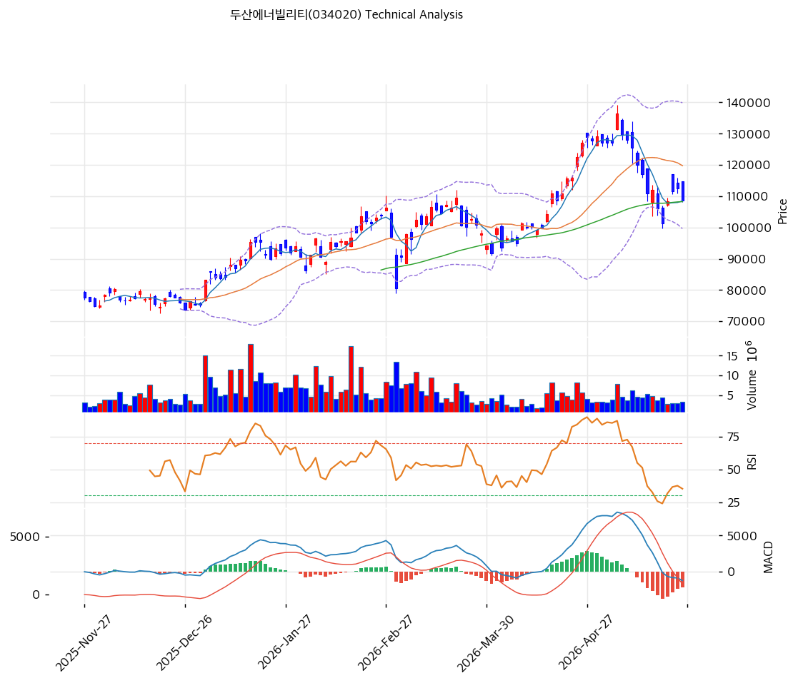

# 두산에너빌리티(034020) 기술적 분석

2026-05-27 | T2 Technical Analysis

## 1. 가격 현황

| 항목 | 값 |
|------|-----|
| 현재가 | 108,500원 (-3.64%) |
| 52주 고가/저가 | 136,400 / 34,600원 |
| 52주 위치 | 72.6% (고점 -20% 조정 중) |
| 거래량 | 20일 평균 대비 0.78x |

## 2. 차트 패턴

- **장대 음봉 + 흑삼병**(강): 5월 중순 136,400 천정 직후 대량 음봉, 이후 단음봉 연속 분배.
- **이중천정 미완성**(중): 4월말\~5월초 136,000원대 두 번 도달 후 반락, 38.2/50% 되돌림 차례로 이탈, 현재 0.618(108,837) 공방.
- **MACD 하락 다이버전스**(강): 4월말 신고가 대비 MACD 정점은 4월 중순.
- **RSI 상승 다이버전스 초기**(약): 저점 갱신 시 RSI 30 반등 → 44.2.

종합: 단기 약세 / 중기 지지권 진입 — PRZ(강) 107,944 사수 여부 분기점.

## 3. 이동평균선 — 비정배열 (단기 약세 / 중기 정배열 유지)

| MA | 값 | 괴리율 | 위치 |
|----|-----|--------|------|
| MA5 | 108,480 | +0.0% | 위 |
| MA20 | 119,760 | **-9.4%** | **아래** |
| MA60 | 108,258 | +0.2% | 위 |
| MA120 | 97,328 | +11.5% | 위 |
| MA200 | 86,573 | +25.3% | 위 |

MA20 -9.4% 이탈로 단기 정배열 붕괴. 다만 MA60/120/200 중장기 정배열 유지로 추세 자체는 살아있음. MA20(119,760) 회복 전까지 반등은 기술적.

## 4. 보조 지표

- **RSI 44.2 중립**: 50선 하향 이탈 후 횡보, 과매도 아님 → 추가 하락 여지.
- **MACD -1,199 / Sig +930 / Hist -2,129**: 데드크로스 후 강한 매도확대, 0선 회귀까지 시간.
- **BB 139,889 / 119,760 / 99,631, 폭 33.6%**: 변동성 확대, 하단이 추세선 지지 97,830과 근접 → 1차 매수 후보.
- **Stoch K28.4 / D25.1 골든크로스(초기, 약)**: 과매도 탈출 초기 신호.

## 5. 지지/저항 (피보나치·추세선·PRZ 통합)

| 구분 | 가격 | 근거 |
|------|------|------|
| 저항 | 136,400 | 52주 고가 |
| 저항 | 119,562 | MA20 + 피보나치 0.382 |
| 저항 | 113,450 | 피봇 R1 + 0.5 되돌림 |
| **현재** | **108,500** | 0.618 되돌림(108,837) 바로 아래 |
| 지지 | **107,944** | **PRZ(강) — 피봇 S1 + MA60 + MA5** |
| 지지 | 101,344 | 0.786 되돌림 + BB 하단(99,631) |
| 지지 | 97,579 | MA120 + 상승 추세선 (메이저, 사수 마지노) |

## 6. 시그널 종합

| 지표 | 내용 | 시그널 |
|------|------|--------|
| 차트 패턴 | 흑삼병 + MACD 하락 다이버전스 | 🔴 |
| 이동평균 | MA20 -9.4% 이탈, 비정배열 | 🔴 |
| RSI | 44.2 중립 | ⚪ |
| MACD | -2,129 매도확대 | 🔴 |
| 볼린저밴드 | 폭 33.6% 확장, 중간 | ⚪ |
| 스토캐스틱 | 골든크로스(초기) | 🟢 |
| 거래량 | 0.78x 약함 | ⚪ |

**🟢 1 / 🔴 3 / ⚪ 3 → 매도우위(약)**

외국인 -402만주 + 기관 -342만주 동반 매도 + 거래량 둔화 → 매도 소진 가능성. 107,944 사수 시 113,450 반등 시도, 깨지면 97,000원대 추가 조정. 메이저 상승 추세선(97,830) 유효.

## 7. 전략 제안

**보유 중**: 비중축소 후 홀드
- 익절 119,760 (MA20 회복) / 손절 103,900 (PRZ 강 이탈 확정) / R:R ≈ 1:2.4

**진입 대기**: 분할 진입 관망
- 1차 107,944 (PRZ 강 — S1+MA60+MA5 클러스터)
- 2차 97,830 (메이저 추세선 + MA120)
- 조건: 거래량 1.2x↑ 양봉 마감 + MACD 히스토그램 축소 확인 후 분할
